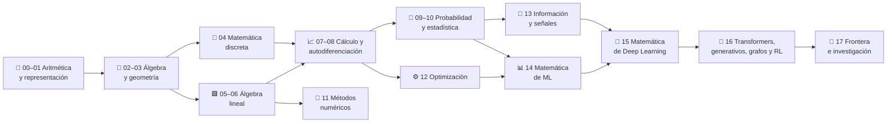

<div align="center">

# 🧮 Computational Mathematics Program

## **18 partes · 360 clases · 1080 notebooks · de cero absoluto a la matemática de la IA**

**Programa completo de matemática computacional en español: aritmética, álgebra, geometría,
matemática discreta, álgebra lineal, cálculo, probabilidad, estadística, métodos numéricos,
optimización, teoría de la información y la matemática que sostiene Machine Learning,
Deep Learning, Transformers, modelos generativos, GNN y Reinforcement Learning.**

[](https://github.com/vladimiracunadev-create/computational-mathematics-program/actions/workflows/ci.yml)
[](https://github.com/vladimiracunadev-create/computational-mathematics-program/actions/workflows/pages.yml)
[](https://github.com/vladimiracunadev-create/computational-mathematics-program/actions/workflows/security.yml)
[](https://github.com/vladimiracunadev-create/computational-mathematics-program/actions/workflows/codeql.yml)

[](CHANGELOG.md)
[](classes/)
[](classes/)
[](LICENSE)

[](pyproject.toml)
[](classes/)
[](src/computational_math/engines/)
[](https://vladimiracunadev-create.github.io/computational-mathematics-program/)

[🌐 **Sitio de estudio (vivo)**](https://vladimiracunadev-create.github.io/computational-mathematics-program/) ·
[🧭 Ruta de aprendizaje](docs/LEARNING_PATH.md) ·
[🤖 Mapa matemático de IA](docs/AI_MATHEMATICS_MAP.md) ·
[🏗️ Arquitectura](docs/ARCHITECTURE.md) ·
[🎓 Guía del estudiante](docs/STUDENT_GUIDE.md) ·
[🧑‍🏫 Guía del instructor](docs/INSTRUCTOR_GUIDE.md) ·
[🗺️ Roadmap](ROADMAP.md)

</div>

---

> [!IMPORTANT]
> Este repositorio **no reemplaza** a `artificial-intelligence-evolution-program`,
> `python-data-science-program` ni `neural-network-training-labs`. Su misión es enseñar
> y hacer **computable** la matemática que esos programas consumen.

## ✅ Estado verificable

| Superficie | Estado |
|---|---|
| Currículo | ✅ 18 partes y 360 clases declaradas en `curriculum.yaml` |
| Contrato pedagógico | ✅ 12 archivos por clase, verificados en CI |
| Notebooks | ✅ 360 de recorrido + 360 de estudiante + 360 de solución |
| Motores ejecutables | ✅ 18 motores en Python estándar, 360 demostraciones deterministas |
| Laboratorios | ✅ 360 `lab.py` que ejecutan la demostración de su clase |
| CLI | ✅ `compmath catalog`, `show`, `run`, `validate`, `progress`, `stats` |
| Sitio | ✅ portal estático HTML/PWA con buscador y progreso local |
| CI | ✅ 3 sistemas operativos × 3 versiones de Python, tests y validación estricta |
| Seguridad | ✅ `pip-audit`, `bandit`, `zizmor` y CodeQL en cada push |
| Dependencias científicas | ⚪ opcionales: ningún laboratorio las necesita para ejecutarse |
| GPU / APIs pagadas | ⚪ no se usan ni se finge su ejecución |

## 🎯 Objetivo

Que una persona pueda empezar **sin base matemática sólida** y terminar siendo capaz de:

- leer fórmulas y derivaciones de ML/IA sin tratarlas como magia;
- implementar los conceptos primero a mano y luego con NumPy/SciPy/SymPy;
- entender precisión, error, condicionamiento y estabilidad numérica;
- derivar los algoritmos clásicos de Machine Learning desde su función objetivo;
- explicar backpropagation, optimizadores, convolución, embeddings y atención;
- seguir papers técnicos de IA moderna y reproducir su idea matemática central.

## 🌟 Qué hace diferente a este programa

- **Nada es un placeholder.** Cada clase apunta a una demostración ejecutable, real y
  determinista. `compmath run --all` corre las 360 y falla si alguna miente.
- **Cero dependencias para aprender.** Los 18 motores están escritos en Python estándar.
  NumPy y PyTorch aparecen como *contraste profesional*, nunca como requisito.
- **Una sola fuente de verdad.** `curriculum.yaml` genera clases, catálogo y sitio;
  CI comprueba que lo generado coincide con lo declarado.
- **Cada resultado se verifica.** Las demostraciones no solo calculan: comprueban
  invariantes (`coinciden`, `es_simetrica`, `preserva_la_norma`, `residuo`).
- **Reproducibilidad explícita.** Todo lo aleatorio lleva semilla fija y la declara.
- **Límites declarados.** Ninguna clase afirma más de lo que demuestra.

## 🧠 Contrato pedagógico

Cada clase sigue el ciclo:

**intuición → matemática manual → derivación → implementación desde cero →
contraste con biblioteca científica → aplicación real → conexión con IA → práctica → evaluación.**

Cada una de las 360 clases contiene exactamente estos 12 archivos:

```text
README.md                 propósito, resultados de aprendizaje y cómo ejecutarla
intuition.md              la pregunta antes de la fórmula, y la predicción obligatoria
theory.md                 modelo / algoritmo / representación en máquina
derivation.md             método de derivación y contraste con el código
exercises.md              10 ejercicios en tres niveles + reto de la parte
assessment.md             rúbrica ponderada y criterios de error crítico
where-is-this-used.md     aplicaciones reales y repositorios conectados
lesson.yaml               metadatos verificables de la clase
lab.py                    laboratorio ejecutable, sin dependencias externas
notebook.ipynb            recorrido guiado
notebook_student.ipynb    versión con TODO para resolver
notebook_solution.ipynb   solución de referencia con verificaciones
```

## 🧬 El mapa del programa



## 🗂️ Las 18 partes

| # | Parte | Clases | Nivel | Motor |
|---:|---|---:|---|---|
| 00 | [Pensamiento matemático desde cero](classes/part-00-pensamiento-matematico-desde-cero/README.md) | 20 | cero-absoluto | `part00` |
| 01 | [Aritmética computacional y representación numérica](classes/part-01-aritmetica-computacional-y-representacion-numerica/README.md) | 20 | basico-computacional | `part01` |
| 02 | [Álgebra y funciones](classes/part-02-algebra-y-funciones/README.md) | 20 | basico | `part02` |
| 03 | [Geometría, trigonometría y geometría analítica](classes/part-03-geometria-trigonometria-y-geometria-analitica/README.md) | 20 | basico-intermedio | `part03` |
| 04 | [Matemática discreta para computación](classes/part-04-matematica-discreta-para-computacion/README.md) | 20 | intermedio | `part04` |
| 05 | [Álgebra lineal I: vectores y matrices](classes/part-05-algebra-lineal-i-vectores-y-matrices/README.md) | 20 | intermedio | `part05` |
| 06 | [Álgebra lineal II: descomposiciones y tensores](classes/part-06-algebra-lineal-ii-descomposiciones-y-tensores/README.md) | 20 | intermedio-avanzado | `part06` |
| 07 | [Cálculo diferencial e integral](classes/part-07-calculo-diferencial-e-integral/README.md) | 20 | universitario | `part07` |
| 08 | [Cálculo multivariable, matricial y autodiferenciación](classes/part-08-calculo-multivariable-matricial-y-autodiferenciacion/README.md) | 20 | universitario-avanzado | `part08` |
| 09 | [Probabilidad y procesos aleatorios](classes/part-09-probabilidad-y-procesos-aleatorios/README.md) | 20 | universitario | `part09` |
| 10 | [Estadística e inferencia](classes/part-10-estadistica-e-inferencia/README.md) | 20 | universitario-avanzado | `part10` |
| 11 | [Métodos numéricos y computación científica](classes/part-11-metodos-numericos-y-computacion-cientifica/README.md) | 20 | cientifico | `part11` |
| 12 | [Optimización matemática y computacional](classes/part-12-optimizacion-matematica-y-computacional/README.md) | 20 | avanzado | `part12` |
| 13 | [Teoría de la información, señales y series](classes/part-13-teoria-de-la-informacion-senales-y-series/README.md) | 20 | avanzado | `part13` |
| 14 | [Matemática de Machine Learning](classes/part-14-matematica-de-machine-learning/README.md) | 20 | ml-avanzado | `part14` |
| 15 | [Matemática de Deep Learning](classes/part-15-matematica-de-deep-learning/README.md) | 20 | deep-learning | `part15` |
| 16 | [Matemática de Transformers, modelos generativos, grafos y RL](classes/part-16-matematica-de-transformers-modelos-generativos-grafos-y-rl/README.md) | 20 | experto | `part16` |
| 17 | [Frontera matemática para IA e investigación](classes/part-17-frontera-matematica-para-ia-e-investigacion/README.md) | 20 | frontera-investigacion | `part17` |

## 🚀 Inicio rápido

```bash
git clone https://github.com/vladimiracunadev-create/computational-mathematics-program.git
cd computational-mathematics-program
python -m venv .venv
# Windows: .venv\Scripts\activate
# Linux/macOS: source .venv/bin/activate
pip install -e .
```

La única dependencia obligatoria es **PyYAML**. Instrucciones completas en [INSTALL.md](INSTALL.md).

```bash
compmath stats                # conteos verificables del programa
compmath catalog --part 12    # las 20 clases de optimización
compmath show 250             # ficha de la clase «Adam»
compmath run 250              # ejecuta su laboratorio
compmath run --part 16        # las 20 clases de Transformers y generativos
compmath run --all            # ejecuta los 360 laboratorios
compmath validate --strict    # la misma validación que corre en CI
compmath progress             # tu avance local
```

También puedes ejecutar un laboratorio directamente:

```bash
python classes/part-15-matematica-de-deep-learning/320-capstone-red-neuronal-desde-cero-en-python-puro/lab.py
```

## 🧪 Ejemplos de lo que ejecutan los motores

| Clase | Demostración | Qué demuestra de verdad |
|---|---|---|
| [029](classes/part-01-aritmetica-computacional-y-representacion-numerica/029-por-que-0-1-0-2-no-es-exactamente-0-3/README.md) | `why_point_one` | la fracción binaria exacta detrás de `0.1 + 0.2 != 0.3` |
| [140](classes/part-06-algebra-lineal-ii-descomposiciones-y-tensores/140-capstone-pca-y-compresion-de-imagenes/README.md) | `capstone_pca_compression` | SVD truncada con error de Frobenius y energía retenida por rango |
| [180](classes/part-08-calculo-multivariable-matricial-y-autodiferenciacion/180-capstone-backpropagation-manual-y-automatica/README.md) | `capstone_backpropagation` | backpropagation manual y autodiferenciación en modo reverso coinciden |
| [260](classes/part-12-optimizacion-matematica-y-computacional/260-capstone-banco-de-optimizadores-comparables/README.md) | `capstone_optimizer_bench` | GD, momentum, RMSProp y Adam con el mismo presupuesto e inicio |
| [320](classes/part-15-matematica-de-deep-learning/320-capstone-red-neuronal-desde-cero-en-python-puro/README.md) | `capstone_neural_network` | MLP entrenado desde cero que separa dos espirales |
| [340](classes/part-16-matematica-de-transformers-modelos-generativos-grafos-y-rl/340-capstone-mini-transformer-matematico/README.md) | `capstone_mini_transformer` | mini-Transformer causal cuyo sesgo relativo aprende a mirar el token anterior |
| [360](classes/part-17-frontera-matematica-para-ia-e-investigacion/360-capstone-final-reproducir-una-idea-matematica-de-un-paper/README.md) | `capstone_reproduce_paper_idea` | Sinkhorn converge al transporte óptimo cuando ε → 0 |

## 🏗️ Arquitectura del repositorio

```text
curriculum.yaml                 fuente de verdad: 18 partes, 360 clases y su metadata
src/computational_math/
  ├── curriculum.py             acceso al currículo y al catálogo derivado
  ├── cli.py                    CLI `compmath`
  ├── helpers.py                utilidades numéricas (stdlib)
  └── engines/                  18 motores didácticos + álgebra lineal en Python puro
classes/part-NN-<slug>/NNN-<slug>/   las 360 clases generadas (12 archivos cada una)
scripts/
  ├── generate_classes.py       regenera las clases desde curriculum.yaml
  ├── generate_site.py          genera el portal HTML en site/
  ├── validate_repository.py    valida coherencia (modo --strict en CI)
  ├── validate_site.py          valida el artefacto de Pages
  └── validate_pages.py         verifica el sitio ya publicado
tests/                          suite unittest (currículo, motores, estructura, CLI y sitio)
site/                           portal estático (generado; no versionado)
docs/                           documentación del programa
learning-paths/                 12 rutas por perfil profesional
```

Detalle completo en [docs/ARCHITECTURE.md](docs/ARCHITECTURE.md).

## 🔁 Cómo se regenera todo

Las clases son **artefactos derivados**: no se editan a mano.

```bash
make generate    # curriculum.yaml + motores → 360 clases, catálogo, rutas e integraciones
make site        # curriculum.yaml + motores → site/ (y lo valida)
make validate    # falla si algo quedó desfasado; es lo que corre CI
make all         # todo lo anterior más tests, lint y los 360 laboratorios
```

`site/` no está versionado: lo reconstruye `pages.yml` en cada push a `main`.

## 🔗 Ecosistema

Este programa mapea prerrequisitos hacia IA, ciencia de datos, redes neuronales, finanzas,
blockchain, ciberseguridad, videojuegos y genómica. **No copia sus currículos**: los
referencia como superficies de aplicación. Ver [docs/integrations/README.md](docs/integrations/README.md).

## ⚖️ Límites honestos

- Un repositorio educativo **no sustituye** una carrera, un posgrado ni supervisión académica.
- Las derivaciones se orientan a comprensión computacional; la profundidad formal completa
  (demostraciones de existencia, análisis funcional, medida) exige textos especializados.
- Los motores están escritos para ser **legibles**, no para ser rápidos: no compiten con
  BLAS, NumPy ni SciPy, y no deben usarse en producción.
- Los resultados numéricos deben leerse considerando precisión, condicionamiento y estabilidad.
- Los conjuntos de datos de los laboratorios son **sintéticos y con semilla fija**: sirven
  para demostrar el mecanismo, no para sacar conclusiones sobre el mundo.

## 📚 Documentación

| Documento | Para qué |
|---|---|
| [docs/LEARNING_PATH.md](docs/LEARNING_PATH.md) | por dónde empezar según tu punto de partida |
| [docs/AI_MATHEMATICS_MAP.md](docs/AI_MATHEMATICS_MAP.md) | qué matemática necesita cada componente de un modelo |
| [docs/ARCHITECTURE.md](docs/ARCHITECTURE.md) | cómo está construido el repositorio |
| [docs/STUDENT_GUIDE.md](docs/STUDENT_GUIDE.md) | método de estudio, ritmo y autoevaluación |
| [docs/INSTRUCTOR_GUIDE.md](docs/INSTRUCTOR_GUIDE.md) | uso en aula, evaluación y calendario |
| [docs/METHODOLOGY.md](docs/METHODOLOGY.md) | por qué el programa está diseñado así |
| [docs/GLOSSARY.md](docs/GLOSSARY.md) | vocabulario preciso del programa |
| [docs/BIBLIOGRAPHY.md](docs/BIBLIOGRAPHY.md) | bibliografía primaria por parte |
| [INSTALL.md](INSTALL.md) | instalación en Windows, macOS y Linux |
| [CONTRIBUTING.md](CONTRIBUTING.md) | cómo contribuir sin romper el contrato |

## 🤝 Contribuir

Lee [CONTRIBUTING.md](CONTRIBUTING.md) y [CODE_OF_CONDUCT.md](CODE_OF_CONDUCT.md).
Para reportar un problema de seguridad, [SECURITY.md](SECURITY.md). ¿Dudas? [SUPPORT.md](SUPPORT.md).

## 📄 Licencia

Código y documentación original bajo [MIT](LICENSE). Libros, papers, datasets y servicios
externos mantienen sus propias licencias.
