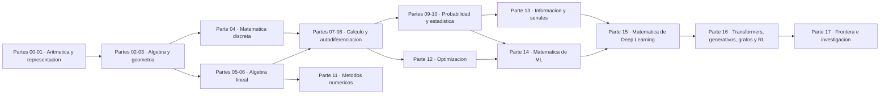

<div align="center">

# 🧮 Computational Mathematics Program

## **18 partes · 360 clases · 1080 notebooks · de cero absoluto a la matemática de la IA**

**Programa completo de matemática computacional en español: aritmética, álgebra, geometría,
matemática discreta, álgebra lineal, cálculo, probabilidad, estadística, métodos numéricos,
optimización, teoría de la información y la matemática que sostiene Machine Learning,
Deep Learning, Transformers, modelos generativos, GNN y Reinforcement Learning.**

[](https://github.com/vladimiracunadev-create/computational-mathematics-program/actions/workflows/ci.yml)
[](https://github.com/vladimiracunadev-create/computational-mathematics-program/actions/workflows/pages.yml)
[](https://github.com/vladimiracunadev-create/computational-mathematics-program/actions/workflows/security.yml)
[](https://github.com/vladimiracunadev-create/computational-mathematics-program/actions/workflows/codeql.yml)

[](CHANGELOG.md)
[](classes/)
[](classes/)
[](LICENSE)

[](pyproject.toml)
[](classes/)
[](src/computational_math/engines/)
[](https://vladimiracunadev-create.github.io/computational-mathematics-program/)

[🌐 **Sitio de estudio (vivo)**](https://vladimiracunadev-create.github.io/computational-mathematics-program/) ·
[📄 **Manual completo (PDF)**](https://vladimiracunadev-create.github.io/computational-mathematics-program/downloads/computational-mathematics-program-manual.pdf) ·
[🧭 Ruta de aprendizaje](docs/LEARNING_PATH.md) ·
[🤖 Mapa matemático de IA](docs/AI_MATHEMATICS_MAP.md) ·
[🏗️ Arquitectura](docs/ARCHITECTURE.md) ·
[🎓 Guía del estudiante](docs/STUDENT_GUIDE.md) ·
[🧑‍🏫 Guía del instructor](docs/INSTRUCTOR_GUIDE.md) ·
[🗺️ Roadmap](ROADMAP.md)

</div>

---

> [!IMPORTANT]
> Este repositorio **no reemplaza** a `artificial-intelligence-evolution-program`,
> `python-data-science-program` ni `neural-network-training-labs`. Su misión es enseñar
> y hacer **computable** la matemática que esos programas consumen.

## ✅ Estado verificable

| Superficie | Estado |
|---|---|
| Currículo | ✅ 18 partes y 360 clases declaradas en `curriculum.yaml` |
| Contrato pedagógico | ✅ 12 archivos por clase, verificados en CI |
| Notebooks | ✅ 360 de recorrido + 360 de estudiante + 360 de solución |
| Motores ejecutables | ✅ 18 motores en Python estándar, 360 demostraciones deterministas |
| Laboratorios | ✅ 360 `lab.py` que ejecutan la demostración de su clase |
| CLI | ✅ `compmath catalog`, `show`, `run`, `validate`, `progress`, `stats` |
| Sitio | ✅ portal estático HTML/PWA con buscador, progreso local y el contenido de las 360 clases |
| Manual | ✅ documento completo en HTML y PDF, generado ejecutando las 360 demostraciones |
| Contenido pedagógico | ✅ 360/360 clases con desarrollo, ejemplo trabajado, errores y fuentes |
| Glosarios y diagramas | ✅ 489 términos en 18 glosarios y un mapa mermaid por parte |
| Trazabilidad de fuentes | ✅ toda obra citada tiene entrada con localizador en [`sources/bibliography.json`](sources/bibliography.json), verificada en CI ([cifras abajo](#-trazabilidad-de-fuentes)) |
| CI | ✅ 3 sistemas operativos × 3 versiones de Python, tests y validación estricta |
| Seguridad | ✅ `pip-audit`, `bandit`, `zizmor` y CodeQL en cada push |
| Dependencias científicas | ⚪ opcionales: ningún laboratorio las necesita para ejecutarse |
| GPU / APIs pagadas | ⚪ no se usan ni se finge su ejecución |

## 🎯 Objetivo

Que una persona pueda empezar **sin base matemática sólida** y terminar siendo capaz de:

- leer fórmulas y derivaciones de ML/IA sin tratarlas como magia;
- implementar los conceptos primero a mano y luego con NumPy/SciPy/SymPy;
- entender precisión, error, condicionamiento y estabilidad numérica;
- derivar los algoritmos clásicos de Machine Learning desde su función objetivo;
- explicar backpropagation, optimizadores, convolución, embeddings y atención;
- seguir papers técnicos de IA moderna y reproducir su idea matemática central.

## 🌟 Qué hace diferente a este programa

- **Nada es un placeholder.** Cada clase apunta a una demostración ejecutable, real y
  determinista. `compmath run --all` corre las 360 y falla si alguna miente.
- **Cero dependencias para aprender.** Los 18 motores están escritos en Python estándar.
  NumPy y PyTorch aparecen como *contraste profesional*, nunca como requisito.
- **Una sola fuente de verdad.** `curriculum.yaml` genera clases, catálogo y sitio;
  CI comprueba que lo generado coincide con lo declarado.
- **Cada resultado se verifica.** Las demostraciones no solo calculan: comprueban
  invariantes (`coinciden`, `es_simetrica`, `preserva_la_norma`, `residuo`).
- **Reproducibilidad explícita.** Todo lo aleatorio lleva semilla fija y la declara.
- **Límites declarados.** Ninguna clase afirma más de lo que demuestra.

## 🧠 Contrato pedagógico

Cada clase sigue el ciclo:

**intuición → matemática manual → derivación → implementación desde cero →
contraste con biblioteca científica → aplicación real → conexión con IA → práctica → evaluación.**

Cada una de las 360 clases contiene exactamente estos 12 archivos:

```text
README.md                 propósito, resultados de aprendizaje y cómo ejecutarla
intuition.md              la pregunta antes de la fórmula, y la predicción obligatoria
theory.md                 modelo / algoritmo / representación en máquina
derivation.md             método de derivación y contraste con el código
exercises.md              10 ejercicios en tres niveles + reto de la parte
assessment.md             rúbrica ponderada y criterios de error crítico
where-is-this-used.md     aplicaciones reales y repositorios conectados
lesson.yaml               metadatos verificables de la clase
lab.py                    laboratorio ejecutable, sin dependencias externas
notebook.ipynb            recorrido guiado
notebook_student.ipynb    versión con TODO para resolver
notebook_solution.ipynb   solución de referencia con verificaciones
```

## 🧬 El mapa del programa



## 🗂️ Las 18 partes

Cada parte tiene su **propio README** con narrativa completa, mapa de la parte, temario y
enlace a sus 20 clases; y su **[glosario propio](classes/)** enlazado a la clase donde se
define cada término. Las cinco etapas se presentan aquí con el mismo detalle porque las
cinco están completas.

### 🟢 Etapa 1 — Cimientos

Para quien empieza sin base matemática. Al terminarla ya no hay número que te engañe: sabes
leer una fracción, un porcentaje y una notación científica, y entiendes por qué
`0.1 + 0.2 != 0.3` en toda máquina del mundo.

| # | Parte | Clases | Contenido central | README |
|---:|---|---:|---|---|
| 00 | Pensamiento matemático desde cero | 20 (001–020) | Conteo, fracciones, decimales, porcentajes, potencias, notación y lógica | [📘 leer](classes/part-00-pensamiento-matematico-desde-cero/README.md) |
| 01 | Aritmética computacional y representación numérica | 20 (021–040) | IEEE 754, ULP, error absoluto y relativo, cancelación y estabilidad | [📘 leer](classes/part-01-aritmetica-computacional-y-representacion-numerica/README.md) |
| 02 | Álgebra y funciones | 20 (041–060) | Ecuaciones, dominio, polinomios, exponenciales, logaritmos y composición | [📘 leer](classes/part-02-algebra-y-funciones/README.md) |
| 03 | Geometría, trigonometría y geometría analítica | 20 (061–080) | Trigonometría, vectores en el plano, rectas, cónicas y transformaciones | [📘 leer](classes/part-03-geometria-trigonometria-y-geometria-analitica/README.md) |
| 04 | Matemática discreta para computación | 20 (081–100) | Conjuntos, lógica, conteo, grafos, recurrencias y demostración | [📘 leer](classes/part-04-matematica-discreta-para-computacion/README.md) |

### 🔵 Etapa 2 — El lenguaje de los modelos

Álgebra lineal y cálculo: las dos herramientas con las que está escrito todo modelo. Al
terminarla derivas backpropagation **a mano** y compruebas que tu resultado coincide con el
de la autodiferenciación en modo reverso.

| # | Parte | Clases | Contenido central | README |
|---:|---|---:|---|---|
| 05 | Álgebra lineal I: vectores y matrices | 20 (101–120) | Producto punto, matrices, sistemas, rango, determinante y proyección | [📘 leer](classes/part-05-algebra-lineal-i-vectores-y-matrices/README.md) |
| 06 | Álgebra lineal II: descomposiciones y tensores | 20 (121–140) | Cambio de base, autovalores, LU, QR, SVD, PCA, Kronecker y einsum | [📘 leer](classes/part-06-algebra-lineal-ii-descomposiciones-y-tensores/README.md) |
| 07 | Cálculo diferencial e integral | 20 (141–160) | Límite, derivada, regla de la cadena, Taylor, optimización e integral | [📘 leer](classes/part-07-calculo-diferencial-e-integral/README.md) |
| 08 | Cálculo multivariable, matricial y autodiferenciación | 20 (161–180) | Gradiente, Jacobiano, Hessiano, Lagrange, cálculo matricial y autodiff | [📘 leer](classes/part-08-calculo-multivariable-matricial-y-autodiferenciacion/README.md) |

### 🟣 Etapa 3 — Incertidumbre y cómputo

Saber si un resultado significa algo, y calcular lo que no tiene forma cerrada. Al terminarla
distingues un efecto real de un p-value fabricado, y sabes por qué un método de orden 4 gana a
uno de orden 1 con la cuarta parte del trabajo.

| # | Parte | Clases | Contenido central | README |
|---:|---|---:|---|---|
| 09 | Probabilidad y procesos aleatorios | 20 (181–200) | Axiomas, Bayes, variables aleatorias, LGN, TCL, Monte Carlo y Markov | [📘 leer](classes/part-09-probabilidad-y-procesos-aleatorios/README.md) |
| 10 | Estadística e inferencia | 20 (201–220) | Muestreo, estimadores, intervalos, p-value, potencia, MLE, MAP y bootstrap | [📘 leer](classes/part-10-estadistica-e-inferencia/README.md) |
| 11 | Métodos numéricos y computación científica | 20 (221–240) | Raíces, interpolación, cuadratura, solvers, EDO, PDE y estabilidad | [📘 leer](classes/part-11-metodos-numericos-y-computacion-cientifica/README.md) |
| 12 | Optimización matemática y computacional | 20 (241–260) | Convexidad, SGD, momentum, Adam, AdamW, Newton, BFGS, KKT y evolutiva | [📘 leer](classes/part-12-optimizacion-matematica-y-computacional/README.md) |
| 13 | Teoría de la información, señales y series | 20 (261–280) | Entropía, entropía cruzada, KL, información mutua, Nyquist, Fourier y FFT | [📘 leer](classes/part-13-teoria-de-la-informacion-senales-y-series/README.md) |

### 🟠 Etapa 4 — La matemática de la IA

Los algoritmos **derivados desde su función objetivo**, no memorizados como recetas. Al
terminarla has entrenado una red desde cero en Python puro que separa dos espirales, y un
mini-Transformer causal de 101 parámetros que aprende a mirar el token anterior.

| # | Parte | Clases | Contenido central | README |
|---:|---|---:|---|---|
| 14 | Matemática de Machine Learning | 20 (281–300) | Regresión, Ridge, Lasso, logística, SVM, kernels, árboles, k-means y EM | [📘 leer](classes/part-14-matematica-de-machine-learning/README.md) |
| 15 | Matemática de Deep Learning | 20 (301–320) | Perceptrón, MLP, backpropagation, inicialización, CNN, RNN, LSTM y GRU | [📘 leer](classes/part-15-matematica-de-deep-learning/README.md) |
| 16 | Matemática de Transformers, modelos generativos, grafos y RL | 20 (321–340) | Softmax, atención escalada, Transformer, VAE, GAN, difusión, GNN y Bellman | [📘 leer](classes/part-16-matematica-de-transformers-modelos-generativos-grafos-y-rl/README.md) |

### 🔴 Etapa 5 — Frontera e investigación

**La diferencia entre entender un modelo y poder leer el paper que lo propone.** Llega al
final porque cada tema responde a una pregunta que solo se reconoce cuando ya se domina lo
anterior.

| # | Parte | Clases | El problema que resuelve | README |
|---:|---|---:|---|---|
| 17 | Frontera matemática para IA e investigación | 20 (341–360) | Abres un paper de este año y no reconoces ni el objeto matemático del que habla | [📘 leer](classes/part-17-frontera-matematica-para-ia-e-investigacion/README.md) |

Cada parte `NN` tiene su motor `partNN` y se ejecuta entera con `compmath run --part NN`.

➡️ **[Ver el índice plano de las 360 clases](classes/README.md)** ·
[🔎 buscador del sitio](https://vladimiracunadev-create.github.io/computational-mathematics-program/)

## 🚀 Inicio rápido

```bash
git clone https://github.com/vladimiracunadev-create/computational-mathematics-program.git
cd computational-mathematics-program
python -m venv .venv
# Windows: .venv\Scripts\activate
# Linux/macOS: source .venv/bin/activate
pip install -e .
```

La única dependencia obligatoria es **PyYAML**. Instrucciones completas en [INSTALL.md](INSTALL.md).

```bash
compmath stats                # conteos verificables del programa
compmath catalog --part 12    # las 20 clases de optimización
compmath show 250             # ficha de la clase «Adam»
compmath run 250              # ejecuta su laboratorio
compmath run --part 16        # las 20 clases de Transformers y generativos
compmath run --all            # ejecuta los 360 laboratorios
compmath validate --strict    # la misma validación que corre en CI
compmath progress             # tu avance local
```

También puedes ejecutar un laboratorio directamente:

```bash
python classes/part-15-matematica-de-deep-learning/320-capstone-red-neuronal-desde-cero-en-python-puro/lab.py
```

## 🧪 Ejemplos de lo que ejecutan los motores

| Clase | Demostración | Qué demuestra de verdad |
|---|---|---|
| [029](classes/part-01-aritmetica-computacional-y-representacion-numerica/029-por-que-0-1-0-2-no-es-exactamente-0-3/README.md) | `why_point_one` | la fracción binaria exacta detrás de `0.1 + 0.2 != 0.3` |
| [140](classes/part-06-algebra-lineal-ii-descomposiciones-y-tensores/140-capstone-pca-y-compresion-de-imagenes/README.md) | `capstone_pca_compression` | SVD truncada con error de Frobenius y energía retenida por rango |
| [180](classes/part-08-calculo-multivariable-matricial-y-autodiferenciacion/180-capstone-backpropagation-manual-y-automatica/README.md) | `capstone_backpropagation` | backpropagation manual y autodiferenciación en modo reverso coinciden |
| [260](classes/part-12-optimizacion-matematica-y-computacional/260-capstone-banco-de-optimizadores-comparables/README.md) | `capstone_optimizer_bench` | GD, momentum, RMSProp y Adam con el mismo presupuesto e inicio |
| [320](classes/part-15-matematica-de-deep-learning/320-capstone-red-neuronal-desde-cero-en-python-puro/README.md) | `capstone_neural_network` | MLP entrenado desde cero que separa dos espirales |
| [340](classes/part-16-matematica-de-transformers-modelos-generativos-grafos-y-rl/340-capstone-mini-transformer-matematico/README.md) | `capstone_mini_transformer` | mini-Transformer causal cuyo sesgo relativo aprende a mirar el token anterior |
| [360](classes/part-17-frontera-matematica-para-ia-e-investigacion/360-capstone-final-reproducir-una-idea-matematica-de-un-paper/README.md) | `capstone_reproduce_paper_idea` | Sinkhorn converge al transporte óptimo cuando ε → 0 |

## 🏗️ Arquitectura del repositorio

```text
curriculum.yaml                 fuente de verdad: 18 partes, 360 clases y su metadata
content/part-NN.yaml            contenido pedagógico: fundamentos, ejemplos, glosario y fuentes
src/computational_math/
  ├── curriculum.py             acceso al currículo y al catálogo derivado
  ├── cli.py                    CLI `compmath`
  ├── helpers.py                utilidades numéricas (stdlib)
  └── engines/                  18 motores didácticos + álgebra lineal en Python puro
classes/part-NN-<slug>/NNN-<slug>/   las 360 clases generadas (12 archivos cada una)
scripts/
  ├── generate_classes.py       regenera las clases desde curriculum.yaml
  ├── generate_site.py          genera el portal HTML en site/
  ├── validate_repository.py    valida coherencia (modo --strict en CI)
  ├── validate_site.py          valida el artefacto de Pages
  └── validate_pages.py         verifica el sitio ya publicado
tests/                          suite unittest (currículo, motores, estructura, CLI y sitio)
site/                           portal estático (generado; no versionado)
manual/                         manual completo HTML y PDF (generado; no versionado)
docs/                           documentación del programa
learning-paths/                 12 rutas por perfil profesional
```

Detalle completo en [docs/ARCHITECTURE.md](docs/ARCHITECTURE.md).

## 🔁 Cómo se regenera todo

Las clases son **artefactos derivados**: no se editan a mano.

```bash
make generate    # curriculum.yaml + content/ + motores → 360 clases, catálogo, rutas, glosarios
make manual      # → manual/ en HTML y PDF, ejecutando las 360 demostraciones
make site        # → site/ (incluye el manual descargable) y lo valida
make validate    # falla si algo quedó desfasado; es lo que corre CI
make all         # todo lo anterior más tests, lint y los 360 laboratorios
```

`site/` no está versionado: lo reconstruye `pages.yml` en cada push a `main`.

## ✅ Calidad y CI

El repositorio no se publica a ciegas: cada `push` y cada PR pasan por integración continua
que ejecuta **las 360 demostraciones**, la suite completa en 3 sistemas operativos × 3
versiones de Python, la validación estricta del currículo y la construcción del manual y del
sitio. Nada llega a `main` en rojo.

| ⚙️ Workflow | Qué cubre |
|---|---|
| 🧪 [ci.yml](.github/workflows/ci.yml) | **coherencia** (las clases generadas coinciden con `curriculum.yaml`, validación estricta, todo el Python compila), **tests** (114 pruebas × Ubuntu/Windows/macOS × Python 3.11/3.12/3.13 y la CLI respondiendo), **laboratorios** (las 360 demostraciones y los 18 capstone como scripts independientes), **portal** (manual en HTML y PDF, sitio generado y validado) y **lint** (`ruff`), más una `quality-gate` que exige verde en todo lo anterior |
| 🚀 [pages.yml](.github/workflows/pages.yml) | construye el manual y el portal, comprueba que existen las páginas clave, publica en GitHub Pages y **verifica que el sitio publicado responde de verdad** |
| 🔒 [security.yml](.github/workflows/security.yml) | `pip-audit` sobre el entorno instalado, `bandit` sobre el código propio, `zizmor` sobre los workflows y **cadena de suministro**: todas las acciones fijadas por SHA y ni un binario ni un comprimido en el repositorio |
| 🛡️ [codeql.yml](.github/workflows/codeql.yml) | análisis semántico de seguridad de GitHub sobre todo el Python |

Los mismos validadores corren en local antes de subir:

```bash
make validate          # exactamente lo que exige la CI
```

O uno a uno, si prefieres ir por partes:

```bash
python scripts/generate_classes.py --check   # sin deriva frente a curriculum.yaml
python scripts/validate_repository.py --strict
python scripts/build_manual.py --check       # 18 partes, 360 clases, sin scripts
python -m unittest discover -s tests -q      # 114 pruebas
compmath run --all                           # las 360 demostraciones
ruff check .
```

## 🔗 Ecosistema

Este programa mapea prerrequisitos hacia IA, ciencia de datos, redes neuronales, finanzas,
blockchain, ciberseguridad, videojuegos y genómica. **No copia sus currículos**: los
referencia como superficies de aplicación. Ver [docs/integrations/README.md](docs/integrations/README.md).

## ⚖️ Límites honestos

- Un repositorio educativo **no sustituye** una carrera, un posgrado ni supervisión académica.
- Las derivaciones se orientan a comprensión computacional; la profundidad formal completa
  (demostraciones de existencia, análisis funcional, medida) exige textos especializados.
- Los motores están escritos para ser **legibles**, no para ser rápidos: no compiten con
  BLAS, NumPy ni SciPy, y no deben usarse en producción.
- Los resultados numéricos deben leerse considerando precisión, condicionamiento y estabilidad.
- Los conjuntos de datos de los laboratorios son **sintéticos y con semilla fija**: sirven
  para demostrar el mecanismo, no para sacar conclusiones sobre el mundo.

## 📚 Documentación

| Documento | Para qué |
|---|---|
| [docs/LEARNING_PATH.md](docs/LEARNING_PATH.md) | por dónde empezar según tu punto de partida |
| [docs/AI_MATHEMATICS_MAP.md](docs/AI_MATHEMATICS_MAP.md) | qué matemática necesita cada componente de un modelo |
| [docs/ARCHITECTURE.md](docs/ARCHITECTURE.md) | cómo está construido el repositorio |
| [docs/STUDENT_GUIDE.md](docs/STUDENT_GUIDE.md) | método de estudio, ritmo y autoevaluación |
| [docs/INSTRUCTOR_GUIDE.md](docs/INSTRUCTOR_GUIDE.md) | uso en aula, evaluación y calendario |
| [docs/METHODOLOGY.md](docs/METHODOLOGY.md) | por qué el programa está diseñado así |
| [docs/GLOSSARY.md](docs/GLOSSARY.md) | vocabulario preciso del programa |
| [docs/BIBLIOGRAPHY.md](docs/BIBLIOGRAPHY.md) | bibliografía primaria por parte |
| [sources/bibliography.json](sources/bibliography.json) | registro de fuentes con localizador verificable por obra |
| [sources/README.md](sources/README.md) | esquema del registro, política y cómo se verifica |
| `classes/part-NN-*/GLOSARIO.md` | glosario de cada parte, enlazado a sus clases |
| [INSTALL.md](INSTALL.md) | instalación en Windows, macOS y Linux |
| [CONTRIBUTING.md](CONTRIBUTING.md) | cómo contribuir sin romper el contrato |

## 🔎 Trazabilidad de fuentes

Cada obra que cita una clase tiene una entrada en
[`sources/bibliography.json`](sources/bibliography.json) con un **localizador resoluble**
—ISBN-13, DOI o URL de la fuente primaria— y un estado: `verificada` si ese localizador se
resolvió contra su autoridad, `pendiente` si todavía no. Lo que no se resuelve **se marca,
no se borra ni se rellena a ojo**: un hueco declarado es información, un hueco inventado es
una bibliografía falsa.

Dos capas separadas, a propósito:

| Script | Red | Qué hace |
|---|---|---|
| [`scripts/verify_sources.py`](scripts/verify_sources.py) | no | esquema, dígito de control del ISBN, forma canónica del localizador, cobertura, bloques repetidos y cifras del README. **Corre en CI y bloquea.** |
| [`scripts/refresh_sources.py`](scripts/refresh_sources.py) | sí | resuelve ISBN contra Open Library y DOI contra Crossref/DataCite, comprueba las URL y actualiza fechas. Manual, **no bloquea**. |

<!-- fuentes:inicio -->

> Cifras generadas por `python scripts/verify_sources.py --sync`. No se escriben a mano.

| Métrica | Valor |
|---|---:|
| Obras en el registro | **334** |
| Citas en las clases | 724 |
| Clases con bloque de fuentes | 360 de 360 |
| Bloques de fuentes distintos | 360 |
| Cobertura del registro | **100.0 %** |
| Localizador resuelto contra su autoridad | 304 (91.0 %) |
| Pendientes de resolver | 30 |
| Entradas con DOI | 169 |
| Entradas con ISBN-13 | 75 |
| Última resolución en red | 2026-08-19 |

| Etapa | Obra rectora | Citas en la etapa | Localizador |
|---|---|---:|---|
| **1 — Cimientos** | Stewart — *Precalculus* | 14 | [reference](https://www.cengage.com/c/precalculus-mathematics-for-calculus-7e-stewart/) |
| **2 — El lenguaje de los modelos** | Strang — *Introduction to Linear Algebra* | 21 | [book](https://openlibrary.org/isbn/9781733146678) |
| **3 — Incertidumbre y cómputo** | Blitzstein et al. — *Introduction to Probability* | 21 | [reference](https://projects.iq.harvard.edu/stat110/home) |
| **4 — La matemática de la IA** | Hastie et al. — *The Elements of Statistical Learning* | 12 | [book](https://openlibrary.org/isbn/9780387848570) |
| **5 — Frontera e investigación** | Shalev-Shwartz et al. — *Understanding Machine Learning* | 3 | [book](https://openlibrary.org/isbn/9781139950619) |

Registro completo en [`sources/bibliography.json`](sources/bibliography.json): 334 obras, 75 libros, 135 artículos, 7 normas y 117 referencias.

<!-- fuentes:fin -->

## 📖 Pauta derivada de la bibliografía de referencia

Cada parte sigue explícitamente la secuencia y los énfasis de la literatura estándar de su
área. Cada referencia de clase declara **el uso que esa clase hace de la obra** y apunta a la
fuente concreta —capítulo incluido cuando aplica— para que puedas ir al original.

| Área | Obras de referencia |
|---|---|
| **Aritmética de máquina** | Goldberg — *What Every Computer Scientist Should Know About Floating-Point* · Higham — *Accuracy and Stability of Numerical Algorithms* |
| **Álgebra lineal** | Strang — *Introduction to Linear Algebra* · Axler — *Linear Algebra Done Right* · Trefethen & Bau — *Numerical Linear Algebra* |
| **Cálculo** | Spivak — *Calculus* · Stewart — *Calculus: Early Transcendentals* |
| **Matemática discreta** | Rosen — *Discrete Mathematics and Its Applications* · Graham, Knuth & Patashnik — *Concrete Mathematics* |
| **Probabilidad** | Blitzstein & Hwang — *Introduction to Probability* · Ross — *A First Course in Probability* · Durrett — *Probability: Theory and Examples* |
| **Estadística e inferencia** | Wasserman — *All of Statistics* · Gelman et al. — *Bayesian Data Analysis* · Efron & Tibshirani — *An Introduction to the Bootstrap* |
| **Métodos numéricos** | Burden & Faires — *Numerical Analysis* · Press et al. — *Numerical Recipes* · Heath — *Scientific Computing* |
| **Optimización** | Boyd & Vandenberghe — *Convex Optimization* · Nocedal & Wright — *Numerical Optimization* |
| **Teoría de la información** | Cover & Thomas — *Elements of Information Theory* · MacKay — *Information Theory, Inference, and Learning Algorithms* |
| **Señales** | Oppenheim & Schafer — *Discrete-Time Signal Processing* · Hyndman & Athanasopoulos — *Forecasting: Principles and Practice* |
| **Machine Learning** | Hastie, Tibshirani & Friedman — *The Elements of Statistical Learning* · Bishop — *Pattern Recognition and ML* · Murphy — *Probabilistic Machine Learning* |
| **Deep Learning** | Goodfellow, Bengio & Courville — *Deep Learning* · papers originales (Glorot, He, Kingma, Loshchilov) |
| **Frontera** | Rasmussen & Williams — *Gaussian Processes for ML* · Peyré & Cuturi — *Computational Optimal Transport* · Shalev-Shwartz & Ben-David — *Understanding Machine Learning* |

> Las referencias apuntan a las obras; **no se reproduce su contenido**. La redacción del
> programa es original, y las derivaciones se rehacen desde cero para poder ejecutarlas.
> Bibliografía completa por parte en [docs/BIBLIOGRAPHY.md](docs/BIBLIOGRAPHY.md).

## 🎯 Qué es y qué no es este programa

<table>
<tr>
<td valign="top" width="50%">

### ✅ Lo que sí es

- 📚 un currículo **secuencial y completo** de 360 clases, de contar con los dedos a reproducir un paper;
- 🧪 un programa con **práctica verificable**: 360 demostraciones deterministas que la CI ejecuta en cada push, y que fallan si mienten;
- 🔍 material **honesto sobre sus límites**: dice qué verifica una máquina, qué no, y qué no da la teoría;
- 🧱 un repositorio **regenerable**: `curriculum.yaml` y `content/` son la fuente, y CI comprueba que lo publicado coincide;
- 📖 material **abierto y offline-friendly** (manual en PDF, sitio en Pages, 1080 notebooks), en español.

</td>
<td valign="top" width="50%">

### ❌ Lo que no es

- 🚫 un atajo para "aprender la matemática de la IA en un mes": la numeración es secuencial por diseño;
- 🚫 una biblioteca de cálculo: los motores están escritos para ser **legibles**, no rápidos, y no compiten con NumPy ni BLAS;
- 🚫 un sustituto de una carrera, un posgrado ni de supervisión académica;
- 🚫 una fuente de conclusiones sobre el mundo: los datos de los laboratorios son **sintéticos y con semilla fija**;
- 🚫 contenido copiado de la bibliografía: la redacción es **original** y las derivaciones se rehacen.

</td>
</tr>
</table>

## 💡 Idea fuerza

> El valor de este programa no está en acumular temario, sino en **volver computable la
> matemática que sostiene la IA**: cada fórmula termina en código que se ejecuta, cada
> resultado comprueba un invariante, y cada afirmación se puede reproducir con una semilla
> fija. La diferencia entre creer un resultado y saberlo son 360 clases de distancia.

## 🤝 Contribuir

Lee [CONTRIBUTING.md](CONTRIBUTING.md) y [CODE_OF_CONDUCT.md](CODE_OF_CONDUCT.md).
Para reportar un problema de seguridad, [SECURITY.md](SECURITY.md). ¿Dudas? [SUPPORT.md](SUPPORT.md).

## 📄 Licencia

[MIT](LICENSE) — úsalo, modifícalo y compártelo. El conocimiento debe ser accesible.
Libros, papers, datasets y servicios externos mantienen sus propias licencias.

---

<div align="center">

**Hecho para quien quiere entender de verdad la matemática de la IA, empezando desde donde esté.**

[⬆️ Empezar por la parte 00](classes/part-00-pensamiento-matematico-desde-cero/README.md) ·
[🧭 ¿No sabes por dónde entrar?](docs/LEARNING_PATH.md)

<br>

**¿Te resulta útil? ⭐ Dale una estrella al repo.**

[](https://github.com/vladimiracunadev-create/computational-mathematics-program/stargazers)
[](https://github.com/vladimiracunadev-create/computational-mathematics-program/network/members)
[](https://github.com/vladimiracunadev-create)

Hecho con 🧮 y ☕ por [Vladimir Acuña](https://github.com/vladimiracunadev-create)

</div>
