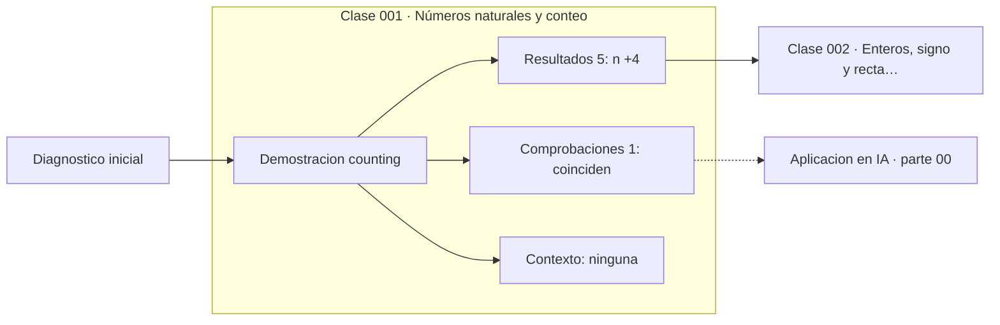

# 001 — Números naturales y conteo

> [📚 Parte 00](../README.md) · [🏠 Programa](../../../README.md) · [002 Enteros, signo y recta numérica ➡️](../002-enteros-signo-y-recta-numerica/README.md)

**Parte:** 00 — Pensamiento matemático desde cero · **Nivel:** `cero-absoluto` · **Horas estimadas:** 4
**Motor:** `engines.part00` · **Demostración:** `counting` · **Clase 1 de 20** de la parte

---

## 🎯 Propósito

**Contar es establecer una biyección entre un conjunto y un tramo inicial de los naturales.**

Reconstruye la aritmética y el lenguaje matemático básico con el rigor que exige escribir código: cada número tiene dominio, unidad y representación.

## ✅ Resultados de aprendizaje

Al terminar podrás:

1. Explicar **Números naturales y conteo** con lenguaje cotidiano y con notación matemática.
2. Resolver un caso pequeño a mano y anticipar el orden de magnitud del resultado.
3. Ejecutar y modificar `lab.py`, que corre la demostración `counting`.
4. Interpretar las 6 salidas del laboratorio y decir qué comprueba cada una.
5. Detectar el error típico de esta parte: sumar porcentajes como si fueran cantidades absolutas.

## 🧩 Fórmulas de la clase

```text
1 + 2 + ... + n = n(n+1)/2
|{1, 2, ..., n}| = n
```

## 🗺️ Ubicación en el programa



## 📖 Fundamentos

Contar parece trivial hasta que se intenta programar. Cuando decimos que un conjunto
tiene 7 elementos, estamos afirmando que existe una correspondencia uno a uno entre
ese conjunto y `{1,2,3,4,5,6,7}`. Esa definición —debida a la construcción de los
naturales que formalizaron Peano y Dedekind a finales del siglo XIX— es la que
permite contar cosas que no se pueden señalar con el dedo: las combinaciones posibles
de una contraseña, los caminos en un grafo, los estados de un programa.

La suma de los primeros n naturales ilustra la diferencia entre **contar** y
**calcular**. Sumar uno a uno cuesta n operaciones; la fórmula cerrada cuesta tres,
independientemente de n. El argumento clásico —atribuido a Gauss siendo niño, aunque
la anécdota es probablemente apócrifa— consiste en emparejar el primer término con el
último, el segundo con el penúltimo, y observar que cada pareja suma n+1 y que hay
n/2 parejas.

Esta distinción reaparece durante todo el programa. En la parte 04 se llamará
«complejidad algorítmica»; en la parte 11, «coste de un método numérico». Aquí es
simplemente la observación de que dos procedimientos correctos pueden diferir en
cuántas operaciones necesitan, y que esa diferencia importa cuando n es grande.

Un detalle que el laboratorio comprueba: la fórmula cerrada y la suma iterativa dan
**exactamente** el mismo entero. Con enteros de Python esto es cierto siempre. En la
parte 01 veremos que con números en punto flotante la coincidencia deja de estar
garantizada, y por qué.

## 🧮 Ejemplo trabajado

Sumar los enteros de 1 a 100.

```text
Iterativo:  1 + 2 + 3 + ... + 100      → 100 sumas
Emparejado: (1+100) + (2+99) + ...     → 50 parejas de 101
            50 · 101 = 5050
Cerrado:    n(n+1)/2 = 100·101/2 = 5050 → 3 operaciones
```

Verificación cruzada: ambos caminos deben dar 5050. Si no coinciden, uno de los dos
está mal implementado. Esa comprobación —dos caminos independientes al mismo
resultado— es el patrón de verificación que se usará en todo el programa.

## 🔬 Qué ejecuta el laboratorio

`counting` — Conteo, suma de Gauss y verificación cerrada frente a iterativa.

| Grupo | Salidas |
|---|---|
| 🔢 Resultados numéricos (5) | `n`, `suma_iterativa`, `suma_formula_cerrada`, `operaciones_iterativas`, `operaciones_formula` |
| ✅ Comprobaciones de invariante (1) | `coinciden` |

Las claves booleanas no son adorno: si alguna fuera `False`, el resultado numérico
no sería fiable aunque el programa terminase sin error.

```bash
python classes/part-00-pensamiento-matematico-desde-cero/001-numeros-naturales-y-conteo/lab.py
compmath run 001
```

> [!TIP]
> Antes de ejecutar, **escribe tu predicción**. Un laboratorio que confirma lo que
> esperabas enseña tanto como uno que te contradice, pero solo si la predicción
> existía antes del resultado.

## ⚠️ Errores conceptuales frecuentes

1. Confundir el número de elementos con el último índice: de 1 a 100 hay 100 números, pero de 0 a 100 hay 101.
2. Aplicar n(n+1)/2 a una secuencia que no empieza en 1 sin ajustar el desplazamiento.
3. Suponer que «contar» y «sumar» son la misma operación: contar es cardinalidad, sumar es agregación.

## 🚀 Dónde se usa de verdad

Toda estimación de coste computacional empieza por un conteo. El número de
comparaciones de un algoritmo de ordenación, el número de parejas en un producto
cartesiano y el número de operaciones de una multiplicación de matrices son sumas de
este tipo. En la parte 04 el conteo se vuelve combinatoria; en la 09, probabilidad.

## 🤖 Conexión con IA

Toda métrica de un modelo (accuracy, loss, learning rate) es una razón, un porcentaje o una escala. Interpretarlas mal es el primer error de un practicante de IA.

## 📓 Notebooks

| Archivo | Para qué |
|---|---|
| [`notebook.ipynb`](notebook.ipynb) | recorrido guiado con la demostración ejecutada |
| [`notebook_student.ipynb`](notebook_student.ipynb) | versión con `TODO` para resolver |
| [`notebook_solution.ipynb`](notebook_solution.ipynb) | solución de referencia verificada |

## 📝 Evaluación

| Criterio | Peso |
|---|---:|
| Comprensión conceptual | 25 % |
| Resolución manual | 25 % |
| Implementación y verificación | 25 % |
| Interpretación y comunicación | 15 % |
| Conexión con aplicación real | 10 % |

Detalle y criterios de error crítico en [`assessment.md`](assessment.md).

## ❓ Preguntas de comprobación

1. ¿Cuál es la entrada, cuál la salida y qué unidades tienen?
2. ¿Qué operación domina el comportamiento del resultado?
3. ¿Qué caso extremo revelaría un error conceptual?
4. ¿Cómo verificarías el resultado por un método independiente?
5. ¿Dónde aparece esto en cálculo cotidiano?

Si necesitas releer el código para responderlas, la clase todavía no está superada.

## 📥 Entregable

`notebook_student.ipynb` resuelto más un párrafo que explique el resultado **sin citar
código**: qué entra, qué sale, qué invariante se comprueba y qué pasaría en un caso límite.

## 🔗 Referencias

- [Lang, S. *Basic Mathematics*. Springer, 1988, cap. 1](https://link.springer.com/book/10.1007/978-1-4757-1836-2) — *uso:* desarrollo formal del tema en «Números naturales y conteo».
- [Graham, Knuth & Patashnik. *Concrete Mathematics*, 2ª ed., 1994, cap. 2 (sumas)](https://www-cs-faculty.stanford.edu/~knuth/gkp.html) — *uso:* obra de referencia consultada en «Números naturales y conteo».
- [Peano axioms — Encyclopedia of Mathematics](https://encyclopediaofmath.org/wiki/Peano_axioms) — *uso:* exposición alternativa del tema en «Números naturales y conteo».

Bibliografía completa de la parte en [`../../../docs/BIBLIOGRAPHY.md`](../../../docs/BIBLIOGRAPHY.md) · localizador verificable de cada obra en [`sources/bibliography.json`](../../../sources/bibliography.json).

## 📂 Material de la clase

[`intuition.md`](intuition.md) · [`theory.md`](theory.md) · [`derivation.md`](derivation.md) · [`exercises.md`](exercises.md) · [`assessment.md`](assessment.md) · [`where-is-this-used.md`](where-is-this-used.md) · [`lesson.yaml`](lesson.yaml)

---

> [📚 Parte 00](../README.md) · [🏠 Programa](../../../README.md) · [002 Enteros, signo y recta numérica ➡️](../002-enteros-signo-y-recta-numerica/README.md)
