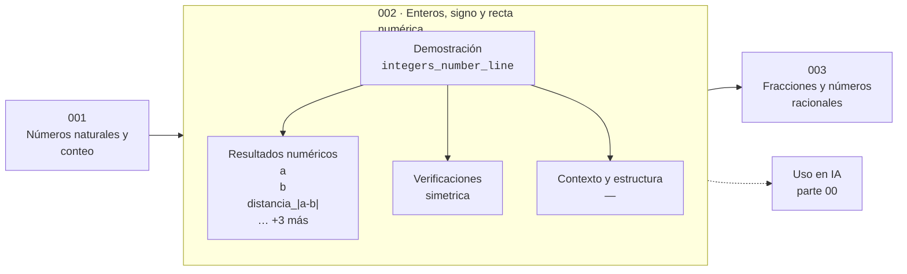

# 002 — Enteros, signo y recta numérica

> [⬅️ 001 Números naturales y conteo](../001-numeros-naturales-y-conteo/README.md) · [📚 Parte 00](../README.md) · [🏠 Programa](../../../README.md) · [003 Fracciones y números racionales ➡️](../003-fracciones-y-numeros-racionales/README.md)

**Parte:** 00 — Pensamiento matemático desde cero · **Nivel:** `cero-absoluto` · **Horas estimadas:** 4
**Motor:** `engines.part00` · **Demostración:** `integers_number_line` · **Clase 2 de 20** de la parte

---

## 🎯 Propósito

**El signo indica dirección en la recta numérica; el valor absoluto indica distancia.**

Reconstruye la aritmética y el lenguaje matemático básico con el rigor que exige escribir código: cada número tiene dominio, unidad y representación.

## ✅ Resultados de aprendizaje

Al terminar podrás:

1. Explicar **Enteros, signo y recta numérica** con lenguaje cotidiano y con notación matemática.
2. Resolver un caso pequeño a mano y anticipar el orden de magnitud del resultado.
3. Ejecutar y modificar `lab.py`, que corre la demostración `integers_number_line`.
4. Interpretar las 7 salidas del laboratorio y decir qué comprueba cada una.
5. Detectar el error típico de esta parte: confundir aumento del 50 % con multiplicar por 50.

## 🧩 Fórmulas de la clase

```text
|x| = x si x ≥ 0, −x si x < 0
d(a, b) = |a − b| = |b − a|
```

## 🗺️ Ubicación en el programa



## 📖 Fundamentos

Los enteros negativos tardaron siglos en aceptarse. Hasta el siglo XVII se los
llamaba «números absurdos» porque no se podía tener −3 ovejas. La aceptación llegó
cuando se dejó de exigir que un número representara una cantidad y se admitió que
podía representar una **posición relativa a un origen**: temperatura respecto al punto
de congelación, saldo respecto a cero, desplazamiento respecto a un punto de partida.

Esa lectura resuelve de golpe la regla de los signos, que de otro modo hay que
memorizar. Multiplicar por −1 es «dar media vuelta» en la recta. Dar media vuelta dos
veces deja el sentido original: (−1)·(−1) = +1. No es una convención arbitraria: es
la única definición que mantiene válida la propiedad distributiva.

El valor absoluto separa dos preguntas que el signo mezcla: **cuánto** y **hacia
dónde**. La distancia `|a − b|` es simétrica por construcción, y esa simetría es lo
que la convierte en una distancia en el sentido matemático. En la parte 05 esa misma
idea se generaliza a vectores como la norma, y en la parte 03 aparece como distancia
euclídea. El valor absoluto es la norma de dimensión 1.

Conviene notar desde ya una asimetría que la parte 01 explotará: en un entero de
ancho fijo con complemento a dos, hay un negativo más que positivos, y por eso
`abs(-128)` desborda en un `int8`. El valor absoluto no siempre es representable.

## 🧮 Ejemplo trabajado

Distancia entre las posiciones −7 y 4 en la recta.

```text
a = −7,  b = 4
a − b = −11      → dirección: de b hacia a se retrocede
|a − b| = 11     → distancia
b − a = 11
|b − a| = 11     → misma distancia, simetría verificada
```

Con signos: el producto de los signos de a y b es (−1)·(+1) = −1, lo que indica que
están en semirrectas opuestas respecto al origen. Esa lectura —el signo del producto
como indicador de posición relativa— es la que se usará en la clase 222 (bisección)
para decidir en qué mitad del intervalo está la raíz.

## 🔬 Qué ejecuta el laboratorio

`integers_number_line` — Signo, valor absoluto y distancia en la recta numérica.

| Grupo | Salidas |
|---|---|
| 🔢 Resultados numéricos (6) | `a`, `b`, `distancia_|a-b|`, `distancia_|b-a|`, `producto_de_signos`, `opuesto_de_a` |
| ✅ Comprobaciones de invariante (1) | `simetrica` |

Las claves booleanas no son adorno: si alguna fuera `False`, el resultado numérico
no sería fiable aunque el programa terminase sin error.

```bash
python classes/part-00-pensamiento-matematico-desde-cero/002-enteros-signo-y-recta-numerica/lab.py
compmath run 002
```

> [!TIP]
> Antes de ejecutar, **escribe tu predicción**. Un laboratorio que confirma lo que
> esperabas enseña tanto como uno que te contradice, pero solo si la predicción
> existía antes del resultado.

## ⚠️ Errores conceptuales frecuentes

1. Leer −3² como (−3)²: la potenciación tiene mayor precedencia que el signo, así que −3² = −9.
2. Suponer que |a + b| = |a| + |b|: solo se cumple si a y b tienen el mismo signo (desigualdad triangular).
3. Tratar el valor absoluto como «quitar el signo» en lugar de «medir distancia»: la segunda lectura es la que generaliza.

## 🚀 Dónde se usa de verdad

El error absoluto de la parte 01, la norma L1 de la parte 05, la pérdida MAE de la
parte 15 y el criterio de cambio de signo de la bisección (clase 222) son todos el
mismo objeto. Cualquier función de pérdida robusta a valores atípicos se construye
sobre valor absoluto en lugar de sobre cuadrados.

## 🤖 Conexión con IA

Toda métrica de un modelo (accuracy, loss, learning rate) es una razón, un porcentaje o una escala. Interpretarlas mal es el primer error de un practicante de IA.

## 📓 Notebooks

| Archivo | Para qué |
|---|---|
| [`notebook.ipynb`](notebook.ipynb) | recorrido guiado con la demostración ejecutada |
| [`notebook_student.ipynb`](notebook_student.ipynb) | versión con `TODO` para resolver |
| [`notebook_solution.ipynb`](notebook_solution.ipynb) | solución de referencia verificada |

## 📝 Evaluación

| Criterio | Peso |
|---|---:|
| Comprensión conceptual | 25 % |
| Resolución manual | 25 % |
| Implementación y verificación | 25 % |
| Interpretación y comunicación | 15 % |
| Conexión con aplicación real | 10 % |

Detalle y criterios de error crítico en [`assessment.md`](assessment.md).

## ❓ Preguntas de comprobación

1. ¿Cuál es la entrada, cuál la salida y qué unidades tienen?
2. ¿Qué operación domina el comportamiento del resultado?
3. ¿Qué caso extremo revelaría un error conceptual?
4. ¿Cómo verificarías el resultado por un método independiente?
5. ¿Dónde aparece esto en cálculo cotidiano?

Si necesitas releer el código para responderlas, la clase todavía no está superada.

## 📥 Entregable

`notebook_student.ipynb` resuelto más un párrafo que explique el resultado **sin citar
código**: qué entra, qué sale, qué invariante se comprueba y qué pasaría en un caso límite.

## 🔗 Referencias

- [Gelfand & Shen. *Algebra*. Birkhäuser, 2002, secc. 1](https://link.springer.com/book/10.1007/978-1-4612-0335-5)
- [Lang, S. *Basic Mathematics*. Springer, 1988, cap. 2](https://link.springer.com/book/10.1007/978-1-4757-1836-2)

Bibliografía completa de la parte en [`../../../docs/BIBLIOGRAPHY.md`](../../../docs/BIBLIOGRAPHY.md).

## 📂 Material de la clase

[`intuition.md`](intuition.md) · [`theory.md`](theory.md) · [`derivation.md`](derivation.md) · [`exercises.md`](exercises.md) · [`assessment.md`](assessment.md) · [`where-is-this-used.md`](where-is-this-used.md) · [`lesson.yaml`](lesson.yaml)

---

> [⬅️ 001 Números naturales y conteo](../001-numeros-naturales-y-conteo/README.md) · [📚 Parte 00](../README.md) · [🏠 Programa](../../../README.md) · [003 Fracciones y números racionales ➡️](../003-fracciones-y-numeros-racionales/README.md)
