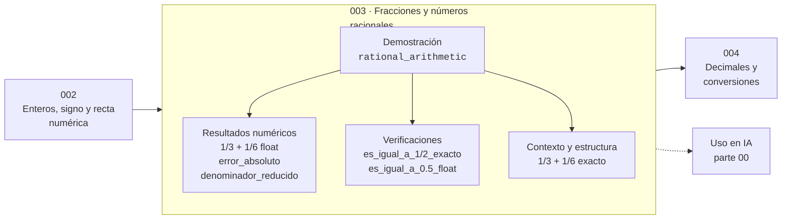

# 003 — Fracciones y números racionales

> [⬅️ 002 Enteros, signo y recta numérica](../002-enteros-signo-y-recta-numerica/README.md) · [📚 Parte 00](../README.md) · [🏠 Programa](../../../README.md) · [004 Decimales y conversiones ➡️](../004-decimales-y-conversiones/README.md)

**Parte:** 00 — Pensamiento matemático desde cero · **Nivel:** `cero-absoluto` · **Horas estimadas:** 4
**Motor:** `engines.part00` · **Demostración:** `rational_arithmetic` · **Clase 3 de 20** de la parte

---

## 🎯 Propósito

**Un racional es un cociente exacto de enteros; un decimal es casi siempre una aproximación suya.**

Reconstruye la aritmética y el lenguaje matemático básico con el rigor que exige escribir código: cada número tiene dominio, unidad y representación.

## ✅ Resultados de aprendizaje

Al terminar podrás:

1. Explicar **Fracciones y números racionales** con lenguaje cotidiano y con notación matemática.
2. Resolver un caso pequeño a mano y anticipar el orden de magnitud del resultado.
3. Ejecutar y modificar `lab.py`, que corre la demostración `rational_arithmetic`.
4. Interpretar las 6 salidas del laboratorio y decir qué comprueba cada una.
5. Detectar el error típico de esta parte: escribir 1/3 como 0.33 y arrastrar el error a todo el cálculo.

## 🧩 Fórmulas de la clase

```text
a/b + c/d = (ad + bc)/(bd)
a/b = c/d ⟺ ad = bc
```

## 🗺️ Ubicación en el programa



## 📖 Fundamentos

Los racionales existen porque los enteros no están cerrados bajo división: 1 dividido
entre 3 no es un entero. La construcción formal define un racional como una clase de
equivalencia de pares de enteros `(a, b)` con `b ≠ 0`, donde `(a,b) ~ (c,d)` si
`ad = bc`. Por eso 2/4 y 1/2 son *el mismo número* escrito de dos formas.

La consecuencia práctica es la que importa aquí: **la fracción es el objeto exacto y
el decimal es su sombra**. `Fraction(1,3)` guarda dos enteros y responde con exactitud
a cualquier operación; `0.3333` guarda una aproximación y arrastra un error que se
acumula. Python distingue las dos cosas: `fractions.Fraction` implementa la aritmética
exacta, y `float` la aproximada.

El laboratorio de esta clase muestra el caso mínimo donde la diferencia se ve:
`1/3 + 1/6` es exactamente `1/2` en aritmética racional, y en punto flotante da un
número que *parece* 0.5 pero cuya igualdad con 0.5 depende de detalles de
representación. Aquí conviene resistir la tentación de concluir «los floats están
rotos»: no lo están; simplemente no son racionales exactos, y la parte 01 explica por
qué.

Un criterio útil para decidir qué usar: si el resultado se va a comparar con `==`, o
si representa dinero, o si va a alimentar cientos de miles de operaciones encadenadas,
la aritmética exacta paga su coste. Si el resultado se va a graficar o alimentar un
modelo estadístico, el float es suficiente y mucho más rápido.

## 🧮 Ejemplo trabajado

Sumar un tercio y un sexto por los dos caminos.

```text
Exacto:   1/3 + 1/6 = 2/6 + 1/6 = 3/6 = 1/2
          denominador reducido: 2
          ¿es igual a 1/2? Sí, por construcción.

Flotante: 0.3333333333333333 + 0.16666666666666666
        = 0.5                    (aparentemente)
        ¿es igual a 0.5? depende del redondeo de cada sumando
```

La lección no es que un camino sea correcto y el otro incorrecto: es que responden
preguntas distintas. El exacto responde «¿cuál es el número?»; el flotante responde
«¿cuál es el número representable más cercano?».

## 🔬 Qué ejecuta el laboratorio

`rational_arithmetic` — Un tercio exacto frente a un tercio en punto flotante.

| Grupo | Salidas |
|---|---|
| 🔢 Resultados numéricos (3) | `1/3 + 1/6 float`, `error_absoluto`, `denominador_reducido` |
| ✅ Comprobaciones de invariante (2) | `es_igual_a_1/2_exacto`, `es_igual_a_0.5_float` |

Las claves booleanas no son adorno: si alguna fuera `False`, el resultado numérico
no sería fiable aunque el programa terminase sin error.

```bash
python classes/part-00-pensamiento-matematico-desde-cero/003-fracciones-y-numeros-racionales/lab.py
compmath run 003
```

> [!TIP]
> Antes de ejecutar, **escribe tu predicción**. Un laboratorio que confirma lo que
> esperabas enseña tanto como uno que te contradice, pero solo si la predicción
> existía antes del resultado.

## ⚠️ Errores conceptuales frecuentes

1. Escribir 1/3 como 0.33 y arrastrar ese error al resto del cálculo sin declararlo.
2. Sumar numeradores y denominadores por separado: 1/2 + 1/3 no es 2/5.
3. Creer que simplificar una fracción cambia su valor: 2/4 y 1/2 son el mismo número.

## 🚀 Dónde se usa de verdad

Cualquier cálculo con dinero, con probabilidades exactas o con proporciones de
inventario. En la parte 01 (clase 038) la aritmética racional exacta se usa para
medir cuánto error acumula la aritmética flotante: la fracción actúa como patrón de
referencia contra el que se mide.

## 🤖 Conexión con IA

Toda métrica de un modelo (accuracy, loss, learning rate) es una razón, un porcentaje o una escala. Interpretarlas mal es el primer error de un practicante de IA.

## 📓 Notebooks

| Archivo | Para qué |
|---|---|
| [`notebook.ipynb`](notebook.ipynb) | recorrido guiado con la demostración ejecutada |
| [`notebook_student.ipynb`](notebook_student.ipynb) | versión con `TODO` para resolver |
| [`notebook_solution.ipynb`](notebook_solution.ipynb) | solución de referencia verificada |

## 📝 Evaluación

| Criterio | Peso |
|---|---:|
| Comprensión conceptual | 25 % |
| Resolución manual | 25 % |
| Implementación y verificación | 25 % |
| Interpretación y comunicación | 15 % |
| Conexión con aplicación real | 10 % |

Detalle y criterios de error crítico en [`assessment.md`](assessment.md).

## ❓ Preguntas de comprobación

1. ¿Cuál es la entrada, cuál la salida y qué unidades tienen?
2. ¿Qué operación domina el comportamiento del resultado?
3. ¿Qué caso extremo revelaría un error conceptual?
4. ¿Cómo verificarías el resultado por un método independiente?
5. ¿Dónde aparece esto en cálculo cotidiano?

Si necesitas releer el código para responderlas, la clase todavía no está superada.

## 📥 Entregable

`notebook_student.ipynb` resuelto más un párrafo que explique el resultado **sin citar
código**: qué entra, qué sale, qué invariante se comprueba y qué pasaría en un caso límite.

## 🔗 Referencias

- [Python: módulo `fractions`](https://docs.python.org/3/library/fractions.html)
- [Gelfand & Shen. *Algebra*. Birkhäuser, 2002](https://link.springer.com/book/10.1007/978-1-4612-0335-5)

Bibliografía completa de la parte en [`../../../docs/BIBLIOGRAPHY.md`](../../../docs/BIBLIOGRAPHY.md).

## 📂 Material de la clase

[`intuition.md`](intuition.md) · [`theory.md`](theory.md) · [`derivation.md`](derivation.md) · [`exercises.md`](exercises.md) · [`assessment.md`](assessment.md) · [`where-is-this-used.md`](where-is-this-used.md) · [`lesson.yaml`](lesson.yaml)

---

> [⬅️ 002 Enteros, signo y recta numérica](../002-enteros-signo-y-recta-numerica/README.md) · [📚 Parte 00](../README.md) · [🏠 Programa](../../../README.md) · [004 Decimales y conversiones ➡️](../004-decimales-y-conversiones/README.md)
