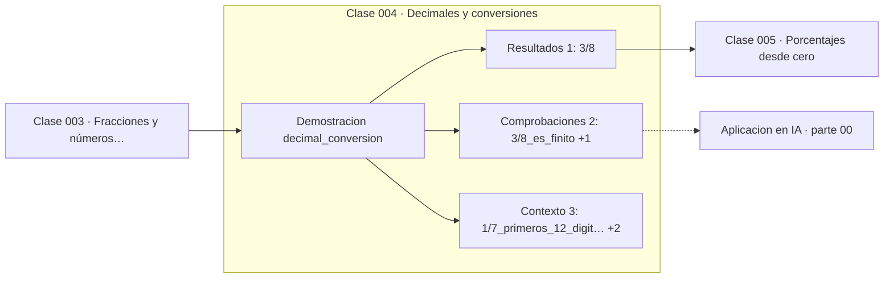

# 004 — Decimales y conversiones

> [⬅️ 003 Fracciones y números racionales](../003-fracciones-y-numeros-racionales/README.md) · [📚 Parte 00](../README.md) · [🏠 Programa](../../../README.md) · [005 Porcentajes desde cero ➡️](../005-porcentajes-desde-cero/README.md)

**Parte:** 00 — Pensamiento matemático desde cero · **Nivel:** `cero-absoluto` · **Horas estimadas:** 4
**Motor:** `engines.part00` · **Demostración:** `decimal_conversion` · **Clase 4 de 20** de la parte

---

## 🎯 Propósito

**El desarrollo decimal de una fracción es finito o periódico, y qué caso ocurre depende solo del denominador.**

Reconstruye la aritmética y el lenguaje matemático básico con el rigor que exige escribir código: cada número tiene dominio, unidad y representación.

## ✅ Resultados de aprendizaje

Al terminar podrás:

1. Explicar **Decimales y conversiones** con lenguaje cotidiano y con notación matemática.
2. Resolver un caso pequeño a mano y anticipar el orden de magnitud del resultado.
3. Ejecutar y modificar `lab.py`, que corre la demostración `decimal_conversion`.
4. Interpretar las 6 salidas del laboratorio y decir qué comprueba cada una.
5. Detectar el error típico de esta parte: sumar porcentajes como si fueran cantidades absolutas.

## 🧩 Fórmulas de la clase

```text
a/b tiene desarrollo finito ⟺ b (reducido) solo tiene factores 2 y 5
0.abcabc... = abc/999
```

## 🗺️ Ubicación en el programa



## 📖 Fundamentos

Toda fracción tiene desarrollo decimal finito o periódico; nunca uno infinito sin
patrón. La razón es de conteo puro: al dividir por b, los restos posibles son
`0, 1, ..., b−1`. Si aparece el resto 0, el desarrollo termina. Si no, en a lo sumo b
pasos algún resto se repite —hay más pasos que restos posibles— y desde ahí el
desarrollo se repite. Es el principio del palomar (clase 090) aplicado antes de
haberlo enunciado.

Cuál de los dos casos ocurre depende únicamente de los factores primos del
denominador reducido. Nuestro sistema decimal es base 10 = 2·5, así que solo las
fracciones cuyo denominador se factoriza en potencias de 2 y 5 tienen desarrollo
finito: 3/8 sí (8 = 2³), 1/7 no (7 no divide ninguna potencia de 10).

Esta observación es la clave para entender la parte 01. En base 2, los denominadores
«buenos» son solo las potencias de 2. Y 1/10 —que en decimal es finito y trivial— no
lo es en binario. De ahí que 0.1 no sea representable exactamente en un float, que es
exactamente el asunto de la clase 029. La rareza no está en la máquina: está en que
cambiar de base cambia qué fracciones son «redondas».

El camino inverso —de periódico a fracción— usa una identidad limpia: el periodo de
longitud k se escribe sobre k nueves. `0.142857142857... = 142857/999999`, que
simplificado es exactamente 1/7.

## 🧮 Ejemplo trabajado

Clasificar dos fracciones y reconstruir una desde su periodo.

```text
3/8:  8 = 2³           → solo factores 2      → finito
      3/8 = 0.375

1/7:  7 primo ≠ 2, 5   → periódico
      1/7 = 0.142857 142857 142857...
      periodo = "142857", longitud 6

Reconstrucción: 142857/999999
              = 142857/999999   (dividir num. y den. por 142857)
              = 1/7             ✓
```

La longitud del periodo de 1/7 es 6 = 7−1. No es casualidad: está relacionada con el
orden multiplicativo de 10 módulo 7, tema de la clase 098.

## 🔬 Qué ejecuta el laboratorio

`decimal_conversion` — Fracciones con desarrollo decimal finito y periódico.

| Grupo | Salidas |
|---|---|
| 🔢 Resultados numéricos (1) | `3/8` |
| ✅ Comprobaciones de invariante (2) | `3/8_es_finito`, `coincide_con_1/7` |

Las claves booleanas no son adorno: si alguna fuera `False`, el resultado numérico
no sería fiable aunque el programa terminase sin error.

```bash
python classes/part-00-pensamiento-matematico-desde-cero/004-decimales-y-conversiones/lab.py
compmath run 004
```

> [!TIP]
> Antes de ejecutar, **escribe tu predicción**. Un laboratorio que confirma lo que
> esperabas enseña tanto como uno que te contradice, pero solo si la predicción
> existía antes del resultado.

## ⚠️ Errores conceptuales frecuentes

1. Truncar en lugar de redondear al convertir a decimal, y no declarar cuál de las dos cosas se hizo.
2. Suponer que un decimal con muchos dígitos es irracional: los irracionales no tienen periodo, y eso no se ve mirando 15 dígitos.
3. Olvidar reducir la fracción antes de mirar los factores del denominador: 5/10 parece problemático y es 1/2.

## 🚀 Dónde se usa de verdad

Explica por qué los sistemas financieros trabajan en centavos enteros o con `Decimal`,
y por qué un total de factura calculado en float puede diferir en un céntimo del
calculado a mano. Es el prerrequisito directo de las clases 029 y 037.

## 🤖 Conexión con IA

Toda métrica de un modelo (accuracy, loss, learning rate) es una razón, un porcentaje o una escala. Interpretarlas mal es el primer error de un practicante de IA.

## 📓 Notebooks

| Archivo | Para qué |
|---|---|
| [`notebook.ipynb`](notebook.ipynb) | recorrido guiado con la demostración ejecutada |
| [`notebook_student.ipynb`](notebook_student.ipynb) | versión con `TODO` para resolver |
| [`notebook_solution.ipynb`](notebook_solution.ipynb) | solución de referencia verificada |

## 📝 Evaluación

| Criterio | Peso |
|---|---:|
| Comprensión conceptual | 25 % |
| Resolución manual | 25 % |
| Implementación y verificación | 25 % |
| Interpretación y comunicación | 15 % |
| Conexión con aplicación real | 10 % |

Detalle y criterios de error crítico en [`assessment.md`](assessment.md).

## ❓ Preguntas de comprobación

1. ¿Cuál es la entrada, cuál la salida y qué unidades tienen?
2. ¿Qué operación domina el comportamiento del resultado?
3. ¿Qué caso extremo revelaría un error conceptual?
4. ¿Cómo verificarías el resultado por un método independiente?
5. ¿Dónde aparece esto en cálculo cotidiano?

Si necesitas releer el código para responderlas, la clase todavía no está superada.

## 📥 Entregable

`notebook_student.ipynb` resuelto más un párrafo que explique el resultado **sin citar
código**: qué entra, qué sale, qué invariante se comprueba y qué pasaría en un caso límite.

## 🔗 Referencias

- [Python: módulo `decimal`](https://docs.python.org/3/library/decimal.html) — *uso:* documentación de la herramienta que ejecuta el laboratorio en «Decimales y conversiones».
- [Hardy & Wright. *An Introduction to the Theory of Numbers*, 6ª ed., 2008, cap. 9](https://global.oup.com/academic/product/an-introduction-to-the-theory-of-numbers-9780199219865) — *uso:* desarrollo formal del tema en «Decimales y conversiones».

Bibliografía completa de la parte en [`../../../docs/BIBLIOGRAPHY.md`](../../../docs/BIBLIOGRAPHY.md) · localizador verificable de cada obra en [`sources/bibliography.json`](../../../sources/bibliography.json).

## 📂 Material de la clase

[`intuition.md`](intuition.md) · [`theory.md`](theory.md) · [`derivation.md`](derivation.md) · [`exercises.md`](exercises.md) · [`assessment.md`](assessment.md) · [`where-is-this-used.md`](where-is-this-used.md) · [`lesson.yaml`](lesson.yaml)

---

> [⬅️ 003 Fracciones y números racionales](../003-fracciones-y-numeros-racionales/README.md) · [📚 Parte 00](../README.md) · [🏠 Programa](../../../README.md) · [005 Porcentajes desde cero ➡️](../005-porcentajes-desde-cero/README.md)
