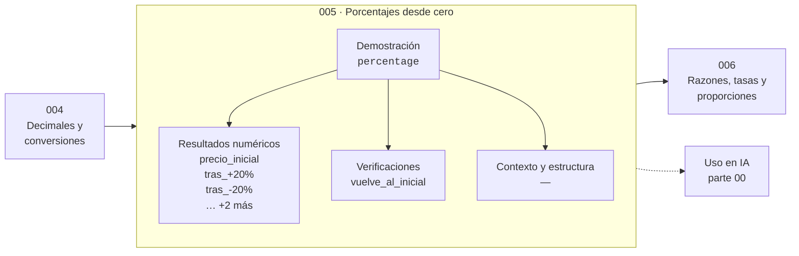

# 005 — Porcentajes desde cero

> [⬅️ 004 Decimales y conversiones](../004-decimales-y-conversiones/README.md) · [📚 Parte 00](../README.md) · [🏠 Programa](../../../README.md) · [006 Razones, tasas y proporciones ➡️](../006-razones-tasas-y-proporciones/README.md)

**Parte:** 00 — Pensamiento matemático desde cero · **Nivel:** `cero-absoluto` · **Horas estimadas:** 4
**Motor:** `engines.part00` · **Demostración:** `percentage` · **Clase 5 de 20** de la parte

---

## 🎯 Propósito

**Un porcentaje es una razón con denominador 100; los cambios porcentuales se componen multiplicando, no sumando.**

Reconstruye la aritmética y el lenguaje matemático básico con el rigor que exige escribir código: cada número tiene dominio, unidad y representación.

## ✅ Resultados de aprendizaje

Al terminar podrás:

1. Explicar **Porcentajes desde cero** con lenguaje cotidiano y con notación matemática.
2. Resolver un caso pequeño a mano y anticipar el orden de magnitud del resultado.
3. Ejecutar y modificar `lab.py`, que corre la demostración `percentage`.
4. Interpretar las 6 salidas del laboratorio y decir qué comprueba cada una.
5. Detectar el error típico de esta parte: confundir aumento del 50 % con multiplicar por 50.

## 🧩 Fórmulas de la clase

```text
x % de A = A · x/100
aumento de p % seguido de descuento de p %: A · (1+p)(1−p) = A(1 − p²)
```

## 🗺️ Ubicación en el programa



## 📖 Fundamentos

El error más caro con porcentajes no es de cálculo, es de composición. Un aumento del
20 % seguido de un descuento del 20 % **no** devuelve el precio original: devuelve el
96 % de él. La razón es que los dos porcentajes se aplican a bases distintas —el
segundo se aplica sobre el precio ya aumentado— y por eso los cambios relativos se
componen multiplicando factores, no sumando tasas.

El factor es la herramienta correcta: aumentar un 20 % es multiplicar por 1.20;
descontar un 20 % es multiplicar por 0.80. Encadenar cambios es multiplicar factores,
y el orden no altera el resultado porque la multiplicación es conmutativa. Lo que sí
cambia es cuál es el descuento que revierte exactamente un aumento: para deshacer un
×1.20 hace falta un ×1/1.20, es decir un descuento del 16.67 %, no del 20 %.

La segunda confusión frecuente es entre **punto porcentual** y **porcentaje**. Si una
tasa de conversión pasa del 10 % al 12 %, ha subido 2 puntos porcentuales, que es un
aumento relativo del 20 %. Ambas cifras son correctas y describen cosas distintas;
publicar una sin decir cuál es se usa habitualmente para exagerar resultados. La
clase 219 (A/B testing) retoma exactamente esta distinción.

Para dinero, esta clase usa `Decimal` deliberadamente. Los porcentajes producen
divisiones por 100 que en binario no son exactas, y el descuadre por redondeo al
repartir un total es un fenómeno real que el capstone de la parte hace visible.

## 🧮 Ejemplo trabajado

Un producto de 1000 sube un 20 % y luego baja un 20 %.

```text
Precio inicial            1000
Tras +20 %:  1000 × 1.20 = 1200
Tras −20 %:  1200 × 0.80 =  960

Variación neta: 960/1000 − 1 = −4 %      (= −p² con p = 0.20)

¿Qué descuento revierte exactamente el +20 %?
1 − 1/1.20 = 0.1667 → 16.67 %
1200 × (1 − 0.1667) = 1000  ✓
```

## 🔬 Qué ejecuta el laboratorio

`percentage` — Aumento y descuento sucesivos: el orden no cambia, la reversión sí.

| Grupo | Salidas |
|---|---|
| 🔢 Resultados numéricos (5) | `precio_inicial`, `tras_+20%`, `tras_-20%`, `variacion_neta_%`, `descuento_que_revierte_+20%` |
| ✅ Comprobaciones de invariante (1) | `vuelve_al_inicial` |

Las claves booleanas no son adorno: si alguna fuera `False`, el resultado numérico
no sería fiable aunque el programa terminase sin error.

```bash
python classes/part-00-pensamiento-matematico-desde-cero/005-porcentajes-desde-cero/lab.py
compmath run 005
```

> [!TIP]
> Antes de ejecutar, **escribe tu predicción**. Un laboratorio que confirma lo que
> esperabas enseña tanto como uno que te contradice, pero solo si la predicción
> existía antes del resultado.

## ⚠️ Errores conceptuales frecuentes

1. Sumar porcentajes encadenados: +20 % y −20 % no se cancelan.
2. Confundir «subió 2 puntos porcentuales» con «subió un 2 %».
3. Calcular el porcentaje sobre la base equivocada: el descuento se aplica sobre el precio ya modificado.

## 🚀 Dónde se usa de verdad

Interés compuesto (parte 07), tasas de conversión y lift en experimentos (clase 219),
y cualquier métrica relativa de un modelo. Un «20 % de mejora» sin base declarada es
una afirmación incompleta.

## 🤖 Conexión con IA

Toda métrica de un modelo (accuracy, loss, learning rate) es una razón, un porcentaje o una escala. Interpretarlas mal es el primer error de un practicante de IA.

## 📓 Notebooks

| Archivo | Para qué |
|---|---|
| [`notebook.ipynb`](notebook.ipynb) | recorrido guiado con la demostración ejecutada |
| [`notebook_student.ipynb`](notebook_student.ipynb) | versión con `TODO` para resolver |
| [`notebook_solution.ipynb`](notebook_solution.ipynb) | solución de referencia verificada |

## 📝 Evaluación

| Criterio | Peso |
|---|---:|
| Comprensión conceptual | 25 % |
| Resolución manual | 25 % |
| Implementación y verificación | 25 % |
| Interpretación y comunicación | 15 % |
| Conexión con aplicación real | 10 % |

Detalle y criterios de error crítico en [`assessment.md`](assessment.md).

## ❓ Preguntas de comprobación

1. ¿Cuál es la entrada, cuál la salida y qué unidades tienen?
2. ¿Qué operación domina el comportamiento del resultado?
3. ¿Qué caso extremo revelaría un error conceptual?
4. ¿Cómo verificarías el resultado por un método independiente?
5. ¿Dónde aparece esto en cálculo cotidiano?

Si necesitas releer el código para responderlas, la clase todavía no está superada.

## 📥 Entregable

`notebook_student.ipynb` resuelto más un párrafo que explique el resultado **sin citar
código**: qué entra, qué sale, qué invariante se comprueba y qué pasaría en un caso límite.

## 🔗 Referencias

- [Python: módulo `decimal`](https://docs.python.org/3/library/decimal.html)
- [Lang, S. *Basic Mathematics*. Springer, 1988](https://link.springer.com/book/10.1007/978-1-4757-1836-2)

Bibliografía completa de la parte en [`../../../docs/BIBLIOGRAPHY.md`](../../../docs/BIBLIOGRAPHY.md).

## 📂 Material de la clase

[`intuition.md`](intuition.md) · [`theory.md`](theory.md) · [`derivation.md`](derivation.md) · [`exercises.md`](exercises.md) · [`assessment.md`](assessment.md) · [`where-is-this-used.md`](where-is-this-used.md) · [`lesson.yaml`](lesson.yaml)

---

> [⬅️ 004 Decimales y conversiones](../004-decimales-y-conversiones/README.md) · [📚 Parte 00](../README.md) · [🏠 Programa](../../../README.md) · [006 Razones, tasas y proporciones ➡️](../006-razones-tasas-y-proporciones/README.md)
