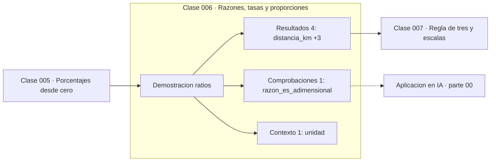

# 006 — Razones, tasas y proporciones

> [⬅️ 005 Porcentajes desde cero](../005-porcentajes-desde-cero/README.md) · [📚 Parte 00](../README.md) · [🏠 Programa](../../../README.md) · [007 Regla de tres y escalas ➡️](../007-regla-de-tres-y-escalas/README.md)

**Parte:** 00 — Pensamiento matemático desde cero · **Nivel:** `cero-absoluto` · **Horas estimadas:** 4
**Motor:** `engines.part00` · **Demostración:** `ratios` · **Clase 6 de 20** de la parte

---

## 🎯 Propósito

**Una razón compara dos cantidades por cociente; si las unidades difieren, es una tasa y conserva unidad.**

Reconstruye la aritmética y el lenguaje matemático básico con el rigor que exige escribir código: cada número tiene dominio, unidad y representación.

## ✅ Resultados de aprendizaje

Al terminar podrás:

1. Explicar **Razones, tasas y proporciones** con lenguaje cotidiano y con notación matemática.
2. Resolver un caso pequeño a mano y anticipar el orden de magnitud del resultado.
3. Ejecutar y modificar `lab.py`, que corre la demostración `ratios`.
4. Interpretar las 6 salidas del laboratorio y decir qué comprueba cada una.
5. Detectar el error típico de esta parte: escribir 1/3 como 0.33 y arrastrar el error a todo el cálculo.

## 🧩 Fórmulas de la clase

```text
razón = a/b (adimensional si a y b comparten unidad)
tasa = cantidad/unidad de referencia (km/h, €/kg, tokens/s)
```

## 🗺️ Ubicación en el programa



## 📖 Fundamentos

La distinción entre razón y tasa parece terminológica y es operativa. Una razón entre
dos cantidades de la misma unidad —tres manzanas por cada dos peras— es adimensional:
su valor no cambia si se mide en docenas en lugar de en unidades. Una tasa relaciona
unidades distintas y **conserva la unidad en el resultado**: 80 km/h no es «80», es
80 kilómetros por cada hora.

Arrastrar la unidad no es formalismo escolar: es el mecanismo de verificación más
barato que existe. Si un cálculo produce «kilómetros por hora al cuadrado» donde se
esperaba una velocidad, hay un error de modelado, y se detecta sin comprobar ni un
solo número. La clase 012 sistematiza esta idea como análisis dimensional.

Las tasas se componen por multiplicación de factores unitarios, y esa composición es
la que permite responder preguntas sin fórmulas memorizadas. Si una tarea consume
3 GB por hora y hay 5 tareas, el consumo es 15 GB/h; el tiempo hasta llenar 120 GB es
`120 GB ÷ 15 GB/h = 8 h`, donde los GB se cancelan y queda la unidad correcta.

En IA las tasas están por todas partes y casi nunca se declaran con unidad completa:
«tokens por segundo», «muestras por época», «FLOPs por parámetro», «coste por millón
de tokens». Comparar dos modelos por una tasa cuyo denominador difiere es el error de
benchmarking más común.

## 🧮 Ejemplo trabajado

Un vehículo recorre 240 km en 3 horas.

```text
Tasa:  240 km / 3 h = 80 km/h        (unidad: km/h, no adimensional)

¿Cuánto tarda en recorrer 400 km a esa tasa?
400 km ÷ 80 km/h = 5 h
          ↑ los km se cancelan, queda h   ✓

Razón (misma unidad): 240 km / 400 km = 0.6   → adimensional
```

Comprobación por unidades: si el resultado hubiera salido en `km²/h`, sabríamos que
multiplicamos donde había que dividir, sin necesidad de revisar la aritmética.

## 🔬 Qué ejecuta el laboratorio

`ratios` — Razón, tasa y proporción con unidades explícitas.

| Grupo | Salidas |
|---|---|
| 🔢 Resultados numéricos (4) | `distancia_km`, `tiempo_h`, `razon_km_por_h`, `tiempo_para_400km_h` |
| ✅ Comprobaciones de invariante (1) | `razon_es_adimensional` |

Las claves booleanas no son adorno: si alguna fuera `False`, el resultado numérico
no sería fiable aunque el programa terminase sin error.

```bash
python classes/part-00-pensamiento-matematico-desde-cero/006-razones-tasas-y-proporciones/lab.py
compmath run 006
```

> [!TIP]
> Antes de ejecutar, **escribe tu predicción**. Un laboratorio que confirma lo que
> esperabas enseña tanto como uno que te contradice, pero solo si la predicción
> existía antes del resultado.

## ⚠️ Errores conceptuales frecuentes

1. Reportar una tasa sin unidad: «la velocidad es 80» no dice si son km/h o m/s.
2. Sumar tasas con denominadores distintos: 60 km/h y 30 km/h de dos tramos no promedian 45 km/h salvo que los tiempos sean iguales.
3. Confundir razón (adimensional) con tasa (con unidad) al comparar dos sistemas.

## 🚀 Dónde se usa de verdad

Throughput y latencia de un sistema, coste por inferencia, tasa de aprendizaje
(que es una tasa: cuánto se mueve el parámetro por unidad de gradiente) y cualquier
métrica normalizada de la parte 10.

## 🤖 Conexión con IA

Toda métrica de un modelo (accuracy, loss, learning rate) es una razón, un porcentaje o una escala. Interpretarlas mal es el primer error de un practicante de IA.

## 📓 Notebooks

| Archivo | Para qué |
|---|---|
| [`notebook.ipynb`](notebook.ipynb) | recorrido guiado con la demostración ejecutada |
| [`notebook_student.ipynb`](notebook_student.ipynb) | versión con `TODO` para resolver |
| [`notebook_solution.ipynb`](notebook_solution.ipynb) | solución de referencia verificada |

## 📝 Evaluación

| Criterio | Peso |
|---|---:|
| Comprensión conceptual | 25 % |
| Resolución manual | 25 % |
| Implementación y verificación | 25 % |
| Interpretación y comunicación | 15 % |
| Conexión con aplicación real | 10 % |

Detalle y criterios de error crítico en [`assessment.md`](assessment.md).

## ❓ Preguntas de comprobación

1. ¿Cuál es la entrada, cuál la salida y qué unidades tienen?
2. ¿Qué operación domina el comportamiento del resultado?
3. ¿Qué caso extremo revelaría un error conceptual?
4. ¿Cómo verificarías el resultado por un método independiente?
5. ¿Dónde aparece esto en cálculo cotidiano?

Si necesitas releer el código para responderlas, la clase todavía no está superada.

## 📥 Entregable

`notebook_student.ipynb` resuelto más un párrafo que explique el resultado **sin citar
código**: qué entra, qué sale, qué invariante se comprueba y qué pasaría en un caso límite.

## 🔗 Referencias

- [BIPM. *The International System of Units (SI)*, 9ª ed., 2019](https://www.bipm.org/en/publications/si-brochure)
- [Stewart, J. *Precalculus*, 7ª ed., Cengage, 2015](https://www.cengage.com/c/precalculus-mathematics-for-calculus-7e-stewart/)

Bibliografía completa de la parte en [`../../../docs/BIBLIOGRAPHY.md`](../../../docs/BIBLIOGRAPHY.md).

## 📂 Material de la clase

[`intuition.md`](intuition.md) · [`theory.md`](theory.md) · [`derivation.md`](derivation.md) · [`exercises.md`](exercises.md) · [`assessment.md`](assessment.md) · [`where-is-this-used.md`](where-is-this-used.md) · [`lesson.yaml`](lesson.yaml)

---

> [⬅️ 005 Porcentajes desde cero](../005-porcentajes-desde-cero/README.md) · [📚 Parte 00](../README.md) · [🏠 Programa](../../../README.md) · [007 Regla de tres y escalas ➡️](../007-regla-de-tres-y-escalas/README.md)
