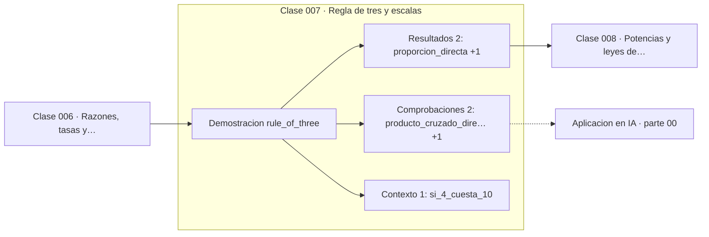

# 007 — Regla de tres y escalas

> [⬅️ 006 Razones, tasas y proporciones](../006-razones-tasas-y-proporciones/README.md) · [📚 Parte 00](../README.md) · [🏠 Programa](../../../README.md) · [008 Potencias y leyes de exponentes ➡️](../008-potencias-y-leyes-de-exponentes/README.md)

**Parte:** 00 — Pensamiento matemático desde cero · **Nivel:** `cero-absoluto` · **Horas estimadas:** 4
**Motor:** `engines.part00` · **Demostración:** `rule_of_three` · **Clase 7 de 20** de la parte

---

## 🎯 Propósito

**En la proporcionalidad directa el cociente es constante; en la inversa lo es el producto.**

Reconstruye la aritmética y el lenguaje matemático básico con el rigor que exige escribir código: cada número tiene dominio, unidad y representación.

## ✅ Resultados de aprendizaje

Al terminar podrás:

1. Explicar **Regla de tres y escalas** con lenguaje cotidiano y con notación matemática.
2. Resolver un caso pequeño a mano y anticipar el orden de magnitud del resultado.
3. Ejecutar y modificar `lab.py`, que corre la demostración `rule_of_three`.
4. Interpretar las 5 salidas del laboratorio y decir qué comprueba cada una.
5. Detectar el error típico de esta parte: sumar porcentajes como si fueran cantidades absolutas.

## 🧩 Fórmulas de la clase

```text
directa:  y/x = k  ⟹  y = kx
inversa:  x·y = k  ⟹  y = k/x
producto cruzado: a/b = c/d ⟺ ad = bc
```

## 🗺️ Ubicación en el programa



## 📖 Fundamentos

La «regla de tres» se enseña como una receta y por eso se aplica mal: se usa la
directa donde corresponde la inversa. El criterio para decidir no es el enunciado
sino la pregunta *¿qué permanece constante?*. Si al duplicar x se duplica y, lo
constante es el cociente y hay proporcionalidad directa. Si al duplicar x se reduce y
a la mitad, lo constante es el producto y la proporcionalidad es inversa.

Casos típicos de cada una: el precio total frente a la cantidad comprada es directo
(más unidades, proporcionalmente más precio). El tiempo de una obra frente al número
de trabajadores es inverso (más trabajadores, proporcionalmente menos tiempo), bajo el
supuesto —rara vez cierto en la práctica— de que los trabajadores no se estorban.
Declarar ese supuesto es parte del modelado.

La proporcionalidad directa es la primera función lineal del programa. `y = kx` es
una recta por el origen, y su generalización a varias variables, `y = Wx`, es
exactamente lo que hace una capa densa de una red neuronal (clase 110). Quien
internaliza aquí que «k es cuánto cambia y por cada unidad de x» ya tiene la
intuición correcta de lo que es un peso en un modelo lineal.

Una advertencia que el programa repetirá: la proporcionalidad es un **modelo**, no una
ley. Casi ninguna relación real es proporcional en todo su rango. El precio por
unidad baja con el volumen, el rendimiento por trabajador cae con el tamaño del
equipo, y el error de un modelo no baja proporcionalmente con los datos. Usar la
regla de tres fuera de su rango de validez es el error de modelado más frecuente.

## 🧮 Ejemplo trabajado

Si 4 unidades cuestan 10, ¿cuánto cuestan 6?

```text
Directa (precio ∝ cantidad):
  10/4 = x/6  →  x = 10·6/4 = 15
  comprobación cruzada: 4·15 = 60 = 10·6   ✓

Si en cambio el problema fuera: 4 trabajadores tardan 10 días,
¿cuánto tardan 6?

Inversa (tiempo ∝ 1/trabajadores):
  4·10 = 6·x  →  x = 40/6 = 6.67 días
  comprobación: el producto se conserva, 40 = 40   ✓
```

El mismo par de números da 15 o 6.67 según el tipo de proporcionalidad. Elegir mal no
produce un error pequeño: produce una respuesta sin relación con la pregunta.

## 🔬 Qué ejecuta el laboratorio

`rule_of_three` — Proporcionalidad directa e inversa comparadas sobre el mismo dato.

| Grupo | Salidas |
|---|---|
| 🔢 Resultados numéricos (2) | `proporcion_directa`, `proporcion_inversa` |
| ✅ Comprobaciones de invariante (2) | `producto_cruzado_directa`, `producto_constante_inversa` |

Las claves booleanas no son adorno: si alguna fuera `False`, el resultado numérico
no sería fiable aunque el programa terminase sin error.

```bash
python classes/part-00-pensamiento-matematico-desde-cero/007-regla-de-tres-y-escalas/lab.py
compmath run 007
```

> [!TIP]
> Antes de ejecutar, **escribe tu predicción**. Un laboratorio que confirma lo que
> esperabas enseña tanto como uno que te contradice, pero solo si la predicción
> existía antes del resultado.

## ⚠️ Errores conceptuales frecuentes

1. Aplicar proporcionalidad directa a una relación inversa (o al revés) sin preguntarse qué permanece constante.
2. Extrapolar fuera del rango donde la proporcionalidad es válida.
3. Olvidar el supuesto de independencia: 9 mujeres no gestan un bebé en un mes.

## 🚀 Dónde se usa de verdad

Escalado de recursos, conversión de unidades, ajuste de recetas y presupuestos. En IA
es el modelo mental correcto para el learning rate y para leer una ley de escala,
cuya forma es una proporcionalidad en escala logarítmica (clase 359).

## 🤖 Conexión con IA

Toda métrica de un modelo (accuracy, loss, learning rate) es una razón, un porcentaje o una escala. Interpretarlas mal es el primer error de un practicante de IA.

## 📓 Notebooks

| Archivo | Para qué |
|---|---|
| [`notebook.ipynb`](notebook.ipynb) | recorrido guiado con la demostración ejecutada |
| [`notebook_student.ipynb`](notebook_student.ipynb) | versión con `TODO` para resolver |
| [`notebook_solution.ipynb`](notebook_solution.ipynb) | solución de referencia verificada |

## 📝 Evaluación

| Criterio | Peso |
|---|---:|
| Comprensión conceptual | 25 % |
| Resolución manual | 25 % |
| Implementación y verificación | 25 % |
| Interpretación y comunicación | 15 % |
| Conexión con aplicación real | 10 % |

Detalle y criterios de error crítico en [`assessment.md`](assessment.md).

## ❓ Preguntas de comprobación

1. ¿Cuál es la entrada, cuál la salida y qué unidades tienen?
2. ¿Qué operación domina el comportamiento del resultado?
3. ¿Qué caso extremo revelaría un error conceptual?
4. ¿Cómo verificarías el resultado por un método independiente?
5. ¿Dónde aparece esto en cálculo cotidiano?

Si necesitas releer el código para responderlas, la clase todavía no está superada.

## 📥 Entregable

`notebook_student.ipynb` resuelto más un párrafo que explique el resultado **sin citar
código**: qué entra, qué sale, qué invariante se comprueba y qué pasaría en un caso límite.

## 🔗 Referencias

- [Stewart, J. *Precalculus*, 7ª ed., Cengage, 2015](https://www.cengage.com/c/precalculus-mathematics-for-calculus-7e-stewart/)
- [Polya, G. *How to Solve It*. Princeton University Press, 1945](https://press.princeton.edu/books/paperback/9780691164076/how-to-solve-it)

Bibliografía completa de la parte en [`../../../docs/BIBLIOGRAPHY.md`](../../../docs/BIBLIOGRAPHY.md).

## 📂 Material de la clase

[`intuition.md`](intuition.md) · [`theory.md`](theory.md) · [`derivation.md`](derivation.md) · [`exercises.md`](exercises.md) · [`assessment.md`](assessment.md) · [`where-is-this-used.md`](where-is-this-used.md) · [`lesson.yaml`](lesson.yaml)

---

> [⬅️ 006 Razones, tasas y proporciones](../006-razones-tasas-y-proporciones/README.md) · [📚 Parte 00](../README.md) · [🏠 Programa](../../../README.md) · [008 Potencias y leyes de exponentes ➡️](../008-potencias-y-leyes-de-exponentes/README.md)
