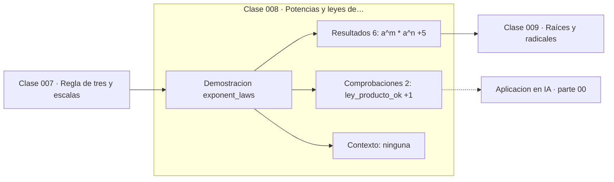

# 008 — Potencias y leyes de exponentes

> [⬅️ 007 Regla de tres y escalas](../007-regla-de-tres-y-escalas/README.md) · [📚 Parte 00](../README.md) · [🏠 Programa](../../../README.md) · [009 Raíces y radicales ➡️](../009-raices-y-radicales/README.md)

**Parte:** 00 — Pensamiento matemático desde cero · **Nivel:** `cero-absoluto` · **Horas estimadas:** 4
**Motor:** `engines.part00` · **Demostración:** `exponent_laws` · **Clase 8 de 20** de la parte

---

## 🎯 Propósito

**Las leyes de exponentes se derivan de contar factores, y su extensión a exponentes negativos y cero es la única que las conserva.**

Reconstruye la aritmética y el lenguaje matemático básico con el rigor que exige escribir código: cada número tiene dominio, unidad y representación.

## ✅ Resultados de aprendizaje

Al terminar podrás:

1. Explicar **Potencias y leyes de exponentes** con lenguaje cotidiano y con notación matemática.
2. Resolver un caso pequeño a mano y anticipar el orden de magnitud del resultado.
3. Ejecutar y modificar `lab.py`, que corre la demostración `exponent_laws`.
4. Interpretar las 8 salidas del laboratorio y decir qué comprueba cada una.
5. Detectar el error típico de esta parte: confundir aumento del 50 % con multiplicar por 50.

## 🧩 Fórmulas de la clase

```text
aᵐ · aⁿ = aᵐ⁺ⁿ
(aᵐ)ⁿ = aᵐⁿ
a⁰ = 1 (a ≠ 0),   a⁻ⁿ = 1/aⁿ
```

## 🗺️ Ubicación en el programa



## 📖 Fundamentos

Con exponentes naturales, las leyes son literalmente contar: `a³·a²` es
`(a·a·a)·(a·a)`, cinco factores, luego `a⁵`. Nada que memorizar. Lo interesante ocurre
al extender la definición fuera de los naturales, porque ahí ya no hay «número de
factores» que contar.

La extensión no es arbitraria: se elige la **única** que mantiene las leyes válidas.
Si queremos que `aᵐ·aⁿ = aᵐ⁺ⁿ` siga siendo cierto con n = 0, entonces
`aᵐ·a⁰ = aᵐ`, y por tanto `a⁰` debe ser 1. Con el mismo argumento,
`aⁿ·a⁻ⁿ = a⁰ = 1` obliga a definir `a⁻ⁿ = 1/aⁿ`. Este patrón —extender una definición
preservando las propiedades estructurales— es cómo funciona buena parte de la
matemática, y reaparecerá en la clase 009 con los exponentes fraccionarios.

El caso `0⁰` queda genuinamente indefinido: los dos argumentos naturales
(`a⁰ = 1` y `0ⁿ = 0`) apuntan a valores distintos. En análisis se toma
convencionalmente `0⁰ = 1` porque hace que las series de potencias funcionen sin caso
especial, y Python devuelve `1`; conviene saber que es un convenio, no un teorema.

La ley que más se confunde es la de la potencia iterada. `(aᵐ)ⁿ = aᵐⁿ` pero
`a^(mⁿ)` es otra cosa completamente distinta, y la potenciación asocia por la derecha:
`2**3**2` es `2**(3**2) = 2⁹ = 512`, no `(2³)² = 64`. La clase 010 vuelve sobre esto.

## 🧮 Ejemplo trabajado

Verificar las leyes con a = 2, m = 5, n = 3.

```text
Producto:   2⁵ · 2³ = 32 · 8 = 256
            2⁵⁺³   = 2⁸      = 256          ✓

Potencia:   (2⁵)³  = 32³     = 32768
            2⁵ˑ³   = 2¹⁵     = 32768        ✓

Extensión:  2⁰ = 1
            2⁻³ = 1/8 = 0.125
            2³ · 2⁻³ = 8 · 0.125 = 1 = 2⁰   ✓
```

Cada igualdad es una comprobación independiente. Si alguna fallara, la implementación
—no la matemática— tendría un error.

## 🔬 Qué ejecuta el laboratorio

`exponent_laws` — Leyes de exponentes verificadas numéricamente.

| Grupo | Salidas |
|---|---|
| 🔢 Resultados numéricos (6) | `a^m * a^n`, `a^(m+n)`, `(a^m)^n`, `a^(m*n)`, `a^0`, `a^-n` |
| ✅ Comprobaciones de invariante (2) | `ley_producto_ok`, `ley_potencia_ok` |

Las claves booleanas no son adorno: si alguna fuera `False`, el resultado numérico
no sería fiable aunque el programa terminase sin error.

```bash
python classes/part-00-pensamiento-matematico-desde-cero/008-potencias-y-leyes-de-exponentes/lab.py
compmath run 008
```

> [!TIP]
> Antes de ejecutar, **escribe tu predicción**. Un laboratorio que confirma lo que
> esperabas enseña tanto como uno que te contradice, pero solo si la predicción
> existía antes del resultado.

## ⚠️ Errores conceptuales frecuentes

1. Leer (aᵐ)ⁿ y a^(mⁿ) como lo mismo.
2. Suponer que la potenciación asocia por la izquierda: 2**3**2 = 512, no 64.
3. Aplicar aᵐ·bᵐ = (ab)ᵐ a bases distintas con exponentes distintos: 2³·3² no se simplifica.

## 🚀 Dónde se usa de verdad

Complejidad exponencial (parte 04), crecimiento compuesto (parte 02), tamaño del
espacio de búsqueda de una contraseña (clase 087) y el conteo de parámetros de un
modelo. La escala logarítmica de la clase 011 es la inversa de esta.

## 🤖 Conexión con IA

Toda métrica de un modelo (accuracy, loss, learning rate) es una razón, un porcentaje o una escala. Interpretarlas mal es el primer error de un practicante de IA.

## 📓 Notebooks

| Archivo | Para qué |
|---|---|
| [`notebook.ipynb`](notebook.ipynb) | recorrido guiado con la demostración ejecutada |
| [`notebook_student.ipynb`](notebook_student.ipynb) | versión con `TODO` para resolver |
| [`notebook_solution.ipynb`](notebook_solution.ipynb) | solución de referencia verificada |

## 📝 Evaluación

| Criterio | Peso |
|---|---:|
| Comprensión conceptual | 25 % |
| Resolución manual | 25 % |
| Implementación y verificación | 25 % |
| Interpretación y comunicación | 15 % |
| Conexión con aplicación real | 10 % |

Detalle y criterios de error crítico en [`assessment.md`](assessment.md).

## ❓ Preguntas de comprobación

1. ¿Cuál es la entrada, cuál la salida y qué unidades tienen?
2. ¿Qué operación domina el comportamiento del resultado?
3. ¿Qué caso extremo revelaría un error conceptual?
4. ¿Cómo verificarías el resultado por un método independiente?
5. ¿Dónde aparece esto en cálculo cotidiano?

Si necesitas releer el código para responderlas, la clase todavía no está superada.

## 📥 Entregable

`notebook_student.ipynb` resuelto más un párrafo que explique el resultado **sin citar
código**: qué entra, qué sale, qué invariante se comprueba y qué pasaría en un caso límite.

## 🔗 Referencias

- [Gelfand & Shen. *Algebra*. Birkhäuser, 2002](https://link.springer.com/book/10.1007/978-1-4612-0335-5)
- [Knuth, D. *Two notes on notation*. Amer. Math. Monthly, 1992](https://arxiv.org/abs/math/9205211)

Bibliografía completa de la parte en [`../../../docs/BIBLIOGRAPHY.md`](../../../docs/BIBLIOGRAPHY.md).

## 📂 Material de la clase

[`intuition.md`](intuition.md) · [`theory.md`](theory.md) · [`derivation.md`](derivation.md) · [`exercises.md`](exercises.md) · [`assessment.md`](assessment.md) · [`where-is-this-used.md`](where-is-this-used.md) · [`lesson.yaml`](lesson.yaml)

---

> [⬅️ 007 Regla de tres y escalas](../007-regla-de-tres-y-escalas/README.md) · [📚 Parte 00](../README.md) · [🏠 Programa](../../../README.md) · [009 Raíces y radicales ➡️](../009-raices-y-radicales/README.md)
