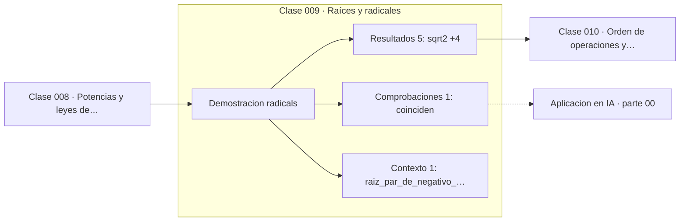

# 009 — Raíces y radicales

> [⬅️ 008 Potencias y leyes de exponentes](../008-potencias-y-leyes-de-exponentes/README.md) · [📚 Parte 00](../README.md) · [🏠 Programa](../../../README.md) · [010 Orden de operaciones y paréntesis ➡️](../010-orden-de-operaciones-y-parentesis/README.md)

**Parte:** 00 — Pensamiento matemático desde cero · **Nivel:** `cero-absoluto` · **Horas estimadas:** 4
**Motor:** `engines.part00` · **Demostración:** `radicals` · **Clase 9 de 20** de la parte

---

## 🎯 Propósito

**La raíz n-ésima es el exponente 1/n, y su dominio real depende de la paridad del índice.**

Reconstruye la aritmética y el lenguaje matemático básico con el rigor que exige escribir código: cada número tiene dominio, unidad y representación.

## ✅ Resultados de aprendizaje

Al terminar podrás:

1. Explicar **Raíces y radicales** con lenguaje cotidiano y con notación matemática.
2. Resolver un caso pequeño a mano y anticipar el orden de magnitud del resultado.
3. Ejecutar y modificar `lab.py`, que corre la demostración `radicals`.
4. Interpretar las 7 salidas del laboratorio y decir qué comprueba cada una.
5. Detectar el error típico de esta parte: escribir 1/3 como 0.33 y arrastrar el error a todo el cálculo.

## 🧩 Fórmulas de la clase

```text
ⁿ√a = a^(1/n)
(ⁿ√a)ⁿ = a  para a ≥ 0
√(a²) = |a|,  no a
```

## 🗺️ Ubicación en el programa



## 📖 Fundamentos

Definir la raíz como exponente fraccionario es la extensión natural de la clase 008:
si `(a^(1/n))ⁿ = a^(n/n) = a`, entonces `a^(1/n)` es precisamente el número que
elevado a n devuelve a. La notación de radical y la de exponente describen el mismo
objeto, y la segunda es la que se generaliza sin esfuerzo a exponentes reales.

El dominio depende de la paridad del índice, y esta es la fuente de confusión más
común. Con índice impar, todo real tiene raíz real única: la raíz cúbica de −8 es −2.
Con índice par, los negativos no tienen raíz real, porque ningún real elevado a una
potencia par da negativo. Ahí es donde aparecen los números complejos, que el programa
usa desde la parte 13 (transformada de Fourier).

La identidad `√(x²) = |x|` sorprende hasta que se piensa en el dominio: la raíz
cuadrada devuelve por convenio la rama no negativa, así que `√((−3)²) = √9 = 3`, no
−3. Olvidarlo produce errores de signo silenciosos al despejar en una ecuación
cuadrática, tema de la clase 048.

Numéricamente hay un detalle que la parte 01 explota: `√2` no es representable en
punto flotante, así que `(√2)²` no devuelve exactamente 2. El error es minúsculo pero
real, y comprobarlo aquí prepara el terreno para el concepto de error de redondeo.

## 🧮 Ejemplo trabajado

Ida y vuelta con la raíz cuadrada de 2.

```text
√2         = 1.4142135623730951    (float64, no exacto)
2**0.5     = 1.4142135623730951    (misma cosa)
(√2)²      = 2.0000000000000004
error      = 4.44e-16              ≈ 2 ulp

Raíz cúbica de −8:  índice impar → −2 en los reales
Raíz cuadrada de −8: índice par  → no existe en ℝ
```

El error de 4.44·10⁻¹⁶ no es un fallo: es el tamaño del hueco entre floats cerca de 2.
La clase 031 le pondrá nombre (ULP).

## 🔬 Qué ejecuta el laboratorio

`radicals` — Raíces como exponentes fraccionarios y su dominio real.

| Grupo | Salidas |
|---|---|
| 🔢 Resultados numéricos (5) | `sqrt(2)`, `2**0.5`, `cuadrado_de_la_raiz`, `error_del_roundtrip`, `raiz_cubica_de_-8` |
| ✅ Comprobaciones de invariante (1) | `coinciden` |

Las claves booleanas no son adorno: si alguna fuera `False`, el resultado numérico
no sería fiable aunque el programa terminase sin error.

```bash
python classes/part-00-pensamiento-matematico-desde-cero/009-raices-y-radicales/lab.py
compmath run 009
```

> [!TIP]
> Antes de ejecutar, **escribe tu predicción**. Un laboratorio que confirma lo que
> esperabas enseña tanto como uno que te contradice, pero solo si la predicción
> existía antes del resultado.

## ⚠️ Errores conceptuales frecuentes

1. Escribir √(x²) = x olvidando el valor absoluto.
2. Buscar raíces pares de números negativos en los reales.
3. Comparar (√a)² con a usando ==: hace falta una tolerancia declarada.

## 🚀 Dónde se usa de verdad

La norma euclídea (clase 104) es una raíz cuadrada; la desviación estándar
(clase 190) también; el factor 1/√d de la atención escalada (clase 325) es una raíz
cuya justificación es de varianza.

## 🤖 Conexión con IA

Toda métrica de un modelo (accuracy, loss, learning rate) es una razón, un porcentaje o una escala. Interpretarlas mal es el primer error de un practicante de IA.

## 📓 Notebooks

| Archivo | Para qué |
|---|---|
| [`notebook.ipynb`](notebook.ipynb) | recorrido guiado con la demostración ejecutada |
| [`notebook_student.ipynb`](notebook_student.ipynb) | versión con `TODO` para resolver |
| [`notebook_solution.ipynb`](notebook_solution.ipynb) | solución de referencia verificada |

## 📝 Evaluación

| Criterio | Peso |
|---|---:|
| Comprensión conceptual | 25 % |
| Resolución manual | 25 % |
| Implementación y verificación | 25 % |
| Interpretación y comunicación | 15 % |
| Conexión con aplicación real | 10 % |

Detalle y criterios de error crítico en [`assessment.md`](assessment.md).

## ❓ Preguntas de comprobación

1. ¿Cuál es la entrada, cuál la salida y qué unidades tienen?
2. ¿Qué operación domina el comportamiento del resultado?
3. ¿Qué caso extremo revelaría un error conceptual?
4. ¿Cómo verificarías el resultado por un método independiente?
5. ¿Dónde aparece esto en cálculo cotidiano?

Si necesitas releer el código para responderlas, la clase todavía no está superada.

## 📥 Entregable

`notebook_student.ipynb` resuelto más un párrafo que explique el resultado **sin citar
código**: qué entra, qué sale, qué invariante se comprueba y qué pasaría en un caso límite.

## 🔗 Referencias

- [Python: `math.isqrt` y aritmética de raíces](https://docs.python.org/3/library/math.html#math.isqrt)
- [Lang, S. *Basic Mathematics*. Springer, 1988](https://link.springer.com/book/10.1007/978-1-4757-1836-2)

Bibliografía completa de la parte en [`../../../docs/BIBLIOGRAPHY.md`](../../../docs/BIBLIOGRAPHY.md).

## 📂 Material de la clase

[`intuition.md`](intuition.md) · [`theory.md`](theory.md) · [`derivation.md`](derivation.md) · [`exercises.md`](exercises.md) · [`assessment.md`](assessment.md) · [`where-is-this-used.md`](where-is-this-used.md) · [`lesson.yaml`](lesson.yaml)

---

> [⬅️ 008 Potencias y leyes de exponentes](../008-potencias-y-leyes-de-exponentes/README.md) · [📚 Parte 00](../README.md) · [🏠 Programa](../../../README.md) · [010 Orden de operaciones y paréntesis ➡️](../010-orden-de-operaciones-y-parentesis/README.md)
