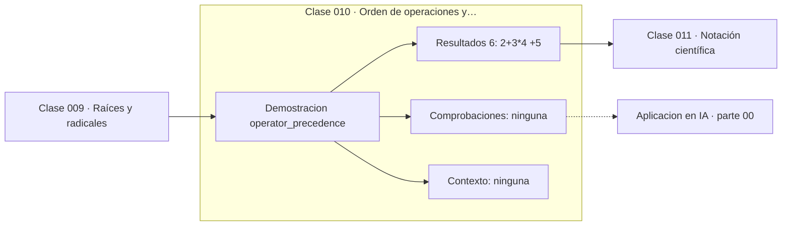

# 010 — Orden de operaciones y paréntesis

> [⬅️ 009 Raíces y radicales](../009-raices-y-radicales/README.md) · [📚 Parte 00](../README.md) · [🏠 Programa](../../../README.md) · [011 Notación científica ➡️](../011-notacion-cientifica/README.md)

**Parte:** 00 — Pensamiento matemático desde cero · **Nivel:** `cero-absoluto` · **Horas estimadas:** 4
**Motor:** `engines.part00` · **Demostración:** `operator_precedence` · **Clase 10 de 20** de la parte

---

## 🎯 Propósito

**La precedencia y la asociatividad determinan qué expresión representa una cadena de símbolos.**

Reconstruye la aritmética y el lenguaje matemático básico con el rigor que exige escribir código: cada número tiene dominio, unidad y representación.

## ✅ Resultados de aprendizaje

Al terminar podrás:

1. Explicar **Orden de operaciones y paréntesis** con lenguaje cotidiano y con notación matemática.
2. Resolver un caso pequeño a mano y anticipar el orden de magnitud del resultado.
3. Ejecutar y modificar `lab.py`, que corre la demostración `operator_precedence`.
4. Interpretar las 6 salidas del laboratorio y decir qué comprueba cada una.
5. Detectar el error típico de esta parte: sumar porcentajes como si fueran cantidades absolutas.

## 🧩 Fórmulas de la clase

```text
orden: paréntesis → potencias → producto/división → suma/resta
la potenciación asocia por la derecha: a**b**c = a**(b**c)
−a**n = −(aⁿ)
```

## 🗺️ Ubicación en el programa



## 📖 Fundamentos

Una expresión escrita en una línea es una notación comprimida de un árbol. `2+3*4` no
es ambiguo para una máquina porque las reglas de precedencia determinan un único
árbol: la multiplicación se agrupa antes que la suma. La ambigüedad está solo en la
cabeza de quien lee sin conocer las reglas.

Dos reglas concentran casi todos los errores. La primera es la asociatividad de la
potenciación **por la derecha**: `2**3**2` es `2**(3**2) = 2⁹ = 512`. Es la convención
matemática estándar y la que implementan Python, R y las calculadoras científicas;
algunas hojas de cálculo hacen lo contrario, lo que produce discrepancias reales entre
un cuaderno y un script.

La segunda es que el signo menos unario tiene **menor** precedencia que la
potenciación: `−3**2` es `−(3²) = −9`, no `(−3)² = 9`. Este error aparece
constantemente al trasladar una fórmula de un paper a código, y no produce una
excepción: produce un número con el signo equivocado.

La conclusión práctica no es memorizar la tabla completa, sino adoptar un hábito:
**poner paréntesis donde la lectura no sea inmediata**. Los paréntesis redundantes no
cuestan nada en tiempo de ejecución y eliminan una clase entera de errores. En una
fórmula que otra persona va a auditar, la claridad vale más que la brevedad.

## 🧮 Ejemplo trabajado

Cuatro expresiones que se leen mal con frecuencia.

```text
2 + 3 * 4      = 2 + 12 = 14      (no 20)
(2 + 3) * 4    = 5 * 4  = 20

2 ** 3 ** 2    = 2 ** 9 = 512     (asocia por la derecha)
(2 ** 3) ** 2  = 8 ** 2 = 64

-3 ** 2        = -(3²)  = -9      (el menos va después)
(-3) ** 2      = 9
```

Escribir `(2 ** 3) ** 2` cuando se quiere decir eso no es redundancia: es
documentación ejecutable.

## 🔬 Qué ejecuta el laboratorio

`operator_precedence` — Precedencia y asociatividad: dos lecturas de la misma cadena.

| Grupo | Salidas |
|---|---|
| 🔢 Resultados numéricos (6) | `2+3*4`, `(2+3)*4`, `2**3**2 (asocia derecha)`, `(2**3)**2`, `-3**2`, `(-3)**2` |
| ✅ Comprobaciones de invariante (0) | — |

Las claves booleanas no son adorno: si alguna fuera `False`, el resultado numérico
no sería fiable aunque el programa terminase sin error.

```bash
python classes/part-00-pensamiento-matematico-desde-cero/010-orden-de-operaciones-y-parentesis/lab.py
compmath run 010
```

> [!TIP]
> Antes de ejecutar, **escribe tu predicción**. Un laboratorio que confirma lo que
> esperabas enseña tanto como uno que te contradice, pero solo si la predicción
> existía antes del resultado.

## ⚠️ Errores conceptuales frecuentes

1. Suponer que la potenciación asocia por la izquierda.
2. Escribir -x**2 esperando (-x)**2.
3. Confiar en la precedencia entre herramientas distintas: hoja de cálculo y Python no siempre coinciden.

## 🚀 Dónde se usa de verdad

Trasladar fórmulas de un paper a código sin cambiar su significado. Es la causa
número uno de discrepancias al reproducir un resultado publicado.

## 🤖 Conexión con IA

Toda métrica de un modelo (accuracy, loss, learning rate) es una razón, un porcentaje o una escala. Interpretarlas mal es el primer error de un practicante de IA.

## 📓 Notebooks

| Archivo | Para qué |
|---|---|
| [`notebook.ipynb`](notebook.ipynb) | recorrido guiado con la demostración ejecutada |
| [`notebook_student.ipynb`](notebook_student.ipynb) | versión con `TODO` para resolver |
| [`notebook_solution.ipynb`](notebook_solution.ipynb) | solución de referencia verificada |

## 📝 Evaluación

| Criterio | Peso |
|---|---:|
| Comprensión conceptual | 25 % |
| Resolución manual | 25 % |
| Implementación y verificación | 25 % |
| Interpretación y comunicación | 15 % |
| Conexión con aplicación real | 10 % |

Detalle y criterios de error crítico en [`assessment.md`](assessment.md).

## ❓ Preguntas de comprobación

1. ¿Cuál es la entrada, cuál la salida y qué unidades tienen?
2. ¿Qué operación domina el comportamiento del resultado?
3. ¿Qué caso extremo revelaría un error conceptual?
4. ¿Cómo verificarías el resultado por un método independiente?
5. ¿Dónde aparece esto en cálculo cotidiano?

Si necesitas releer el código para responderlas, la clase todavía no está superada.

## 📥 Entregable

`notebook_student.ipynb` resuelto más un párrafo que explique el resultado **sin citar
código**: qué entra, qué sale, qué invariante se comprueba y qué pasaría en un caso límite.

## 🔗 Referencias

- [Python: precedencia de operadores](https://docs.python.org/3/reference/expressions.html#operator-precedence) — *uso:* documentación de la herramienta que ejecuta el laboratorio en «Orden de operaciones y paréntesis».
- [Knuth, D. *Two notes on notation*. Amer. Math. Monthly, 1992](https://arxiv.org/abs/math/9205211) — *uso:* artículo de origen consultado en «Orden de operaciones y paréntesis».

Bibliografía completa de la parte en [`../../../docs/BIBLIOGRAPHY.md`](../../../docs/BIBLIOGRAPHY.md) · localizador verificable de cada obra en [`sources/bibliography.json`](../../../sources/bibliography.json).

## 📂 Material de la clase

[`intuition.md`](intuition.md) · [`theory.md`](theory.md) · [`derivation.md`](derivation.md) · [`exercises.md`](exercises.md) · [`assessment.md`](assessment.md) · [`where-is-this-used.md`](where-is-this-used.md) · [`lesson.yaml`](lesson.yaml)

---

> [⬅️ 009 Raíces y radicales](../009-raices-y-radicales/README.md) · [📚 Parte 00](../README.md) · [🏠 Programa](../../../README.md) · [011 Notación científica ➡️](../011-notacion-cientifica/README.md)
