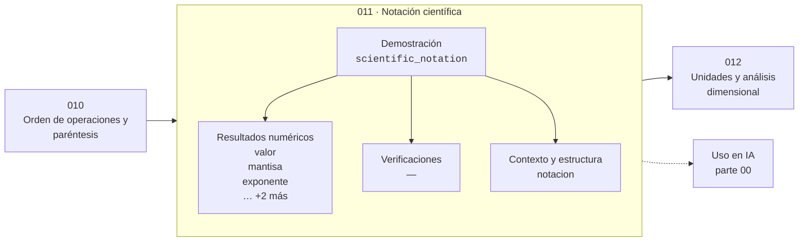

# 011 — Notación científica

> [⬅️ 010 Orden de operaciones y paréntesis](../010-orden-de-operaciones-y-parentesis/README.md) · [📚 Parte 00](../README.md) · [🏠 Programa](../../../README.md) · [012 Unidades y análisis dimensional ➡️](../012-unidades-y-analisis-dimensional/README.md)

**Parte:** 00 — Pensamiento matemático desde cero · **Nivel:** `cero-absoluto` · **Horas estimadas:** 4
**Motor:** `engines.part00` · **Demostración:** `scientific_notation` · **Clase 11 de 20** de la parte

---

## 🎯 Propósito

**La notación científica separa la magnitud (exponente) de la precisión (mantisa).**

Reconstruye la aritmética y el lenguaje matemático básico con el rigor que exige escribir código: cada número tiene dominio, unidad y representación.

## ✅ Resultados de aprendizaje

Al terminar podrás:

1. Explicar **Notación científica** con lenguaje cotidiano y con notación matemática.
2. Resolver un caso pequeño a mano y anticipar el orden de magnitud del resultado.
3. Ejecutar y modificar `lab.py`, que corre la demostración `scientific_notation`.
4. Interpretar las 6 salidas del laboratorio y decir qué comprueba cada una.
5. Detectar el error típico de esta parte: confundir aumento del 50 % con multiplicar por 50.

## 🧩 Fórmulas de la clase

```text
x = m · 10ᵉ  con 1 ≤ |m| < 10
orden de magnitud = ⌊log₁₀|x|⌋
```

## 🗺️ Ubicación en el programa



## 📖 Fundamentos

La notación científica no es una forma abreviada de escribir números grandes: es una
**descomposición** que separa dos informaciones independientes. La mantisa dice qué
dígitos conocemos —es decir, cuánta precisión tenemos— y el exponente dice en qué
escala estamos. Esa separación es exactamente la que usa el formato IEEE 754 en base
2, tema central de la clase 028.

Razonar por órdenes de magnitud es una habilidad, no un atajo. Decir que un modelo
tiene «siete mil millones de parámetros» y otro «setecientos mil millones» invita a
compararlos como si la diferencia fuera de grado; decir 7·10⁹ frente a 7·10¹¹ deja
claro que hay un factor 100 de diferencia, con el coste de memoria y cómputo que eso
implica.

Dos números del mismo orden de magnitud son comparables; dos que difieren en tres
órdenes casi nunca lo son en la práctica, porque el factor 1000 suele cambiar qué
solución es viable. Este criterio es el que se usa en la clase 014 para validar una
estimación: si la estimación y el cálculo exacto comparten orden de magnitud, la
estimación cumplió su función.

Al escribir código, conviene usar la notación de Python (`1.2e-9`) en lugar de contar
ceros. `0.0000000012` y `0.000000012` son visualmente casi idénticos y difieren en un
factor 10; `1.2e-9` y `1.2e-8` no se confunden.

## 🧮 Ejemplo trabajado

Descomponer 0.00000012345.

```text
valor        = 1.2345e-7
exponente    = ⌊log₁₀(1.2345e-7)⌋ = −7
mantisa      = 1.2345e-7 / 10⁻⁷ = 1.2345
condición    1 ≤ 1.2345 < 10                ✓
reconstruido = 1.2345 × 10⁻⁷ = 0.00000012345 ✓

Orden de magnitud: −7
```

Comparación por órdenes: 7·10⁹ frente a 7·10¹¹ → dos órdenes de diferencia, factor
100. No es «un poco más grande»: es otra categoría de problema.

## 🔬 Qué ejecuta el laboratorio

`scientific_notation` — Mantisa, exponente y orden de magnitud.

| Grupo | Salidas |
|---|---|
| 🔢 Resultados numéricos (5) | `valor`, `mantisa`, `exponente`, `reconstruido`, `orden_de_magnitud` |
| ✅ Comprobaciones de invariante (0) | — |

Las claves booleanas no son adorno: si alguna fuera `False`, el resultado numérico
no sería fiable aunque el programa terminase sin error.

```bash
python classes/part-00-pensamiento-matematico-desde-cero/011-notacion-cientifica/lab.py
compmath run 011
```

> [!TIP]
> Antes de ejecutar, **escribe tu predicción**. Un laboratorio que confirma lo que
> esperabas enseña tanto como uno que te contradice, pero solo si la predicción
> existía antes del resultado.

## ⚠️ Errores conceptuales frecuentes

1. Dejar la mantisa fuera del rango [1, 10): 12.3e5 no está en forma normalizada.
2. Contar ceros a mano en lugar de usar el exponente.
3. Confundir la precisión (número de dígitos de la mantisa) con la magnitud (exponente).

## 🚀 Dónde se usa de verdad

Presupuestos de cómputo, tamaños de modelo, tolerancias numéricas y cualquier
comparación entre cantidades de escalas distintas. Es la base de la representación en
punto flotante (clase 028).

## 🤖 Conexión con IA

Toda métrica de un modelo (accuracy, loss, learning rate) es una razón, un porcentaje o una escala. Interpretarlas mal es el primer error de un practicante de IA.

## 📓 Notebooks

| Archivo | Para qué |
|---|---|
| [`notebook.ipynb`](notebook.ipynb) | recorrido guiado con la demostración ejecutada |
| [`notebook_student.ipynb`](notebook_student.ipynb) | versión con `TODO` para resolver |
| [`notebook_solution.ipynb`](notebook_solution.ipynb) | solución de referencia verificada |

## 📝 Evaluación

| Criterio | Peso |
|---|---:|
| Comprensión conceptual | 25 % |
| Resolución manual | 25 % |
| Implementación y verificación | 25 % |
| Interpretación y comunicación | 15 % |
| Conexión con aplicación real | 10 % |

Detalle y criterios de error crítico en [`assessment.md`](assessment.md).

## ❓ Preguntas de comprobación

1. ¿Cuál es la entrada, cuál la salida y qué unidades tienen?
2. ¿Qué operación domina el comportamiento del resultado?
3. ¿Qué caso extremo revelaría un error conceptual?
4. ¿Cómo verificarías el resultado por un método independiente?
5. ¿Dónde aparece esto en cálculo cotidiano?

Si necesitas releer el código para responderlas, la clase todavía no está superada.

## 📥 Entregable

`notebook_student.ipynb` resuelto más un párrafo que explique el resultado **sin citar
código**: qué entra, qué sale, qué invariante se comprueba y qué pasaría en un caso límite.

## 🔗 Referencias

- [NIST. *Guide for the Use of the International System of Units*](https://www.nist.gov/pml/special-publication-811)
- [Goldberg, D. *What Every Computer Scientist Should Know About Floating-Point Arithmetic*. ACM CSUR, 1991](https://dl.acm.org/doi/10.1145/103162.103163)

Bibliografía completa de la parte en [`../../../docs/BIBLIOGRAPHY.md`](../../../docs/BIBLIOGRAPHY.md).

## 📂 Material de la clase

[`intuition.md`](intuition.md) · [`theory.md`](theory.md) · [`derivation.md`](derivation.md) · [`exercises.md`](exercises.md) · [`assessment.md`](assessment.md) · [`where-is-this-used.md`](where-is-this-used.md) · [`lesson.yaml`](lesson.yaml)

---

> [⬅️ 010 Orden de operaciones y paréntesis](../010-orden-de-operaciones-y-parentesis/README.md) · [📚 Parte 00](../README.md) · [🏠 Programa](../../../README.md) · [012 Unidades y análisis dimensional ➡️](../012-unidades-y-analisis-dimensional/README.md)
