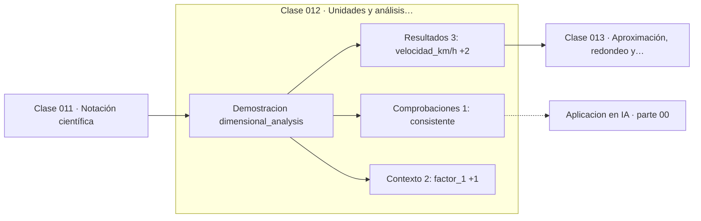

# 012 — Unidades y análisis dimensional

> [⬅️ 011 Notación científica](../011-notacion-cientifica/README.md) · [📚 Parte 00](../README.md) · [🏠 Programa](../../../README.md) · [013 Aproximación, redondeo y cifras significativas ➡️](../013-aproximacion-redondeo-y-cifras-significativas/README.md)

**Parte:** 00 — Pensamiento matemático desde cero · **Nivel:** `cero-absoluto` · **Horas estimadas:** 4
**Motor:** `engines.part00` · **Demostración:** `dimensional_analysis` · **Clase 12 de 20** de la parte

---

## 🎯 Propósito

**Convertir unidades es multiplicar por factores iguales a 1; las unidades se cancelan como factores algebraicos.**

Reconstruye la aritmética y el lenguaje matemático básico con el rigor que exige escribir código: cada número tiene dominio, unidad y representación.

## ✅ Resultados de aprendizaje

Al terminar podrás:

1. Explicar **Unidades y análisis dimensional** con lenguaje cotidiano y con notación matemática.
2. Resolver un caso pequeño a mano y anticipar el orden de magnitud del resultado.
3. Ejecutar y modificar `lab.py`, que corre la demostración `dimensional_analysis`.
4. Interpretar las 6 salidas del laboratorio y decir qué comprueba cada una.
5. Detectar el error típico de esta parte: escribir 1/3 como 0.33 y arrastrar el error a todo el cálculo.

## 🧩 Fórmulas de la clase

```text
1 = 1000 m / 1 km = 1 h / 3600 s
[velocidad] = L·T⁻¹
```

## 🗺️ Ubicación en el programa



## 📖 Fundamentos

El análisis dimensional trata las unidades como objetos algebraicos que se multiplican
y se cancelan. Un factor unitario es un cociente entre dos expresiones de la misma
cantidad —`1000 m / 1 km`— cuyo valor es exactamente 1, de modo que multiplicar por él
cambia la unidad sin cambiar la cantidad. Encadenar factores unitarios convierte
cualquier unidad en cualquier otra sin memorizar fórmulas.

La verdadera potencia del método no es convertir, es **verificar**. Antes de comprobar
un solo número, el análisis dimensional detecta si una fórmula es imposible: una
ecuación que iguala metros con segundos está mal, y eso se ve sin calculadora. En
física esta comprobación es rutina; en modelado de datos se omite casi siempre, y de
ahí salen features que mezclan escalas incompatibles.

El desastre más citado —la pérdida del Mars Climate Orbiter en 1999, donde un sistema
trabajaba en libras-fuerza·segundo y otro en newton·segundo— es el ejemplo canónico de
que declarar la unidad no es una formalidad. Ningún número estaba mal calculado; la
interfaz entre dos sistemas no declaraba unidad.

En machine learning aparece disfrazado: estandarizar features es, en el fondo,
convertirlas todas a una unidad común (desviaciones estándar) para que una distancia
euclídea tenga sentido. La clase 288 muestra cómo cambia una predicción de k-NN si una
variable se mide en una escala 100 veces mayor.

## 🧮 Ejemplo trabajado

Convertir 90 km/h a m/s encadenando factores unitarios.

```text
90 km   1000 m    1 h        90 · 1000
----- × ------ × ------  =  ----------- m/s = 25 m/s
 1 h     1 km    3600 s        3600

Cancelaciones: km/km = 1, h/h = 1  → quedan m/s   ✓

Vuelta:  25 m/s × 3600 s/h × 1 km/1000 m = 90 km/h   ✓
Atajo verificado: dividir entre 3.6
```

Si el resultado hubiera salido en `km²/h²`, el error estaría en la estructura del
cálculo, no en la aritmética.

## 🔬 Qué ejecuta el laboratorio

`dimensional_analysis` — Conversión de unidades como multiplicación por factores unitarios.

| Grupo | Salidas |
|---|---|
| 🔢 Resultados numéricos (3) | `velocidad_km/h`, `velocidad_m/s`, `vuelta_a_km/h` |
| ✅ Comprobaciones de invariante (1) | `consistente` |

Las claves booleanas no son adorno: si alguna fuera `False`, el resultado numérico
no sería fiable aunque el programa terminase sin error.

```bash
python classes/part-00-pensamiento-matematico-desde-cero/012-unidades-y-analisis-dimensional/lab.py
compmath run 012
```

> [!TIP]
> Antes de ejecutar, **escribe tu predicción**. Un laboratorio que confirma lo que
> esperabas enseña tanto como uno que te contradice, pero solo si la predicción
> existía antes del resultado.

## ⚠️ Errores conceptuales frecuentes

1. Multiplicar cuando había que dividir por el factor: siempre se comprueba qué unidad se cancela.
2. Mezclar sistemas (imperial y SI) sin declararlo en la interfaz entre módulos.
3. Comparar features de escalas distintas con una distancia euclídea sin estandarizar.

## 🚀 Dónde se usa de verdad

Interfaces entre sistemas, física computacional, y el preprocesado de datos: la
estandarización de la parte 14 es análisis dimensional aplicado a estadística.

## 🤖 Conexión con IA

Toda métrica de un modelo (accuracy, loss, learning rate) es una razón, un porcentaje o una escala. Interpretarlas mal es el primer error de un practicante de IA.

## 📓 Notebooks

| Archivo | Para qué |
|---|---|
| [`notebook.ipynb`](notebook.ipynb) | recorrido guiado con la demostración ejecutada |
| [`notebook_student.ipynb`](notebook_student.ipynb) | versión con `TODO` para resolver |
| [`notebook_solution.ipynb`](notebook_solution.ipynb) | solución de referencia verificada |

## 📝 Evaluación

| Criterio | Peso |
|---|---:|
| Comprensión conceptual | 25 % |
| Resolución manual | 25 % |
| Implementación y verificación | 25 % |
| Interpretación y comunicación | 15 % |
| Conexión con aplicación real | 10 % |

Detalle y criterios de error crítico en [`assessment.md`](assessment.md).

## ❓ Preguntas de comprobación

1. ¿Cuál es la entrada, cuál la salida y qué unidades tienen?
2. ¿Qué operación domina el comportamiento del resultado?
3. ¿Qué caso extremo revelaría un error conceptual?
4. ¿Cómo verificarías el resultado por un método independiente?
5. ¿Dónde aparece esto en cálculo cotidiano?

Si necesitas releer el código para responderlas, la clase todavía no está superada.

## 📥 Entregable

`notebook_student.ipynb` resuelto más un párrafo que explique el resultado **sin citar
código**: qué entra, qué sale, qué invariante se comprueba y qué pasaría en un caso límite.

## 🔗 Referencias

- [BIPM. *The International System of Units (SI)*, 9ª ed., 2019](https://www.bipm.org/en/publications/si-brochure) — *uso:* referencia normativa consultada en «Unidades y análisis dimensional».
- [NASA. *Mars Climate Orbiter Mishap Investigation Board Report*, 1999](https://llis.nasa.gov/llis_lib/pdf/1009464main1_0641-mr.pdf) — *uso:* obra de referencia consultada en «Unidades y análisis dimensional».

Bibliografía completa de la parte en [`../../../docs/BIBLIOGRAPHY.md`](../../../docs/BIBLIOGRAPHY.md) · localizador verificable de cada obra en [`sources/bibliography.json`](../../../sources/bibliography.json).

## 📂 Material de la clase

[`intuition.md`](intuition.md) · [`theory.md`](theory.md) · [`derivation.md`](derivation.md) · [`exercises.md`](exercises.md) · [`assessment.md`](assessment.md) · [`where-is-this-used.md`](where-is-this-used.md) · [`lesson.yaml`](lesson.yaml)

---

> [⬅️ 011 Notación científica](../011-notacion-cientifica/README.md) · [📚 Parte 00](../README.md) · [🏠 Programa](../../../README.md) · [013 Aproximación, redondeo y cifras significativas ➡️](../013-aproximacion-redondeo-y-cifras-significativas/README.md)
