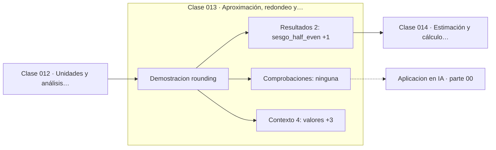

# 013 — Aproximación, redondeo y cifras significativas

> [⬅️ 012 Unidades y análisis dimensional](../012-unidades-y-analisis-dimensional/README.md) · [📚 Parte 00](../README.md) · [🏠 Programa](../../../README.md) · [014 Estimación y cálculo mental ➡️](../014-estimacion-y-calculo-mental/README.md)

**Parte:** 00 — Pensamiento matemático desde cero · **Nivel:** `cero-absoluto` · **Horas estimadas:** 4
**Motor:** `engines.part00` · **Demostración:** `rounding` · **Clase 13 de 20** de la parte

---

## 🎯 Propósito

**Redondear es una decisión de modelado con regla declarada, no un accidente de la calculadora.**

Reconstruye la aritmética y el lenguaje matemático básico con el rigor que exige escribir código: cada número tiene dominio, unidad y representación.

## ✅ Resultados de aprendizaje

Al terminar podrás:

1. Explicar **Aproximación, redondeo y cifras significativas** con lenguaje cotidiano y con notación matemática.
2. Resolver un caso pequeño a mano y anticipar el orden de magnitud del resultado.
3. Ejecutar y modificar `lab.py`, que corre la demostración `rounding`.
4. Interpretar las 6 salidas del laboratorio y decir qué comprueba cada una.
5. Detectar el error típico de esta parte: sumar porcentajes como si fueran cantidades absolutas.

## 🧩 Fórmulas de la clase

```text
half-even (bancario): 0.5 → 0, 1.5 → 2, 2.5 → 2
half-up (aritmético): 0.5 → 1, 1.5 → 2, 2.5 → 3
```

## 🗺️ Ubicación en el programa



## 📖 Fundamentos

Cuando el valor a redondear cae exactamente en la mitad, hay que elegir hacia dónde
va, y las dos elecciones habituales tienen consecuencias estadísticas distintas. El
redondeo aritmético (half-up) siempre sube, y por tanto introduce un **sesgo positivo**
que se acumula al sumar muchos valores. El redondeo bancario (half-even) manda al par
más cercano, con lo que los casos intermedios se reparten y el sesgo tiende a cero.

Por eso el estándar IEEE 754 fija half-even como modo por defecto, y por eso la
función `round` de Python hace lo mismo: `round(0.5)` devuelve 0, no 1. Quien espera
el comportamiento escolar lo interpreta como un bug; es la elección correcta para
cadenas largas de cálculos.

Las cifras significativas son el otro lado de la misma moneda: dicen **cuánta**
información contiene el número, no cuántos dígitos se imprimen. Un valor medido como
2.50 comunica precisión de centésimas; escrito como 2.5 comunica precisión de décimas;
escrito como 2.500000 comunica una precisión que probablemente no se tiene. Reportar
más dígitos de los que la medida soporta es una forma de exagerar la certeza.

La regla práctica del programa: redondear **al final**, nunca en pasos intermedios, y
declarar siempre la regla usada. Redondear intermedio destruye información que ya no
se recupera, y es una causa habitual de que dos implementaciones «iguales» devuelvan
totales distintos.

## 🧮 Ejemplo trabajado

Redondear los cuatro casos intermedios y medir el sesgo.

```text
valores        0.5   1.5   2.5   3.5     suma original = 8.0

half-even       0     2     2     4      suma = 8   → sesgo  0.0
half-up         1     2     3     4      suma = 10  → sesgo +2.0
round() Python  0     2     2     4      (half-even)
```

Con cuatro valores el sesgo de half-up ya es de 2 unidades. Sobre un millón de
importes, el descuadre es sistemático y siempre en la misma dirección.

## 🔬 Qué ejecuta el laboratorio

`rounding` — Redondeo bancario frente a redondeo aritmético.

| Grupo | Salidas |
|---|---|
| 🔢 Resultados numéricos (2) | `sesgo_half_even`, `sesgo_half_up` |
| ✅ Comprobaciones de invariante (0) | — |

Las claves booleanas no son adorno: si alguna fuera `False`, el resultado numérico
no sería fiable aunque el programa terminase sin error.

```bash
python classes/part-00-pensamiento-matematico-desde-cero/013-aproximacion-redondeo-y-cifras-significativas/lab.py
compmath run 013
```

> [!TIP]
> Antes de ejecutar, **escribe tu predicción**. Un laboratorio que confirma lo que
> esperabas enseña tanto como uno que te contradice, pero solo si la predicción
> existía antes del resultado.

## ⚠️ Errores conceptuales frecuentes

1. Esperar que round(0.5) devuelva 1 en Python.
2. Redondear en pasos intermedios y no solo en la presentación final.
3. Reportar más cifras significativas de las que la medida soporta.

## 🚀 Dónde se usa de verdad

Contabilidad, reparto de totales, informes de métricas y cualquier agregación de
muchos valores redondeados. Es prerrequisito directo del capstone de esta parte y de
la clase 034 (propagación de errores)."

## 🤖 Conexión con IA

Toda métrica de un modelo (accuracy, loss, learning rate) es una razón, un porcentaje o una escala. Interpretarlas mal es el primer error de un practicante de IA.

## 📓 Notebooks

| Archivo | Para qué |
|---|---|
| [`notebook.ipynb`](notebook.ipynb) | recorrido guiado con la demostración ejecutada |
| [`notebook_student.ipynb`](notebook_student.ipynb) | versión con `TODO` para resolver |
| [`notebook_solution.ipynb`](notebook_solution.ipynb) | solución de referencia verificada |

## 📝 Evaluación

| Criterio | Peso |
|---|---:|
| Comprensión conceptual | 25 % |
| Resolución manual | 25 % |
| Implementación y verificación | 25 % |
| Interpretación y comunicación | 15 % |
| Conexión con aplicación real | 10 % |

Detalle y criterios de error crítico en [`assessment.md`](assessment.md).

## ❓ Preguntas de comprobación

1. ¿Cuál es la entrada, cuál la salida y qué unidades tienen?
2. ¿Qué operación domina el comportamiento del resultado?
3. ¿Qué caso extremo revelaría un error conceptual?
4. ¿Cómo verificarías el resultado por un método independiente?
5. ¿Dónde aparece esto en cálculo cotidiano?

Si necesitas releer el código para responderlas, la clase todavía no está superada.

## 📥 Entregable

`notebook_student.ipynb` resuelto más un párrafo que explique el resultado **sin citar
código**: qué entra, qué sale, qué invariante se comprueba y qué pasaría en un caso límite.

## 📚 Bibliografía de la clase

Esta clase enseña **Aritmética de máquina · Fundamentos y lenguaje matemático**. Cada obra dice qué aporta aquí y cómo se comprobó su localizador:

- [IEEE 754-2019 Standard for Floating-Point Arithmetic](https://standards.ieee.org/ieee/754/6210/) — Aritmética de máquina: el tema de esta clase · URL de la fuente primaria comprobada en IEEE Standards Association (2026-08-19).
- [Python: modos de redondeo de `decimal`](https://docs.python.org/3/library/decimal.html#rounding-modes) — documentación de la herramienta que ejecuta el laboratorio · URL de la fuente primaria comprobada en Python Software Foundation (2026-08-19).

Bibliografía de todas las clases, con el porqué de cada obra, en [`docs/BIBLIOGRAPHY.md`](../../../docs/BIBLIOGRAPHY.md) · localizador y estado de cada obra en [`sources/bibliography.json`](../../../sources/bibliography.json).

## 📂 Material de la clase

[`intuition.md`](intuition.md) · [`theory.md`](theory.md) · [`derivation.md`](derivation.md) · [`exercises.md`](exercises.md) · [`assessment.md`](assessment.md) · [`where-is-this-used.md`](where-is-this-used.md) · [`lesson.yaml`](lesson.yaml)

---

> [⬅️ 012 Unidades y análisis dimensional](../012-unidades-y-analisis-dimensional/README.md) · [📚 Parte 00](../README.md) · [🏠 Programa](../../../README.md) · [014 Estimación y cálculo mental ➡️](../014-estimacion-y-calculo-mental/README.md)
