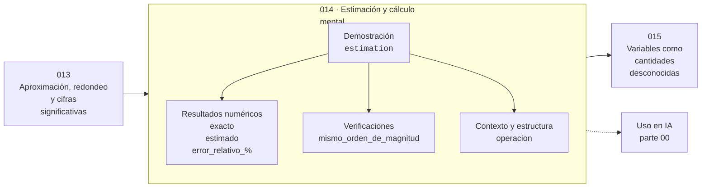

# 014 — Estimación y cálculo mental

> [⬅️ 013 Aproximación, redondeo y cifras significativas](../013-aproximacion-redondeo-y-cifras-significativas/README.md) · [📚 Parte 00](../README.md) · [🏠 Programa](../../../README.md) · [015 Variables como cantidades desconocidas ➡️](../015-variables-como-cantidades-desconocidas/README.md)

**Parte:** 00 — Pensamiento matemático desde cero · **Nivel:** `cero-absoluto` · **Horas estimadas:** 4
**Motor:** `engines.part00` · **Demostración:** `estimation` · **Clase 14 de 20** de la parte

---

## 🎯 Propósito

**Estimar por órdenes de magnitud detecta resultados absurdos antes de invertir esfuerzo en calcularlos.**

Reconstruye la aritmética y el lenguaje matemático básico con el rigor que exige escribir código: cada número tiene dominio, unidad y representación.

## ✅ Resultados de aprendizaje

Al terminar podrás:

1. Explicar **Estimación y cálculo mental** con lenguaje cotidiano y con notación matemática.
2. Resolver un caso pequeño a mano y anticipar el orden de magnitud del resultado.
3. Ejecutar y modificar `lab.py`, que corre la demostración `estimation`.
4. Interpretar las 5 salidas del laboratorio y decir qué comprueba cada una.
5. Detectar el error típico de esta parte: confundir aumento del 50 % con multiplicar por 50.

## 🧩 Fórmulas de la clase

```text
error relativo = |estimado − exacto| / |exacto|
mismo orden de magnitud ⟺ ⌊log₁₀ a⌋ = ⌊log₁₀ b⌋
```

## 🗺️ Ubicación en el programa



## 📖 Fundamentos

La estimación no compite con el cálculo exacto: lo protege. Antes de ejecutar una
operación cara —o de aceptar el número que devuelve— conviene tener una expectativa
del orden de magnitud del resultado. Si el cálculo devuelve algo tres órdenes por
encima de la expectativa, hay un error en alguna parte y se busca antes de seguir.

El método de Fermi consiste en descomponer una cantidad difícil en factores que sí se
pueden estimar, aceptando que cada factor tendrá error. La clave es que los errores
tienden a compensarse: si algunos factores se sobreestiman y otros se subestiman, el
producto queda cerca. Enrico Fermi es célebre por haber estimado la potencia de la
primera prueba nuclear soltando papelitos y midiendo su desplazamiento.

Redondear a la potencia de 10 más cercana antes de multiplicar convierte cualquier
producto en una suma de exponentes, que se hace mentalmente. `4873 × 297` es
aproximadamente `5·10³ × 3·10²= 15·10⁵ = 1.5·10⁶`, y el valor exacto es 1447281: mismo
orden de magnitud, error relativo del 3.6 %. Para decidir si un enfoque es viable,
esa precisión sobra.

En la práctica profesional esta habilidad se usa para descartar rápido: si un cálculo
de coste de entrenamiento da tres órdenes de magnitud por encima del presupuesto, no
hace falta refinarlo. La estimación no responde «cuánto», responde «¿es siquiera
posible?».

## 🧮 Ejemplo trabajado

Estimar 4873 × 297 antes de calcularlo.

```text
Estimación:  4873 ≈ 5000 = 5·10³
              297 ≈  300 = 3·10²
              producto ≈ 15·10⁵ = 1.5·10⁶

Exacto:      4873 × 297 = 1 447 281 ≈ 1.45·10⁶

Error relativo = |1.5e6 − 1.447e6| / 1.447e6 = 3.6 %
Mismo orden de magnitud (10⁶)                      ✓
```

Si el cálculo hubiera devuelto 1.4·10⁵ o 1.4·10⁷, la estimación habría detectado el
error de inmediato.

## 🔬 Qué ejecuta el laboratorio

`estimation` — Estimación por orden de magnitud contra el cálculo exacto.

| Grupo | Salidas |
|---|---|
| 🔢 Resultados numéricos (3) | `exacto`, `estimado`, `error_relativo_%` |
| ✅ Comprobaciones de invariante (1) | `mismo_orden_de_magnitud` |

Las claves booleanas no son adorno: si alguna fuera `False`, el resultado numérico
no sería fiable aunque el programa terminase sin error.

```bash
python classes/part-00-pensamiento-matematico-desde-cero/014-estimacion-y-calculo-mental/lab.py
compmath run 014
```

> [!TIP]
> Antes de ejecutar, **escribe tu predicción**. Un laboratorio que confirma lo que
> esperabas enseña tanto como uno que te contradice, pero solo si la predicción
> existía antes del resultado.

## ⚠️ Errores conceptuales frecuentes

1. Confundir estimación con cálculo aproximado descuidado: una estimación declara su margen.
2. Redondear todos los factores en la misma dirección, que amplifica el sesgo en lugar de compensarlo.
3. Usar la estimación como resultado final en lugar de como control de sanidad.

## 🚀 Dónde se usa de verdad

Dimensionar infraestructura, validar la salida de un modelo, revisar un presupuesto y
detectar errores de unidad. En entrevistas técnicas es una competencia evaluada
explícitamente."

## 🤖 Conexión con IA

Toda métrica de un modelo (accuracy, loss, learning rate) es una razón, un porcentaje o una escala. Interpretarlas mal es el primer error de un practicante de IA.

## 📓 Notebooks

| Archivo | Para qué |
|---|---|
| [`notebook.ipynb`](notebook.ipynb) | recorrido guiado con la demostración ejecutada |
| [`notebook_student.ipynb`](notebook_student.ipynb) | versión con `TODO` para resolver |
| [`notebook_solution.ipynb`](notebook_solution.ipynb) | solución de referencia verificada |

## 📝 Evaluación

| Criterio | Peso |
|---|---:|
| Comprensión conceptual | 25 % |
| Resolución manual | 25 % |
| Implementación y verificación | 25 % |
| Interpretación y comunicación | 15 % |
| Conexión con aplicación real | 10 % |

Detalle y criterios de error crítico en [`assessment.md`](assessment.md).

## ❓ Preguntas de comprobación

1. ¿Cuál es la entrada, cuál la salida y qué unidades tienen?
2. ¿Qué operación domina el comportamiento del resultado?
3. ¿Qué caso extremo revelaría un error conceptual?
4. ¿Cómo verificarías el resultado por un método independiente?
5. ¿Dónde aparece esto en cálculo cotidiano?

Si necesitas releer el código para responderlas, la clase todavía no está superada.

## 📥 Entregable

`notebook_student.ipynb` resuelto más un párrafo que explique el resultado **sin citar
código**: qué entra, qué sale, qué invariante se comprueba y qué pasaría en un caso límite.

## 🔗 Referencias

- [Weinstein & Adam. *Guesstimation*. Princeton University Press, 2008](https://press.princeton.edu/books/paperback/9780691129495/guesstimation)
- [Polya, G. *How to Solve It*. Princeton University Press, 1945](https://press.princeton.edu/books/paperback/9780691164076/how-to-solve-it)

Bibliografía completa de la parte en [`../../../docs/BIBLIOGRAPHY.md`](../../../docs/BIBLIOGRAPHY.md).

## 📂 Material de la clase

[`intuition.md`](intuition.md) · [`theory.md`](theory.md) · [`derivation.md`](derivation.md) · [`exercises.md`](exercises.md) · [`assessment.md`](assessment.md) · [`where-is-this-used.md`](where-is-this-used.md) · [`lesson.yaml`](lesson.yaml)

---

> [⬅️ 013 Aproximación, redondeo y cifras significativas](../013-aproximacion-redondeo-y-cifras-significativas/README.md) · [📚 Parte 00](../README.md) · [🏠 Programa](../../../README.md) · [015 Variables como cantidades desconocidas ➡️](../015-variables-como-cantidades-desconocidas/README.md)
