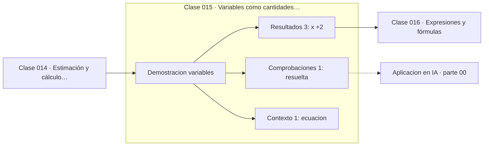

# 015 — Variables como cantidades desconocidas

> [⬅️ 014 Estimación y cálculo mental](../014-estimacion-y-calculo-mental/README.md) · [📚 Parte 00](../README.md) · [🏠 Programa](../../../README.md) · [016 Expresiones y fórmulas ➡️](../016-expresiones-y-formulas/README.md)

**Parte:** 00 — Pensamiento matemático desde cero · **Nivel:** `cero-absoluto` · **Horas estimadas:** 4
**Motor:** `engines.part00` · **Demostración:** `variables` · **Clase 15 de 20** de la parte

---

## 🎯 Propósito

**Una incógnita es un valor concreto pero desconocido; las restricciones del problema lo determinan.**

Reconstruye la aritmética y el lenguaje matemático básico con el rigor que exige escribir código: cada número tiene dominio, unidad y representación.

## ✅ Resultados de aprendizaje

Al terminar podrás:

1. Explicar **Variables como cantidades desconocidas** con lenguaje cotidiano y con notación matemática.
2. Resolver un caso pequeño a mano y anticipar el orden de magnitud del resultado.
3. Ejecutar y modificar `lab.py`, que corre la demostración `variables`.
4. Interpretar las 5 salidas del laboratorio y decir qué comprueba cada una.
5. Detectar el error típico de esta parte: escribir 1/3 como 0.33 y arrastrar el error a todo el cálculo.

## 🧩 Fórmulas de la clase

```text
ax + b = c  ⟹  x = (c − b)/a,  a ≠ 0
residuo = a·x + b − c  (debe ser 0)
```

## 🗺️ Ubicación en el programa



## 📖 Fundamentos

Introducir una letra para lo que no se conoce es el paso que convierte un acertijo en
un problema resoluble. Antes de al-Juarismi —cuyo tratado del siglo IX da nombre al
álgebra y al algoritmo— los problemas se resolvían con recetas verbales específicas
para cada caso. La letra permite escribir la relación **antes** de conocer el valor, y
luego manipularla mecánicamente.

Conviene distinguir tres papeles que juegan las letras, porque se confunden a menudo:
la **incógnita** tiene un valor concreto que hay que despejar; el **parámetro** es
fijo pero no especificado (la `a` de `ax + b`); y la **variable** recorre un conjunto
de valores (la x de una función). Un mismo símbolo puede cambiar de papel según el
contexto, y no darse cuenta produce confusiones reales en la parte 02.

Despejar es aplicar operaciones inversas manteniendo la igualdad. Cada paso es
legítimo mientras la operación sea reversible: sumar y restar siempre lo son; dividir
lo es solo si el divisor no es cero. Ese detalle —`a ≠ 0`— no es un tecnicismo: si a
es cero, la ecuación `0·x = 0` tiene infinitas soluciones y `0·x = 5` no tiene
ninguna. Declarar el caso degenerado es parte de resolver.

La verificación es obligatoria y barata: sustituir la solución en la ecuación original
y comprobar que el residuo es cero. Es el mismo hábito que en la parte 05 se llamará
«comprobar el residuo del sistema lineal» y en la 11, «criterio de parada».

## 🧮 Ejemplo trabajado

Resolver 3x + 7 = 25 y verificar.

```text
3x + 7 = 25
3x     = 25 − 7 = 18        (restar 7 a ambos lados)
 x     = 18/3   = 6          (dividir por 3, válido porque 3 ≠ 0)

Verificación:  3·6 + 7 = 18 + 7 = 25    ✓
Residuo:       3·6 + 7 − 25 = 0         ✓

Casos degenerados:
  0·x = 0  → infinitas soluciones
  0·x = 5  → ninguna solución
```

## 🔬 Qué ejecuta el laboratorio

`variables` — Una incógnita convierte una pregunta en una ecuación resoluble.

| Grupo | Salidas |
|---|---|
| 🔢 Resultados numéricos (3) | `x`, `verificacion`, `residuo` |
| ✅ Comprobaciones de invariante (1) | `resuelta` |

Las claves booleanas no son adorno: si alguna fuera `False`, el resultado numérico
no sería fiable aunque el programa terminase sin error.

```bash
python classes/part-00-pensamiento-matematico-desde-cero/015-variables-como-cantidades-desconocidas/lab.py
compmath run 015
```

> [!TIP]
> Antes de ejecutar, **escribe tu predicción**. Un laboratorio que confirma lo que
> esperabas enseña tanto como uno que te contradice, pero solo si la predicción
> existía antes del resultado.

## ⚠️ Errores conceptuales frecuentes

1. Dividir por una expresión que puede ser cero sin declarar el caso.
2. Aplicar una operación a un solo lado de la igualdad.
3. Dar la solución sin sustituirla en la ecuación original.

## 🚀 Dónde se usa de verdad

Toda resolución de sistemas (parte 05), todo despeje en una derivación (parte 07) y la
condición de primer orden ∇f = 0 de la optimización (parte 12) son despejes con más
variables."

## 🤖 Conexión con IA

Toda métrica de un modelo (accuracy, loss, learning rate) es una razón, un porcentaje o una escala. Interpretarlas mal es el primer error de un practicante de IA.

## 📓 Notebooks

| Archivo | Para qué |
|---|---|
| [`notebook.ipynb`](notebook.ipynb) | recorrido guiado con la demostración ejecutada |
| [`notebook_student.ipynb`](notebook_student.ipynb) | versión con `TODO` para resolver |
| [`notebook_solution.ipynb`](notebook_solution.ipynb) | solución de referencia verificada |

## 📝 Evaluación

| Criterio | Peso |
|---|---:|
| Comprensión conceptual | 25 % |
| Resolución manual | 25 % |
| Implementación y verificación | 25 % |
| Interpretación y comunicación | 15 % |
| Conexión con aplicación real | 10 % |

Detalle y criterios de error crítico en [`assessment.md`](assessment.md).

## ❓ Preguntas de comprobación

1. ¿Cuál es la entrada, cuál la salida y qué unidades tienen?
2. ¿Qué operación domina el comportamiento del resultado?
3. ¿Qué caso extremo revelaría un error conceptual?
4. ¿Cómo verificarías el resultado por un método independiente?
5. ¿Dónde aparece esto en cálculo cotidiano?

Si necesitas releer el código para responderlas, la clase todavía no está superada.

## 📥 Entregable

`notebook_student.ipynb` resuelto más un párrafo que explique el resultado **sin citar
código**: qué entra, qué sale, qué invariante se comprueba y qué pasaría en un caso límite.

## 📚 Bibliografía de la clase

Esta clase enseña **Fundamentos y lenguaje matemático · Lógica y demostración · Álgebra y funciones · Teoría de números**. Cada obra dice qué aporta aquí y cómo se comprobó su localizador:

- [Gelfand & Shen. *Algebra*. Birkhäuser, 2002](https://link.springer.com/book/10.1007/978-1-4612-0335-5) — Álgebra y funciones: el tema de esta clase · DOI `10.1007/978-1-4612-0335-5`, pendiente de resolver.
- [Katz, V. *A History of Mathematics*, 3ª ed., Pearson, 2008, cap. 7](https://www.pearson.com/en-us/subject-catalog/p/history-of-mathematics-a/P200000006166) — Historia de la matemática: conexión declarada de esta parte · URL de la fuente primaria comprobada en sitio de la obra o de su editorial (2026-08-19).

Bibliografía de todas las clases, con el porqué de cada obra, en [`docs/BIBLIOGRAPHY.md`](../../../docs/BIBLIOGRAPHY.md) · localizador y estado de cada obra en [`sources/bibliography.json`](../../../sources/bibliography.json).

## 📂 Material de la clase

[`intuition.md`](intuition.md) · [`theory.md`](theory.md) · [`derivation.md`](derivation.md) · [`exercises.md`](exercises.md) · [`assessment.md`](assessment.md) · [`where-is-this-used.md`](where-is-this-used.md) · [`lesson.yaml`](lesson.yaml)

---

> [⬅️ 014 Estimación y cálculo mental](../014-estimacion-y-calculo-mental/README.md) · [📚 Parte 00](../README.md) · [🏠 Programa](../../../README.md) · [016 Expresiones y fórmulas ➡️](../016-expresiones-y-formulas/README.md)
