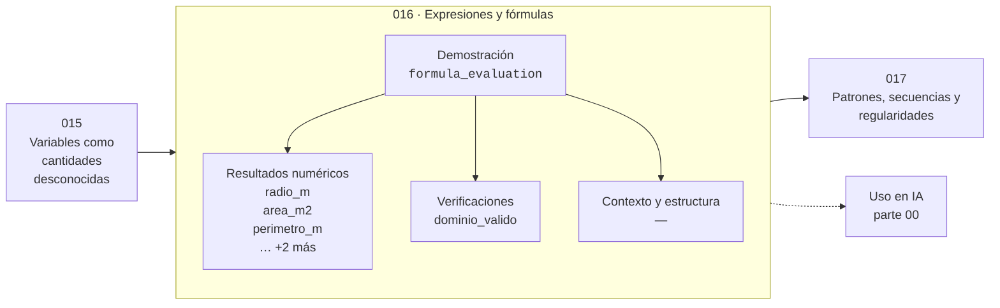

# 016 — Expresiones y fórmulas

> [⬅️ 015 Variables como cantidades desconocidas](../015-variables-como-cantidades-desconocidas/README.md) · [📚 Parte 00](../README.md) · [🏠 Programa](../../../README.md) · [017 Patrones, secuencias y regularidades ➡️](../017-patrones-secuencias-y-regularidades/README.md)

**Parte:** 00 — Pensamiento matemático desde cero · **Nivel:** `cero-absoluto` · **Horas estimadas:** 4
**Motor:** `engines.part00` · **Demostración:** `formula_evaluation` · **Clase 16 de 20** de la parte

---

## 🎯 Propósito

**Una fórmula es una relación entre cantidades con dominio y unidades declarados.**

Reconstruye la aritmética y el lenguaje matemático básico con el rigor que exige escribir código: cada número tiene dominio, unidad y representación.

## ✅ Resultados de aprendizaje

Al terminar podrás:

1. Explicar **Expresiones y fórmulas** con lenguaje cotidiano y con notación matemática.
2. Resolver un caso pequeño a mano y anticipar el orden de magnitud del resultado.
3. Ejecutar y modificar `lab.py`, que corre la demostración `formula_evaluation`.
4. Interpretar las 6 salidas del laboratorio y decir qué comprueba cada una.
5. Detectar el error típico de esta parte: sumar porcentajes como si fueran cantidades absolutas.

## 🧩 Fórmulas de la clase

```text
A = πr²  (r > 0, A en unidad²)
P = 2πr  ⟹  A/P = r/2
```

## 🗺️ Ubicación en el programa



## 📖 Fundamentos

Evaluar una fórmula es fácil; usarla bien exige tres cosas que rara vez se escriben:
su **dominio de validez**, las **unidades** de cada símbolo y los **supuestos** bajo
los que se dedujo. Una fórmula sin esas tres declaraciones es una máquina de producir
números plausibles fuera de contexto.

El área del círculo, `A = πr²`, ilustra los tres. Dominio: r > 0, porque un radio
negativo no tiene interpretación. Unidades: si r está en metros, A está en metros
**cuadrados**, y esa elevación al cuadrado es lo que hace que duplicar el radio
cuadruplique el área —un hecho que sorprende a mucha gente y que se deduce sin
calcular nada, solo mirando el exponente.

La relación entre área y perímetro, `A/P = r/2`, muestra otra habilidad: combinar
fórmulas para obtener relaciones que ninguna de las dos expresa por separado. Que el
cociente dependa solo de r —y linealmente— dice algo estructural sobre el círculo, no
sobre un círculo concreto.

Este es el hábito que la parte 07 formaliza como análisis de sensibilidad: preguntar
«¿qué le pasa a la salida si esta entrada cambia un poco?» antes de meter números. El
exponente de cada variable responde esa pregunta de forma inmediata: en `A = πr²`, un
error del 1 % en r produce aproximadamente un 2 % de error en A.

## 🧮 Ejemplo trabajado

Círculo de radio 2.5 m.

```text
A = π · 2.5² = π · 6.25 ≈ 19.635 m²
P = 2π · 2.5           ≈ 15.708 m

A/P = 19.635 / 15.708 = 1.25 m
r/2 = 2.5/2           = 1.25 m       ✓ (relación estructural)

Sensibilidad: si r sube un 1 % (2.525 m),
  A = π·2.525² ≈ 20.030 m²  → +2.01 %
  el exponente 2 predice el factor de amplificación
```

## 🔬 Qué ejecuta el laboratorio

`formula_evaluation` — Una fórmula evaluada con dominio y unidades declaradas.

| Grupo | Salidas |
|---|---|
| 🔢 Resultados numéricos (5) | `radio_m`, `area_m2`, `perimetro_m`, `razon_area_perimetro`, `razon_teorica_r/2` |
| ✅ Comprobaciones de invariante (1) | `dominio_valido` |

Las claves booleanas no son adorno: si alguna fuera `False`, el resultado numérico
no sería fiable aunque el programa terminase sin error.

```bash
python classes/part-00-pensamiento-matematico-desde-cero/016-expresiones-y-formulas/lab.py
compmath run 016
```

> [!TIP]
> Antes de ejecutar, **escribe tu predicción**. Un laboratorio que confirma lo que
> esperabas enseña tanto como uno que te contradice, pero solo si la predicción
> existía antes del resultado.

## ⚠️ Errores conceptuales frecuentes

1. Evaluar una fórmula fuera de su dominio (radio negativo, logaritmo de cero).
2. Olvidar que el área escala con el cuadrado de la longitud y el volumen con el cubo.
3. Usar una fórmula sin conocer los supuestos bajo los que se dedujo.

## 🚀 Dónde se usa de verdad

Cualquier modelo es una fórmula con dominio. El análisis de sensibilidad por
exponentes es la versión elemental del gradiente (parte 08) y del número de condición
(clase 035)."

## 🤖 Conexión con IA

Toda métrica de un modelo (accuracy, loss, learning rate) es una razón, un porcentaje o una escala. Interpretarlas mal es el primer error de un practicante de IA.

## 📓 Notebooks

| Archivo | Para qué |
|---|---|
| [`notebook.ipynb`](notebook.ipynb) | recorrido guiado con la demostración ejecutada |
| [`notebook_student.ipynb`](notebook_student.ipynb) | versión con `TODO` para resolver |
| [`notebook_solution.ipynb`](notebook_solution.ipynb) | solución de referencia verificada |

## 📝 Evaluación

| Criterio | Peso |
|---|---:|
| Comprensión conceptual | 25 % |
| Resolución manual | 25 % |
| Implementación y verificación | 25 % |
| Interpretación y comunicación | 15 % |
| Conexión con aplicación real | 10 % |

Detalle y criterios de error crítico en [`assessment.md`](assessment.md).

## ❓ Preguntas de comprobación

1. ¿Cuál es la entrada, cuál la salida y qué unidades tienen?
2. ¿Qué operación domina el comportamiento del resultado?
3. ¿Qué caso extremo revelaría un error conceptual?
4. ¿Cómo verificarías el resultado por un método independiente?
5. ¿Dónde aparece esto en cálculo cotidiano?

Si necesitas releer el código para responderlas, la clase todavía no está superada.

## 📥 Entregable

`notebook_student.ipynb` resuelto más un párrafo que explique el resultado **sin citar
código**: qué entra, qué sale, qué invariante se comprueba y qué pasaría en un caso límite.

## 🔗 Referencias

- [Stewart, J. *Precalculus*, 7ª ed., Cengage, 2015](https://www.cengage.com/c/precalculus-mathematics-for-calculus-7e-stewart/)
- [BIPM. *The International System of Units (SI)*, 9ª ed., 2019](https://www.bipm.org/en/publications/si-brochure)

Bibliografía completa de la parte en [`../../../docs/BIBLIOGRAPHY.md`](../../../docs/BIBLIOGRAPHY.md).

## 📂 Material de la clase

[`intuition.md`](intuition.md) · [`theory.md`](theory.md) · [`derivation.md`](derivation.md) · [`exercises.md`](exercises.md) · [`assessment.md`](assessment.md) · [`where-is-this-used.md`](where-is-this-used.md) · [`lesson.yaml`](lesson.yaml)

---

> [⬅️ 015 Variables como cantidades desconocidas](../015-variables-como-cantidades-desconocidas/README.md) · [📚 Parte 00](../README.md) · [🏠 Programa](../../../README.md) · [017 Patrones, secuencias y regularidades ➡️](../017-patrones-secuencias-y-regularidades/README.md)
