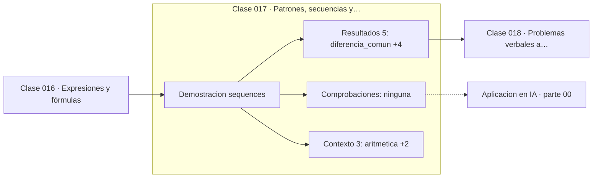

# 017 — Patrones, secuencias y regularidades

> [⬅️ 016 Expresiones y fórmulas](../016-expresiones-y-formulas/README.md) · [📚 Parte 00](../README.md) · [🏠 Programa](../../../README.md) · [018 Problemas verbales a lenguaje matemático ➡️](../018-problemas-verbales-a-lenguaje-matematico/README.md)

**Parte:** 00 — Pensamiento matemático desde cero · **Nivel:** `cero-absoluto` · **Horas estimadas:** 4
**Motor:** `engines.part00` · **Demostración:** `sequences` · **Clase 17 de 20** de la parte

---

## 🎯 Propósito

**Detectar una regla en una secuencia es una conjetura; extrapolarla sin justificación es un salto injustificado.**

Reconstruye la aritmética y el lenguaje matemático básico con el rigor que exige escribir código: cada número tiene dominio, unidad y representación.

## ✅ Resultados de aprendizaje

Al terminar podrás:

1. Explicar **Patrones, secuencias y regularidades** con lenguaje cotidiano y con notación matemática.
2. Resolver un caso pequeño a mano y anticipar el orden de magnitud del resultado.
3. Ejecutar y modificar `lab.py`, que corre la demostración `sequences`.
4. Interpretar las 8 salidas del laboratorio y decir qué comprueba cada una.
5. Detectar el error típico de esta parte: confundir aumento del 50 % con multiplicar por 50.

## 🧩 Fórmulas de la clase

```text
aritmética:  aₙ = a₁ + (n−1)d
geométrica:  aₙ = a₁·rⁿ⁻¹
Fibonacci:   Fₙ = Fₙ₋₁ + Fₙ₋₂,  Fₙ₊₁/Fₙ → φ = (1+√5)/2
```

## 🗺️ Ubicación en el programa



## 📖 Fundamentos

Ver un patrón es barato; demostrarlo no. Dada la secuencia 3, 7, 11, 15, la regla
«suma 4» es la más simple, pero infinitas fórmulas producen esos cuatro términos y
luego divergen. La matemática distingue entre **conjeturar** una regla y
**demostrarla**, y esa distinción es el puente entre esta clase y la 091 (inducción).

Las dos familias fundamentales se distinguen por qué operación es constante. En la
aritmética lo constante es la **diferencia** entre términos consecutivos; su
crecimiento es lineal. En la geométrica lo constante es la **razón**; su crecimiento
es exponencial. Confundirlas al modelar produce predicciones que fallan por órdenes de
magnitud, no por un poco.

Fibonacci añade un tercer tipo: la recurrencia, donde cada término depende de varios
anteriores. Su comportamiento asintótico es sorprendente y demostrable: el cociente
entre términos consecutivos converge a la razón áurea φ ≈ 1.618, que es la raíz
positiva de `x² = x + 1`. Que una recurrencia de enteros converja a un irracional es
un buen ejemplo de que el comportamiento asintótico no se lee en los primeros
términos.

El hábito que instala esta clase: al proponer una regla, indicar **qué operación
permanece constante** y hasta dónde se ha verificado. «Suma 4, verificado en 4
términos» es una afirmación honesta; «la regla es sumar 4» no lo es.

## 🧮 Ejemplo trabajado

Tres secuencias y su regla.

```text
Aritmética:  3, 7, 11, 15, 19        diferencia constante = 4
             a₆ = 3 + 5·4 = 23

Geométrica:  2, 6, 18, 54, 162       razón constante = 3
             a₆ = 2·3⁵ = 486

Fibonacci:   1, 1, 2, 3, 5, 8, 13, 21, 34, 55
             55/34 = 1.6176...
             φ     = 1.6180...       converge, no coincide aún
```

La secuencia aritmética crece 4 por paso; la geométrica multiplica por 3 por paso. En
diez pasos la primera llega a 39 y la segunda a 39366.

## 🔬 Qué ejecuta el laboratorio

`sequences` — Detectar la regla de una secuencia y extrapolarla con cuidado.

| Grupo | Salidas |
|---|---|
| 🔢 Resultados numéricos (5) | `diferencia_comun`, `siguiente_aritmetica`, `razon_comun`, `razon_fib_final`, `razon_aurea` |
| ✅ Comprobaciones de invariante (0) | — |

Las claves booleanas no son adorno: si alguna fuera `False`, el resultado numérico
no sería fiable aunque el programa terminase sin error.

```bash
python classes/part-00-pensamiento-matematico-desde-cero/017-patrones-secuencias-y-regularidades/lab.py
compmath run 017
```

> [!TIP]
> Antes de ejecutar, **escribe tu predicción**. Un laboratorio que confirma lo que
> esperabas enseña tanto como uno que te contradice, pero solo si la predicción
> existía antes del resultado.

## ⚠️ Errores conceptuales frecuentes

1. Afirmar una regla como demostrada tras verificar unos pocos términos.
2. Confundir diferencia constante (lineal) con razón constante (exponencial).
3. Extrapolar una secuencia empírica fuera del rango observado.

## 🚀 Dónde se usa de verdad

Análisis de complejidad (parte 04), crecimiento compuesto (parte 02), series
temporales (parte 13) y la lectura de curvas de aprendizaje: distinguir si un error
baja linealmente o exponencialmente cambia por completo la decisión."

## 🤖 Conexión con IA

Toda métrica de un modelo (accuracy, loss, learning rate) es una razón, un porcentaje o una escala. Interpretarlas mal es el primer error de un practicante de IA.

## 📓 Notebooks

| Archivo | Para qué |
|---|---|
| [`notebook.ipynb`](notebook.ipynb) | recorrido guiado con la demostración ejecutada |
| [`notebook_student.ipynb`](notebook_student.ipynb) | versión con `TODO` para resolver |
| [`notebook_solution.ipynb`](notebook_solution.ipynb) | solución de referencia verificada |

## 📝 Evaluación

| Criterio | Peso |
|---|---:|
| Comprensión conceptual | 25 % |
| Resolución manual | 25 % |
| Implementación y verificación | 25 % |
| Interpretación y comunicación | 15 % |
| Conexión con aplicación real | 10 % |

Detalle y criterios de error crítico en [`assessment.md`](assessment.md).

## ❓ Preguntas de comprobación

1. ¿Cuál es la entrada, cuál la salida y qué unidades tienen?
2. ¿Qué operación domina el comportamiento del resultado?
3. ¿Qué caso extremo revelaría un error conceptual?
4. ¿Cómo verificarías el resultado por un método independiente?
5. ¿Dónde aparece esto en cálculo cotidiano?

Si necesitas releer el código para responderlas, la clase todavía no está superada.

## 📥 Entregable

`notebook_student.ipynb` resuelto más un párrafo que explique el resultado **sin citar
código**: qué entra, qué sale, qué invariante se comprueba y qué pasaría en un caso límite.

## 🔗 Referencias

- [OEIS — Enciclopedia en línea de secuencias de enteros](https://oeis.org/) — *uso:* exposición alternativa del tema en «Patrones, secuencias y regularidades».
- [Graham, Knuth & Patashnik. *Concrete Mathematics*, 2ª ed., 1994](https://www-cs-faculty.stanford.edu/~knuth/gkp.html) — *uso:* obra de referencia consultada en «Patrones, secuencias y regularidades».

Bibliografía completa de la parte en [`../../../docs/BIBLIOGRAPHY.md`](../../../docs/BIBLIOGRAPHY.md) · localizador verificable de cada obra en [`sources/bibliography.json`](../../../sources/bibliography.json).

## 📂 Material de la clase

[`intuition.md`](intuition.md) · [`theory.md`](theory.md) · [`derivation.md`](derivation.md) · [`exercises.md`](exercises.md) · [`assessment.md`](assessment.md) · [`where-is-this-used.md`](where-is-this-used.md) · [`lesson.yaml`](lesson.yaml)

---

> [⬅️ 016 Expresiones y fórmulas](../016-expresiones-y-formulas/README.md) · [📚 Parte 00](../README.md) · [🏠 Programa](../../../README.md) · [018 Problemas verbales a lenguaje matemático ➡️](../018-problemas-verbales-a-lenguaje-matematico/README.md)
