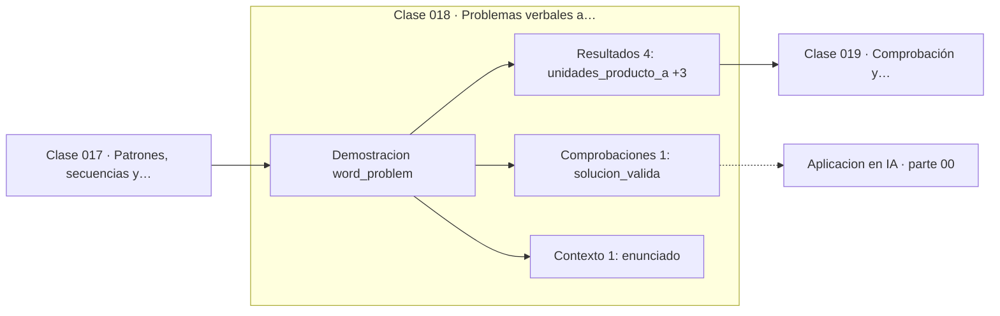

# 018 — Problemas verbales a lenguaje matemático

> [⬅️ 017 Patrones, secuencias y regularidades](../017-patrones-secuencias-y-regularidades/README.md) · [📚 Parte 00](../README.md) · [🏠 Programa](../../../README.md) · [019 Comprobación y contraejemplos ➡️](../019-comprobacion-y-contraejemplos/README.md)

**Parte:** 00 — Pensamiento matemático desde cero · **Nivel:** `cero-absoluto` · **Horas estimadas:** 4
**Motor:** `engines.part00` · **Demostración:** `word_problem` · **Clase 18 de 20** de la parte

---

## 🎯 Propósito

**Modelar es traducir un enunciado a ecuaciones declarando qué representa cada símbolo.**

Reconstruye la aritmética y el lenguaje matemático básico con el rigor que exige escribir código: cada número tiene dominio, unidad y representación.

## ✅ Resultados de aprendizaje

Al terminar podrás:

1. Explicar **Problemas verbales a lenguaje matemático** con lenguaje cotidiano y con notación matemática.
2. Resolver un caso pequeño a mano y anticipar el orden de magnitud del resultado.
3. Ejecutar y modificar `lab.py`, que corre la demostración `word_problem`.
4. Interpretar las 6 salidas del laboratorio y decir qué comprueba cada una.
5. Detectar el error típico de esta parte: escribir 1/3 como 0.33 y arrastrar el error a todo el cálculo.

## 🧩 Fórmulas de la clase

```text
sistema 2×2:  x + y = T,   p₁x + p₂y = M
solución:  y = (M − p₁T)/(p₂ − p₁),  x = T − y
```

## 🗺️ Ubicación en el programa



## 📖 Fundamentos

La dificultad de un problema verbal casi nunca está en el álgebra: está en la
traducción. El procedimiento fiable tiene cuatro pasos y conviene seguirlos en orden:
(1) nombrar las incógnitas **con su unidad**, (2) escribir una ecuación por cada
restricción del enunciado, (3) resolver el sistema, (4) comprobar que la solución
tiene sentido en el problema original, no solo en las ecuaciones.

El paso 4 es el que más se omite y el que más errores atrapa. Un sistema puede tener
solución matemática y ninguna solución real: si el reparto da −3 unidades de un
producto, el modelo es correcto y el enunciado es imposible. Distinguir «no hay
solución» de «el modelo está mal» exige volver al enunciado.

Contar restricciones es el control de sanidad previo. Dos incógnitas necesitan dos
ecuaciones independientes; con una sola hay infinitas soluciones, y con tres es
probable que el sistema sea incompatible. Esta cuenta reaparece en la parte 05 como
la relación entre rango, número de incógnitas y existencia de solución.

Polya, en *How to Solve It* (1945), sistematizó este método en cuatro fases:
comprender el problema, concebir un plan, ejecutarlo y examinar la solución. Sigue
siendo la mejor descripción del proceso, y su última fase —examinar— es exactamente
el paso que la prisa elimina.

## 🧮 Ejemplo trabajado

«Se venden 30 unidades entre dos productos, uno a 1500 y otro a 2500, recaudando
61 000. ¿Cuántas de cada uno?»

```text
Paso 1 — incógnitas con unidad
  x = unidades del producto A
  y = unidades del producto B

Paso 2 — una ecuación por restricción
  x + y = 30                    (total de unidades)
  1500x + 2500y = 61000         (recaudación)

Paso 3 — resolver
  y = (61000 − 1500·30)/(2500 − 1500) = 16000/1000 = 16
  x = 30 − 16 = 14

Paso 4 — comprobar contra el enunciado
  14 + 16 = 30                            ✓
  1500·14 + 2500·16 = 21000 + 40000 = 61000 ✓
  ambas cantidades ≥ 0 → solución factible  ✓
```

## 🔬 Qué ejecuta el laboratorio

`word_problem` — Traducir un enunciado a ecuaciones y resolverlo.

| Grupo | Salidas |
|---|---|
| 🔢 Resultados numéricos (4) | `unidades_producto_a`, `unidades_producto_b`, `verificacion_unidades`, `verificacion_dinero` |
| ✅ Comprobaciones de invariante (1) | `solucion_valida` |

Las claves booleanas no son adorno: si alguna fuera `False`, el resultado numérico
no sería fiable aunque el programa terminase sin error.

```bash
python classes/part-00-pensamiento-matematico-desde-cero/018-problemas-verbales-a-lenguaje-matematico/lab.py
compmath run 018
```

> [!TIP]
> Antes de ejecutar, **escribe tu predicción**. Un laboratorio que confirma lo que
> esperabas enseña tanto como uno que te contradice, pero solo si la predicción
> existía antes del resultado.

## ⚠️ Errores conceptuales frecuentes

1. Empezar a operar antes de nombrar las incógnitas y sus unidades.
2. Escribir menos ecuaciones que incógnitas y no notar que el problema queda indeterminado.
3. Aceptar una solución matemáticamente válida pero imposible en el problema (cantidades negativas).

## 🚀 Dónde se usa de verdad

Es la habilidad central del modelado: formular un problema real como un objeto
matemático. Reaparece en cada capstone del programa, y en la parte 12 como la
construcción de la función objetivo y sus restricciones."

## 🤖 Conexión con IA

Toda métrica de un modelo (accuracy, loss, learning rate) es una razón, un porcentaje o una escala. Interpretarlas mal es el primer error de un practicante de IA.

## 📓 Notebooks

| Archivo | Para qué |
|---|---|
| [`notebook.ipynb`](notebook.ipynb) | recorrido guiado con la demostración ejecutada |
| [`notebook_student.ipynb`](notebook_student.ipynb) | versión con `TODO` para resolver |
| [`notebook_solution.ipynb`](notebook_solution.ipynb) | solución de referencia verificada |

## 📝 Evaluación

| Criterio | Peso |
|---|---:|
| Comprensión conceptual | 25 % |
| Resolución manual | 25 % |
| Implementación y verificación | 25 % |
| Interpretación y comunicación | 15 % |
| Conexión con aplicación real | 10 % |

Detalle y criterios de error crítico en [`assessment.md`](assessment.md).

## ❓ Preguntas de comprobación

1. ¿Cuál es la entrada, cuál la salida y qué unidades tienen?
2. ¿Qué operación domina el comportamiento del resultado?
3. ¿Qué caso extremo revelaría un error conceptual?
4. ¿Cómo verificarías el resultado por un método independiente?
5. ¿Dónde aparece esto en cálculo cotidiano?

Si necesitas releer el código para responderlas, la clase todavía no está superada.

## 📥 Entregable

`notebook_student.ipynb` resuelto más un párrafo que explique el resultado **sin citar
código**: qué entra, qué sale, qué invariante se comprueba y qué pasaría en un caso límite.

## 🔗 Referencias

- [Polya, G. *How to Solve It*. Princeton University Press, 1945](https://press.princeton.edu/books/paperback/9780691164076/how-to-solve-it) — *uso:* desarrollo formal del tema en «Problemas verbales a lenguaje matemático».
- [Schoenfeld, A. *Mathematical Problem Solving*. Academic Press, 1985](https://www.elsevier.com/books/mathematical-problem-solving/schoenfeld/978-0-12-628870-4) — *uso:* desarrollo formal del tema en «Problemas verbales a lenguaje matemático».

Bibliografía completa de la parte en [`../../../docs/BIBLIOGRAPHY.md`](../../../docs/BIBLIOGRAPHY.md) · localizador verificable de cada obra en [`sources/bibliography.json`](../../../sources/bibliography.json).

## 📂 Material de la clase

[`intuition.md`](intuition.md) · [`theory.md`](theory.md) · [`derivation.md`](derivation.md) · [`exercises.md`](exercises.md) · [`assessment.md`](assessment.md) · [`where-is-this-used.md`](where-is-this-used.md) · [`lesson.yaml`](lesson.yaml)

---

> [⬅️ 017 Patrones, secuencias y regularidades](../017-patrones-secuencias-y-regularidades/README.md) · [📚 Parte 00](../README.md) · [🏠 Programa](../../../README.md) · [019 Comprobación y contraejemplos ➡️](../019-comprobacion-y-contraejemplos/README.md)
