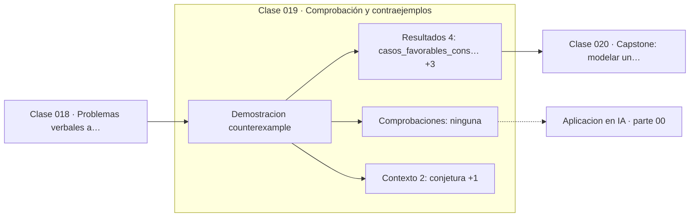

# 019 — Comprobación y contraejemplos

> [⬅️ 018 Problemas verbales a lenguaje matemático](../018-problemas-verbales-a-lenguaje-matematico/README.md) · [📚 Parte 00](../README.md) · [🏠 Programa](../../../README.md) · [020 Capstone: modelar un problema cotidiano con matemáticas ➡️](../020-capstone-modelar-un-problema-cotidiano-con-matematicas/README.md)

**Parte:** 00 — Pensamiento matemático desde cero · **Nivel:** `cero-absoluto` · **Horas estimadas:** 4
**Motor:** `engines.part00` · **Demostración:** `counterexample` · **Clase 19 de 20** de la parte

---

## 🎯 Propósito

**Un contraejemplo refuta una afirmación universal; ninguna cantidad de confirmaciones la demuestra.**

Reconstruye la aritmética y el lenguaje matemático básico con el rigor que exige escribir código: cada número tiene dominio, unidad y representación.

## ✅ Resultados de aprendizaje

Al terminar podrás:

1. Explicar **Comprobación y contraejemplos** con lenguaje cotidiano y con notación matemática.
2. Resolver un caso pequeño a mano y anticipar el orden de magnitud del resultado.
3. Ejecutar y modificar `lab.py`, que corre la demostración `counterexample`.
4. Interpretar las 6 salidas del laboratorio y decir qué comprueba cada una.
5. Detectar el error típico de esta parte: sumar porcentajes como si fueran cantidades absolutas.

## 🧩 Fórmulas de la clase

```text
¬(∀x P(x)) ⟺ ∃x ¬P(x)
n² + n + 41 es primo para n = 0..39, compuesto para n = 40
```

## 🗺️ Ubicación en el programa



## 📖 Fundamentos

La asimetría entre verificar y demostrar es el contenido de esta clase, y es la
lección más transferible de toda la parte. Una afirmación universal —«para todo n se
cumple P(n)»— no queda demostrada por muchos casos favorables, pero queda refutada por
**uno solo** desfavorable. Verificar y demostrar son operaciones de coste y de valor
radicalmente distintos.

El polinomio de Euler `n² + n + 41` es el ejemplo canónico. Produce números primos
para n = 0, 1, 2, ..., 39: cuarenta confirmaciones consecutivas, más de las que
cualquiera revisaría antes de convencerse. Y falla en n = 40, donde vale
`40² + 40 + 41 = 1681 = 41²`. La razón es visible en retrospectiva: al sustituir
n = 41 (o 40) aparece el factor 41 explícitamente.

Trasladado al software, esto es exactamente la relación entre pruebas y corrección:
«los tests pasan» significa que no se encontró contraejemplo en los casos probados, no
que el código sea correcto. Dijkstra lo formuló en 1970 con una frase que resume la
clase: las pruebas pueden mostrar la presencia de errores, nunca su ausencia.

La estrategia práctica que se deriva es contraintuitiva y muy eficaz: al evaluar una
afirmación propia, **buscar activamente el caso que la rompa** en lugar de acumular
casos que la confirmen. Los casos límite —cero, negativos, vacío, uno, el máximo
representable— son donde viven los contraejemplos.

## 🧮 Ejemplo trabajado

La conjetura de Euler y su caída.

```text
n:   0  1  2  3  ...  38  39   |  40
n²+n+41: 41 43 47 53 ... 1523 1601  |  1681

n = 0..39  → los 40 valores son primos
n = 40     → 1681 = 41 × 41       ✗ COMPUESTO

Regla:  40 confirmaciones no demuestran
        1 contraejemplo refuta
```

Nótese que el contraejemplo no requiere teoría avanzada: requiere seguir probando
cuando ya «parecía» cierto.

## 🔬 Qué ejecuta el laboratorio

`counterexample` — Una conjetura plausible destruida por un único contraejemplo.

| Grupo | Salidas |
|---|---|
| 🔢 Resultados numéricos (4) | `casos_favorables_consecutivos`, `primer_contraejemplo_n`, `valor_en_el_contraejemplo`, `factor` |
| ✅ Comprobaciones de invariante (0) | — |

Las claves booleanas no son adorno: si alguna fuera `False`, el resultado numérico
no sería fiable aunque el programa terminase sin error.

```bash
python classes/part-00-pensamiento-matematico-desde-cero/019-comprobacion-y-contraejemplos/lab.py
compmath run 019
```

> [!TIP]
> Antes de ejecutar, **escribe tu predicción**. Un laboratorio que confirma lo que
> esperabas enseña tanto como uno que te contradice, pero solo si la predicción
> existía antes del resultado.

## ⚠️ Errores conceptuales frecuentes

1. Concluir que una afirmación es cierta porque no se encontró contraejemplo en pocos casos.
2. Probar solo casos favorables o típicos, evitando los límites.
3. Confundir «los tests pasan» con «el código es correcto».

## 🚀 Dónde se usa de verdad

Diseño de pruebas, validación de modelos y evaluación de resultados publicados. En la
parte 10 reaparece como la lógica de las pruebas de hipótesis: no se demuestra H₁, se
rechaza H₀."

## 🤖 Conexión con IA

Toda métrica de un modelo (accuracy, loss, learning rate) es una razón, un porcentaje o una escala. Interpretarlas mal es el primer error de un practicante de IA.

## 📓 Notebooks

| Archivo | Para qué |
|---|---|
| [`notebook.ipynb`](notebook.ipynb) | recorrido guiado con la demostración ejecutada |
| [`notebook_student.ipynb`](notebook_student.ipynb) | versión con `TODO` para resolver |
| [`notebook_solution.ipynb`](notebook_solution.ipynb) | solución de referencia verificada |

## 📝 Evaluación

| Criterio | Peso |
|---|---:|
| Comprensión conceptual | 25 % |
| Resolución manual | 25 % |
| Implementación y verificación | 25 % |
| Interpretación y comunicación | 15 % |
| Conexión con aplicación real | 10 % |

Detalle y criterios de error crítico en [`assessment.md`](assessment.md).

## ❓ Preguntas de comprobación

1. ¿Cuál es la entrada, cuál la salida y qué unidades tienen?
2. ¿Qué operación domina el comportamiento del resultado?
3. ¿Qué caso extremo revelaría un error conceptual?
4. ¿Cómo verificarías el resultado por un método independiente?
5. ¿Dónde aparece esto en cálculo cotidiano?

Si necesitas releer el código para responderlas, la clase todavía no está superada.

## 📥 Entregable

`notebook_student.ipynb` resuelto más un párrafo que explique el resultado **sin citar
código**: qué entra, qué sale, qué invariante se comprueba y qué pasaría en un caso límite.

## 📚 Bibliografía de la clase

Esta clase enseña **Fundamentos y lenguaje matemático · Lógica y demostración · Álgebra y funciones · Teoría de números**. Cada obra dice qué aporta aquí y cómo se comprobó su localizador:

- [Dijkstra, E. W. *Notes on Structured Programming*, EWD249, 1970](https://www.cs.utexas.edu/~EWD/ewd02xx/EWD249.PDF) — Lógica y demostración: el tema de esta clase · URL de la fuente primaria comprobada en www.cs.utexas.edu (2026-08-19).
- [Lakatos, I. *Proofs and Refutations*. Cambridge University Press, 1976](https://www.cambridge.org/core/books/proofs-and-refutations/575FC6BB16BD500BB0B04D2B0A1EA2C9) — Lógica y demostración: el tema de esta clase · URL de la fuente primaria, pendiente de resolver.
- [Euler's prime-generating polynomial — Wolfram MathWorld](https://mathworld.wolfram.com/Prime-GeneratingPolynomial.html) — Lógica y demostración y Teoría de números: el tema de esta clase · URL de la fuente primaria comprobada en Wolfram Research (2026-08-19).

Bibliografía de todas las clases, con el porqué de cada obra, en [`docs/BIBLIOGRAPHY.md`](../../../docs/BIBLIOGRAPHY.md) · localizador y estado de cada obra en [`sources/bibliography.json`](../../../sources/bibliography.json).

## 📂 Material de la clase

[`intuition.md`](intuition.md) · [`theory.md`](theory.md) · [`derivation.md`](derivation.md) · [`exercises.md`](exercises.md) · [`assessment.md`](assessment.md) · [`where-is-this-used.md`](where-is-this-used.md) · [`lesson.yaml`](lesson.yaml)

---

> [⬅️ 018 Problemas verbales a lenguaje matemático](../018-problemas-verbales-a-lenguaje-matematico/README.md) · [📚 Parte 00](../README.md) · [🏠 Programa](../../../README.md) · [020 Capstone: modelar un problema cotidiano con matemáticas ➡️](../020-capstone-modelar-un-problema-cotidiano-con-matematicas/README.md)
