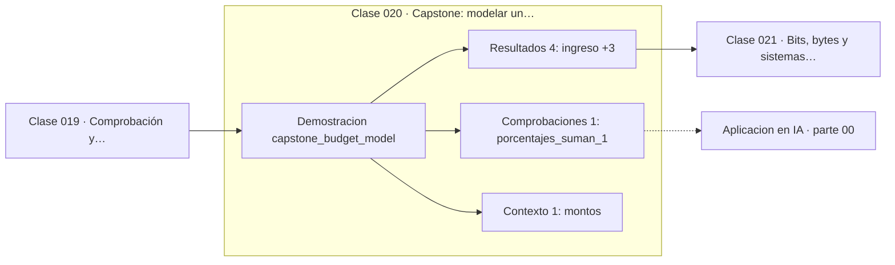

# 020 — Capstone: modelar un problema cotidiano con matemáticas

> [⬅️ 019 Comprobación y contraejemplos](../019-comprobacion-y-contraejemplos/README.md) · [📚 Parte 00](../README.md) · [🏠 Programa](../../../README.md) · [021 Bits, bytes y sistemas de numeración ➡️](../../part-01-aritmetica-computacional-y-representacion-numerica/021-bits-bytes-y-sistemas-de-numeracion/README.md)

**Parte:** 00 — Pensamiento matemático desde cero · **Nivel:** `cero-absoluto` · **Horas estimadas:** 4
**Motor:** `engines.part00` · **Demostración:** `capstone_budget_model` · **Clase 20 de 20** de la parte

---

## 🎯 Propósito

**Modelar un presupuesto integra dinero exacto, porcentajes, redondeo y verificación en un solo problema.**

Reconstruye la aritmética y el lenguaje matemático básico con el rigor que exige escribir código: cada número tiene dominio, unidad y representación.

## ✅ Resultados de aprendizaje

Al terminar podrás:

1. Explicar **Capstone: modelar un problema cotidiano con matemáticas** con lenguaje cotidiano y con notación matemática.
2. Resolver un caso pequeño a mano y anticipar el orden de magnitud del resultado.
3. Ejecutar y modificar `lab.py`, que corre la demostración `capstone_budget_model`.
4. Interpretar las 6 salidas del laboratorio y decir qué comprueba cada una.
5. Detectar el error típico de esta parte: confundir aumento del 50 % con multiplicar por 50.

## 🧩 Fórmulas de la clase

```text
Σ pᵢ = 1  (los porcentajes deben sumar la unidad)
descuadre = ingreso − Σ redondeo(ingreso · pᵢ)
```

## 🗺️ Ubicación en el programa



## 📖 Fundamentos

El capstone reúne todo lo de la parte en un problema con consecuencias reales:
repartir un ingreso en categorías según porcentajes. Parece trivial y contiene tres
trampas que las clases anteriores anticiparon.

La primera: los porcentajes deben sumar exactamente 1. Comprobarlo con `Decimal` es
trivial; comprobarlo con `float` no lo es, porque 0.35 + 0.20 + 0.10 + 0.20 + 0.15
puede no dar exactamente 1.0 en binario. Esta es la primera vez en el programa que la
representación numérica cambia el resultado de una comprobación lógica.

La segunda: redondear cada categoría a la unidad monetaria hace que la suma de las
partes **no** coincida con el total. El descuadre es pequeño pero sistemático, y
cualquier sistema contable real necesita una política explícita para él: asignar el
resto a una categoría, distribuirlo, o llevar el redondeo por acumulación. No decidir
es también una decisión, y produce descuadres impredecibles.

La tercera: proyectar hacia el futuro. «¿Cuántos meses para ahorrar 5 millones?» es
una división, pero su resultado es un número real y la respuesta es un entero de
meses —hay que redondear **hacia arriba**, porque a mitad de mes no se ha ahorrado la
cantidad—. Elegir la dirección del redondeo según el significado del problema, y no
según la costumbre, es la competencia que cierra la parte.

## 🧮 Ejemplo trabajado

Repartir un ingreso de 1 250 000 en cinco categorías.

```text
categoría      %      importe (Decimal, redondeado a 1)
vivienda      35 %      437 500
alimentación  20 %      250 000
transporte    10 %      125 000
ahorro        20 %      250 000
otros         15 %      187 500
─────────────────────────────────
suma %       100 %  ✓
suma importes        1 250 000
descuadre                    0    (aquí los porcentajes dan exactos)

Meses para ahorrar 5 000 000 con 250 000/mes:
  5 000 000 / 250 000 = 20 meses exactos
  (si diera 20.3, la respuesta operativa sería 21)
```

Con porcentajes como 1/3 el descuadre aparece y hay que decidir dónde va el resto.

## 🔬 Qué ejecuta el laboratorio

`capstone_budget_model` — Capstone: modelar un presupuesto con dinero exacto y proporciones.

| Grupo | Salidas |
|---|---|
| 🔢 Resultados numéricos (4) | `ingreso`, `total_asignado`, `descuadre_por_redondeo`, `meses_para_ahorrar_5M` |
| ✅ Comprobaciones de invariante (1) | `porcentajes_suman_1` |

Las claves booleanas no son adorno: si alguna fuera `False`, el resultado numérico
no sería fiable aunque el programa terminase sin error.

```bash
python classes/part-00-pensamiento-matematico-desde-cero/020-capstone-modelar-un-problema-cotidiano-con-matematicas/lab.py
compmath run 020
```

> [!TIP]
> Antes de ejecutar, **escribe tu predicción**. Un laboratorio que confirma lo que
> esperabas enseña tanto como uno que te contradice, pero solo si la predicción
> existía antes del resultado.

## ⚠️ Errores conceptuales frecuentes

1. Comprobar que los porcentajes suman 1 usando float y == en lugar de Decimal.
2. No definir una política para el descuadre por redondeo.
3. Redondear hacia abajo un número de periodos: a los 20.3 meses aún no se alcanzó la meta.

## 🚀 Dónde se usa de verdad

Contabilidad, presupuestos personales y empresariales, reparto de costes entre
equipos y prorrateo de recursos en la nube. La política de descuadre es un requisito
real en cualquier sistema de facturación."

## 🤖 Conexión con IA

Toda métrica de un modelo (accuracy, loss, learning rate) es una razón, un porcentaje o una escala. Interpretarlas mal es el primer error de un practicante de IA.

## 📓 Notebooks

| Archivo | Para qué |
|---|---|
| [`notebook.ipynb`](notebook.ipynb) | recorrido guiado con la demostración ejecutada |
| [`notebook_student.ipynb`](notebook_student.ipynb) | versión con `TODO` para resolver |
| [`notebook_solution.ipynb`](notebook_solution.ipynb) | solución de referencia verificada |

## 📝 Evaluación

| Criterio | Peso |
|---|---:|
| Comprensión conceptual | 25 % |
| Resolución manual | 25 % |
| Implementación y verificación | 25 % |
| Interpretación y comunicación | 15 % |
| Conexión con aplicación real | 10 % |

Detalle y criterios de error crítico en [`assessment.md`](assessment.md).

## ❓ Preguntas de comprobación

1. ¿Cuál es la entrada, cuál la salida y qué unidades tienen?
2. ¿Qué operación domina el comportamiento del resultado?
3. ¿Qué caso extremo revelaría un error conceptual?
4. ¿Cómo verificarías el resultado por un método independiente?
5. ¿Dónde aparece esto en cálculo cotidiano?

Si necesitas releer el código para responderlas, la clase todavía no está superada.

## 📥 Entregable

`notebook_student.ipynb` resuelto más un párrafo que explique el resultado **sin citar
código**: qué entra, qué sale, qué invariante se comprueba y qué pasaría en un caso límite.

## 🔗 Referencias

- [Python: módulo `decimal`](https://docs.python.org/3/library/decimal.html)
- [IEEE 754-2019 Standard for Floating-Point Arithmetic](https://standards.ieee.org/ieee/754/6210/)

Bibliografía completa de la parte en [`../../../docs/BIBLIOGRAPHY.md`](../../../docs/BIBLIOGRAPHY.md).

## 📂 Material de la clase

[`intuition.md`](intuition.md) · [`theory.md`](theory.md) · [`derivation.md`](derivation.md) · [`exercises.md`](exercises.md) · [`assessment.md`](assessment.md) · [`where-is-this-used.md`](where-is-this-used.md) · [`lesson.yaml`](lesson.yaml)

---

> [⬅️ 019 Comprobación y contraejemplos](../019-comprobacion-y-contraejemplos/README.md) · [📚 Parte 00](../README.md) · [🏠 Programa](../../../README.md) · [021 Bits, bytes y sistemas de numeración ➡️](../../part-01-aritmetica-computacional-y-representacion-numerica/021-bits-bytes-y-sistemas-de-numeracion/README.md)
