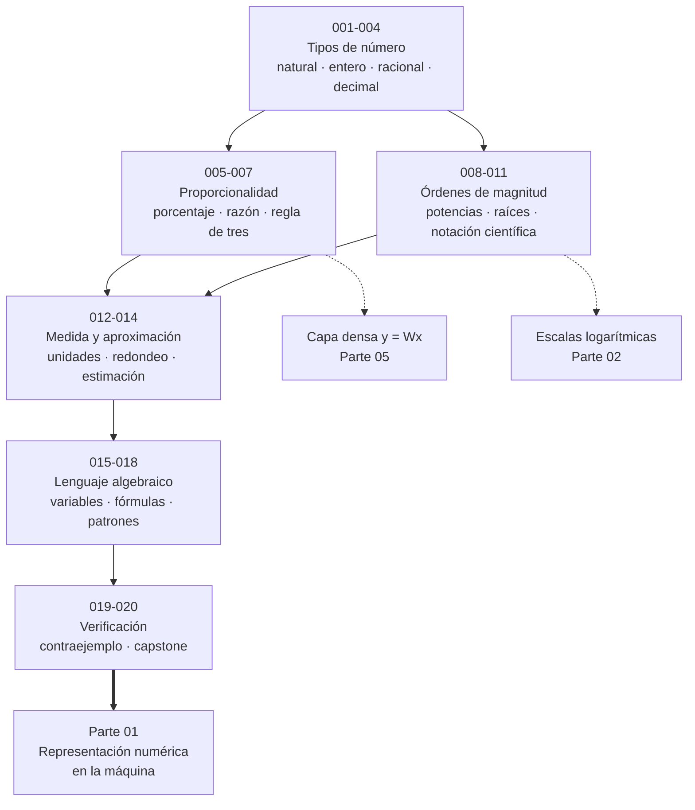

# 🔢 Parte 00 — Pensamiento matemático desde cero

> [🏠 Programa](../../README.md) · [📇 Catálogo](../README.md) · [Parte 01 — Aritmética computacional y representación numérica ➡️](../part-01-aritmetica-computacional-y-representacion-numerica/README.md)

**Nivel:** `cero-absoluto` · **Clases:** 20 · **Horas estimadas:** 80 · **Motor:** [`part00.py`](../../src/computational_math/engines/part00.py)

---

## 🎯 De qué trata esta parte

Reconstruye la aritmética y el lenguaje matemático básico con el rigor que exige escribir código: cada número tiene dominio, unidad y representación.

Esta parte no enseña «matemática básica»: reconstruye la aritmética con el nivel de
precisión que exige escribir código que otra persona ejecutará. La diferencia es real.
En la escuela, `1/3 = 0.33` es una respuesta aceptable; en un programa, esa igualdad es
falsa y su error se propaga a todo lo que venga después.

El hilo conductor son tres preguntas que se repetirán en las 360 clases del programa:

1. **¿Qué es este número?** Un natural, un entero, un racional exacto o una aproximación
   decimal no son el mismo objeto, aunque se escriban parecido y la calculadora los
   mezcle sin avisar.
2. **¿En qué unidad y en qué escala vive?** Un 15 sin unidad no es una cantidad: es una
   cadena de dígitos. Casi todo error de modelado empieza aquí.
3. **¿Cómo sé que el resultado es correcto?** Un cálculo sin verificación independiente
   es una conjetura con formato de respuesta.

La proporcionalidad es el eje del bloque central (clases 006 a 007). Es la primera
función lineal que aprendemos sin llamarla así, y reaparece literalmente en cada capa
densa de una red neuronal: `y = kx` es el caso unidimensional de `y = Wx`. Quien no
distingue una proporcionalidad directa de una inversa tampoco distinguirá después una
relación lineal de una recíproca en un modelo.

El bloque de potencias, raíces y notación científica (008 a 011) construye el vocabulario
para hablar de **órdenes de magnitud**. En IA esa competencia es cotidiana: un modelo de
7·10⁹ parámetros y otro de 7·10¹¹ no se diferencian en «tamaño», se diferencian en dos
órdenes de magnitud, y esa es la unidad en la que se razona sobre coste, memoria y
tiempo de entrenamiento.

El cierre (013 a 019) instala los hábitos que separan un cálculo de una afirmación:
redondear como decisión declarada, estimar antes de calcular, traducir un enunciado a
ecuaciones y —sobre todo— **buscar el contraejemplo antes que la confirmación**. La clase
019 demuestra una conjetura que resiste 40 verificaciones consecutivas y cae en la
cuadragésima primera: es la lección más importante de toda la parte.

Nada de esto requiere talento matemático previo. Requiere aceptar que la precisión no es
pedantería: es la única forma de que un resultado siga siendo cierto cuando lo ejecuta
otra máquina, otro día, con otros datos.

## 🗺️ Mapa conceptual



## 🧠 Ideas centrales

- Un número sin unidad ni dominio es una cadena de dígitos, no una cantidad.
- Fracción exacta y decimal aproximado no son el mismo objeto computacional.
- Proporcionalidad es la primera función lineal que aprendemos sin llamarla así.
- Redondear es una decisión de modelado, no un accidente de la calculadora.
- Un contraejemplo derrumba una regla; mil ejemplos favorables no la demuestran.

## 🤖 Por qué importa en IA

> [!IMPORTANT]
> Toda métrica de un modelo (accuracy, loss, learning rate) es una razón, un porcentaje o una escala. Interpretarlas mal es el primer error de un practicante de IA.

## ⚠️ Errores frecuentes de esta parte

- Sumar porcentajes como si fueran cantidades absolutas.
- Confundir aumento del 50 % con multiplicar por 50.
- Escribir 1/3 como 0.33 y arrastrar el error a todo el cálculo.

## 🧭 Secuencia de la parte

```mermaid
flowchart LR
    subgraph B1["Bloque 1"]
        direction TB
        L001["001<br/>Números naturales y<br/>conteo"]
        L002["002<br/>Enteros, signo y recta<br/>numérica"]
        L003["003<br/>Fracciones y números<br/>racionales"]
        L004["004<br/>Decimales y conversiones"]
        L005["005<br/>Porcentajes desde cero"]
        L001 --> L002
        L002 --> L003
        L003 --> L004
        L004 --> L005
    end
    subgraph B2["Bloque 2"]
        direction TB
        L006["006<br/>Razones, tasas y<br/>proporciones"]
        L007["007<br/>Regla de tres y escalas"]
        L008["008<br/>Potencias y leyes de<br/>exponentes"]
        L009["009<br/>Raíces y radicales"]
        L010["010<br/>Orden de operaciones y<br/>paréntesis"]
        L006 --> L007
        L007 --> L008
        L008 --> L009
        L009 --> L010
    end
    subgraph B3["Bloque 3"]
        direction TB
        L011["011<br/>Notación científica"]
        L012["012<br/>Unidades y análisis<br/>dimensional"]
        L013["013<br/>Aproximación, redondeo y<br/>cifras significativas"]
        L014["014<br/>Estimación y cálculo<br/>mental"]
        L015["015<br/>Variables como<br/>cantidades desconocidas"]
        L011 --> L012
        L012 --> L013
        L013 --> L014
        L014 --> L015
    end
    subgraph B4["Bloque 4"]
        direction TB
        L016["016<br/>Expresiones y fórmulas"]
        L017["017<br/>Patrones, secuencias y<br/>regularidades"]
        L018["018<br/>Problemas verbales a<br/>lenguaje matemático"]
        L019["019<br/>Comprobación y<br/>contraejemplos"]
        L020["020<br/>Capstone: modelar un<br/>problema cotidiano con<br/>matemáticas"]
        L016 --> L017
        L017 --> L018
        L018 --> L019
        L019 --> L020
    end
    L005 --> L006
    L010 --> L011
    L015 --> L016
```



## 📚 Las clases

| # | Clase | Demostración | Idea central |
|---|---|---|---|
| `001` | [Números naturales y conteo](001-numeros-naturales-y-conteo/README.md) | `counting` | Contar es establecer una biyección entre un conjunto y un tramo inicial de los naturales. |
| `002` | [Enteros, signo y recta numérica](002-enteros-signo-y-recta-numerica/README.md) | `integers_number_line` | El signo indica dirección en la recta numérica; el valor absoluto indica distancia. |
| `003` | [Fracciones y números racionales](003-fracciones-y-numeros-racionales/README.md) | `rational_arithmetic` | Un racional es un cociente exacto de enteros; un decimal es casi siempre una aproximación suya. |
| `004` | [Decimales y conversiones](004-decimales-y-conversiones/README.md) | `decimal_conversion` | El desarrollo decimal de una fracción es finito o periódico, y qué caso ocurre depende solo del denominador. |
| `005` | [Porcentajes desde cero](005-porcentajes-desde-cero/README.md) | `percentage` | Un porcentaje es una razón con denominador 100; los cambios porcentuales se componen multiplicando, no sumando. |
| `006` | [Razones, tasas y proporciones](006-razones-tasas-y-proporciones/README.md) | `ratios` | Una razón compara dos cantidades por cociente; si las unidades difieren, es una tasa y conserva unidad. |
| `007` | [Regla de tres y escalas](007-regla-de-tres-y-escalas/README.md) | `rule_of_three` | En la proporcionalidad directa el cociente es constante; en la inversa lo es el producto. |
| `008` | [Potencias y leyes de exponentes](008-potencias-y-leyes-de-exponentes/README.md) | `exponent_laws` | Las leyes de exponentes se derivan de contar factores, y su extensión a exponentes negativos y cero es la única que las conserva. |
| `009` | [Raíces y radicales](009-raices-y-radicales/README.md) | `radicals` | La raíz n-ésima es el exponente 1/n, y su dominio real depende de la paridad del índice. |
| `010` | [Orden de operaciones y paréntesis](010-orden-de-operaciones-y-parentesis/README.md) | `operator_precedence` | La precedencia y la asociatividad determinan qué expresión representa una cadena de símbolos. |
| `011` | [Notación científica](011-notacion-cientifica/README.md) | `scientific_notation` | La notación científica separa la magnitud (exponente) de la precisión (mantisa). |
| `012` | [Unidades y análisis dimensional](012-unidades-y-analisis-dimensional/README.md) | `dimensional_analysis` | Convertir unidades es multiplicar por factores iguales a 1; las unidades se cancelan como factores algebraicos. |
| `013` | [Aproximación, redondeo y cifras significativas](013-aproximacion-redondeo-y-cifras-significativas/README.md) | `rounding` | Redondear es una decisión de modelado con regla declarada, no un accidente de la calculadora. |
| `014` | [Estimación y cálculo mental](014-estimacion-y-calculo-mental/README.md) | `estimation` | Estimar por órdenes de magnitud detecta resultados absurdos antes de invertir esfuerzo en calcularlos. |
| `015` | [Variables como cantidades desconocidas](015-variables-como-cantidades-desconocidas/README.md) | `variables` | Una incógnita es un valor concreto pero desconocido; las restricciones del problema lo determinan. |
| `016` | [Expresiones y fórmulas](016-expresiones-y-formulas/README.md) | `formula_evaluation` | Una fórmula es una relación entre cantidades con dominio y unidades declarados. |
| `017` | [Patrones, secuencias y regularidades](017-patrones-secuencias-y-regularidades/README.md) | `sequences` | Detectar una regla en una secuencia es una conjetura; extrapolarla sin justificación es un salto injustificado. |
| `018` | [Problemas verbales a lenguaje matemático](018-problemas-verbales-a-lenguaje-matematico/README.md) | `word_problem` | Modelar es traducir un enunciado a ecuaciones declarando qué representa cada símbolo. |
| `019` | [Comprobación y contraejemplos](019-comprobacion-y-contraejemplos/README.md) | `counterexample` | Un contraejemplo refuta una afirmación universal; ninguna cantidad de confirmaciones la demuestra. |
| `020` | [Capstone: modelar un problema cotidiano con matemáticas](020-capstone-modelar-un-problema-cotidiano-con-matematicas/README.md) | `capstone_budget_model` | Modelar un presupuesto integra dinero exacto, porcentajes, redondeo y verificación en un solo problema. |

## 📖 Glosario de la parte (21 términos)

Definiciones precisas en [`GLOSARIO.md`](GLOSARIO.md).

## 🧰 Stack de referencia

`math`, `fractions`, `decimal`

Los laboratorios se ejecutan con biblioteca estándar; estas herramientas aparecen
como contraste profesional, no como requisito.

## 🧪 Ejecutar toda la parte

```bash
compmath run --part 00
compmath catalog --part 00
```

## 📊 Evaluación de la parte

| Componente | Peso |
|---|---:|
| Clases y ejercicios | 40 % |
| Laboratorios y notebooks | 25 % |
| Explicación oral o escrita | 15 % |
| Capstone ([020](020-capstone-modelar-un-problema-cotidiano-con-matematicas/README.md)) | 20 % |

## 📖 Bibliografía

- Lang, S. *Basic Mathematics*. Springer, 1988.
- Gelfand, I. M.; Shen, A. *Algebra*. Birkhäuser, 2002.
- Polya, G. *How to Solve It*. Princeton University Press, 1945.

---

> [🏠 Programa](../../README.md) · [📇 Catálogo](../README.md) · [Parte 01 — Aritmética computacional y representación numérica ➡️](../part-01-aritmetica-computacional-y-representacion-numerica/README.md)
