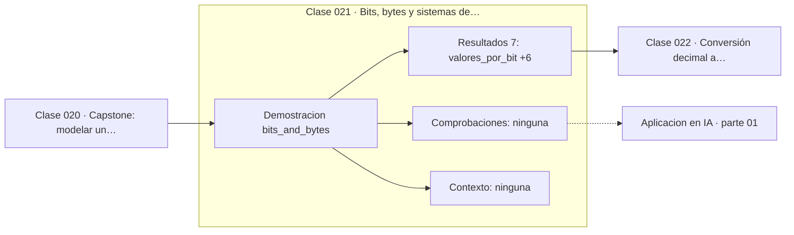

# 021 — Bits, bytes y sistemas de numeración

> [⬅️ 020 Capstone: modelar un problema cotidiano con matemáticas](../../part-00-pensamiento-matematico-desde-cero/020-capstone-modelar-un-problema-cotidiano-con-matematicas/README.md) · [📚 Parte 01](../README.md) · [🏠 Programa](../../../README.md) · [022 Conversión decimal a binario ➡️](../022-conversion-decimal-a-binario/README.md)

**Parte:** 01 — Aritmética computacional y representación numérica · **Nivel:** `basico-computacional` · **Horas estimadas:** 4
**Motor:** `engines.part01` · **Demostración:** `bits_and_bytes` · **Clase 1 de 20** de la parte

---

## 🎯 Propósito

**Con n bits se codifican exactamente 2ⁿ valores distintos; el ancho de palabra fija el rango, no la precisión.**

Qué es realmente un número dentro de una máquina: bits, complemento a dos, IEEE 754, error, condicionamiento y estabilidad.

## ✅ Resultados de aprendizaje

Al terminar podrás:

1. Explicar **Bits, bytes y sistemas de numeración** con lenguaje cotidiano y con notación matemática.
2. Resolver un caso pequeño a mano y anticipar el orden de magnitud del resultado.
3. Ejecutar y modificar `lab.py`, que corre la demostración `bits_and_bytes`.
4. Interpretar las 7 salidas del laboratorio y decir qué comprueba cada una.
5. Detectar el error típico de esta parte: comparar floats con `==` en lugar de una tolerancia razonada.

## 🧩 Fórmulas de la clase

```text
valores representables con n bits = 2ⁿ
bits necesarios para k valores = ⌈log₂ k⌉
```

## 🗺️ Ubicación en el programa



## 📖 Fundamentos

Un bit distingue dos estados. Dos bits distinguen cuatro, porque cada estado del
primero se combina con cada estado del segundo. La regla del producto —que la clase
087 formalizará como combinatoria— da directamente 2ⁿ para n bits, y esa cuenta es la
base de todo dimensionamiento en computación.

La relación inversa importa igual: para representar k valores distintos hacen falta
`⌈log₂ k⌉` bits. Un millón de valores necesita 20 bits; mil millones, 30. El
logaritmo convierte una multiplicación de posibilidades en una suma de bits, y por eso
la información se mide en bits (clase 262): es la unidad natural en la que las
posibilidades se suman.

Los anchos habituales no son arbitrarios: 8, 16, 32 y 64 bits corresponden a las
unidades que el hardware manipula de una vez. Elegir el ancho es elegir un compromiso
entre rango y memoria. En deep learning esa elección es un tema activo: pasar de
`float32` a `bfloat16` reduce a la mitad la memoria de activaciones y permite lotes
mayores, a costa de precisión.

Conviene separar desde ya dos cosas que el ancho de palabra confunde: **cuántos
valores distintos** caben (rango) y **cuán juntos** están (precisión). Un `int32` y un
`float32` ocupan lo mismo y representan cosas radicalmente distintas: el entero cubre
un rango pequeño con espaciado uniforme de 1; el flotante cubre un rango enorme con
espaciado variable.

## 🧮 Ejemplo trabajado

Cuántos bits hacen falta y cuántos valores caben.

```text
ancho    valores representables
1 bit                       2
1 byte                    256
16 bits                65 536
32 bits         4 294 967 296
64 bits    1.8446744e19

Para 1000 valores:      ⌈log₂ 1000⌉  = 10 bits   (2¹⁰ = 1024 ≥ 1000)
Para 1 000 000 valores: ⌈log₂ 10⁶⌉   = 20 bits   (2²⁰ = 1 048 576)
```

Observa el salto: duplicar los bits no duplica los valores, los eleva al cuadrado.
De 32 a 64 bits no hay «el doble de números»: hay 4·10⁹ veces más.

## 🔬 Qué ejecuta el laboratorio

`bits_and_bytes` — Cuántos valores distintos codifica cada ancho de palabra.

| Grupo | Salidas |
|---|---|
| 🔢 Resultados numéricos (7) | `valores_por_bit`, `valores_en_1_byte`, `valores_en_16_bits`, `valores_en_32_bits`, `valores_en_64_bits`, `bits_para_1000_valores`, `bits_para_1_millon` |
| ✅ Comprobaciones de invariante (0) | — |

Las claves booleanas no son adorno: si alguna fuera `False`, el resultado numérico
no sería fiable aunque el programa terminase sin error.

```bash
python classes/part-01-aritmetica-computacional-y-representacion-numerica/021-bits-bytes-y-sistemas-de-numeracion/lab.py
compmath run 021
```

> [!TIP]
> Antes de ejecutar, **escribe tu predicción**. Un laboratorio que confirma lo que
> esperabas enseña tanto como uno que te contradice, pero solo si la predicción
> existía antes del resultado.

## ⚠️ Errores conceptuales frecuentes

1. Confundir rango (cuántos valores caben) con precisión (cuán juntos están).
2. Suponer que 2ⁿ bits representan 2n valores en lugar de 2^(2n).
3. Elegir el ancho por costumbre en lugar de por el rango real que necesita el dato.

## 🚀 Dónde se usa de verdad

Diseño de esquemas de base de datos, formatos binarios, cuantización de modelos y
dimensionamiento de índices. La elección `float32` frente a `bfloat16` en
entrenamiento es exactamente esta decisión.

## 🤖 Conexión con IA

float32, bfloat16 y la cuantización a int8 son decisiones de representación. Los NaN en un entrenamiento casi siempre nacen aquí, no en la arquitectura.

## 📓 Notebooks

| Archivo | Para qué |
|---|---|
| [`notebook.ipynb`](notebook.ipynb) | recorrido guiado con la demostración ejecutada |
| [`notebook_student.ipynb`](notebook_student.ipynb) | versión con `TODO` para resolver |
| [`notebook_solution.ipynb`](notebook_solution.ipynb) | solución de referencia verificada |

## 📝 Evaluación

| Criterio | Peso |
|---|---:|
| Comprensión conceptual | 25 % |
| Resolución manual | 25 % |
| Implementación y verificación | 25 % |
| Interpretación y comunicación | 15 % |
| Conexión con aplicación real | 10 % |

Detalle y criterios de error crítico en [`assessment.md`](assessment.md).

## ❓ Preguntas de comprobación

1. ¿Cuál es la entrada, cuál la salida y qué unidades tienen?
2. ¿Qué operación domina el comportamiento del resultado?
3. ¿Qué caso extremo revelaría un error conceptual?
4. ¿Cómo verificarías el resultado por un método independiente?
5. ¿Dónde aparece esto en motores numéricos?

Si necesitas releer el código para responderlas, la clase todavía no está superada.

## 📥 Entregable

`notebook_student.ipynb` resuelto más un párrafo que explique el resultado **sin citar
código**: qué entra, qué sale, qué invariante se comprueba y qué pasaría en un caso límite.

## 📚 Bibliografía de la clase

Esta clase enseña **Aritmética de máquina · Métodos numéricos**. Cada obra dice qué aporta aquí y cómo se comprobó su localizador:

- [IEEE 754-2019 Standard for Floating-Point Arithmetic](https://standards.ieee.org/ieee/754/6210/) — Aritmética de máquina: el tema de esta clase · URL de la fuente primaria comprobada en IEEE Standards Association (2026-08-19).
- [Patterson & Hennessy. *Computer Organization and Design*, 6ª ed., Morgan Kaufmann, 2020, cap. 3](https://www.elsevier.com/books/computer-organization-and-design-risc-v-edition/patterson/978-0-12-820331-6) — Aritmética de máquina: el tema de esta clase · ISBN-13 `9780128203316` verificado en International ISBN Agency (2026-08-19).

Bibliografía de todas las clases, con el porqué de cada obra, en [`docs/BIBLIOGRAPHY.md`](../../../docs/BIBLIOGRAPHY.md) · localizador y estado de cada obra en [`sources/bibliography.json`](../../../sources/bibliography.json).

## 📂 Material de la clase

[`intuition.md`](intuition.md) · [`theory.md`](theory.md) · [`derivation.md`](derivation.md) · [`exercises.md`](exercises.md) · [`assessment.md`](assessment.md) · [`where-is-this-used.md`](where-is-this-used.md) · [`lesson.yaml`](lesson.yaml)

---

> [⬅️ 020 Capstone: modelar un problema cotidiano con matemáticas](../../part-00-pensamiento-matematico-desde-cero/020-capstone-modelar-un-problema-cotidiano-con-matematicas/README.md) · [📚 Parte 01](../README.md) · [🏠 Programa](../../../README.md) · [022 Conversión decimal a binario ➡️](../022-conversion-decimal-a-binario/README.md)
