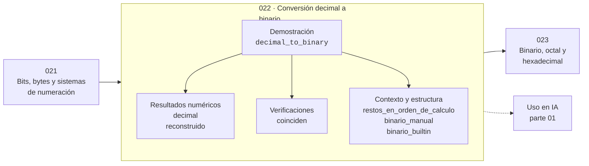

# 022 — Conversión decimal a binario

> [⬅️ 021 Bits, bytes y sistemas de numeración](../021-bits-bytes-y-sistemas-de-numeracion/README.md) · [📚 Parte 01](../README.md) · [🏠 Programa](../../../README.md) · [023 Binario, octal y hexadecimal ➡️](../023-binario-octal-y-hexadecimal/README.md)

**Parte:** 01 — Aritmética computacional y representación numérica · **Nivel:** `basico-computacional` · **Horas estimadas:** 4
**Motor:** `engines.part01` · **Demostración:** `decimal_to_binary` · **Clase 2 de 20** de la parte

---

## 🎯 Propósito

**Convertir a binario es dividir sucesivamente por 2 y leer los restos en orden inverso.**

Qué es realmente un número dentro de una máquina: bits, complemento a dos, IEEE 754, error, condicionamiento y estabilidad.

## ✅ Resultados de aprendizaje

Al terminar podrás:

1. Explicar **Conversión decimal a binario** con lenguaje cotidiano y con notación matemática.
2. Resolver un caso pequeño a mano y anticipar el orden de magnitud del resultado.
3. Ejecutar y modificar `lab.py`, que corre la demostración `decimal_to_binary`.
4. Interpretar las 6 salidas del laboratorio y decir qué comprueba cada una.
5. Detectar el error típico de esta parte: suponer que la suma de floats es asociativa.

## 🧩 Fórmulas de la clase

```text
n = Σ bᵢ·2ⁱ  con bᵢ ∈ {0,1}
restos de n/2 leídos de abajo arriba = representación binaria
```

## 🗺️ Ubicación en el programa



## 📖 Fundamentos

El algoritmo de divisiones sucesivas no es un truco: es la construcción directa de la
representación posicional. Al dividir n entre 2, el resto es el bit menos significativo
—dice si n es par o impar— y el cociente es el número «desplazado un bit a la derecha».
Repetir hasta llegar a cero produce todos los bits, del menos al más significativo, y
por eso se leen al revés.

La representación es **única**: todo entero positivo tiene exactamente una escritura en
base 2. Esa unicidad es la que permite que dos máquinas distintas interpreten los
mismos bits como el mismo número, y es la que se pierde en punto flotante, donde
varios reales distintos comparten representación.

El mismo algoritmo funciona en cualquier base cambiando el divisor. En base 16 los
restos van de 0 a 15 y se escriben con dígitos hexadecimales; en base 8, de 0 a 7. La
clase 023 explota que 16 y 8 son potencias de 2 para convertir sin dividir.

Un detalle práctico: Python trae la conversión en `format(n, "b")` y `int(s, 2)`, pero
implementarla a mano una vez deja claro por qué el bit menos significativo es la
paridad, hecho que se usará constantemente en la parte 04 (aritmética modular) y en
cualquier manipulación de bits.

## 🧮 Ejemplo trabajado

Convertir 156 a binario por divisiones sucesivas.

```text
156 / 2 = 78  resto 0    ← bit menos significativo
 78 / 2 = 39  resto 0
 39 / 2 = 19  resto 1
 19 / 2 =  9  resto 1
  9 / 2 =  4  resto 1
  4 / 2 =  2  resto 0
  2 / 2 =  1  resto 0
  1 / 2 =  0  resto 1    ← bit más significativo

Leídos de abajo arriba: 10011100

Verificación: 128 + 16 + 8 + 4 = 156   ✓
              (2⁷ + 2⁴ + 2³ + 2²)
```

## 🔬 Qué ejecuta el laboratorio

`decimal_to_binary` — Divisiones sucesivas frente a la conversión de la biblioteca.

| Grupo | Salidas |
|---|---|
| 🔢 Resultados numéricos (2) | `decimal`, `reconstruido` |
| ✅ Comprobaciones de invariante (1) | `coinciden` |

Las claves booleanas no son adorno: si alguna fuera `False`, el resultado numérico
no sería fiable aunque el programa terminase sin error.

```bash
python classes/part-01-aritmetica-computacional-y-representacion-numerica/022-conversion-decimal-a-binario/lab.py
compmath run 022
```

> [!TIP]
> Antes de ejecutar, **escribe tu predicción**. Un laboratorio que confirma lo que
> esperabas enseña tanto como uno que te contradice, pero solo si la predicción
> existía antes del resultado.

## ⚠️ Errores conceptuales frecuentes

1. Leer los restos en el orden en que salen en lugar de invertirlos.
2. Olvidar que el último resto (el del cociente 1) también forma parte del número.
3. No verificar reconstruyendo con las potencias de 2.

## 🚀 Dónde se usa de verdad

Máscaras de bits, permisos de sistema de archivos, banderas de configuración,
direcciones de red y cualquier serialización binaria. Es el prerrequisito de la
representación IEEE 754.

## 🤖 Conexión con IA

float32, bfloat16 y la cuantización a int8 son decisiones de representación. Los NaN en un entrenamiento casi siempre nacen aquí, no en la arquitectura.

## 📓 Notebooks

| Archivo | Para qué |
|---|---|
| [`notebook.ipynb`](notebook.ipynb) | recorrido guiado con la demostración ejecutada |
| [`notebook_student.ipynb`](notebook_student.ipynb) | versión con `TODO` para resolver |
| [`notebook_solution.ipynb`](notebook_solution.ipynb) | solución de referencia verificada |

## 📝 Evaluación

| Criterio | Peso |
|---|---:|
| Comprensión conceptual | 25 % |
| Resolución manual | 25 % |
| Implementación y verificación | 25 % |
| Interpretación y comunicación | 15 % |
| Conexión con aplicación real | 10 % |

Detalle y criterios de error crítico en [`assessment.md`](assessment.md).

## ❓ Preguntas de comprobación

1. ¿Cuál es la entrada, cuál la salida y qué unidades tienen?
2. ¿Qué operación domina el comportamiento del resultado?
3. ¿Qué caso extremo revelaría un error conceptual?
4. ¿Cómo verificarías el resultado por un método independiente?
5. ¿Dónde aparece esto en motores numéricos?

Si necesitas releer el código para responderlas, la clase todavía no está superada.

## 📥 Entregable

`notebook_student.ipynb` resuelto más un párrafo que explique el resultado **sin citar
código**: qué entra, qué sale, qué invariante se comprueba y qué pasaría en un caso límite.

## 🔗 Referencias

- [Python: funciones `bin`, `int` y `format`](https://docs.python.org/3/library/functions.html#bin)
- [Knuth, D. *The Art of Computer Programming*, vol. 2, 3ª ed., 1997, secc. 4.1](https://www-cs-faculty.stanford.edu/~knuth/taocp.html)

Bibliografía completa de la parte en [`../../../docs/BIBLIOGRAPHY.md`](../../../docs/BIBLIOGRAPHY.md).

## 📂 Material de la clase

[`intuition.md`](intuition.md) · [`theory.md`](theory.md) · [`derivation.md`](derivation.md) · [`exercises.md`](exercises.md) · [`assessment.md`](assessment.md) · [`where-is-this-used.md`](where-is-this-used.md) · [`lesson.yaml`](lesson.yaml)

---

> [⬅️ 021 Bits, bytes y sistemas de numeración](../021-bits-bytes-y-sistemas-de-numeracion/README.md) · [📚 Parte 01](../README.md) · [🏠 Programa](../../../README.md) · [023 Binario, octal y hexadecimal ➡️](../023-binario-octal-y-hexadecimal/README.md)
