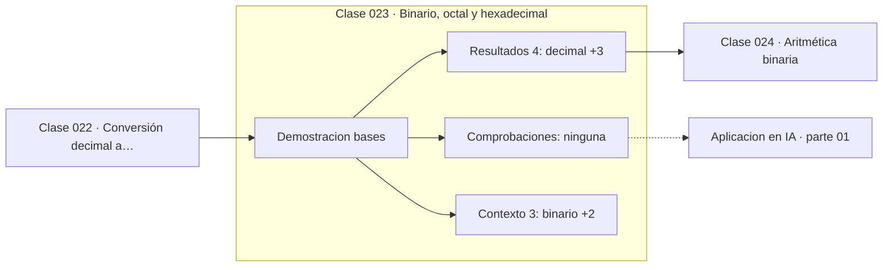

# 023 — Binario, octal y hexadecimal

> [⬅️ 022 Conversión decimal a binario](../022-conversion-decimal-a-binario/README.md) · [📚 Parte 01](../README.md) · [🏠 Programa](../../../README.md) · [024 Aritmética binaria ➡️](../024-aritmetica-binaria/README.md)

**Parte:** 01 — Aritmética computacional y representación numérica · **Nivel:** `basico-computacional` · **Horas estimadas:** 4
**Motor:** `engines.part01` · **Demostración:** `bases` · **Clase 3 de 20** de la parte

---

## 🎯 Propósito

**Hexadecimal y octal son taquigrafías de binario porque 16 y 8 son potencias de 2.**

Qué es realmente un número dentro de una máquina: bits, complemento a dos, IEEE 754, error, condicionamiento y estabilidad.

## ✅ Resultados de aprendizaje

Al terminar podrás:

1. Explicar **Binario, octal y hexadecimal** con lenguaje cotidiano y con notación matemática.
2. Resolver un caso pequeño a mano y anticipar el orden de magnitud del resultado.
3. Ejecutar y modificar `lab.py`, que corre la demostración `bases`.
4. Interpretar las 7 salidas del laboratorio y decir qué comprueba cada una.
5. Detectar el error típico de esta parte: usar float para dinero en vez de decimal o enteros de centavos.

## 🧩 Fórmulas de la clase

```text
1 dígito hexadecimal = 4 bits
1 dígito octal = 3 bits
```

## 🗺️ Ubicación en el programa



## 📖 Fundamentos

Los programadores usan hexadecimal por una razón puramente práctica: cada dígito
hexadecimal corresponde exactamente a 4 bits, así que convertir entre binario y hex se
hace por grupos, sin dividir nada. `1101 0110` es `D6` porque `1101` es 13 (D) y `0110`
es 6. En octal ocurre lo mismo con grupos de 3 bits.

Esta correspondencia solo funciona porque 16 = 2⁴ y 8 = 2³. Con base 10 no hay
agrupación posible, y por eso convertir decimal ↔ binario requiere el algoritmo de
divisiones de la clase 022 mientras que hex ↔ binario es una tabla de 16 entradas.

El hexadecimal es además compacto: un byte se escribe con dos dígitos en lugar de
ocho, y una dirección de 32 bits con ocho en lugar de treinta y dos. Por eso aparece
en direcciones de memoria, colores CSS (`#7c5cff` son tres bytes), UUID, hashes y
volcados de memoria.

Al leer código conviene reconocer los prefijos: `0b` para binario, `0o` para octal,
`0x` para hexadecimal. Python los acepta todos y `int(s, base)` convierte desde
cualquier base entre 2 y 36. Los permisos de Unix (`chmod 755`) son octal precisamente
porque cada dígito codifica tres bits de permiso: lectura, escritura y ejecución.

## 🧮 Ejemplo trabajado

El mismo número en cuatro bases.

```text
decimal      3 735 928 559
hexadecimal  deadbeef
octal        33653337357
binario      11011110101011011011111011101111

Agrupación hex ← binario (grupos de 4, desde la derecha):
  1101 1110 1010 1101 1011 1110 1110 1111
     d    e    a    d    b    e    e    f     ✓

Bits necesarios: 32
```

`deadbeef` es un valor centinela clásico en depuración: es hexadecimal legible y
difícilmente aparece por accidente en memoria.

## 🔬 Qué ejecuta el laboratorio

`bases` — La misma cantidad en base 2, 8, 10 y 16.

| Grupo | Salidas |
|---|---|
| 🔢 Resultados numéricos (4) | `decimal`, `digitos_binarios`, `un_hex_equivale_a_bits`, `un_octal_equivale_a_bits` |
| ✅ Comprobaciones de invariante (0) | — |

Las claves booleanas no son adorno: si alguna fuera `False`, el resultado numérico
no sería fiable aunque el programa terminase sin error.

```bash
python classes/part-01-aritmetica-computacional-y-representacion-numerica/023-binario-octal-y-hexadecimal/lab.py
compmath run 023
```

> [!TIP]
> Antes de ejecutar, **escribe tu predicción**. Un laboratorio que confirma lo que
> esperabas enseña tanto como uno que te contradice, pero solo si la predicción
> existía antes del resultado.

## ⚠️ Errores conceptuales frecuentes

1. Agrupar los bits desde la izquierda en lugar de desde la derecha.
2. Confundir el prefijo 0o (octal) con un cero seguido de la letra o.
3. Suponer que la agrupación por dígitos funciona con base 10.

## 🚀 Dónde se usa de verdad

Direcciones de memoria, colores, hashes, UUID, permisos Unix y protocolos binarios.
Leer un volcado hexadecimal es una habilidad de depuración básica.

## 🤖 Conexión con IA

float32, bfloat16 y la cuantización a int8 son decisiones de representación. Los NaN en un entrenamiento casi siempre nacen aquí, no en la arquitectura.

## 📓 Notebooks

| Archivo | Para qué |
|---|---|
| [`notebook.ipynb`](notebook.ipynb) | recorrido guiado con la demostración ejecutada |
| [`notebook_student.ipynb`](notebook_student.ipynb) | versión con `TODO` para resolver |
| [`notebook_solution.ipynb`](notebook_solution.ipynb) | solución de referencia verificada |

## 📝 Evaluación

| Criterio | Peso |
|---|---:|
| Comprensión conceptual | 25 % |
| Resolución manual | 25 % |
| Implementación y verificación | 25 % |
| Interpretación y comunicación | 15 % |
| Conexión con aplicación real | 10 % |

Detalle y criterios de error crítico en [`assessment.md`](assessment.md).

## ❓ Preguntas de comprobación

1. ¿Cuál es la entrada, cuál la salida y qué unidades tienen?
2. ¿Qué operación domina el comportamiento del resultado?
3. ¿Qué caso extremo revelaría un error conceptual?
4. ¿Cómo verificarías el resultado por un método independiente?
5. ¿Dónde aparece esto en motores numéricos?

Si necesitas releer el código para responderlas, la clase todavía no está superada.

## 📥 Entregable

`notebook_student.ipynb` resuelto más un párrafo que explique el resultado **sin citar
código**: qué entra, qué sale, qué invariante se comprueba y qué pasaría en un caso límite.

## 📚 Bibliografía de la clase

Esta clase enseña **Aritmética de máquina · Métodos numéricos**. Cada obra dice qué aporta aquí y cómo se comprobó su localizador:

- [Python: literales numéricos](https://docs.python.org/3/reference/lexical_analysis.html#integer-literals) — documentación de la herramienta que ejecuta el laboratorio · URL de la fuente primaria comprobada en Python Software Foundation (2026-08-19).
- [Patterson & Hennessy. *Computer Organization and Design*, 6ª ed., 2020](https://www.elsevier.com/books/computer-organization-and-design-risc-v-edition/patterson/978-0-12-820331-6) — Aritmética de máquina: el tema de esta clase · ISBN-13 `9780128203316` verificado en International ISBN Agency (2026-08-19).

Bibliografía de todas las clases, con el porqué de cada obra, en [`docs/BIBLIOGRAPHY.md`](../../../docs/BIBLIOGRAPHY.md) · localizador y estado de cada obra en [`sources/bibliography.json`](../../../sources/bibliography.json).

## 📂 Material de la clase

[`intuition.md`](intuition.md) · [`theory.md`](theory.md) · [`derivation.md`](derivation.md) · [`exercises.md`](exercises.md) · [`assessment.md`](assessment.md) · [`where-is-this-used.md`](where-is-this-used.md) · [`lesson.yaml`](lesson.yaml)

---

> [⬅️ 022 Conversión decimal a binario](../022-conversion-decimal-a-binario/README.md) · [📚 Parte 01](../README.md) · [🏠 Programa](../../../README.md) · [024 Aritmética binaria ➡️](../024-aritmetica-binaria/README.md)
