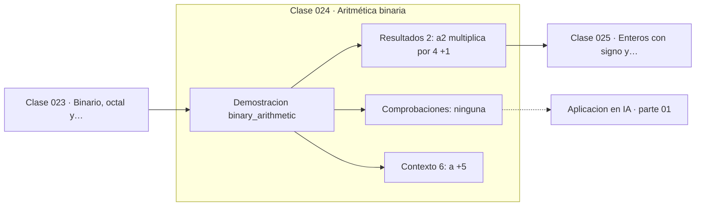

# 024 — Aritmética binaria

> [⬅️ 023 Binario, octal y hexadecimal](../023-binario-octal-y-hexadecimal/README.md) · [📚 Parte 01](../README.md) · [🏠 Programa](../../../README.md) · [025 Enteros con signo y complemento a dos ➡️](../025-enteros-con-signo-y-complemento-a-dos/README.md)

**Parte:** 01 — Aritmética computacional y representación numérica · **Nivel:** `basico-computacional` · **Horas estimadas:** 4
**Motor:** `engines.part01` · **Demostración:** `binary_arithmetic` · **Clase 4 de 20** de la parte

---

## 🎯 Propósito

**La aritmética binaria es la decimal con acarreo en base 2; los desplazamientos multiplican y dividen por potencias de 2.**

Qué es realmente un número dentro de una máquina: bits, complemento a dos, IEEE 754, error, condicionamiento y estabilidad.

## ✅ Resultados de aprendizaje

Al terminar podrás:

1. Explicar **Aritmética binaria** con lenguaje cotidiano y con notación matemática.
2. Resolver un caso pequeño a mano y anticipar el orden de magnitud del resultado.
3. Ejecutar y modificar `lab.py`, que corre la demostración `binary_arithmetic`.
4. Interpretar las 8 salidas del laboratorio y decir qué comprueba cada una.
5. Detectar el error típico de esta parte: comparar floats con `==` en lugar de una tolerancia razonada.

## 🧩 Fórmulas de la clase

```text
x << k = x · 2ᵏ
x >> k = ⌊x / 2ᵏ⌋  (para x ≥ 0)
x & (x−1) apaga el bit menos significativo encendido
```

## 🗺️ Ubicación en el programa



## 📖 Fundamentos

Sumar en binario funciona igual que en decimal: se suma columna a columna y se
arrastra el acarreo. La única diferencia es que el acarreo salta cuando la suma llega
a 2 en lugar de a 10. Esta simplicidad es la razón por la que el hardware usa base 2:
un sumador completo de un bit cabe en unas pocas puertas lógicas.

Los desplazamientos son la operación más barata de un procesador y equivalen a
multiplicar o dividir por potencias de 2. `x << 3` es `x · 8`, y `x >> 1` es la
división entera por 2. Los compiladores hacen esta sustitución automáticamente, pero
reconocerla ayuda a leer código de bajo nivel y algoritmos de hashing.

Las operaciones bit a bit —AND, OR, XOR— actúan sobre cada posición de forma
independiente, sin acarreo. AND enmascara (deja pasar solo los bits marcados), OR
activa, XOR conmuta. XOR tiene una propiedad que se usa constantemente en
criptografía: es su propia inversa, `(a ^ b) ^ b = a`.

Un idiom que conviene conocer: `x & (x−1)` apaga el bit encendido más a la derecha,
porque restar 1 invierte ese bit y todos los ceros a su derecha. Contar cuántas veces
se puede aplicar antes de llegar a cero cuenta los bits encendidos (`popcount`), y esa
cuenta aparece en distancias de Hamming y en índices de bases de datos.

## 🧮 Ejemplo trabajado

Operaciones sobre a = 1011₂ (11) y b = 0110₂ (6).

```text
a      = 1011   (11)
b      = 0110   (6)

a + b  = 10001  (17)     acarreo hasta el quinto bit
a & b  = 0010   (2)      solo donde ambos tienen 1
a | b  = 1111   (15)     donde alguno tiene 1
a ^ b  = 1101   (13)     donde difieren

a << 2 = 101100 (44)     = 11 · 4    ✓
a >> 1 = 101    (5)      = ⌊11/2⌋    ✓

Verificación XOR:  (a ^ b) ^ b = 1101 ^ 0110 = 1011 = a   ✓
```

## 🔬 Qué ejecuta el laboratorio

`binary_arithmetic` — Suma y desplazamiento en binario, con acarreo visible.

| Grupo | Salidas |
|---|---|
| 🔢 Resultados numéricos (2) | `a<<2 (multiplica por 4)`, `a>>1 (divide por 2)` |
| ✅ Comprobaciones de invariante (0) | — |

Las claves booleanas no son adorno: si alguna fuera `False`, el resultado numérico
no sería fiable aunque el programa terminase sin error.

```bash
python classes/part-01-aritmetica-computacional-y-representacion-numerica/024-aritmetica-binaria/lab.py
compmath run 024
```

> [!TIP]
> Antes de ejecutar, **escribe tu predicción**. Un laboratorio que confirma lo que
> esperabas enseña tanto como uno que te contradice, pero solo si la predicción
> existía antes del resultado.

## ⚠️ Errores conceptuales frecuentes

1. Usar >> con enteros negativos esperando división truncada hacia cero: en Python trunca hacia −∞.
2. Confundir & (bit a bit) con and (lógico) o | con or.
3. Suponer que << nunca desborda: en ancho fijo los bits que salen se pierden.

## 🚀 Dónde se usa de verdad

Hashing, compresión, criptografía, banderas de configuración, índices de bitmap y
optimización de bucles. La distancia de Hamming entre dos cadenas de bits es el
popcount de su XOR.

## 🤖 Conexión con IA

float32, bfloat16 y la cuantización a int8 son decisiones de representación. Los NaN en un entrenamiento casi siempre nacen aquí, no en la arquitectura.

## 📓 Notebooks

| Archivo | Para qué |
|---|---|
| [`notebook.ipynb`](notebook.ipynb) | recorrido guiado con la demostración ejecutada |
| [`notebook_student.ipynb`](notebook_student.ipynb) | versión con `TODO` para resolver |
| [`notebook_solution.ipynb`](notebook_solution.ipynb) | solución de referencia verificada |

## 📝 Evaluación

| Criterio | Peso |
|---|---:|
| Comprensión conceptual | 25 % |
| Resolución manual | 25 % |
| Implementación y verificación | 25 % |
| Interpretación y comunicación | 15 % |
| Conexión con aplicación real | 10 % |

Detalle y criterios de error crítico en [`assessment.md`](assessment.md).

## ❓ Preguntas de comprobación

1. ¿Cuál es la entrada, cuál la salida y qué unidades tienen?
2. ¿Qué operación domina el comportamiento del resultado?
3. ¿Qué caso extremo revelaría un error conceptual?
4. ¿Cómo verificarías el resultado por un método independiente?
5. ¿Dónde aparece esto en motores numéricos?

Si necesitas releer el código para responderlas, la clase todavía no está superada.

## 📥 Entregable

`notebook_student.ipynb` resuelto más un párrafo que explique el resultado **sin citar
código**: qué entra, qué sale, qué invariante se comprueba y qué pasaría en un caso límite.

## 🔗 Referencias

- [Warren, H. *Hacker's Delight*, 2ª ed., Addison-Wesley, 2012](https://www.oreilly.com/library/view/hackers-delight-second/9780133084993/)
- [Python: operaciones bit a bit](https://docs.python.org/3/library/stdtypes.html#bitwise-operations-on-integer-types)

Bibliografía completa de la parte en [`../../../docs/BIBLIOGRAPHY.md`](../../../docs/BIBLIOGRAPHY.md).

## 📂 Material de la clase

[`intuition.md`](intuition.md) · [`theory.md`](theory.md) · [`derivation.md`](derivation.md) · [`exercises.md`](exercises.md) · [`assessment.md`](assessment.md) · [`where-is-this-used.md`](where-is-this-used.md) · [`lesson.yaml`](lesson.yaml)

---

> [⬅️ 023 Binario, octal y hexadecimal](../023-binario-octal-y-hexadecimal/README.md) · [📚 Parte 01](../README.md) · [🏠 Programa](../../../README.md) · [025 Enteros con signo y complemento a dos ➡️](../025-enteros-con-signo-y-complemento-a-dos/README.md)
