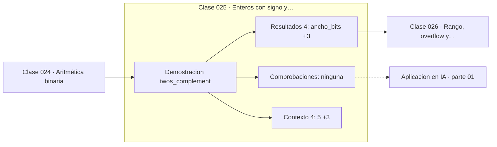

# 025 — Enteros con signo y complemento a dos

> [⬅️ 024 Aritmética binaria](../024-aritmetica-binaria/README.md) · [📚 Parte 01](../README.md) · [🏠 Programa](../../../README.md) · [026 Rango, overflow y wraparound ➡️](../026-rango-overflow-y-wraparound/README.md)

**Parte:** 01 — Aritmética computacional y representación numérica · **Nivel:** `basico-computacional` · **Horas estimadas:** 4
**Motor:** `engines.part01` · **Demostración:** `twos_complement` · **Clase 5 de 20** de la parte

---

## 🎯 Propósito

**En complemento a dos, el negativo de x es 2ⁿ − x, y por eso la resta se implementa con el mismo sumador que la suma.**

Qué es realmente un número dentro de una máquina: bits, complemento a dos, IEEE 754, error, condicionamiento y estabilidad.

## ✅ Resultados de aprendizaje

Al terminar podrás:

1. Explicar **Enteros con signo y complemento a dos** con lenguaje cotidiano y con notación matemática.
2. Resolver un caso pequeño a mano y anticipar el orden de magnitud del resultado.
3. Ejecutar y modificar `lab.py`, que corre la demostración `twos_complement`.
4. Interpretar las 8 salidas del laboratorio y decir qué comprueba cada una.
5. Detectar el error típico de esta parte: suponer que la suma de floats es asociativa.

## 🧩 Fórmulas de la clase

```text
representación de −x en n bits = 2ⁿ − x
rango: [−2ⁿ⁻¹, 2ⁿ⁻¹ − 1]
```

## 🗺️ Ubicación en el programa



## 📖 Fundamentos

La razón por la que existe el complemento a dos es de ingeniería, no de matemáticas:
permite que un único circuito sumador maneje positivos y negativos sin casos
especiales. Si `−x` se representa como `2ⁿ − x`, entonces `a + (−b)` calculado módulo
2ⁿ da exactamente `a − b` cuando el resultado está en rango. La resta desaparece como
operación separada.

Las alternativas históricas —signo-magnitud y complemento a uno— tenían dos
representaciones para el cero (`+0` y `−0`), lo que obliga a casos especiales en las
comparaciones. El complemento a dos tiene un único cero, y como contrapartida un
**rango asimétrico**: en 8 bits va de −128 a +127, un negativo más que positivos.

Esa asimetría no es una curiosidad. `abs(-128)` en un `int8` no es representable, así
que desborda; en NumPy, `np.abs(np.int8(-128))` devuelve −128 sin avisar. El mismo
fenómeno afecta a `-x` y a la división `x // -1`. Es una fuente real de errores en
código que procesa datos de sensores o audio en enteros.

El bit más significativo actúa como bit de signo, pero no es «un bit de signo» en el
sentido de signo-magnitud: su peso es `−2ⁿ⁻¹`. Interpretar `11111011` como número
requiere `−128 + 64 + 32 + 16 + 8 + 2 + 1 = −5`, no «signo negativo y magnitud 123».

## 🧮 Ejemplo trabajado

Representación en 8 bits y suma con signos opuestos.

```text
+5  = 00000101
−5  = 2⁸ − 5 = 251 = 11111011

Suma 5 + (−5):
  00000101
+ 11111011
-----------
 100000000   → se descarta el noveno bit (módulo 2⁸)
  00000000   = 0   ✓

Decodificar 11111011:
  −128 + 64 + 32 + 16 + 8 + 0 + 2 + 1 = −5   ✓

Rango:  mínimo −128,  máximo +127
Asimetría: |−128| = 128 NO es representable en int8
```

## 🔬 Qué ejecuta el laboratorio

`twos_complement` — Representación de negativos en 8 bits.

| Grupo | Salidas |
|---|---|
| 🔢 Resultados numéricos (4) | `ancho_bits`, `decodifica_11111011`, `minimo_representable`, `maximo_representable` |
| ✅ Comprobaciones de invariante (0) | — |

Las claves booleanas no son adorno: si alguna fuera `False`, el resultado numérico
no sería fiable aunque el programa terminase sin error.

```bash
python classes/part-01-aritmetica-computacional-y-representacion-numerica/025-enteros-con-signo-y-complemento-a-dos/lab.py
compmath run 025
```

> [!TIP]
> Antes de ejecutar, **escribe tu predicción**. Un laboratorio que confirma lo que
> esperabas enseña tanto como uno que te contradice, pero solo si la predicción
> existía antes del resultado.

## ⚠️ Errores conceptuales frecuentes

1. Interpretar el bit más significativo como signo y el resto como magnitud.
2. Suponer que abs(x) siempre es representable: abs(−128) desborda en int8.
3. Olvidar el módulo 2ⁿ al sumar: el bit que se sale no es un error, es la definición.

## 🚀 Dónde se usa de verdad

Todo entero con signo en C, Rust, Java, NumPy y bases de datos. Los errores de
desbordamiento por complemento a dos son una categoría reconocida de vulnerabilidad
(CWE-190).

## 🤖 Conexión con IA

float32, bfloat16 y la cuantización a int8 son decisiones de representación. Los NaN en un entrenamiento casi siempre nacen aquí, no en la arquitectura.

## 📓 Notebooks

| Archivo | Para qué |
|---|---|
| [`notebook.ipynb`](notebook.ipynb) | recorrido guiado con la demostración ejecutada |
| [`notebook_student.ipynb`](notebook_student.ipynb) | versión con `TODO` para resolver |
| [`notebook_solution.ipynb`](notebook_solution.ipynb) | solución de referencia verificada |

## 📝 Evaluación

| Criterio | Peso |
|---|---:|
| Comprensión conceptual | 25 % |
| Resolución manual | 25 % |
| Implementación y verificación | 25 % |
| Interpretación y comunicación | 15 % |
| Conexión con aplicación real | 10 % |

Detalle y criterios de error crítico en [`assessment.md`](assessment.md).

## ❓ Preguntas de comprobación

1. ¿Cuál es la entrada, cuál la salida y qué unidades tienen?
2. ¿Qué operación domina el comportamiento del resultado?
3. ¿Qué caso extremo revelaría un error conceptual?
4. ¿Cómo verificarías el resultado por un método independiente?
5. ¿Dónde aparece esto en motores numéricos?

Si necesitas releer el código para responderlas, la clase todavía no está superada.

## 📥 Entregable

`notebook_student.ipynb` resuelto más un párrafo que explique el resultado **sin citar
código**: qué entra, qué sale, qué invariante se comprueba y qué pasaría en un caso límite.

## 📚 Bibliografía de la clase

Esta clase enseña **Aritmética de máquina · Métodos numéricos**. Cada obra dice qué aporta aquí y cómo se comprobó su localizador:

- [Patterson & Hennessy. *Computer Organization and Design*, 6ª ed., 2020, cap. 3](https://www.elsevier.com/books/computer-organization-and-design-risc-v-edition/patterson/978-0-12-820331-6) — Aritmética de máquina: el tema de esta clase · ISBN-13 `9780128203316` verificado en International ISBN Agency (2026-08-19).
- [CWE-190: Integer Overflow or Wraparound](https://cwe.mitre.org/data/definitions/190.html) — Aritmética de máquina: el tema de esta clase · URL de la fuente primaria comprobada en MITRE Corporation (2026-08-19).

Bibliografía de todas las clases, con el porqué de cada obra, en [`docs/BIBLIOGRAPHY.md`](../../../docs/BIBLIOGRAPHY.md) · localizador y estado de cada obra en [`sources/bibliography.json`](../../../sources/bibliography.json).

## 📂 Material de la clase

[`intuition.md`](intuition.md) · [`theory.md`](theory.md) · [`derivation.md`](derivation.md) · [`exercises.md`](exercises.md) · [`assessment.md`](assessment.md) · [`where-is-this-used.md`](where-is-this-used.md) · [`lesson.yaml`](lesson.yaml)

---

> [⬅️ 024 Aritmética binaria](../024-aritmetica-binaria/README.md) · [📚 Parte 01](../README.md) · [🏠 Programa](../../../README.md) · [026 Rango, overflow y wraparound ➡️](../026-rango-overflow-y-wraparound/README.md)
