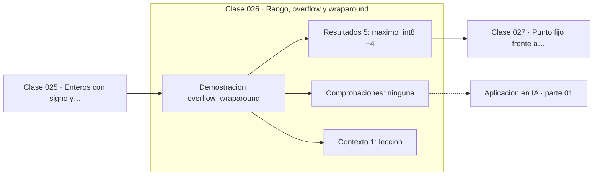

# 026 — Rango, overflow y wraparound

> [⬅️ 025 Enteros con signo y complemento a dos](../025-enteros-con-signo-y-complemento-a-dos/README.md) · [📚 Parte 01](../README.md) · [🏠 Programa](../../../README.md) · [027 Punto fijo frente a punto flotante ➡️](../027-punto-fijo-frente-a-punto-flotante/README.md)

**Parte:** 01 — Aritmética computacional y representación numérica · **Nivel:** `basico-computacional` · **Horas estimadas:** 4
**Motor:** `engines.part01` · **Demostración:** `overflow_wraparound` · **Clase 6 de 20** de la parte

---

## 🎯 Propósito

**En ancho fijo, superar el máximo no lanza excepción: el valor da la vuelta al rango.**

Qué es realmente un número dentro de una máquina: bits, complemento a dos, IEEE 754, error, condicionamiento y estabilidad.

## ✅ Resultados de aprendizaje

Al terminar podrás:

1. Explicar **Rango, overflow y wraparound** con lenguaje cotidiano y con notación matemática.
2. Resolver un caso pequeño a mano y anticipar el orden de magnitud del resultado.
3. Ejecutar y modificar `lab.py`, que corre la demostración `overflow_wraparound`.
4. Interpretar las 6 salidas del laboratorio y decir qué comprueba cada una.
5. Detectar el error típico de esta parte: usar float para dinero en vez de decimal o enteros de centavos.

## 🧩 Fórmulas de la clase

```text
resultado = (a + b) mod 2ⁿ, reinterpretado con signo
int8: 127 + 1 = −128
```

## 🗺️ Ubicación en el programa



## 📖 Fundamentos

El desbordamiento en enteros de ancho fijo es silencioso por diseño: el hardware
calcula módulo 2ⁿ y descarta los bits que sobran. No hay excepción, no hay aviso, y el
programa continúa con un valor que puede tener el signo contrario al esperado. Es una
de las pocas situaciones en computación donde un error grave no produce ninguna señal.

Python es la excepción cómoda: sus enteros crecen indefinidamente, limitados solo por
la memoria. Esa comodidad esconde el problema hasta que el mismo cálculo pasa a NumPy
(donde `int32` sí desborda), a una base de datos, a un servicio en otro lenguaje o a
un modelo cuantizado. La lección de esta clase es que **la ausencia de desbordamiento
en Python no es una propiedad del algoritmo**: es una propiedad del intérprete.

Los casos históricos abundan. El vuelo inaugural del Ariane 5 en 1996 se destruyó por
una conversión de un flotante de 64 bits a un entero con signo de 16 bits cuyo valor
no cabía. El «problema del año 2038» es el desbordamiento de un `time_t` de 32 bits
contando segundos desde 1970.

La defensa práctica tiene tres capas: elegir el ancho con margen sobre el rango real,
validar los límites en las fronteras del sistema, y usar tipos con detección de
desbordamiento donde el lenguaje los ofrezca (`checked_add` en Rust, `-ftrapv` en C).

## 🧮 Ejemplo trabajado

Wraparound en int8 simulado sobre Python.

```text
máximo int8            127
127 + 1  →  wraparound  −128       (no 128)
127 + 2  →  wraparound  −127

En Python nativo:
127 + 1 = 128                       (int ilimitado)
sys.maxsize = 9223372036854775807   (tamaño del puntero, no un límite del int)

Lección: Python no desborda, C y NumPy sí.
El algoritmo es el mismo; el resultado, no.
```

## 🔬 Qué ejecuta el laboratorio

`overflow_wraparound` — Wraparound en enteros de ancho fijo simulado sobre Python.

| Grupo | Salidas |
|---|---|
| 🔢 Resultados numéricos (5) | `maximo_int8`, `maximo+1_con_wraparound`, `maximo+2_con_wraparound`, `python_int_es_ilimitado`, `sys_maxsize` |
| ✅ Comprobaciones de invariante (0) | — |

Las claves booleanas no son adorno: si alguna fuera `False`, el resultado numérico
no sería fiable aunque el programa terminase sin error.

```bash
python classes/part-01-aritmetica-computacional-y-representacion-numerica/026-rango-overflow-y-wraparound/lab.py
compmath run 026
```

> [!TIP]
> Antes de ejecutar, **escribe tu predicción**. Un laboratorio que confirma lo que
> esperabas enseña tanto como uno que te contradice, pero solo si la predicción
> existía antes del resultado.

## ⚠️ Errores conceptuales frecuentes

1. Probar un algoritmo solo en Python y asumir que no desborda en otro lenguaje.
2. Confiar en que un valor «nunca será tan grande» sin validarlo en la frontera del sistema.
3. Confundir sys.maxsize con un límite del tipo int de Python: es el tamaño del puntero.

## 🚀 Dónde se usa de verdad

Contadores, marcas de tiempo, identificadores, acumuladores de métricas y cualquier
dato que cruza la frontera entre Python y un sistema de ancho fijo. Es una categoría
reconocida de vulnerabilidad de seguridad.

## 🤖 Conexión con IA

float32, bfloat16 y la cuantización a int8 son decisiones de representación. Los NaN en un entrenamiento casi siempre nacen aquí, no en la arquitectura.

## 📓 Notebooks

| Archivo | Para qué |
|---|---|
| [`notebook.ipynb`](notebook.ipynb) | recorrido guiado con la demostración ejecutada |
| [`notebook_student.ipynb`](notebook_student.ipynb) | versión con `TODO` para resolver |
| [`notebook_solution.ipynb`](notebook_solution.ipynb) | solución de referencia verificada |

## 📝 Evaluación

| Criterio | Peso |
|---|---:|
| Comprensión conceptual | 25 % |
| Resolución manual | 25 % |
| Implementación y verificación | 25 % |
| Interpretación y comunicación | 15 % |
| Conexión con aplicación real | 10 % |

Detalle y criterios de error crítico en [`assessment.md`](assessment.md).

## ❓ Preguntas de comprobación

1. ¿Cuál es la entrada, cuál la salida y qué unidades tienen?
2. ¿Qué operación domina el comportamiento del resultado?
3. ¿Qué caso extremo revelaría un error conceptual?
4. ¿Cómo verificarías el resultado por un método independiente?
5. ¿Dónde aparece esto en motores numéricos?

Si necesitas releer el código para responderlas, la clase todavía no está superada.

## 📥 Entregable

`notebook_student.ipynb` resuelto más un párrafo que explique el resultado **sin citar
código**: qué entra, qué sale, qué invariante se comprueba y qué pasaría en un caso límite.

## 🔗 Referencias

- [ESA. *Ariane 5 Flight 501 Failure — Report by the Inquiry Board*, 1996](https://esamultimedia.esa.int/docs/esa-x-1819eng.pdf)
- [CWE-190: Integer Overflow or Wraparound](https://cwe.mitre.org/data/definitions/190.html)

Bibliografía completa de la parte en [`../../../docs/BIBLIOGRAPHY.md`](../../../docs/BIBLIOGRAPHY.md).

## 📂 Material de la clase

[`intuition.md`](intuition.md) · [`theory.md`](theory.md) · [`derivation.md`](derivation.md) · [`exercises.md`](exercises.md) · [`assessment.md`](assessment.md) · [`where-is-this-used.md`](where-is-this-used.md) · [`lesson.yaml`](lesson.yaml)

---

> [⬅️ 025 Enteros con signo y complemento a dos](../025-enteros-con-signo-y-complemento-a-dos/README.md) · [📚 Parte 01](../README.md) · [🏠 Programa](../../../README.md) · [027 Punto fijo frente a punto flotante ➡️](../027-punto-fijo-frente-a-punto-flotante/README.md)
