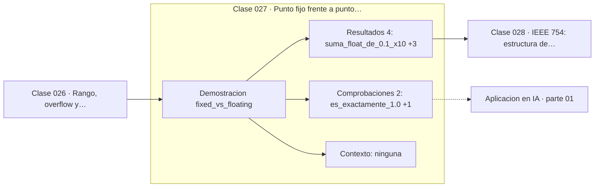

# 027 — Punto fijo frente a punto flotante

> [⬅️ 026 Rango, overflow y wraparound](../026-rango-overflow-y-wraparound/README.md) · [📚 Parte 01](../README.md) · [🏠 Programa](../../../README.md) · [028 IEEE 754: estructura de un float ➡️](../028-ieee-754-estructura-de-un-float/README.md)

**Parte:** 01 — Aritmética computacional y representación numérica · **Nivel:** `basico-computacional` · **Horas estimadas:** 4
**Motor:** `engines.part01` · **Demostración:** `fixed_vs_floating` · **Clase 7 de 20** de la parte

---

## 🎯 Propósito

**El punto fijo reparte la precisión de forma uniforme; el flotante la reparte proporcionalmente a la magnitud.**

Qué es realmente un número dentro de una máquina: bits, complemento a dos, IEEE 754, error, condicionamiento y estabilidad.

## ✅ Resultados de aprendizaje

Al terminar podrás:

1. Explicar **Punto fijo frente a punto flotante** con lenguaje cotidiano y con notación matemática.
2. Resolver un caso pequeño a mano y anticipar el orden de magnitud del resultado.
3. Ejecutar y modificar `lab.py`, que corre la demostración `fixed_vs_floating`.
4. Interpretar las 6 salidas del laboratorio y decir qué comprueba cada una.
5. Detectar el error típico de esta parte: comparar floats con `==` en lugar de una tolerancia razonada.

## 🧩 Fórmulas de la clase

```text
punto fijo: valor = entero · 10⁻ᵏ (exacto en su rango)
punto flotante: valor = mantisa · 2^exponente (precisión relativa constante)
```

## 🗺️ Ubicación en el programa



## 📖 Fundamentos

Las dos representaciones responden a necesidades distintas. En **punto fijo** se guarda
un entero y se acuerda dónde está la coma: el dinero se guarda en centavos, y todas las
operaciones son aritmética entera exacta. El espaciado entre valores representables es
constante —un centavo— en todo el rango.

En **punto flotante** se guarda una mantisa y un exponente, y el espaciado crece con la
magnitud: cerca de 1 los floats están separados por unos 2⁻⁵², y cerca de 10⁶ por unos
2⁻³². Eso significa **precisión relativa constante**: siempre unos 16 dígitos
significativos, independientemente de la escala. Es la elección correcta para
magnitudes físicas que abarcan muchos órdenes de magnitud.

La consecuencia para dinero es directa y conocida: sumar `0.1` diez veces en float no
da exactamente `1.0`, porque `0.1` no es representable en binario. Sumar 10 veces el
entero 10 (centavos) da exactamente 100. Por eso todo sistema contable serio trabaja
en punto fijo o con `Decimal`.

El criterio para elegir: si los valores tienen una unidad mínima natural y las
comparaciones exactas importan (dinero, contadores, índices), punto fijo. Si los
valores abarcan varios órdenes de magnitud y lo que importa es la precisión relativa
(física, estadística, gradientes), punto flotante.

## 🧮 Ejemplo trabajado

Sumar diez veces una décima por los dos caminos.

```text
Punto flotante:
  0.0 + 0.1 repetido 10 veces = 0.9999999999999999
  ¿es exactamente 1.0?  No
  error = 1.11e−16

Punto fijo (centavos como enteros):
  0 + 10 repetido 10 veces = 100
  100 / 100 = 1.0
  exacto: sí, porque toda la aritmética fue entera
```

El error del flotante es minúsculo. El problema no es su tamaño: es que rompe la
comparación `total == 1.0`, que es exactamente la que hace un sistema de facturación.

## 🔬 Qué ejecuta el laboratorio

`fixed_vs_floating` — Punto fijo (centavos enteros) frente a punto flotante.

| Grupo | Salidas |
|---|---|
| 🔢 Resultados numéricos (4) | `suma_float_de_0.1_x10`, `error`, `suma_en_centavos_enteros`, `centavos_a_unidades` |
| ✅ Comprobaciones de invariante (2) | `es_exactamente_1.0`, `punto_fijo_exacto` |

Las claves booleanas no son adorno: si alguna fuera `False`, el resultado numérico
no sería fiable aunque el programa terminase sin error.

```bash
python classes/part-01-aritmetica-computacional-y-representacion-numerica/027-punto-fijo-frente-a-punto-flotante/lab.py
compmath run 027
```

> [!TIP]
> Antes de ejecutar, **escribe tu predicción**. Un laboratorio que confirma lo que
> esperabas enseña tanto como uno que te contradice, pero solo si la predicción
> existía antes del resultado.

## ⚠️ Errores conceptuales frecuentes

1. Usar float para dinero y comparar totales con ==.
2. Suponer que el punto fijo es siempre mejor: pierde rango y no sirve para magnitudes físicas.
3. Redondear a dos decimales al final y creer que eso corrige el error acumulado.

## 🚀 Dónde se usa de verdad

Contabilidad, facturación e inventario en punto fijo; física, estadística y deep
learning en punto flotante. La cuantización de modelos a int8 es una vuelta al punto
fijo por razones de memoria.

## 🤖 Conexión con IA

float32, bfloat16 y la cuantización a int8 son decisiones de representación. Los NaN en un entrenamiento casi siempre nacen aquí, no en la arquitectura.

## 📓 Notebooks

| Archivo | Para qué |
|---|---|
| [`notebook.ipynb`](notebook.ipynb) | recorrido guiado con la demostración ejecutada |
| [`notebook_student.ipynb`](notebook_student.ipynb) | versión con `TODO` para resolver |
| [`notebook_solution.ipynb`](notebook_solution.ipynb) | solución de referencia verificada |

## 📝 Evaluación

| Criterio | Peso |
|---|---:|
| Comprensión conceptual | 25 % |
| Resolución manual | 25 % |
| Implementación y verificación | 25 % |
| Interpretación y comunicación | 15 % |
| Conexión con aplicación real | 10 % |

Detalle y criterios de error crítico en [`assessment.md`](assessment.md).

## ❓ Preguntas de comprobación

1. ¿Cuál es la entrada, cuál la salida y qué unidades tienen?
2. ¿Qué operación domina el comportamiento del resultado?
3. ¿Qué caso extremo revelaría un error conceptual?
4. ¿Cómo verificarías el resultado por un método independiente?
5. ¿Dónde aparece esto en motores numéricos?

Si necesitas releer el código para responderlas, la clase todavía no está superada.

## 📥 Entregable

`notebook_student.ipynb` resuelto más un párrafo que explique el resultado **sin citar
código**: qué entra, qué sale, qué invariante se comprueba y qué pasaría en un caso límite.

## 🔗 Referencias

- [Goldberg, D. *What Every Computer Scientist Should Know About Floating-Point Arithmetic*. ACM CSUR, 1991](https://dl.acm.org/doi/10.1145/103162.103163)
- [Python: módulo `decimal`](https://docs.python.org/3/library/decimal.html)

Bibliografía completa de la parte en [`../../../docs/BIBLIOGRAPHY.md`](../../../docs/BIBLIOGRAPHY.md).

## 📂 Material de la clase

[`intuition.md`](intuition.md) · [`theory.md`](theory.md) · [`derivation.md`](derivation.md) · [`exercises.md`](exercises.md) · [`assessment.md`](assessment.md) · [`where-is-this-used.md`](where-is-this-used.md) · [`lesson.yaml`](lesson.yaml)

---

> [⬅️ 026 Rango, overflow y wraparound](../026-rango-overflow-y-wraparound/README.md) · [📚 Parte 01](../README.md) · [🏠 Programa](../../../README.md) · [028 IEEE 754: estructura de un float ➡️](../028-ieee-754-estructura-de-un-float/README.md)
