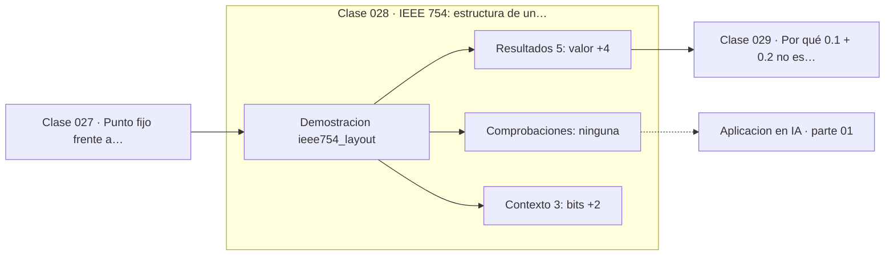

# 028 — IEEE 754: estructura de un float

> [⬅️ 027 Punto fijo frente a punto flotante](../027-punto-fijo-frente-a-punto-flotante/README.md) · [📚 Parte 01](../README.md) · [🏠 Programa](../../../README.md) · [029 Por qué 0.1 + 0.2 no es exactamente 0.3 ➡️](../029-por-que-0-1-0-2-no-es-exactamente-0-3/README.md)

**Parte:** 01 — Aritmética computacional y representación numérica · **Nivel:** `basico-computacional` · **Horas estimadas:** 4
**Motor:** `engines.part01` · **Demostración:** `ieee754_layout` · **Clase 8 de 20** de la parte

---

## 🎯 Propósito

**Un float64 es signo, exponente sesgado de 11 bits y mantisa de 52 bits con un 1 implícito.**

Qué es realmente un número dentro de una máquina: bits, complemento a dos, IEEE 754, error, condicionamiento y estabilidad.

## ✅ Resultados de aprendizaje

Al terminar podrás:

1. Explicar **IEEE 754: estructura de un float** con lenguaje cotidiano y con notación matemática.
2. Resolver un caso pequeño a mano y anticipar el orden de magnitud del resultado.
3. Ejecutar y modificar `lab.py`, que corre la demostración `ieee754_layout`.
4. Interpretar las 8 salidas del laboratorio y decir qué comprueba cada una.
5. Detectar el error típico de esta parte: suponer que la suma de floats es asociativa.

## 🧩 Fórmulas de la clase

```text
valor = (−1)^s · (1 + m/2⁵²) · 2^(e − 1023)
float64: 1 bit de signo + 11 de exponente + 52 de mantisa = 64
```

## 🗺️ Ubicación en el programa



## 📖 Fundamentos

El estándar IEEE 754, publicado en 1985 y revisado en 2019, unificó lo que antes era
un caos de formatos incompatibles entre fabricantes. Su diseño responde a una idea:
guardar un número en notación científica **binaria**, con la mantisa normalizada al
intervalo [1, 2) para que el primer bit sea siempre 1 y no haga falta almacenarlo. Ese
«bit implícito» regala un bit de precisión gratis.

Los tres campos tienen papeles distintos. El **signo** es un bit. El **exponente** se
guarda sesgado (sumándole 1023 en float64) para poder representar exponentes negativos
sin necesitar un signo propio; con 11 bits cubre de 2⁻¹⁰²² a 2¹⁰²³, es decir de
10⁻³⁰⁸ a 10³⁰⁸ aproximadamente. La **mantisa** de 52 bits (más el implícito, 53
efectivos) determina la precisión: log₁₀(2⁵³) ≈ 15.95 dígitos decimales.

Los valores extremos del exponente están reservados: todo ceros indica cero o
subnormal, todo unos indica infinito o `NaN`. Por eso existen `+inf`, `-inf` y `NaN`
como valores de primera clase en lugar de como errores, lo que permite que un cálculo
continúe y el problema se detecte al final.

Reconstruir un float a mano desde sus bits, como hace el laboratorio, deja claro que
no hay nada mágico: es notación científica en base 2 con un formato de empaquetado
acordado. Y explica de inmediato por qué la precisión es relativa: los 53 bits de
mantisa siempre representan los mismos dígitos significativos, sea cual sea el
exponente.

## 🧮 Ejemplo trabajado

Descomponer −6.25 en float64.

```text
−6.25 en binario = −110.01₂ = −1.1001₂ × 2²

signo    s = 1                        (negativo)
exponente e = 2 + 1023 = 1025 = 10000000001₂
mantisa   m = 1001000...0   (el 1 inicial es implícito)

Reconstrucción:
  (−1)¹ · (1 + m/2⁵²) · 2^(1025−1023)
= −1 · 1.5625 · 4
= −6.25   ✓

Precisión: 53 bits ⇒ log₁₀(2⁵³) ≈ 15.95 dígitos decimales
Rango:     exponente de −1022 a 1023 ⇒ ~1e−308 a ~1e308
```

## 🔬 Qué ejecuta el laboratorio

`ieee754_layout` — Signo, exponente y mantisa de un float64.

| Grupo | Salidas |
|---|---|
| 🔢 Resultados numéricos (5) | `valor`, `exponente_bruto`, `sesgo`, `exponente_real`, `reconstruido` |
| ✅ Comprobaciones de invariante (0) | — |

Las claves booleanas no son adorno: si alguna fuera `False`, el resultado numérico
no sería fiable aunque el programa terminase sin error.

```bash
python classes/part-01-aritmetica-computacional-y-representacion-numerica/028-ieee-754-estructura-de-un-float/lab.py
compmath run 028
```

> [!TIP]
> Antes de ejecutar, **escribe tu predicción**. Un laboratorio que confirma lo que
> esperabas enseña tanto como uno que te contradice, pero solo si la predicción
> existía antes del resultado.

## ⚠️ Errores conceptuales frecuentes

1. Confundir precisión (mantisa, ~16 dígitos) con rango (exponente, ~1e±308).
2. Olvidar el sesgo del exponente al leer los bits.
3. Suponer que más bits de exponente dan más precisión: dan más rango.

## 🚀 Dónde se usa de verdad

Es el formato de casi todo cálculo científico. Entenderlo explica float32 (24 bits de
mantisa), bfloat16 (8 bits de mantisa pero el mismo rango que float32, por eso se usa
en entrenamiento) y float16 (10 bits, rango reducido).

## 🤖 Conexión con IA

float32, bfloat16 y la cuantización a int8 son decisiones de representación. Los NaN en un entrenamiento casi siempre nacen aquí, no en la arquitectura.

## 📓 Notebooks

| Archivo | Para qué |
|---|---|
| [`notebook.ipynb`](notebook.ipynb) | recorrido guiado con la demostración ejecutada |
| [`notebook_student.ipynb`](notebook_student.ipynb) | versión con `TODO` para resolver |
| [`notebook_solution.ipynb`](notebook_solution.ipynb) | solución de referencia verificada |

## 📝 Evaluación

| Criterio | Peso |
|---|---:|
| Comprensión conceptual | 25 % |
| Resolución manual | 25 % |
| Implementación y verificación | 25 % |
| Interpretación y comunicación | 15 % |
| Conexión con aplicación real | 10 % |

Detalle y criterios de error crítico en [`assessment.md`](assessment.md).

## ❓ Preguntas de comprobación

1. ¿Cuál es la entrada, cuál la salida y qué unidades tienen?
2. ¿Qué operación domina el comportamiento del resultado?
3. ¿Qué caso extremo revelaría un error conceptual?
4. ¿Cómo verificarías el resultado por un método independiente?
5. ¿Dónde aparece esto en motores numéricos?

Si necesitas releer el código para responderlas, la clase todavía no está superada.

## 📥 Entregable

`notebook_student.ipynb` resuelto más un párrafo que explique el resultado **sin citar
código**: qué entra, qué sale, qué invariante se comprueba y qué pasaría en un caso límite.

## 🔗 Referencias

- [IEEE 754-2019 Standard for Floating-Point Arithmetic](https://standards.ieee.org/ieee/754/6210/) — *uso:* referencia normativa consultada en «IEEE 754: estructura de un float».
- [Goldberg, D. *What Every Computer Scientist Should Know About Floating-Point Arithmetic*. ACM CSUR, 1991](https://dl.acm.org/doi/10.1145/103162.103163) — *uso:* artículo de origen consultado en «IEEE 754: estructura de un float».
- [Kahan, W. *Lecture Notes on the Status of IEEE 754*, UC Berkeley, 1997](https://people.eecs.berkeley.edu/~wkahan/ieee754status/IEEE754.PDF) — *uso:* obra de referencia consultada en «IEEE 754: estructura de un float».

Bibliografía completa de la parte en [`../../../docs/BIBLIOGRAPHY.md`](../../../docs/BIBLIOGRAPHY.md) · localizador verificable de cada obra en [`sources/bibliography.json`](../../../sources/bibliography.json).

## 📂 Material de la clase

[`intuition.md`](intuition.md) · [`theory.md`](theory.md) · [`derivation.md`](derivation.md) · [`exercises.md`](exercises.md) · [`assessment.md`](assessment.md) · [`where-is-this-used.md`](where-is-this-used.md) · [`lesson.yaml`](lesson.yaml)

---

> [⬅️ 027 Punto fijo frente a punto flotante](../027-punto-fijo-frente-a-punto-flotante/README.md) · [📚 Parte 01](../README.md) · [🏠 Programa](../../../README.md) · [029 Por qué 0.1 + 0.2 no es exactamente 0.3 ➡️](../029-por-que-0-1-0-2-no-es-exactamente-0-3/README.md)
