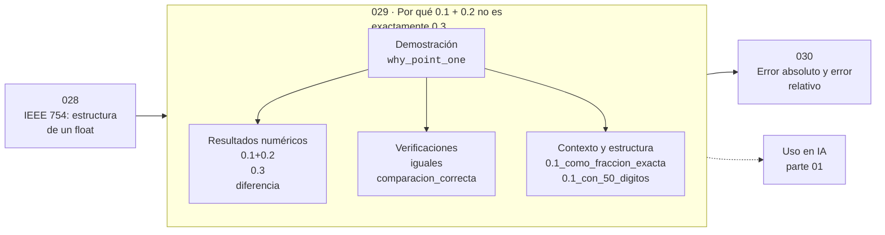

# 029 — Por qué 0.1 + 0.2 no es exactamente 0.3

> [⬅️ 028 IEEE 754: estructura de un float](../028-ieee-754-estructura-de-un-float/README.md) · [📚 Parte 01](../README.md) · [🏠 Programa](../../../README.md) · [030 Error absoluto y error relativo ➡️](../030-error-absoluto-y-error-relativo/README.md)

**Parte:** 01 — Aritmética computacional y representación numérica · **Nivel:** `basico-computacional` · **Horas estimadas:** 4
**Motor:** `engines.part01` · **Demostración:** `why_point_one` · **Clase 9 de 20** de la parte

---

## 🎯 Propósito

**0.1 no es representable en binario, igual que 1/3 no lo es en decimal; la desigualdad no es un fallo sino una consecuencia.**

Qué es realmente un número dentro de una máquina: bits, complemento a dos, IEEE 754, error, condicionamiento y estabilidad.

## ✅ Resultados de aprendizaje

Al terminar podrás:

1. Explicar **Por qué 0.1 + 0.2 no es exactamente 0.3** con lenguaje cotidiano y con notación matemática.
2. Resolver un caso pequeño a mano y anticipar el orden de magnitud del resultado.
3. Ejecutar y modificar `lab.py`, que corre la demostración `why_point_one`.
4. Interpretar las 7 salidas del laboratorio y decir qué comprueba cada una.
5. Detectar el error típico de esta parte: usar float para dinero en vez de decimal o enteros de centavos.

## 🧩 Fórmulas de la clase

```text
0.1₁₀ = 0.0001100110011...₂  (periódico infinito)
comparación correcta: math.isclose(a, b, rel_tol=...)
```

## 🗺️ Ubicación en el programa



## 📖 Fundamentos

La clase 004 estableció que una fracción tiene desarrollo finito solo si su
denominador reducido se factoriza en los primos de la base. En base 10 los primos son
2 y 5, y por eso 1/10 es finito. En base 2 el único primo es 2, así que 1/10 —cuyo
denominador contiene un 5— tiene desarrollo **binario periódico infinito**.

Como la mantisa tiene 53 bits, ese desarrollo se trunca. El float más cercano a 0.1 es
en realidad 0.1000000000000000055511151231257827021181583404541015625. Sumar dos
aproximaciones y compararlas con la aproximación de 0.3 no tiene por qué dar igualdad,
y de hecho no la da: la diferencia es de unos 5.5·10⁻¹⁷.

La conclusión correcta no es «los floats están rotos». Es que **el operador `==` no es
la comparación adecuada para resultados de cálculo en punto flotante**. La comparación
correcta declara una tolerancia: `math.isclose(a, b, rel_tol=1e-12)` pregunta si los
dos números coinciden dentro de una precisión relativa declarada, que es la pregunta
que realmente se quiere responder.

Hay una excepción importante: comparar con `==` sí es correcto cuando los valores son
exactamente representables y no han pasado por operaciones inexactas —enteros
pequeños, potencias de 2, resultados de asignaciones directas—. La regla práctica es
preguntarse si el valor viene de un cálculo; si viene, hace falta tolerancia.

## 🧮 Ejemplo trabajado

La desigualdad y su explicación.

```text
0.1 + 0.2 = 0.30000000000000004
0.3       = 0.29999999999999998889776975374843...
¿iguales con ==?           No
diferencia                 5.55e−17

0.1 con 50 decimales:
  0.10000000000000000555111512312578270211815834045410

Comparación correcta:
  math.isclose(0.1 + 0.2, 0.3, rel_tol=1e-12)  →  True
```

El error es de 5.5·10⁻¹⁷ sobre 0.3: precisión relativa de 1.8·10⁻¹⁶, exactamente el
epsilon de máquina. El resultado es tan bueno como el formato permite.

## 🔬 Qué ejecuta el laboratorio

`why_point_one` — 0.1 + 0.2 != 0.3 explicado con la fracción binaria real.

| Grupo | Salidas |
|---|---|
| 🔢 Resultados numéricos (3) | `0.1+0.2`, `0.3`, `diferencia` |
| ✅ Comprobaciones de invariante (2) | `iguales`, `comparacion_correcta` |

Las claves booleanas no son adorno: si alguna fuera `False`, el resultado numérico
no sería fiable aunque el programa terminase sin error.

```bash
python classes/part-01-aritmetica-computacional-y-representacion-numerica/029-por-que-0-1-0-2-no-es-exactamente-0-3/lab.py
compmath run 029
```

> [!TIP]
> Antes de ejecutar, **escribe tu predicción**. Un laboratorio que confirma lo que
> esperabas enseña tanto como uno que te contradice, pero solo si la predicción
> existía antes del resultado.

## ⚠️ Errores conceptuales frecuentes

1. Comparar resultados de cálculo con == en lugar de con una tolerancia declarada.
2. Concluir que los floats son poco fiables en lugar de que la comparación era incorrecta.
3. Usar una tolerancia absoluta fija sin considerar la escala de los valores.

## 🚀 Dónde se usa de verdad

Cualquier test numérico, criterio de convergencia o comparación de resultados. Los
asserts de todo el programa usan tolerancia declarada precisamente por esto.

## 🤖 Conexión con IA

float32, bfloat16 y la cuantización a int8 son decisiones de representación. Los NaN en un entrenamiento casi siempre nacen aquí, no en la arquitectura.

## 📓 Notebooks

| Archivo | Para qué |
|---|---|
| [`notebook.ipynb`](notebook.ipynb) | recorrido guiado con la demostración ejecutada |
| [`notebook_student.ipynb`](notebook_student.ipynb) | versión con `TODO` para resolver |
| [`notebook_solution.ipynb`](notebook_solution.ipynb) | solución de referencia verificada |

## 📝 Evaluación

| Criterio | Peso |
|---|---:|
| Comprensión conceptual | 25 % |
| Resolución manual | 25 % |
| Implementación y verificación | 25 % |
| Interpretación y comunicación | 15 % |
| Conexión con aplicación real | 10 % |

Detalle y criterios de error crítico en [`assessment.md`](assessment.md).

## ❓ Preguntas de comprobación

1. ¿Cuál es la entrada, cuál la salida y qué unidades tienen?
2. ¿Qué operación domina el comportamiento del resultado?
3. ¿Qué caso extremo revelaría un error conceptual?
4. ¿Cómo verificarías el resultado por un método independiente?
5. ¿Dónde aparece esto en motores numéricos?

Si necesitas releer el código para responderlas, la clase todavía no está superada.

## 📥 Entregable

`notebook_student.ipynb` resuelto más un párrafo que explique el resultado **sin citar
código**: qué entra, qué sale, qué invariante se comprueba y qué pasaría en un caso límite.

## 🔗 Referencias

- [Python: `math.isclose` y PEP 485](https://peps.python.org/pep-0485/)
- [Goldberg, D. *What Every Computer Scientist Should Know About Floating-Point Arithmetic*. ACM CSUR, 1991](https://dl.acm.org/doi/10.1145/103162.103163)
- [0.30000000000000004.com — el mismo fenómeno en 40 lenguajes](https://0.30000000000000004.com/)

Bibliografía completa de la parte en [`../../../docs/BIBLIOGRAPHY.md`](../../../docs/BIBLIOGRAPHY.md).

## 📂 Material de la clase

[`intuition.md`](intuition.md) · [`theory.md`](theory.md) · [`derivation.md`](derivation.md) · [`exercises.md`](exercises.md) · [`assessment.md`](assessment.md) · [`where-is-this-used.md`](where-is-this-used.md) · [`lesson.yaml`](lesson.yaml)

---

> [⬅️ 028 IEEE 754: estructura de un float](../028-ieee-754-estructura-de-un-float/README.md) · [📚 Parte 01](../README.md) · [🏠 Programa](../../../README.md) · [030 Error absoluto y error relativo ➡️](../030-error-absoluto-y-error-relativo/README.md)
