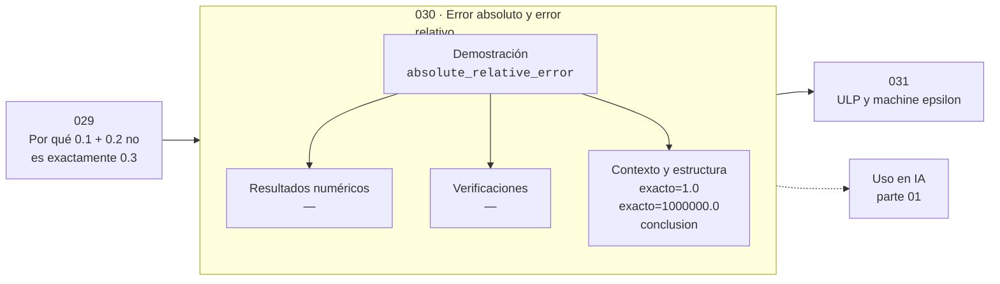

# 030 — Error absoluto y error relativo

> [⬅️ 029 Por qué 0.1 + 0.2 no es exactamente 0.3](../029-por-que-0-1-0-2-no-es-exactamente-0-3/README.md) · [📚 Parte 01](../README.md) · [🏠 Programa](../../../README.md) · [031 ULP y machine epsilon ➡️](../031-ulp-y-machine-epsilon/README.md)

**Parte:** 01 — Aritmética computacional y representación numérica · **Nivel:** `basico-computacional` · **Horas estimadas:** 4
**Motor:** `engines.part01` · **Demostración:** `absolute_relative_error` · **Clase 10 de 20** de la parte

---

## 🎯 Propósito

**El error relativo es la magnitud que se propaga; el absoluto solo tiene sentido con la escala declarada.**

Qué es realmente un número dentro de una máquina: bits, complemento a dos, IEEE 754, error, condicionamiento y estabilidad.

## ✅ Resultados de aprendizaje

Al terminar podrás:

1. Explicar **Error absoluto y error relativo** con lenguaje cotidiano y con notación matemática.
2. Resolver un caso pequeño a mano y anticipar el orden de magnitud del resultado.
3. Ejecutar y modificar `lab.py`, que corre la demostración `absolute_relative_error`.
4. Interpretar las 3 salidas del laboratorio y decir qué comprueba cada una.
5. Detectar el error típico de esta parte: comparar floats con `==` en lugar de una tolerancia razonada.

## 🧩 Fórmulas de la clase

```text
error absoluto = |aprox − exacto|
error relativo = |aprox − exacto| / |exacto|
dígitos significativos correctos ≈ −log₁₀(error relativo)
```

## 🗺️ Ubicación en el programa



## 📖 Fundamentos

Un error absoluto sin escala es una cifra sin significado. Diez unidades de error son
catastróficas si el valor exacto es 1 e irrelevantes si es un millón. El error
relativo normaliza esa comparación y por eso es la magnitud que se usa para hablar de
precisión.

La relación con los dígitos significativos es directa y muy útil: un error relativo de
10⁻⁶ significa aproximadamente 6 dígitos correctos. Como el epsilon de máquina de
float64 es ≈2.2·10⁻¹⁶, ningún cálculo en doble precisión puede prometer más de unos
16 dígitos, y prometer más es exagerar la certeza.

Los dos errores se comportan de forma distinta al operar. Al multiplicar o dividir,
los errores **relativos** se suman aproximadamente. Al sumar o restar, los errores
**absolutos** se suman. Esa asimetría explica por qué la resta de números parecidos es
peligrosa —el error absoluto se mantiene pero el resultado se hace pequeño, así que el
relativo explota— y es el contenido de la clase 032.

La consecuencia práctica: al reportar un resultado numérico hay que decir cuál de los
dos errores se está acotando y con respecto a qué. Un criterio de parada basado solo
en el error absoluto falla si la escala del problema es muy grande o muy pequeña
(clase 233).

## 🧮 Ejemplo trabajado

Dos aproximaciones con errores absolutos muy distintos.

```text
Caso A:  exacto = 1.0            aprox = 1.01
         error absoluto = 0.01
         error relativo = 0.01   → 1 %      ~2 dígitos correctos

Caso B:  exacto = 1 000 000.0    aprox = 1 000 010.0
         error absoluto = 10.0   (1000× mayor que en A)
         error relativo = 1e−5   → 0.001 %  ~5 dígitos correctos

Conclusión: B es 1000 veces más preciso pese a tener
            un error absoluto 1000 veces mayor.
```

## 🔬 Qué ejecuta el laboratorio

`absolute_relative_error` — El error relativo es el que se propaga; el absoluto engaña con la escala.

| Grupo | Salidas |
|---|---|
| 🔢 Resultados numéricos (0) | — |
| ✅ Comprobaciones de invariante (0) | — |

Las claves booleanas no son adorno: si alguna fuera `False`, el resultado numérico
no sería fiable aunque el programa terminase sin error.

```bash
python classes/part-01-aritmetica-computacional-y-representacion-numerica/030-error-absoluto-y-error-relativo/lab.py
compmath run 030
```

> [!TIP]
> Antes de ejecutar, **escribe tu predicción**. Un laboratorio que confirma lo que
> esperabas enseña tanto como uno que te contradice, pero solo si la predicción
> existía antes del resultado.

## ⚠️ Errores conceptuales frecuentes

1. Comparar errores absolutos entre magnitudes de escalas distintas.
2. Reportar más dígitos significativos de los que el error relativo justifica.
3. Usar solo tolerancia absoluta como criterio de parada de un método iterativo.

## 🚀 Dónde se usa de verdad

Criterios de parada (parte 11), tolerancias de test, informes de precisión y
comparación de implementaciones. La clase 040 construye un auditor basado en esta
métrica.

## 🤖 Conexión con IA

float32, bfloat16 y la cuantización a int8 son decisiones de representación. Los NaN en un entrenamiento casi siempre nacen aquí, no en la arquitectura.

## 📓 Notebooks

| Archivo | Para qué |
|---|---|
| [`notebook.ipynb`](notebook.ipynb) | recorrido guiado con la demostración ejecutada |
| [`notebook_student.ipynb`](notebook_student.ipynb) | versión con `TODO` para resolver |
| [`notebook_solution.ipynb`](notebook_solution.ipynb) | solución de referencia verificada |

## 📝 Evaluación

| Criterio | Peso |
|---|---:|
| Comprensión conceptual | 25 % |
| Resolución manual | 25 % |
| Implementación y verificación | 25 % |
| Interpretación y comunicación | 15 % |
| Conexión con aplicación real | 10 % |

Detalle y criterios de error crítico en [`assessment.md`](assessment.md).

## ❓ Preguntas de comprobación

1. ¿Cuál es la entrada, cuál la salida y qué unidades tienen?
2. ¿Qué operación domina el comportamiento del resultado?
3. ¿Qué caso extremo revelaría un error conceptual?
4. ¿Cómo verificarías el resultado por un método independiente?
5. ¿Dónde aparece esto en motores numéricos?

Si necesitas releer el código para responderlas, la clase todavía no está superada.

## 📥 Entregable

`notebook_student.ipynb` resuelto más un párrafo que explique el resultado **sin citar
código**: qué entra, qué sale, qué invariante se comprueba y qué pasaría en un caso límite.

## 🔗 Referencias

- [Higham, N. J. *Accuracy and Stability of Numerical Algorithms*, 2ª ed., SIAM, 2002, cap. 1](https://epubs.siam.org/doi/book/10.1137/1.9780898718027)
- [Python: `math.isclose`](https://docs.python.org/3/library/math.html#math.isclose)

Bibliografía completa de la parte en [`../../../docs/BIBLIOGRAPHY.md`](../../../docs/BIBLIOGRAPHY.md).

## 📂 Material de la clase

[`intuition.md`](intuition.md) · [`theory.md`](theory.md) · [`derivation.md`](derivation.md) · [`exercises.md`](exercises.md) · [`assessment.md`](assessment.md) · [`where-is-this-used.md`](where-is-this-used.md) · [`lesson.yaml`](lesson.yaml)

---

> [⬅️ 029 Por qué 0.1 + 0.2 no es exactamente 0.3](../029-por-que-0-1-0-2-no-es-exactamente-0-3/README.md) · [📚 Parte 01](../README.md) · [🏠 Programa](../../../README.md) · [031 ULP y machine epsilon ➡️](../031-ulp-y-machine-epsilon/README.md)
