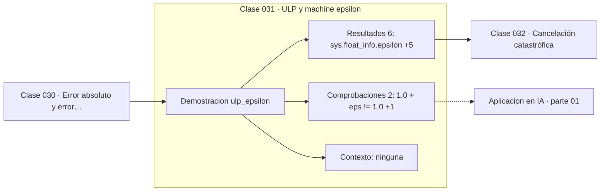

# 031 — ULP y machine epsilon

> [⬅️ 030 Error absoluto y error relativo](../030-error-absoluto-y-error-relativo/README.md) · [📚 Parte 01](../README.md) · [🏠 Programa](../../../README.md) · [032 Cancelación catastrófica ➡️](../032-cancelacion-catastrofica/README.md)

**Parte:** 01 — Aritmética computacional y representación numérica · **Nivel:** `basico-computacional` · **Horas estimadas:** 4
**Motor:** `engines.part01` · **Demostración:** `ulp_epsilon` · **Clase 11 de 20** de la parte

---

## 🎯 Propósito

**El epsilon de máquina mide la precisión relativa; el ULP mide la distancia absoluta entre floats vecinos.**

Qué es realmente un número dentro de una máquina: bits, complemento a dos, IEEE 754, error, condicionamiento y estabilidad.

## ✅ Resultados de aprendizaje

Al terminar podrás:

1. Explicar **ULP y machine epsilon** con lenguaje cotidiano y con notación matemática.
2. Resolver un caso pequeño a mano y anticipar el orden de magnitud del resultado.
3. Ejecutar y modificar `lab.py`, que corre la demostración `ulp_epsilon`.
4. Interpretar las 8 salidas del laboratorio y decir qué comprueba cada una.
5. Detectar el error típico de esta parte: suponer que la suma de floats es asociativa.

## 🧩 Fórmulas de la clase

```text
ε = 2⁻⁵² ≈ 2.22e−16  (float64)
ulp(x) ≈ ε · 2^⌊log₂|x|⌋
```

## 🗺️ Ubicación en el programa



## 📖 Fundamentos

El epsilon de máquina se define como el menor ε tal que `1 + ε ≠ 1` en la aritmética
del formato. En float64 vale exactamente 2⁻⁵², porque la mantisa tiene 52 bits
almacenados: sumar algo menor que el último bit de la mantisa no cambia el número. El
laboratorio comprueba justamente eso: `1.0 + ε` difiere de 1.0, pero `1.0 + ε/2` no.

El ULP —*unit in the last place*— es el concepto relacionado pero distinto: la
distancia entre un float concreto y su vecino inmediato. No es constante: cerca de 1
vale unos 2.2·10⁻¹⁶, cerca de 10⁶ vale unos 1.2·10⁻¹⁰, y cerca de 10⁻⁶ vale unos
2.1·10⁻²². Los floats no están repartidos uniformemente en la recta: se concentran
cerca del cero y se espacian al alejarse.

Esta no uniformidad explica un fenómeno cotidiano: sumar un número muy pequeño a uno
muy grande no cambia nada. `1e16 + 1.0` devuelve `1e16` porque 1.0 es menor que el ULP
en esa escala. No es un redondeo agresivo: es que el resultado exacto no tiene
representación y el más cercano es el propio `1e16`.

Medir un error en ULP en lugar de en unidades absolutas es la forma correcta de
evaluar la calidad de una función numérica. Una implementación de `sin` «correctamente
redondeada» tiene un error menor a 0.5 ULP; una aceptable, menor a 1 ULP. Esa es la
unidad en la que las bibliotecas matemáticas declaran su precisión.

## 🧮 Ejemplo trabajado

Epsilon, ULP y el límite de la suma.

```text
ε = sys.float_info.epsilon = 2.220446049250313e−16 = 2⁻⁵²

1.0 + ε      ≠ 1.0        ✓ (por definición de ε)
1.0 + ε/2    == 1.0       ✓ (por debajo del último bit)

ULP según la magnitud:
  ulp(1.0)   = 2.22e−16
  ulp(1e6)   = 1.16e−10       500 000 veces mayor
  ulp(1e−6)  = 2.12e−22

Siguiente float tras 1.0: 1.0000000000000002
```

Los floats no son un retículo uniforme: son casi logarítmicos.

## 🔬 Qué ejecuta el laboratorio

`ulp_epsilon` — Machine epsilon y la distancia al float siguiente.

| Grupo | Salidas |
|---|---|
| 🔢 Resultados numéricos (6) | `sys.float_info.epsilon`, `2**-52`, `ulp_en_1.0`, `ulp_en_1e6`, `ulp_en_1e-6`, `siguiente_float_tras_1.0` |
| ✅ Comprobaciones de invariante (2) | `1.0 + eps != 1.0`, `1.0 + eps/2 == 1.0` |

Las claves booleanas no son adorno: si alguna fuera `False`, el resultado numérico
no sería fiable aunque el programa terminase sin error.

```bash
python classes/part-01-aritmetica-computacional-y-representacion-numerica/031-ulp-y-machine-epsilon/lab.py
compmath run 031
```

> [!TIP]
> Antes de ejecutar, **escribe tu predicción**. Un laboratorio que confirma lo que
> esperabas enseña tanto como uno que te contradice, pero solo si la predicción
> existía antes del resultado.

## ⚠️ Errores conceptuales frecuentes

1. Confundir el epsilon de máquina con el menor float positivo (5e−324).
2. Suponer que el ULP es constante en toda la recta real.
3. Usar una tolerancia absoluta de 1e−16 para valores de magnitud 1e6, donde el ULP ya es 1e−10.

## 🚀 Dónde se usa de verdad

Elegir tolerancias, evaluar la calidad de una biblioteca matemática y entender por qué
un acumulador pierde términos pequeños. Es el prerrequisito de las clases 032 y 034.

## 🤖 Conexión con IA

float32, bfloat16 y la cuantización a int8 son decisiones de representación. Los NaN en un entrenamiento casi siempre nacen aquí, no en la arquitectura.

## 📓 Notebooks

| Archivo | Para qué |
|---|---|
| [`notebook.ipynb`](notebook.ipynb) | recorrido guiado con la demostración ejecutada |
| [`notebook_student.ipynb`](notebook_student.ipynb) | versión con `TODO` para resolver |
| [`notebook_solution.ipynb`](notebook_solution.ipynb) | solución de referencia verificada |

## 📝 Evaluación

| Criterio | Peso |
|---|---:|
| Comprensión conceptual | 25 % |
| Resolución manual | 25 % |
| Implementación y verificación | 25 % |
| Interpretación y comunicación | 15 % |
| Conexión con aplicación real | 10 % |

Detalle y criterios de error crítico en [`assessment.md`](assessment.md).

## ❓ Preguntas de comprobación

1. ¿Cuál es la entrada, cuál la salida y qué unidades tienen?
2. ¿Qué operación domina el comportamiento del resultado?
3. ¿Qué caso extremo revelaría un error conceptual?
4. ¿Cómo verificarías el resultado por un método independiente?
5. ¿Dónde aparece esto en motores numéricos?

Si necesitas releer el código para responderlas, la clase todavía no está superada.

## 📥 Entregable

`notebook_student.ipynb` resuelto más un párrafo que explique el resultado **sin citar
código**: qué entra, qué sale, qué invariante se comprueba y qué pasaría en un caso límite.

## 🔗 Referencias

- [Muller, J.-M. et al. *Handbook of Floating-Point Arithmetic*, 2ª ed., Birkhäuser, 2018](https://link.springer.com/book/10.1007/978-3-319-76526-6)
- [Python: `math.ulp` y `math.nextafter`](https://docs.python.org/3/library/math.html#math.ulp)

Bibliografía completa de la parte en [`../../../docs/BIBLIOGRAPHY.md`](../../../docs/BIBLIOGRAPHY.md).

## 📂 Material de la clase

[`intuition.md`](intuition.md) · [`theory.md`](theory.md) · [`derivation.md`](derivation.md) · [`exercises.md`](exercises.md) · [`assessment.md`](assessment.md) · [`where-is-this-used.md`](where-is-this-used.md) · [`lesson.yaml`](lesson.yaml)

---

> [⬅️ 030 Error absoluto y error relativo](../030-error-absoluto-y-error-relativo/README.md) · [📚 Parte 01](../README.md) · [🏠 Programa](../../../README.md) · [032 Cancelación catastrófica ➡️](../032-cancelacion-catastrofica/README.md)
