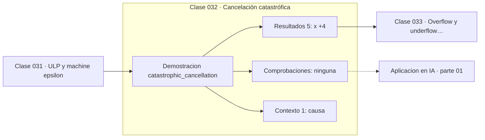

# 032 — Cancelación catastrófica

> [⬅️ 031 ULP y machine epsilon](../031-ulp-y-machine-epsilon/README.md) · [📚 Parte 01](../README.md) · [🏠 Programa](../../../README.md) · [033 Overflow y underflow flotante ➡️](../033-overflow-y-underflow-flotante/README.md)

**Parte:** 01 — Aritmética computacional y representación numérica · **Nivel:** `basico-computacional` · **Horas estimadas:** 4
**Motor:** `engines.part01` · **Demostración:** `catastrophic_cancellation` · **Clase 12 de 20** de la parte

---

## 🎯 Propósito

**Restar dos números casi iguales destruye dígitos significativos sin producir ningún error visible.**

Qué es realmente un número dentro de una máquina: bits, complemento a dos, IEEE 754, error, condicionamiento y estabilidad.

## ✅ Resultados de aprendizaje

Al terminar podrás:

1. Explicar **Cancelación catastrófica** con lenguaje cotidiano y con notación matemática.
2. Resolver un caso pequeño a mano y anticipar el orden de magnitud del resultado.
3. Ejecutar y modificar `lab.py`, que corre la demostración `catastrophic_cancellation`.
4. Interpretar las 6 salidas del laboratorio y decir qué comprueba cada una.
5. Detectar el error típico de esta parte: usar float para dinero en vez de decimal o enteros de centavos.

## 🧩 Fórmulas de la clase

```text
forma ingenua:  √(x²+1) − x
forma estable:  1 / (√(x²+1) + x)
```

## 🗺️ Ubicación en el programa



## 📖 Fundamentos

La cancelación catastrófica es el fenómeno más peligroso de la aritmética de punto
flotante porque **no produce ninguna señal**. Al restar dos números que coinciden en
sus primeros k dígitos, esos dígitos se anulan y el resultado queda formado por los
dígitos de menor peso, que son precisamente los contaminados por el redondeo previo.
El error absoluto se mantiene; el resultado se hace pequeño; el error relativo explota.

El caso canónico es `√(x²+1) − x` para x grande. Con x = 10⁸, ambos términos valen
aproximadamente 10⁸ y coinciden en unos 16 dígitos, que son todos los que hay. El
resultado de la resta es esencialmente ruido. La forma algebraicamente equivalente
`1/(√(x²+1) + x)` —obtenida multiplicando y dividiendo por el conjugado— no tiene resta
y da el resultado correcto.

El patrón se repite en toda la matemática computacional: `exp(x) − 1` para x pequeño
(por eso existe `expm1`), `log(1 + x)` para x pequeño (`log1p`), la fórmula cuadrática
cuando `b² ≫ 4ac` (clase 036), y la varianza calculada como `E[X²] − E[X]²` en lugar
de con la fórmula de dos pasos.

La regla práctica es reconocible: **cada vez que una fórmula reste dos cantidades que
pueden ser casi iguales, hay que buscar una forma alternativa**. Casi siempre existe, y
obtenerla es álgebra elemental —racionalizar, factorizar, usar una identidad—, no
análisis numérico avanzado.

## 🧮 Ejemplo trabajado

La misma expresión por dos caminos con x = 10⁸.

```text
Ingenua:  √(10¹⁶ + 1) − 10⁸
          = 100000000.00000001 − 100000000
          = 7.45e−09          ← casi todo ruido

Estable:  1 / (√(10¹⁶+1) + 10⁸)
          = 1 / 200000000.00000001
          = 5.0e−09           ← correcto

Diferencia relativa entre ambas: ~49 %
Dígitos significativos de la ingenua: ~0
```

Las dos expresiones son idénticas en ℝ. En float64 una es útil y la otra no.

## 🔬 Qué ejecuta el laboratorio

`catastrophic_cancellation` — Dos fórmulas algebraicamente iguales con precisión muy distinta.

| Grupo | Salidas |
|---|---|
| 🔢 Resultados numéricos (5) | `x`, `formula_ingenua_sqrt(x^2+1)-x`, `formula_estable_1/(sqrt(x^2+1)+x)`, `diferencia`, `error_relativo_de_la_ingenua` |
| ✅ Comprobaciones de invariante (0) | — |

Las claves booleanas no son adorno: si alguna fuera `False`, el resultado numérico
no sería fiable aunque el programa terminase sin error.

```bash
python classes/part-01-aritmetica-computacional-y-representacion-numerica/032-cancelacion-catastrofica/lab.py
compmath run 032
```

> [!TIP]
> Antes de ejecutar, **escribe tu predicción**. Un laboratorio que confirma lo que
> esperabas enseña tanto como uno que te contradice, pero solo si la predicción
> existía antes del resultado.

## ⚠️ Errores conceptuales frecuentes

1. Trasladar una fórmula del papel al código sin comprobar si contiene una resta peligrosa.
2. Interpretar el resultado incorrecto como un problema del lenguaje o de la biblioteca.
3. Aumentar la precisión (float128) en lugar de reformular: retrasa el problema, no lo resuelve.

## 🚀 Dónde se usa de verdad

Fórmula cuadrática, cálculo de varianza, diferencias finitas, funciones especiales y
cualquier resta de magnitudes cercanas. `expm1` y `log1p` existen exactamente por esto.

## 🤖 Conexión con IA

float32, bfloat16 y la cuantización a int8 son decisiones de representación. Los NaN en un entrenamiento casi siempre nacen aquí, no en la arquitectura.

## 📓 Notebooks

| Archivo | Para qué |
|---|---|
| [`notebook.ipynb`](notebook.ipynb) | recorrido guiado con la demostración ejecutada |
| [`notebook_student.ipynb`](notebook_student.ipynb) | versión con `TODO` para resolver |
| [`notebook_solution.ipynb`](notebook_solution.ipynb) | solución de referencia verificada |

## 📝 Evaluación

| Criterio | Peso |
|---|---:|
| Comprensión conceptual | 25 % |
| Resolución manual | 25 % |
| Implementación y verificación | 25 % |
| Interpretación y comunicación | 15 % |
| Conexión con aplicación real | 10 % |

Detalle y criterios de error crítico en [`assessment.md`](assessment.md).

## ❓ Preguntas de comprobación

1. ¿Cuál es la entrada, cuál la salida y qué unidades tienen?
2. ¿Qué operación domina el comportamiento del resultado?
3. ¿Qué caso extremo revelaría un error conceptual?
4. ¿Cómo verificarías el resultado por un método independiente?
5. ¿Dónde aparece esto en motores numéricos?

Si necesitas releer el código para responderlas, la clase todavía no está superada.

## 📥 Entregable

`notebook_student.ipynb` resuelto más un párrafo que explique el resultado **sin citar
código**: qué entra, qué sale, qué invariante se comprueba y qué pasaría en un caso límite.

## 📚 Bibliografía de la clase

Esta clase enseña **Aritmética de máquina · Métodos numéricos**. Cada obra dice qué aporta aquí y cómo se comprobó su localizador:

- [Higham, N. J. *Accuracy and Stability of Numerical Algorithms*, 2ª ed., SIAM, 2002](https://epubs.siam.org/doi/book/10.1137/1.9780898718027) — Aritmética de máquina y Métodos numéricos: el tema de esta clase · ISBN-13 `9780898718027`, pendiente de resolver.
- [Python: `math.expm1` y `math.log1p`](https://docs.python.org/3/library/math.html#math.expm1) — documentación de la herramienta que ejecuta el laboratorio · URL de la fuente primaria comprobada en Python Software Foundation (2026-08-19).

Bibliografía de todas las clases, con el porqué de cada obra, en [`docs/BIBLIOGRAPHY.md`](../../../docs/BIBLIOGRAPHY.md) · localizador y estado de cada obra en [`sources/bibliography.json`](../../../sources/bibliography.json).

## 📂 Material de la clase

[`intuition.md`](intuition.md) · [`theory.md`](theory.md) · [`derivation.md`](derivation.md) · [`exercises.md`](exercises.md) · [`assessment.md`](assessment.md) · [`where-is-this-used.md`](where-is-this-used.md) · [`lesson.yaml`](lesson.yaml)

---

> [⬅️ 031 ULP y machine epsilon](../031-ulp-y-machine-epsilon/README.md) · [📚 Parte 01](../README.md) · [🏠 Programa](../../../README.md) · [033 Overflow y underflow flotante ➡️](../033-overflow-y-underflow-flotante/README.md)
