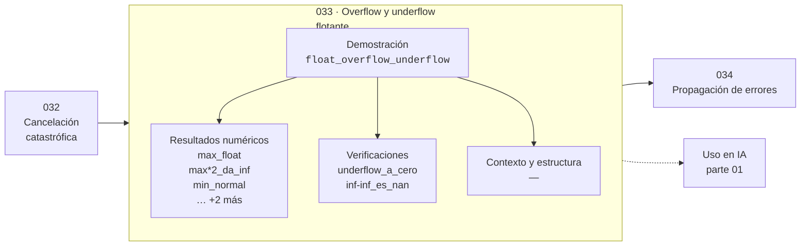

# 033 — Overflow y underflow flotante

> [⬅️ 032 Cancelación catastrófica](../032-cancelacion-catastrofica/README.md) · [📚 Parte 01](../README.md) · [🏠 Programa](../../../README.md) · [034 Propagación de errores ➡️](../034-propagacion-de-errores/README.md)

**Parte:** 01 — Aritmética computacional y representación numérica · **Nivel:** `basico-computacional` · **Horas estimadas:** 4
**Motor:** `engines.part01` · **Demostración:** `float_overflow_underflow` · **Clase 13 de 20** de la parte

---

## 🎯 Propósito

**Los subnormales extienden el rango hacia el cero a costa de precisión; el overflow produce infinito y no error.**

Qué es realmente un número dentro de una máquina: bits, complemento a dos, IEEE 754, error, condicionamiento y estabilidad.

## ✅ Resultados de aprendizaje

Al terminar podrás:

1. Explicar **Overflow y underflow flotante** con lenguaje cotidiano y con notación matemática.
2. Resolver un caso pequeño a mano y anticipar el orden de magnitud del resultado.
3. Ejecutar y modificar `lab.py`, que corre la demostración `float_overflow_underflow`.
4. Interpretar las 7 salidas del laboratorio y decir qué comprueba cada una.
5. Detectar el error típico de esta parte: comparar floats con `==` en lugar de una tolerancia razonada.

## 🧩 Fórmulas de la clase

```text
float64: max ≈ 1.797e308,  min normal ≈ 2.225e−308,  min subnormal = 5e−324
inf − inf = NaN,  0/0 = NaN,  NaN != NaN
```

## 🗺️ Ubicación en el programa



## 📖 Fundamentos

El rango de float64 tiene tres zonas. Los **normales** van de 2.2·10⁻³⁰⁸ a
1.8·10³⁰⁸ con la precisión completa de 53 bits. Por debajo del mínimo normal están los
**subnormales**, que renuncian al bit implícito para poder acercarse más al cero: llegan
hasta 5·10⁻³²⁴ pero con precisión progresivamente menor. Por encima del máximo está el
**infinito**.

Los subnormales existen para que la resta de dos números cercanos nunca dé cero cuando
los números son distintos, propiedad conocida como *gradual underflow*. Sin ellos,
`a − b == 0` podría ser cierto con `a != b`, lo que rompe algoritmos que dividen por esa
diferencia. La contrapartida es de rendimiento: en muchas CPU las operaciones con
subnormales son órdenes de magnitud más lentas, y por eso los frameworks de deep
learning ofrecen el modo *flush-to-zero*.

El desbordamiento no lanza excepción: produce `inf`, y el cálculo continúa. Esto es
deliberado —permite terminar una operación vectorizada y detectar el problema al
final— pero exige comprobar los resultados. El `NaN` aparece en las operaciones
indeterminadas (`inf − inf`, `0/0`, `√(−1)`) y tiene una propiedad que sorprende:
**no es igual a sí mismo**. `nan == nan` es `False`, y por eso hay que usar
`math.isnan`.

En entrenamiento de redes, la secuencia típica es: un gradiente crece, produce `inf`,
el `inf` participa en una resta y produce `NaN`, y el `NaN` contamina todos los pesos
en una sola actualización. Detectarlo exige comprobar explícitamente; el programa no
avisa.

## 🧮 Ejemplo trabajado

Los tres límites y la propiedad del NaN.

```text
max float64        1.7976931348623157e+308
max × 2            inf                      ← sin excepción

min normal         2.2250738585072014e−308
min subnormal      5e−324
min subnormal / 2  0.0                      ← underflow a cero

inf − inf          nan
nan == nan         False                    ← usar math.isnan
```

Un `inf` en un cálculo no detiene nada. Se propaga en silencio hasta que alguien
comprueba.

## 🔬 Qué ejecuta el laboratorio

`float_overflow_underflow` — Límites del float64 y el paso por subnormales.

| Grupo | Salidas |
|---|---|
| 🔢 Resultados numéricos (5) | `max_float`, `max*2_da_inf`, `min_normal`, `min_subnormal`, `min_subnormal/2` |
| ✅ Comprobaciones de invariante (2) | `underflow_a_cero`, `inf-inf_es_nan` |

Las claves booleanas no son adorno: si alguna fuera `False`, el resultado numérico
no sería fiable aunque el programa terminase sin error.

```bash
python classes/part-01-aritmetica-computacional-y-representacion-numerica/033-overflow-y-underflow-flotante/lab.py
compmath run 033
```

> [!TIP]
> Antes de ejecutar, **escribe tu predicción**. Un laboratorio que confirma lo que
> esperabas enseña tanto como uno que te contradice, pero solo si la predicción
> existía antes del resultado.

## ⚠️ Errores conceptuales frecuentes

1. Comparar con == para detectar NaN en lugar de usar math.isnan.
2. Suponer que el desbordamiento lanza una excepción.
3. Ignorar el coste de rendimiento de los subnormales en bucles numéricos intensivos.

## 🚀 Dónde se usa de verdad

Depuración de entrenamientos que producen NaN, control de estabilidad en softmax y
logaritmos, y validación de pipelines numéricos. La estabilización de softmax
(clase 321) existe para evitar exactamente este overflow.

## 🤖 Conexión con IA

float32, bfloat16 y la cuantización a int8 son decisiones de representación. Los NaN en un entrenamiento casi siempre nacen aquí, no en la arquitectura.

## 📓 Notebooks

| Archivo | Para qué |
|---|---|
| [`notebook.ipynb`](notebook.ipynb) | recorrido guiado con la demostración ejecutada |
| [`notebook_student.ipynb`](notebook_student.ipynb) | versión con `TODO` para resolver |
| [`notebook_solution.ipynb`](notebook_solution.ipynb) | solución de referencia verificada |

## 📝 Evaluación

| Criterio | Peso |
|---|---:|
| Comprensión conceptual | 25 % |
| Resolución manual | 25 % |
| Implementación y verificación | 25 % |
| Interpretación y comunicación | 15 % |
| Conexión con aplicación real | 10 % |

Detalle y criterios de error crítico en [`assessment.md`](assessment.md).

## ❓ Preguntas de comprobación

1. ¿Cuál es la entrada, cuál la salida y qué unidades tienen?
2. ¿Qué operación domina el comportamiento del resultado?
3. ¿Qué caso extremo revelaría un error conceptual?
4. ¿Cómo verificarías el resultado por un método independiente?
5. ¿Dónde aparece esto en motores numéricos?

Si necesitas releer el código para responderlas, la clase todavía no está superada.

## 📥 Entregable

`notebook_student.ipynb` resuelto más un párrafo que explique el resultado **sin citar
código**: qué entra, qué sale, qué invariante se comprueba y qué pasaría en un caso límite.

## 🔗 Referencias

- [IEEE 754-2019 Standard for Floating-Point Arithmetic](https://standards.ieee.org/ieee/754/6210/)
- [Python: `sys.float_info`](https://docs.python.org/3/library/sys.html#sys.float_info)

Bibliografía completa de la parte en [`../../../docs/BIBLIOGRAPHY.md`](../../../docs/BIBLIOGRAPHY.md).

## 📂 Material de la clase

[`intuition.md`](intuition.md) · [`theory.md`](theory.md) · [`derivation.md`](derivation.md) · [`exercises.md`](exercises.md) · [`assessment.md`](assessment.md) · [`where-is-this-used.md`](where-is-this-used.md) · [`lesson.yaml`](lesson.yaml)

---

> [⬅️ 032 Cancelación catastrófica](../032-cancelacion-catastrofica/README.md) · [📚 Parte 01](../README.md) · [🏠 Programa](../../../README.md) · [034 Propagación de errores ➡️](../034-propagacion-de-errores/README.md)
