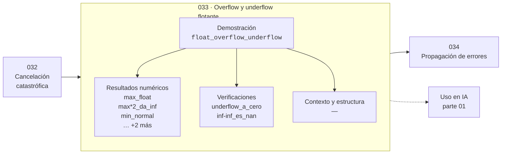

# 033 — Overflow y underflow flotante

> [⬅️ 032 Cancelación catastrófica](../032-cancelacion-catastrofica/README.md) · [📚 Parte 01](../README.md) · [🏠 Programa](../../../README.md) · [034 Propagación de errores ➡️](../034-propagacion-de-errores/README.md)

**Parte:** 01 — Aritmética computacional y representación numérica · **Nivel:** `basico-computacional` · **Horas estimadas:** 4
**Motor:** `engines.part01` · **Demostración:** `float_overflow_underflow` · **Clase 13 de 20** de la parte

---

## 🎯 Propósito

Qué es realmente un número dentro de una máquina: bits, complemento a dos, IEEE 754, error, condicionamiento y estabilidad.

Esta clase concreta ese objetivo sobre **Overflow y underflow flotante**: qué es, cómo se
calcula a mano, cómo se implementa sin ocultar el procedimiento y cómo se verifica
que el resultado es correcto y no solo plausible.

## ✅ Resultados de aprendizaje

Al terminar podrás:

1. Explicar **Overflow y underflow flotante** con lenguaje cotidiano y con notación matemática.
2. Resolver un caso pequeño a mano y anticipar el orden de magnitud del resultado.
3. Ejecutar y modificar `lab.py`, que corre la demostración `float_overflow_underflow`.
4. Interpretar las 7 salidas del laboratorio y decir qué comprueba cada una.
5. Detectar el error típico de esta parte: comparar floats con `==` en lugar de una tolerancia razonada.

## 🗺️ Ubicación en el programa



## 🧠 Idea rectora de la parte 01

> Condicionamiento es del problema; estabilidad es del algoritmo.

## 🔬 Qué ejecuta el laboratorio

`float_overflow_underflow` — Límites del float64 y el paso por subnormales.

| Grupo | Salidas |
|---|---|
| 🔢 Resultados numéricos (5) | `max_float`, `max*2_da_inf`, `min_normal`, `min_subnormal`, `min_subnormal/2` |
| ✅ Comprobaciones de invariante (2) | `underflow_a_cero`, `inf-inf_es_nan` |

Las claves booleanas no son adorno: si alguna fuera `False`, el resultado numérico
no sería fiable aunque el programa terminase sin error.

```bash
python classes/part-01-aritmetica-computacional-y-representacion-numerica/033-overflow-y-underflow-flotante/lab.py
compmath run 033
```

> [!TIP]
> Antes de ejecutar, **escribe tu predicción**. Un laboratorio que confirma lo que
> esperabas enseña tanto como uno que te contradice, pero solo si la predicción
> existía antes del resultado.

## ⚠️ Errores frecuentes en esta parte

- Comparar floats con `==` en lugar de una tolerancia razonada.
- Suponer que la suma de floats es asociativa.
- Usar float para dinero en vez de Decimal o enteros de centavos.

## 🤖 Conexión con IA

float32, bfloat16 y la cuantización a int8 son decisiones de representación. Los NaN en un entrenamiento casi siempre nacen aquí, no en la arquitectura.

## 📓 Notebooks

| Archivo | Para qué |
|---|---|
| [`notebook.ipynb`](notebook.ipynb) | recorrido guiado con la demostración ejecutada |
| [`notebook_student.ipynb`](notebook_student.ipynb) | versión con `TODO` para resolver |
| [`notebook_solution.ipynb`](notebook_solution.ipynb) | solución de referencia verificada |

## 📝 Evaluación

| Criterio | Peso |
|---|---:|
| Comprensión conceptual | 25 % |
| Resolución manual | 25 % |
| Implementación y verificación | 25 % |
| Interpretación y comunicación | 15 % |
| Conexión con aplicación real | 10 % |

Detalle y criterios de error crítico en [`assessment.md`](assessment.md).

## ❓ Preguntas de comprobación

1. ¿Cuál es la entrada, cuál la salida y qué unidades tienen?
2. ¿Qué operación domina el comportamiento del resultado?
3. ¿Qué caso extremo revelaría un error conceptual?
4. ¿Cómo verificarías el resultado por un método independiente?
5. ¿Dónde aparece esto en motores numéricos?

Si necesitas releer el código para responderlas, la clase todavía no está superada.

## 📥 Entregable

`notebook_student.ipynb` resuelto más un párrafo que explique el resultado **sin citar
código**: qué entra, qué sale, qué invariante se comprueba y qué pasaría en un caso límite.

## 🔗 Referencias

- Goldberg, D. *What Every Computer Scientist Should Know About Floating-Point Arithmetic*. ACM Computing Surveys, 1991.
- Higham, N. J. *Accuracy and Stability of Numerical Algorithms*. 2ª ed., SIAM, 2002.
- IEEE 754-2019 Standard for Floating-Point Arithmetic.

## 📂 Material de la clase

[`intuition.md`](intuition.md) · [`theory.md`](theory.md) · [`derivation.md`](derivation.md) · [`exercises.md`](exercises.md) · [`assessment.md`](assessment.md) · [`where-is-this-used.md`](where-is-this-used.md) · [`lesson.yaml`](lesson.yaml)

---

> [⬅️ 032 Cancelación catastrófica](../032-cancelacion-catastrofica/README.md) · [📚 Parte 01](../README.md) · [🏠 Programa](../../../README.md) · [034 Propagación de errores ➡️](../034-propagacion-de-errores/README.md)
