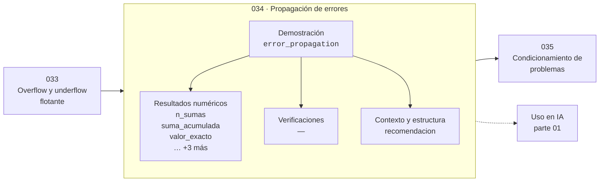

# 034 — Propagación de errores

> [⬅️ 033 Overflow y underflow flotante](../033-overflow-y-underflow-flotante/README.md) · [📚 Parte 01](../README.md) · [🏠 Programa](../../../README.md) · [035 Condicionamiento de problemas ➡️](../035-condicionamiento-de-problemas/README.md)

**Parte:** 01 — Aritmética computacional y representación numérica · **Nivel:** `basico-computacional` · **Horas estimadas:** 4
**Motor:** `engines.part01` · **Demostración:** `error_propagation` · **Clase 14 de 20** de la parte

---

## 🎯 Propósito

**Los errores de redondeo se acumulan al sumar muchos términos; la suma compensada los recupera.**

Qué es realmente un número dentro de una máquina: bits, complemento a dos, IEEE 754, error, condicionamiento y estabilidad.

## ✅ Resultados de aprendizaje

Al terminar podrás:

1. Explicar **Propagación de errores** con lenguaje cotidiano y con notación matemática.
2. Resolver un caso pequeño a mano y anticipar el orden de magnitud del resultado.
3. Ejecutar y modificar `lab.py`, que corre la demostración `error_propagation`.
4. Interpretar las 7 salidas del laboratorio y decir qué comprueba cada una.
5. Detectar el error típico de esta parte: suponer que la suma de floats es asociativa.

## 🧩 Fórmulas de la clase

```text
error de la suma ingenua: O(n·ε)
error de la suma compensada (Kahan): O(ε)
```

## 🗺️ Ubicación en el programa



## 📖 Fundamentos

Cada operación en punto flotante introduce un error de a lo sumo medio ULP. Al sumar n
términos, esos errores se acumulan, y en el peor caso el error total crece
proporcionalmente a `n·ε`. Con un millón de sumandos y ε ≈ 2·10⁻¹⁶, el error relativo
puede llegar a 2·10⁻¹⁰: se han perdido seis dígitos por el simple hecho de sumar
muchas veces.

La suma compensada de Kahan (1965) resuelve el problema arrastrando explícitamente el
error de cada paso: guarda en una variable auxiliar lo que se perdió al redondear y lo
reinyecta en la siguiente suma. El coste es cuatro operaciones en lugar de una, y el
error pasa a ser independiente de n. Python ofrece `math.fsum`, que usa un algoritmo
aún más preciso y devuelve la suma **correctamente redondeada**.

El orden de la suma también importa. Sumar de menor a mayor magnitud reduce el error,
porque evita que los términos pequeños caigan por debajo del ULP del acumulado. Es el
motivo por el que algunas bibliotecas ordenan antes de sumar en cálculos críticos.

En deep learning esto aparece al acumular la pérdida sobre un lote grande o al reducir
gradientes entre dispositivos. Los frameworks acumulan en float32 aunque el cálculo sea
en float16 precisamente para que el acumulador tenga más precisión que los sumandos.

## 🧮 Ejemplo trabajado

Acumular un millón de veces 0.1.

```text
Suma ingenua de 1e6 términos de 0.1:
  resultado    99999.99999808663
  exacto       100000.0
  error abs    1.91e−03
  error rel    1.91e−08         ← se perdieron ~8 dígitos

math.fsum([0.1]*1000) − 100.0 = 0.0
  (correctamente redondeada)

Coste: fsum es más lento, pero el error no crece con n.
```

## 🔬 Qué ejecuta el laboratorio

`error_propagation` — Cómo crece el error al sumar 10^6 veces un valor no representable.

| Grupo | Salidas |
|---|---|
| 🔢 Resultados numéricos (6) | `n_sumas`, `suma_acumulada`, `valor_exacto`, `error_absoluto`, `error_relativo`, `suma_compensada_fsum` |
| ✅ Comprobaciones de invariante (0) | — |

Las claves booleanas no son adorno: si alguna fuera `False`, el resultado numérico
no sería fiable aunque el programa terminase sin error.

```bash
python classes/part-01-aritmetica-computacional-y-representacion-numerica/034-propagacion-de-errores/lab.py
compmath run 034
```

> [!TIP]
> Antes de ejecutar, **escribe tu predicción**. Un laboratorio que confirma lo que
> esperabas enseña tanto como uno que te contradice, pero solo si la predicción
> existía antes del resultado.

## ⚠️ Errores conceptuales frecuentes

1. Acumular millones de términos con += y no medir el error resultante.
2. Acumular en la misma precisión que los sumandos cuando esta es baja (float16).
3. Suponer que el error de redondeo se cancela estadísticamente: en general se acumula.

## 🚀 Dónde se usa de verdad

Sumas de grandes conjuntos de datos, integración numérica, acumulación de pérdida y
reducción de gradientes. `math.fsum`, `numpy.sum` con `dtype` ampliado y la
acumulación en float32 responden a este problema.

## 🤖 Conexión con IA

float32, bfloat16 y la cuantización a int8 son decisiones de representación. Los NaN en un entrenamiento casi siempre nacen aquí, no en la arquitectura.

## 📓 Notebooks

| Archivo | Para qué |
|---|---|
| [`notebook.ipynb`](notebook.ipynb) | recorrido guiado con la demostración ejecutada |
| [`notebook_student.ipynb`](notebook_student.ipynb) | versión con `TODO` para resolver |
| [`notebook_solution.ipynb`](notebook_solution.ipynb) | solución de referencia verificada |

## 📝 Evaluación

| Criterio | Peso |
|---|---:|
| Comprensión conceptual | 25 % |
| Resolución manual | 25 % |
| Implementación y verificación | 25 % |
| Interpretación y comunicación | 15 % |
| Conexión con aplicación real | 10 % |

Detalle y criterios de error crítico en [`assessment.md`](assessment.md).

## ❓ Preguntas de comprobación

1. ¿Cuál es la entrada, cuál la salida y qué unidades tienen?
2. ¿Qué operación domina el comportamiento del resultado?
3. ¿Qué caso extremo revelaría un error conceptual?
4. ¿Cómo verificarías el resultado por un método independiente?
5. ¿Dónde aparece esto en motores numéricos?

Si necesitas releer el código para responderlas, la clase todavía no está superada.

## 📥 Entregable

`notebook_student.ipynb` resuelto más un párrafo que explique el resultado **sin citar
código**: qué entra, qué sale, qué invariante se comprueba y qué pasaría en un caso límite.

## 🔗 Referencias

- [Kahan, W. *Further remarks on reducing truncation errors*. CACM, 1965](https://dl.acm.org/doi/10.1145/363707.363723)
- [Python: `math.fsum`](https://docs.python.org/3/library/math.html#math.fsum)

Bibliografía completa de la parte en [`../../../docs/BIBLIOGRAPHY.md`](../../../docs/BIBLIOGRAPHY.md).

## 📂 Material de la clase

[`intuition.md`](intuition.md) · [`theory.md`](theory.md) · [`derivation.md`](derivation.md) · [`exercises.md`](exercises.md) · [`assessment.md`](assessment.md) · [`where-is-this-used.md`](where-is-this-used.md) · [`lesson.yaml`](lesson.yaml)

---

> [⬅️ 033 Overflow y underflow flotante](../033-overflow-y-underflow-flotante/README.md) · [📚 Parte 01](../README.md) · [🏠 Programa](../../../README.md) · [035 Condicionamiento de problemas ➡️](../035-condicionamiento-de-problemas/README.md)
