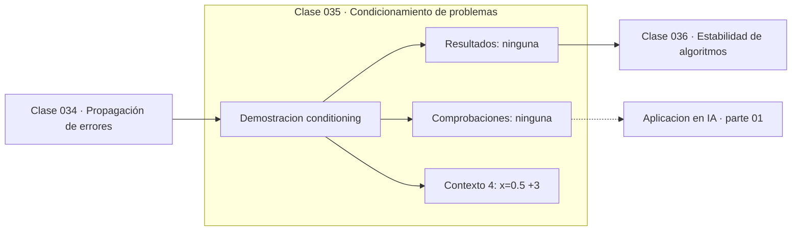

# 035 — Condicionamiento de problemas

> [⬅️ 034 Propagación de errores](../034-propagacion-de-errores/README.md) · [📚 Parte 01](../README.md) · [🏠 Programa](../../../README.md) · [036 Estabilidad de algoritmos ➡️](../036-estabilidad-de-algoritmos/README.md)

**Parte:** 01 — Aritmética computacional y representación numérica · **Nivel:** `basico-computacional` · **Horas estimadas:** 4
**Motor:** `engines.part01` · **Demostración:** `conditioning` · **Clase 15 de 20** de la parte

---

## 🎯 Propósito

**El número de condición mide cuánto amplifica el problema el error de la entrada, con independencia del algoritmo.**

Qué es realmente un número dentro de una máquina: bits, complemento a dos, IEEE 754, error, condicionamiento y estabilidad.

## ✅ Resultados de aprendizaje

Al terminar podrás:

1. Explicar **Condicionamiento de problemas** con lenguaje cotidiano y con notación matemática.
2. Resolver un caso pequeño a mano y anticipar el orden de magnitud del resultado.
3. Ejecutar y modificar `lab.py`, que corre la demostración `conditioning`.
4. Interpretar las 4 salidas del laboratorio y decir qué comprueba cada una.
5. Detectar el error típico de esta parte: usar float para dinero en vez de decimal o enteros de centavos.

## 🧩 Fórmulas de la clase

```text
κ(f, x) = |x·f′(x) / f(x)|
error relativo de salida ≈ κ · error relativo de entrada
```

## 🗺️ Ubicación en el programa



## 📖 Fundamentos

El condicionamiento es una propiedad **del problema**, no de cómo se resuelva. Formaliza
la pregunta: si perturbo la entrada un 0.001 %, ¿cuánto cambia la salida? El número de
condición es el factor de amplificación. Si vale 1, el problema conserva la precisión;
si vale 10⁸, un error de entrada en el dígito 16 se convierte en un error en el dígito
8 de la salida.

Para una función de una variable, `κ = |x·f′(x)/f(x)|`. La fórmula dice algo intuitivo:
el problema está mal condicionado donde la función es muy sensible en relación a su
propio valor, típicamente cerca de sus ceros. `f(x) = 1 − x` cerca de x = 1 tiene
condición enorme: es la versión analítica de la cancelación catastrófica.

La consecuencia práctica es dura y conviene aceptarla pronto: **ningún algoritmo puede
resolver con precisión un problema mal condicionado**. Si la entrada tiene 16 dígitos y
la condición es 10⁸, la salida tiene como mucho 8 dígitos correctos, use uno el método
que use. Buscar un algoritmo mejor es buscar en el sitio equivocado; hay que reformular
el problema.

En álgebra lineal el mismo concepto aparece como el número de condición de una matriz
—cociente entre el mayor y el menor valor singular (clase 132)—, y en machine learning
como la razón entre el mayor y el menor autovalor del Hessiano, que determina lo lento
que converge el descenso de gradiente (clase 244).

## 🧮 Ejemplo trabajado

Condición de f(x) = 1 − x en tres puntos.

```text
κ(x) = |x · f′(x) / f(x)| = |x / (1 − x)|

x = 0.5     f(x) = 0.5        κ = 1.0        bien condicionado
x = 0.99    f(x) = 0.01       κ = 99         empieza a amplificar
x = 1e−8    f(x) ≈ 1.0        κ = 1e−8       muy bien condicionado

x = 0.9999  f(x) = 1e−4       κ = 9999
  un error de entrada de 1e−16 → error de salida de 1e−12
```

La condición no depende de cómo se calcule `1 − x`: depende del problema.

## 🔬 Qué ejecuta el laboratorio

`conditioning` — Número de condición de una función: sensibilidad del problema.

| Grupo | Salidas |
|---|---|
| 🔢 Resultados numéricos (0) | — |
| ✅ Comprobaciones de invariante (0) | — |

Las claves booleanas no son adorno: si alguna fuera `False`, el resultado numérico
no sería fiable aunque el programa terminase sin error.

```bash
python classes/part-01-aritmetica-computacional-y-representacion-numerica/035-condicionamiento-de-problemas/lab.py
compmath run 035
```

> [!TIP]
> Antes de ejecutar, **escribe tu predicción**. Un laboratorio que confirma lo que
> esperabas enseña tanto como uno que te contradice, pero solo si la predicción
> existía antes del resultado.

## ⚠️ Errores conceptuales frecuentes

1. Buscar un algoritmo mejor para un problema mal condicionado.
2. Confundir condicionamiento (del problema) con estabilidad (del algoritmo).
3. Evaluar la condición en un punto y extrapolarla a todo el dominio.

## 🚀 Dónde se usa de verdad

Diagnóstico de sistemas lineales (parte 05), regularización (ridge mejora el
condicionamiento, clase 283) y análisis de convergencia de optimizadores. Es la
pregunta previa a elegir método.

## 🤖 Conexión con IA

float32, bfloat16 y la cuantización a int8 son decisiones de representación. Los NaN en un entrenamiento casi siempre nacen aquí, no en la arquitectura.

## 📓 Notebooks

| Archivo | Para qué |
|---|---|
| [`notebook.ipynb`](notebook.ipynb) | recorrido guiado con la demostración ejecutada |
| [`notebook_student.ipynb`](notebook_student.ipynb) | versión con `TODO` para resolver |
| [`notebook_solution.ipynb`](notebook_solution.ipynb) | solución de referencia verificada |

## 📝 Evaluación

| Criterio | Peso |
|---|---:|
| Comprensión conceptual | 25 % |
| Resolución manual | 25 % |
| Implementación y verificación | 25 % |
| Interpretación y comunicación | 15 % |
| Conexión con aplicación real | 10 % |

Detalle y criterios de error crítico en [`assessment.md`](assessment.md).

## ❓ Preguntas de comprobación

1. ¿Cuál es la entrada, cuál la salida y qué unidades tienen?
2. ¿Qué operación domina el comportamiento del resultado?
3. ¿Qué caso extremo revelaría un error conceptual?
4. ¿Cómo verificarías el resultado por un método independiente?
5. ¿Dónde aparece esto en motores numéricos?

Si necesitas releer el código para responderlas, la clase todavía no está superada.

## 📥 Entregable

`notebook_student.ipynb` resuelto más un párrafo que explique el resultado **sin citar
código**: qué entra, qué sale, qué invariante se comprueba y qué pasaría en un caso límite.

## 📚 Bibliografía de la clase

Esta clase enseña **Aritmética de máquina · Métodos numéricos**. Cada obra dice qué aporta aquí y cómo se comprobó su localizador:

- [Higham, N. J. *Accuracy and Stability of Numerical Algorithms*, 2ª ed., SIAM, 2002](https://epubs.siam.org/doi/book/10.1137/1.9780898718027) — Aritmética de máquina y Métodos numéricos: el tema de esta clase · ISBN-13 `9780898718027`, pendiente de resolver.
- [Trefethen & Bau. *Numerical Linear Algebra*, SIAM, 1997, lecc. 12](https://epubs.siam.org/doi/book/10.1137/1.9780898719574) — Álgebra lineal y Álgebra lineal numérica: conexión declarada de esta parte · ISBN-13 `9780898719574` verificado en International ISBN Agency (2026-08-19).

Bibliografía de todas las clases, con el porqué de cada obra, en [`docs/BIBLIOGRAPHY.md`](../../../docs/BIBLIOGRAPHY.md) · localizador y estado de cada obra en [`sources/bibliography.json`](../../../sources/bibliography.json).

## 📂 Material de la clase

[`intuition.md`](intuition.md) · [`theory.md`](theory.md) · [`derivation.md`](derivation.md) · [`exercises.md`](exercises.md) · [`assessment.md`](assessment.md) · [`where-is-this-used.md`](where-is-this-used.md) · [`lesson.yaml`](lesson.yaml)

---

> [⬅️ 034 Propagación de errores](../034-propagacion-de-errores/README.md) · [📚 Parte 01](../README.md) · [🏠 Programa](../../../README.md) · [036 Estabilidad de algoritmos ➡️](../036-estabilidad-de-algoritmos/README.md)
