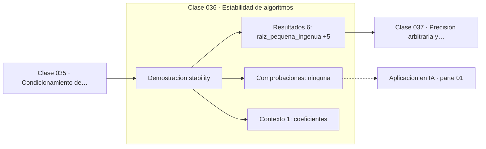

# 036 — Estabilidad de algoritmos

> [⬅️ 035 Condicionamiento de problemas](../035-condicionamiento-de-problemas/README.md) · [📚 Parte 01](../README.md) · [🏠 Programa](../../../README.md) · [037 Precisión arbitraria y Decimal ➡️](../037-precision-arbitraria-y-decimal/README.md)

**Parte:** 01 — Aritmética computacional y representación numérica · **Nivel:** `basico-computacional` · **Horas estimadas:** 4
**Motor:** `engines.part01` · **Demostración:** `stability` · **Clase 16 de 20** de la parte

---

## 🎯 Propósito

**Un algoritmo es estable si no amplifica el error más allá de lo que el condicionamiento del problema exige.**

Qué es realmente un número dentro de una máquina: bits, complemento a dos, IEEE 754, error, condicionamiento y estabilidad.

## ✅ Resultados de aprendizaje

Al terminar podrás:

1. Explicar **Estabilidad de algoritmos** con lenguaje cotidiano y con notación matemática.
2. Resolver un caso pequeño a mano y anticipar el orden de magnitud del resultado.
3. Ejecutar y modificar `lab.py`, que corre la demostración `stability`.
4. Interpretar las 7 salidas del laboratorio y decir qué comprueba cada una.
5. Detectar el error típico de esta parte: comparar floats con `==` en lugar de una tolerancia razonada.

## 🧩 Fórmulas de la clase

```text
raíz pequeña ingenua:  (−b + √(b²−4ac)) / 2a
raíz pequeña estable:  2c / (−b − √(b²−4ac))
invariante: r₁·r₂ = c/a
```

## 🗺️ Ubicación en el programa



## 📖 Fundamentos

Estabilidad y condicionamiento son propiedades distintas que se confunden
constantemente. El condicionamiento dice cuánta precisión permite el **problema**; la
estabilidad dice cuánta precisión conserva el **algoritmo**. Un algoritmo estable
aplicado a un problema mal condicionado dará un resultado impreciso, y eso no es culpa
del algoritmo. Un algoritmo inestable aplicado a un problema bien condicionado dará un
resultado impreciso, y eso sí lo es.

La fórmula cuadrática es el ejemplo canónico. Cuando `b² ≫ 4ac`, la raíz cuadrada del
discriminante es casi igual a `|b|`, así que una de las dos raíces se obtiene restando
dos números casi iguales: cancelación catastrófica. El problema —encontrar las raíces—
está perfectamente bien condicionado; el algoritmo estándar es inestable para una de
ellas.

La solución usa una identidad elemental: el producto de las raíces es `c/a`. Calculada
la raíz grande de forma estable (la que no sufre cancelación), la pequeña se obtiene
dividiendo. El invariante que se usa para calcularla sirve además como verificación:
si `r₁·r₂` no da `c/a`, hay un error.

Este patrón —usar un invariante conocido tanto para calcular como para verificar— es
uno de los hábitos más transferibles del programa. Aparece en la ortogonalidad de QR
(clase 130), en la conservación de la masa de un plan de transporte (clase 346) y en la
suma de probabilidades de una softmax (clase 321).

## 🧮 Ejemplo trabajado

Raíces de x² + 10⁸x + 1 = 0.

```text
a = 1,  b = 1e8,  c = 1
√(b² − 4ac) = 99999999.99999999

Raíz grande (estable en ambos métodos):
  r₂ = (−b − √Δ)/2a = −1e8

Raíz pequeña:
  ingenua:  (−b + √Δ)/2a = −7.45e−09    ← cancelación
  estable:  2c/(−b − √Δ) = −1.0e−08     ← correcta

Verificación con el invariante r₁·r₂ = c/a = 1:
  ingenua:  −7.45e−09 × −1e8 = 0.745    ✗
  estable:  −1.0e−08  × −1e8 = 1.0      ✓
```

## 🔬 Qué ejecuta el laboratorio

`stability` — Misma raíz cuadrática por dos algoritmos: uno estable, otro no.

| Grupo | Salidas |
|---|---|
| 🔢 Resultados numéricos (6) | `raiz_pequena_ingenua`, `raiz_pequena_estable`, `raiz_grande`, `producto_raices_ingenua`, `producto_raices_estable`, `producto_teorico_c/a` |
| ✅ Comprobaciones de invariante (0) | — |

Las claves booleanas no son adorno: si alguna fuera `False`, el resultado numérico
no sería fiable aunque el programa terminase sin error.

```bash
python classes/part-01-aritmetica-computacional-y-representacion-numerica/036-estabilidad-de-algoritmos/lab.py
compmath run 036
```

> [!TIP]
> Antes de ejecutar, **escribe tu predicción**. Un laboratorio que confirma lo que
> esperabas enseña tanto como uno que te contradice, pero solo si la predicción
> existía antes del resultado.

## ⚠️ Errores conceptuales frecuentes

1. Culpar al condicionamiento del problema cuando el inestable es el algoritmo.
2. Aceptar un resultado numérico sin comprobar ningún invariante.
3. Usar la fórmula cuadrática estándar sin considerar el caso b² ≫ 4ac.

## 🚀 Dónde se usa de verdad

Selección de algoritmos numéricos, implementación de fórmulas cerradas y verificación
de resultados. Es la razón por la que se prefiere QR frente a las ecuaciones normales
en mínimos cuadrados (clase 234).

## 🤖 Conexión con IA

float32, bfloat16 y la cuantización a int8 son decisiones de representación. Los NaN en un entrenamiento casi siempre nacen aquí, no en la arquitectura.

## 📓 Notebooks

| Archivo | Para qué |
|---|---|
| [`notebook.ipynb`](notebook.ipynb) | recorrido guiado con la demostración ejecutada |
| [`notebook_student.ipynb`](notebook_student.ipynb) | versión con `TODO` para resolver |
| [`notebook_solution.ipynb`](notebook_solution.ipynb) | solución de referencia verificada |

## 📝 Evaluación

| Criterio | Peso |
|---|---:|
| Comprensión conceptual | 25 % |
| Resolución manual | 25 % |
| Implementación y verificación | 25 % |
| Interpretación y comunicación | 15 % |
| Conexión con aplicación real | 10 % |

Detalle y criterios de error crítico en [`assessment.md`](assessment.md).

## ❓ Preguntas de comprobación

1. ¿Cuál es la entrada, cuál la salida y qué unidades tienen?
2. ¿Qué operación domina el comportamiento del resultado?
3. ¿Qué caso extremo revelaría un error conceptual?
4. ¿Cómo verificarías el resultado por un método independiente?
5. ¿Dónde aparece esto en motores numéricos?

Si necesitas releer el código para responderlas, la clase todavía no está superada.

## 📥 Entregable

`notebook_student.ipynb` resuelto más un párrafo que explique el resultado **sin citar
código**: qué entra, qué sale, qué invariante se comprueba y qué pasaría en un caso límite.

## 🔗 Referencias

- [Higham, N. J. *Accuracy and Stability of Numerical Algorithms*, 2ª ed., SIAM, 2002](https://epubs.siam.org/doi/book/10.1137/1.9780898718027)
- [Forsythe, G. E. *Pitfalls in Computation, or Why a Math Book Isn't Enough*, 1970](https://www.jstor.org/stable/2317081)

Bibliografía completa de la parte en [`../../../docs/BIBLIOGRAPHY.md`](../../../docs/BIBLIOGRAPHY.md).

## 📂 Material de la clase

[`intuition.md`](intuition.md) · [`theory.md`](theory.md) · [`derivation.md`](derivation.md) · [`exercises.md`](exercises.md) · [`assessment.md`](assessment.md) · [`where-is-this-used.md`](where-is-this-used.md) · [`lesson.yaml`](lesson.yaml)

---

> [⬅️ 035 Condicionamiento de problemas](../035-condicionamiento-de-problemas/README.md) · [📚 Parte 01](../README.md) · [🏠 Programa](../../../README.md) · [037 Precisión arbitraria y Decimal ➡️](../037-precision-arbitraria-y-decimal/README.md)
