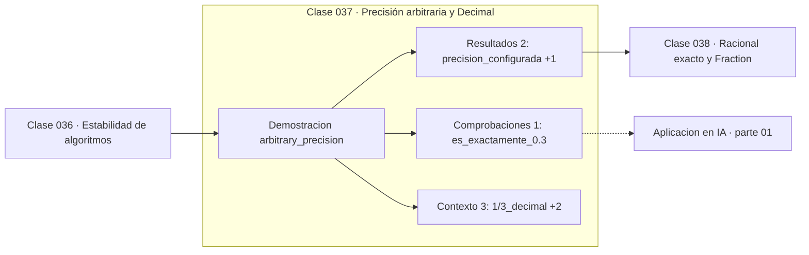

# 037 — Precisión arbitraria y Decimal

> [⬅️ 036 Estabilidad de algoritmos](../036-estabilidad-de-algoritmos/README.md) · [📚 Parte 01](../README.md) · [🏠 Programa](../../../README.md) · [038 Racional exacto y Fraction ➡️](../038-racional-exacto-y-fraction/README.md)

**Parte:** 01 — Aritmética computacional y representación numérica · **Nivel:** `basico-computacional` · **Horas estimadas:** 4
**Motor:** `engines.part01` · **Demostración:** `arbitrary_precision` · **Clase 17 de 20** de la parte

---

## 🎯 Propósito

**Decimal ofrece precisión decimal declarada y exacta a cambio de velocidad.**

Qué es realmente un número dentro de una máquina: bits, complemento a dos, IEEE 754, error, condicionamiento y estabilidad.

## ✅ Resultados de aprendizaje

Al terminar podrás:

1. Explicar **Precisión arbitraria y Decimal** con lenguaje cotidiano y con notación matemática.
2. Resolver un caso pequeño a mano y anticipar el orden de magnitud del resultado.
3. Ejecutar y modificar `lab.py`, que corre la demostración `arbitrary_precision`.
4. Interpretar las 6 salidas del laboratorio y decir qué comprueba cada una.
5. Detectar el error típico de esta parte: suponer que la suma de floats es asociativa.

## 🧩 Fórmulas de la clase

```text
Decimal('0.1') · 3 == Decimal('0.3')  → True
0.1 * 3 == 0.3  → False
```

## 🗺️ Ubicación en el programa



## 📖 Fundamentos

El módulo `decimal` implementa aritmética de punto flotante **en base 10** con
precisión configurable. Su ventaja no es tener más dígitos: es que las fracciones
decimales que escribimos —0.1, 0.05, 19.99— son exactamente representables, porque la
base coincide con la de nuestra notación.

Eso resuelve de raíz el problema del dinero. `Decimal('0.1') * 3` da exactamente
`Decimal('0.3')`, mientras que `0.1 * 3` en float da `0.30000000000000004`. Además,
`Decimal` permite declarar la precisión (`getcontext().prec`) y el modo de redondeo,
de modo que el comportamiento queda documentado en el código en lugar de depender del
hardware.

El coste es real: `Decimal` es entre 50 y 100 veces más lento que `float` porque no se
apoya en la FPU. Para un cálculo científico con millones de operaciones es
inaceptable; para calcular el total de una factura es irrelevante.

Un detalle que atrapa a muchos: `Decimal(0.1)` —con un float como argumento— hereda el
error del float y da 0.1000000000000000055511151231257827. Hay que construirlo desde
**cadena**: `Decimal('0.1')`. La firma acepta ambos precisamente para poder inspeccionar
qué guarda realmente un float, que es lo que hace el laboratorio de la clase 029.

## 🧮 Ejemplo trabajado

Exactitud decimal frente a binaria.

```text
getcontext().prec = 50

Decimal(1)/Decimal(3) =
  0.33333333333333333333333333333333333333333333333333   (50 dígitos)
1/3 (float) = 0.3333333333333333                          (16 dígitos)

Decimal('0.1') * 3 == Decimal('0.3')   →  True   ✓
0.1 * 3 == 0.3                          →  False  ✗

Trampa:
  Decimal(0.1)   → 0.1000000000000000055511151231257827...
  Decimal('0.1') → 0.1                                    ✓
```

## 🔬 Qué ejecuta el laboratorio

`arbitrary_precision` — Decimal con precisión declarada frente a float.

| Grupo | Salidas |
|---|---|
| 🔢 Resultados numéricos (2) | `precision_configurada`, `1/3_float` |
| ✅ Comprobaciones de invariante (1) | `es_exactamente_0.3` |

Las claves booleanas no son adorno: si alguna fuera `False`, el resultado numérico
no sería fiable aunque el programa terminase sin error.

```bash
python classes/part-01-aritmetica-computacional-y-representacion-numerica/037-precision-arbitraria-y-decimal/lab.py
compmath run 037
```

> [!TIP]
> Antes de ejecutar, **escribe tu predicción**. Un laboratorio que confirma lo que
> esperabas enseña tanto como uno que te contradice, pero solo si la predicción
> existía antes del resultado.

## ⚠️ Errores conceptuales frecuentes

1. Construir Decimal desde un float en lugar de desde una cadena.
2. Usar Decimal en bucles numéricos intensivos donde el coste es prohibitivo.
3. Suponer que Decimal elimina todos los errores: sigue siendo precisión finita, solo que en base 10.

## 🚀 Dónde se usa de verdad

Contabilidad, facturación, impuestos, cálculo de intereses y cualquier dominio con
reglas de redondeo normativas. Es el estándar en sistemas financieros.

## 🤖 Conexión con IA

float32, bfloat16 y la cuantización a int8 son decisiones de representación. Los NaN en un entrenamiento casi siempre nacen aquí, no en la arquitectura.

## 📓 Notebooks

| Archivo | Para qué |
|---|---|
| [`notebook.ipynb`](notebook.ipynb) | recorrido guiado con la demostración ejecutada |
| [`notebook_student.ipynb`](notebook_student.ipynb) | versión con `TODO` para resolver |
| [`notebook_solution.ipynb`](notebook_solution.ipynb) | solución de referencia verificada |

## 📝 Evaluación

| Criterio | Peso |
|---|---:|
| Comprensión conceptual | 25 % |
| Resolución manual | 25 % |
| Implementación y verificación | 25 % |
| Interpretación y comunicación | 15 % |
| Conexión con aplicación real | 10 % |

Detalle y criterios de error crítico en [`assessment.md`](assessment.md).

## ❓ Preguntas de comprobación

1. ¿Cuál es la entrada, cuál la salida y qué unidades tienen?
2. ¿Qué operación domina el comportamiento del resultado?
3. ¿Qué caso extremo revelaría un error conceptual?
4. ¿Cómo verificarías el resultado por un método independiente?
5. ¿Dónde aparece esto en motores numéricos?

Si necesitas releer el código para responderlas, la clase todavía no está superada.

## 📥 Entregable

`notebook_student.ipynb` resuelto más un párrafo que explique el resultado **sin citar
código**: qué entra, qué sale, qué invariante se comprueba y qué pasaría en un caso límite.

## 🔗 Referencias

- [Python: módulo `decimal`](https://docs.python.org/3/library/decimal.html)
- [IEEE 754-2019: formatos decimales](https://standards.ieee.org/ieee/754/6210/)

Bibliografía completa de la parte en [`../../../docs/BIBLIOGRAPHY.md`](../../../docs/BIBLIOGRAPHY.md).

## 📂 Material de la clase

[`intuition.md`](intuition.md) · [`theory.md`](theory.md) · [`derivation.md`](derivation.md) · [`exercises.md`](exercises.md) · [`assessment.md`](assessment.md) · [`where-is-this-used.md`](where-is-this-used.md) · [`lesson.yaml`](lesson.yaml)

---

> [⬅️ 036 Estabilidad de algoritmos](../036-estabilidad-de-algoritmos/README.md) · [📚 Parte 01](../README.md) · [🏠 Programa](../../../README.md) · [038 Racional exacto y Fraction ➡️](../038-racional-exacto-y-fraction/README.md)
