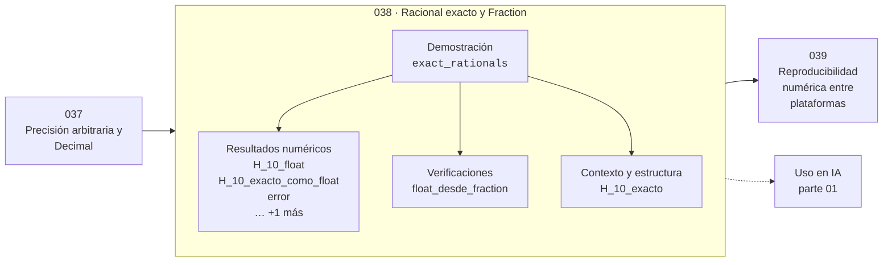

# 038 — Racional exacto y Fraction

> [⬅️ 037 Precisión arbitraria y Decimal](../037-precision-arbitraria-y-decimal/README.md) · [📚 Parte 01](../README.md) · [🏠 Programa](../../../README.md) · [039 Reproducibilidad numérica entre plataformas ➡️](../039-reproducibilidad-numerica-entre-plataformas/README.md)

**Parte:** 01 — Aritmética computacional y representación numérica · **Nivel:** `basico-computacional` · **Horas estimadas:** 4
**Motor:** `engines.part01` · **Demostración:** `exact_rationals` · **Clase 18 de 20** de la parte

---

## 🎯 Propósito

**Fraction guarda dos enteros y da aritmética racional exacta, útil como patrón de referencia.**

Qué es realmente un número dentro de una máquina: bits, complemento a dos, IEEE 754, error, condicionamiento y estabilidad.

## ✅ Resultados de aprendizaje

Al terminar podrás:

1. Explicar **Racional exacto y Fraction** con lenguaje cotidiano y con notación matemática.
2. Resolver un caso pequeño a mano y anticipar el orden de magnitud del resultado.
3. Ejecutar y modificar `lab.py`, que corre la demostración `exact_rationals`.
4. Interpretar las 6 salidas del laboratorio y decir qué comprueba cada una.
5. Detectar el error típico de esta parte: usar float para dinero en vez de decimal o enteros de centavos.

## 🧩 Fórmulas de la clase

```text
Fraction(1,3) + Fraction(1,6) == Fraction(1,2)  → exacto
H_n = Σ 1/k  (número armónico)
```

## 🗺️ Ubicación en el programa



## 📖 Fundamentos

`Fraction` representa un racional como un par de enteros de precisión arbitraria en
forma reducida. Toda operación —suma, producto, comparación— es exacta, sin
excepciones y sin necesidad de declarar precisión. Es la aritmética más fiel que ofrece
la biblioteca estándar.

Su papel en este programa no es sustituir al float en cálculo real: es servir de
**patrón de referencia**. Para medir cuánto error comete un cálculo en punto flotante
hace falta conocer el valor exacto, y `Fraction` lo proporciona en cualquier expresión
que solo use operaciones racionales. El laboratorio calcula el número armónico H₁₀ por
ambos caminos y compara.

El coste es de crecimiento: los denominadores se multiplican y crecen muy rápido. H₁₀
ya tiene denominador 2520, y H₁₀₀ tiene cientos de dígitos. Para cálculos largos, la
aritmética exacta deja de ser viable no por lentitud de cada operación sino por el
tamaño de los números.

Una utilidad práctica: `Fraction(0.1)` muestra el racional exacto que guarda un float,
y `Fraction(x).limit_denominator(n)` encuentra la mejor aproximación racional con
denominador acotado. Esto último es la base de la aproximación por fracciones continuas
y explica por qué 22/7 y 355/113 son buenas aproximaciones de π.

## 🧮 Ejemplo trabajado

Número armónico H₁₀ exacto frente a flotante.

```text
H₁₀ = 1 + 1/2 + 1/3 + ... + 1/10

Exacto (Fraction):  7381/2520
Como float:         2.9289682539682538
Suma en float:      2.9289682539682538
Diferencia:         0.0  (en este caso coinciden)

Denominador: 2520 = mcm(1..10)

Fraction(0.1) == Fraction(1, 10)  →  False
  porque el float 0.1 no es exactamente 1/10
```

Que coincidan con diez términos no significa que coincidan con un millón: el error
crece con n (clase 034).

## 🔬 Qué ejecuta el laboratorio

`exact_rationals` — Fraction mantiene exactitud donde float ya perdió información.

| Grupo | Salidas |
|---|---|
| 🔢 Resultados numéricos (4) | `H_10_float`, `H_10_exacto_como_float`, `error`, `denominador` |
| ✅ Comprobaciones de invariante (1) | `float_desde_fraction` |

Las claves booleanas no son adorno: si alguna fuera `False`, el resultado numérico
no sería fiable aunque el programa terminase sin error.

```bash
python classes/part-01-aritmetica-computacional-y-representacion-numerica/038-racional-exacto-y-fraction/lab.py
compmath run 038
```

> [!TIP]
> Antes de ejecutar, **escribe tu predicción**. Un laboratorio que confirma lo que
> esperabas enseña tanto como uno que te contradice, pero solo si la predicción
> existía antes del resultado.

## ⚠️ Errores conceptuales frecuentes

1. Usar Fraction en cálculos largos sin considerar el crecimiento del denominador.
2. Suponer que Fraction(0.1) es 1/10: hereda el valor real del float.
3. Confundir aritmética exacta con precisión infinita en el resultado final convertido a float.

## 🚀 Dónde se usa de verdad

Verificación de implementaciones numéricas, cálculo simbólico ligero, probabilidades
exactas en combinatoria y generación de casos de prueba con valor esperado conocido.

## 🤖 Conexión con IA

float32, bfloat16 y la cuantización a int8 son decisiones de representación. Los NaN en un entrenamiento casi siempre nacen aquí, no en la arquitectura.

## 📓 Notebooks

| Archivo | Para qué |
|---|---|
| [`notebook.ipynb`](notebook.ipynb) | recorrido guiado con la demostración ejecutada |
| [`notebook_student.ipynb`](notebook_student.ipynb) | versión con `TODO` para resolver |
| [`notebook_solution.ipynb`](notebook_solution.ipynb) | solución de referencia verificada |

## 📝 Evaluación

| Criterio | Peso |
|---|---:|
| Comprensión conceptual | 25 % |
| Resolución manual | 25 % |
| Implementación y verificación | 25 % |
| Interpretación y comunicación | 15 % |
| Conexión con aplicación real | 10 % |

Detalle y criterios de error crítico en [`assessment.md`](assessment.md).

## ❓ Preguntas de comprobación

1. ¿Cuál es la entrada, cuál la salida y qué unidades tienen?
2. ¿Qué operación domina el comportamiento del resultado?
3. ¿Qué caso extremo revelaría un error conceptual?
4. ¿Cómo verificarías el resultado por un método independiente?
5. ¿Dónde aparece esto en motores numéricos?

Si necesitas releer el código para responderlas, la clase todavía no está superada.

## 📥 Entregable

`notebook_student.ipynb` resuelto más un párrafo que explique el resultado **sin citar
código**: qué entra, qué sale, qué invariante se comprueba y qué pasaría en un caso límite.

## 🔗 Referencias

- [Python: módulo `fractions`](https://docs.python.org/3/library/fractions.html)
- [Hardy & Wright. *An Introduction to the Theory of Numbers*, 6ª ed., 2008](https://global.oup.com/academic/product/an-introduction-to-the-theory-of-numbers-9780199219865)

Bibliografía completa de la parte en [`../../../docs/BIBLIOGRAPHY.md`](../../../docs/BIBLIOGRAPHY.md).

## 📂 Material de la clase

[`intuition.md`](intuition.md) · [`theory.md`](theory.md) · [`derivation.md`](derivation.md) · [`exercises.md`](exercises.md) · [`assessment.md`](assessment.md) · [`where-is-this-used.md`](where-is-this-used.md) · [`lesson.yaml`](lesson.yaml)

---

> [⬅️ 037 Precisión arbitraria y Decimal](../037-precision-arbitraria-y-decimal/README.md) · [📚 Parte 01](../README.md) · [🏠 Programa](../../../README.md) · [039 Reproducibilidad numérica entre plataformas ➡️](../039-reproducibilidad-numerica-entre-plataformas/README.md)
