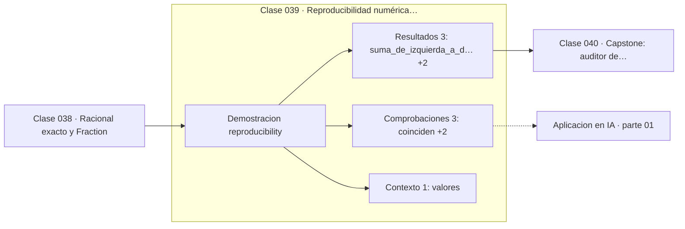

# 039 — Reproducibilidad numérica entre plataformas

> [⬅️ 038 Racional exacto y Fraction](../038-racional-exacto-y-fraction/README.md) · [📚 Parte 01](../README.md) · [🏠 Programa](../../../README.md) · [040 Capstone: auditor de precisión numérica ➡️](../040-capstone-auditor-de-precision-numerica/README.md)

**Parte:** 01 — Aritmética computacional y representación numérica · **Nivel:** `basico-computacional` · **Horas estimadas:** 4
**Motor:** `engines.part01` · **Demostración:** `reproducibility` · **Clase 19 de 20** de la parte

---

## 🎯 Propósito

**La suma en punto flotante no es asociativa; reproducir un resultado exige fijar el orden de las operaciones.**

Qué es realmente un número dentro de una máquina: bits, complemento a dos, IEEE 754, error, condicionamiento y estabilidad.

## ✅ Resultados de aprendizaje

Al terminar podrás:

1. Explicar **Reproducibilidad numérica entre plataformas** con lenguaje cotidiano y con notación matemática.
2. Resolver un caso pequeño a mano y anticipar el orden de magnitud del resultado.
3. Ejecutar y modificar `lab.py`, que corre la demostración `reproducibility`.
4. Interpretar las 7 salidas del laboratorio y decir qué comprueba cada una.
5. Detectar el error típico de esta parte: comparar floats con `==` en lugar de una tolerancia razonada.

## 🧩 Fórmulas de la clase

```text
(a + b) + c ≠ a + (b + c)  en float64
la suma es conmutativa pero no asociativa
```

## 🗺️ Ubicación en el programa



## 📖 Fundamentos

En los reales, la suma es asociativa: agrupar de una forma u otra da el mismo
resultado. En punto flotante **no lo es**, porque cada suma parcial se redondea y el
redondeo depende de las magnitudes involucradas. El ejemplo clásico usa `1e16`, `1.0` y
`−1e16`: sumando de izquierda a derecha, el `1.0` se pierde por estar bajo el ULP de
`1e16`; sumando en otro orden, sobrevive.

Esto tiene una consecuencia incómoda para la reproducibilidad: fijar la semilla
aleatoria **no basta**. Dos ejecuciones del mismo código pueden dar resultados
distintos si el orden de las sumas cambia, y el orden cambia con el número de hilos, la
arquitectura de la GPU, la versión de la biblioteca BLAS o incluso la disponibilidad de
instrucciones vectoriales.

Por eso los frameworks de deep learning ofrecen modos deterministas explícitos
(`torch.use_deterministic_algorithms(True)`), que fuerzan implementaciones con orden
fijo a costa de rendimiento. Sin ese modo, el mismo entrenamiento con la misma semilla
puede divergir tras unos miles de pasos —no porque haya aleatoriedad extra, sino porque
las diferencias de redondeo se amplifican.

El programa adopta la consecuencia como norma: todas las demostraciones son
deterministas en un solo hilo y con orden de operaciones fijo, y un test comprueba que
dos ejecuciones devuelven exactamente el mismo diccionario. Esa comprobación sería
imposible de garantizar en cálculo paralelo sin medidas adicionales.

## 🧮 Ejemplo trabajado

El mismo conjunto de sumandos en dos órdenes.

```text
valores = [1e16, 1.0, −1e16, 1.0]

De izquierda a derecha:
  1e16 + 1.0    = 1e16        ← el 1.0 cae bajo el ULP
  1e16 − 1e16   = 0.0
  0.0 + 1.0     = 1.0         resultado: 1.0

De derecha a izquierda:
  1.0 − 1e16    = −1e16
  −1e16 + 1.0   = −1e16
  −1e16 + 1e16  = 0.0         resultado: 0.0

math.fsum(valores) = 2.0      ← el valor exacto

¿Asociativa en ℝ?      Sí
¿Asociativa en float64? No
```

## 🔬 Qué ejecuta el laboratorio

`reproducibility` — El orden de la suma cambia el resultado en punto flotante.

| Grupo | Salidas |
|---|---|
| 🔢 Resultados numéricos (3) | `suma_de_izquierda_a_derecha`, `suma_de_derecha_a_izquierda`, `suma_compensada` |
| ✅ Comprobaciones de invariante (3) | `coinciden`, `suma_es_asociativa_en_R`, `suma_es_asociativa_en_float64` |

Las claves booleanas no son adorno: si alguna fuera `False`, el resultado numérico
no sería fiable aunque el programa terminase sin error.

```bash
python classes/part-01-aritmetica-computacional-y-representacion-numerica/039-reproducibilidad-numerica-entre-plataformas/lab.py
compmath run 039
```

> [!TIP]
> Antes de ejecutar, **escribe tu predicción**. Un laboratorio que confirma lo que
> esperabas enseña tanto como uno que te contradice, pero solo si la predicción
> existía antes del resultado.

## ⚠️ Errores conceptuales frecuentes

1. Creer que fijar la semilla garantiza reproducibilidad numérica.
2. Comparar resultados entre CPU y GPU esperando igualdad bit a bit.
3. Paralelizar una reducción sin declarar que el resultado deja de ser determinista.

## 🚀 Dónde se usa de verdad

Reproducibilidad de experimentos, comparación de implementaciones, depuración de
divergencias entre entornos y publicación de resultados verificables. Es la razón por
la que los papers serios publican semilla, versión y hardware.

## 🤖 Conexión con IA

float32, bfloat16 y la cuantización a int8 son decisiones de representación. Los NaN en un entrenamiento casi siempre nacen aquí, no en la arquitectura.

## 📓 Notebooks

| Archivo | Para qué |
|---|---|
| [`notebook.ipynb`](notebook.ipynb) | recorrido guiado con la demostración ejecutada |
| [`notebook_student.ipynb`](notebook_student.ipynb) | versión con `TODO` para resolver |
| [`notebook_solution.ipynb`](notebook_solution.ipynb) | solución de referencia verificada |

## 📝 Evaluación

| Criterio | Peso |
|---|---:|
| Comprensión conceptual | 25 % |
| Resolución manual | 25 % |
| Implementación y verificación | 25 % |
| Interpretación y comunicación | 15 % |
| Conexión con aplicación real | 10 % |

Detalle y criterios de error crítico en [`assessment.md`](assessment.md).

## ❓ Preguntas de comprobación

1. ¿Cuál es la entrada, cuál la salida y qué unidades tienen?
2. ¿Qué operación domina el comportamiento del resultado?
3. ¿Qué caso extremo revelaría un error conceptual?
4. ¿Cómo verificarías el resultado por un método independiente?
5. ¿Dónde aparece esto en motores numéricos?

Si necesitas releer el código para responderlas, la clase todavía no está superada.

## 📥 Entregable

`notebook_student.ipynb` resuelto más un párrafo que explique el resultado **sin citar
código**: qué entra, qué sale, qué invariante se comprueba y qué pasaría en un caso límite.

## 🔗 Referencias

- [Goldberg, D. *What Every Computer Scientist Should Know About Floating-Point Arithmetic*. ACM CSUR, 1991](https://dl.acm.org/doi/10.1145/103162.103163)
- [PyTorch: reproducibilidad](https://pytorch.org/docs/stable/notes/randomness.html)

Bibliografía completa de la parte en [`../../../docs/BIBLIOGRAPHY.md`](../../../docs/BIBLIOGRAPHY.md).

## 📂 Material de la clase

[`intuition.md`](intuition.md) · [`theory.md`](theory.md) · [`derivation.md`](derivation.md) · [`exercises.md`](exercises.md) · [`assessment.md`](assessment.md) · [`where-is-this-used.md`](where-is-this-used.md) · [`lesson.yaml`](lesson.yaml)

---

> [⬅️ 038 Racional exacto y Fraction](../038-racional-exacto-y-fraction/README.md) · [📚 Parte 01](../README.md) · [🏠 Programa](../../../README.md) · [040 Capstone: auditor de precisión numérica ➡️](../040-capstone-auditor-de-precision-numerica/README.md)
