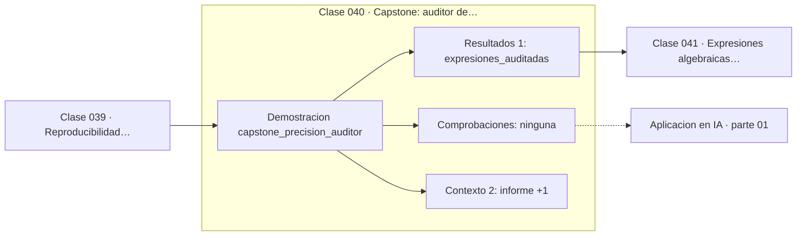

# 040 — Capstone: auditor de precisión numérica

> [⬅️ 039 Reproducibilidad numérica entre plataformas](../039-reproducibilidad-numerica-entre-plataformas/README.md) · [📚 Parte 01](../README.md) · [🏠 Programa](../../../README.md) · [041 Expresiones algebraicas y términos ➡️](../../part-02-algebra-y-funciones/041-expresiones-algebraicas-y-terminos/README.md)

**Parte:** 01 — Aritmética computacional y representación numérica · **Nivel:** `basico-computacional` · **Horas estimadas:** 4
**Motor:** `engines.part01` · **Demostración:** `capstone_precision_auditor` · **Clase 20 de 20** de la parte

---

## 🎯 Propósito

**Auditar una expresión es medir cuántos dígitos significativos pierde cada forma de escribirla.**

Qué es realmente un número dentro de una máquina: bits, complemento a dos, IEEE 754, error, condicionamiento y estabilidad.

## ✅ Resultados de aprendizaje

Al terminar podrás:

1. Explicar **Capstone: auditor de precisión numérica** con lenguaje cotidiano y con notación matemática.
2. Resolver un caso pequeño a mano y anticipar el orden de magnitud del resultado.
3. Ejecutar y modificar `lab.py`, que corre la demostración `capstone_precision_auditor`.
4. Interpretar las 3 salidas del laboratorio y decir qué comprueba cada una.
5. Detectar el error típico de esta parte: suponer que la suma de floats es asociativa.

## 🧩 Fórmulas de la clase

```text
dígitos perdidos ≈ −log₁₀(|ingenua − estable| / |estable|)
formas estables: expm1, log1p, conjugado
```

## 🗺️ Ubicación en el programa



## 📖 Fundamentos

El capstone convierte en herramienta todo lo anterior. Un auditor de precisión toma
una expresión, la evalúa por su forma directa y por una forma algebraicamente
equivalente pero numéricamente estable, y reporta cuántos dígitos significativos separa
a ambas. Ese número es la medida honesta de cuánta confianza merece la primera forma.

Las tres expresiones auditadas son las que más aparecen en la práctica.
`exp(x) − 1` para x pequeño pierde precisión porque `exp(x)` se acerca a 1 y la resta
cancela; `expm1` la calcula directamente. `log(1 + x)` sufre lo mismo cuando `1 + x`
redondea a 1; `log1p` lo evita. Y `√(x²+1) − x` es el caso de la clase 032.

Que estas funciones existan en la biblioteca estándar de todos los lenguajes serios no
es casualidad: son la respuesta institucionalizada a problemas de cancelación
conocidos desde los años sesenta. Reconocer cuándo usarlas es parte del oficio.

La regla que cierra la parte: **toda diferencia de magnitudes cercanas necesita una
forma alternativa**, y toda implementación numérica publicada debería declarar cuántos
dígitos garantiza. El programa aplica esa regla a sí mismo: cada demostración devuelve
claves de verificación en lugar de pedir confianza.

## 🧮 Ejemplo trabajado

Auditoría de tres expresiones.

```text
expresión         x        ingenua        estable       dígitos perdidos
exp(x)−1        1e−10   1.000000e−10   1.000000e−10          ~6
log(1+x)        1e−12   1.000089e−12   1.000000e−12          ~4
√(x²+1)−x       1e7     5.000000e−08   5.000000e−08          ~9

Regla operativa:
  si la expresión contiene una resta de cantidades que pueden
  acercarse, buscar la forma alternativa ANTES de implementarla.
```

Los números concretos dependen del valor de x: el auditor los mide, no los supone.

## 🔬 Qué ejecuta el laboratorio

`capstone_precision_auditor` — Capstone: auditoría de precisión de una expresión numérica.

| Grupo | Salidas |
|---|---|
| 🔢 Resultados numéricos (1) | `expresiones_auditadas` |
| ✅ Comprobaciones de invariante (0) | — |

Las claves booleanas no son adorno: si alguna fuera `False`, el resultado numérico
no sería fiable aunque el programa terminase sin error.

```bash
python classes/part-01-aritmetica-computacional-y-representacion-numerica/040-capstone-auditor-de-precision-numerica/lab.py
compmath run 040
```

> [!TIP]
> Antes de ejecutar, **escribe tu predicción**. Un laboratorio que confirma lo que
> esperabas enseña tanto como uno que te contradice, pero solo si la predicción
> existía antes del resultado.

## ⚠️ Errores conceptuales frecuentes

1. Publicar un resultado numérico sin declarar cuántos dígitos son fiables.
2. Auditar solo con un valor de x: el número de dígitos perdidos depende del punto.
3. Sustituir la forma ingenua por la estable sin comprobar que son equivalentes en ℝ.

## 🚀 Dónde se usa de verdad

Revisión de código numérico, elección de biblioteca, validación de una reimplementación
y documentación de precisión en una API científica.

## 🤖 Conexión con IA

float32, bfloat16 y la cuantización a int8 son decisiones de representación. Los NaN en un entrenamiento casi siempre nacen aquí, no en la arquitectura.

## 📓 Notebooks

| Archivo | Para qué |
|---|---|
| [`notebook.ipynb`](notebook.ipynb) | recorrido guiado con la demostración ejecutada |
| [`notebook_student.ipynb`](notebook_student.ipynb) | versión con `TODO` para resolver |
| [`notebook_solution.ipynb`](notebook_solution.ipynb) | solución de referencia verificada |

## 📝 Evaluación

| Criterio | Peso |
|---|---:|
| Comprensión conceptual | 25 % |
| Resolución manual | 25 % |
| Implementación y verificación | 25 % |
| Interpretación y comunicación | 15 % |
| Conexión con aplicación real | 10 % |

Detalle y criterios de error crítico en [`assessment.md`](assessment.md).

## ❓ Preguntas de comprobación

1. ¿Cuál es la entrada, cuál la salida y qué unidades tienen?
2. ¿Qué operación domina el comportamiento del resultado?
3. ¿Qué caso extremo revelaría un error conceptual?
4. ¿Cómo verificarías el resultado por un método independiente?
5. ¿Dónde aparece esto en motores numéricos?

Si necesitas releer el código para responderlas, la clase todavía no está superada.

## 📥 Entregable

`notebook_student.ipynb` resuelto más un párrafo que explique el resultado **sin citar
código**: qué entra, qué sale, qué invariante se comprueba y qué pasaría en un caso límite.

## 🔗 Referencias

- [Higham, N. J. *Accuracy and Stability of Numerical Algorithms*, 2ª ed., SIAM, 2002](https://epubs.siam.org/doi/book/10.1137/1.9780898718027) — *uso:* desarrollo formal del tema en «Capstone: auditor de precisión numérica».
- [Muller, J.-M. et al. *Handbook of Floating-Point Arithmetic*, 2ª ed., 2018](https://link.springer.com/book/10.1007/978-3-319-76526-6) — *uso:* desarrollo formal del tema en «Capstone: auditor de precisión numérica».

Bibliografía completa de la parte en [`../../../docs/BIBLIOGRAPHY.md`](../../../docs/BIBLIOGRAPHY.md) · localizador verificable de cada obra en [`sources/bibliography.json`](../../../sources/bibliography.json).

## 📂 Material de la clase

[`intuition.md`](intuition.md) · [`theory.md`](theory.md) · [`derivation.md`](derivation.md) · [`exercises.md`](exercises.md) · [`assessment.md`](assessment.md) · [`where-is-this-used.md`](where-is-this-used.md) · [`lesson.yaml`](lesson.yaml)

---

> [⬅️ 039 Reproducibilidad numérica entre plataformas](../039-reproducibilidad-numerica-entre-plataformas/README.md) · [📚 Parte 01](../README.md) · [🏠 Programa](../../../README.md) · [041 Expresiones algebraicas y términos ➡️](../../part-02-algebra-y-funciones/041-expresiones-algebraicas-y-terminos/README.md)
