# 💾 Parte 01 — Aritmética computacional y representación numérica

> [⬅️ Parte 00 — Pensamiento matemático desde cero](../part-00-pensamiento-matematico-desde-cero/README.md) · [🏠 Programa](../../README.md) · [📇 Catálogo](../README.md) · [Parte 02 — Álgebra y funciones ➡️](../part-02-algebra-y-funciones/README.md)

**Nivel:** `basico-computacional` · **Clases:** 20 · **Horas estimadas:** 80 · **Motor:** [`part01.py`](../../src/computational_math/engines/part01.py)

---

## 🎯 De qué trata esta parte

Qué es realmente un número dentro de una máquina: bits, complemento a dos, IEEE 754, error, condicionamiento y estabilidad.

## 🧠 Ideas centrales

- Un float es un racional binario de precisión finita, no un número real.
- El error relativo, no el absoluto, es la magnitud que se propaga.
- Condicionamiento es del problema; estabilidad es del algoritmo.
- La cancelación catastrófica destruye dígitos significativos sin lanzar excepciones.
- Reproducibilidad numérica exige fijar orden de operaciones, no solo semillas.

## 🤖 Por qué importa en IA

> [!IMPORTANT]
> float32, bfloat16 y la cuantización a int8 son decisiones de representación. Los NaN en un entrenamiento casi siempre nacen aquí, no en la arquitectura.

## ⚠️ Errores frecuentes de esta parte

- Comparar floats con `==` en lugar de una tolerancia razonada.
- Suponer que la suma de floats es asociativa.
- Usar float para dinero en vez de Decimal o enteros de centavos.

## 🧭 Secuencia de la parte

```mermaid
flowchart LR
    subgraph B1["Bloque 1"]
        direction TB
        L021["021<br/>Bits, bytes y sistemas<br/>de numeración"]
        L022["022<br/>Conversión decimal a<br/>binario"]
        L023["023<br/>Binario, octal y<br/>hexadecimal"]
        L024["024<br/>Aritmética binaria"]
        L025["025<br/>Enteros con signo y<br/>complemento a dos"]
        L021 --> L022
        L022 --> L023
        L023 --> L024
        L024 --> L025
    end
    subgraph B2["Bloque 2"]
        direction TB
        L026["026<br/>Rango, overflow y<br/>wraparound"]
        L027["027<br/>Punto fijo frente a<br/>punto flotante"]
        L028["028<br/>IEEE 754: estructura de<br/>un float"]
        L029["029<br/>Por qué 0.1 + 0.2 no es<br/>exactamente 0.3"]
        L030["030<br/>Error absoluto y error<br/>relativo"]
        L026 --> L027
        L027 --> L028
        L028 --> L029
        L029 --> L030
    end
    subgraph B3["Bloque 3"]
        direction TB
        L031["031<br/>ULP y machine epsilon"]
        L032["032<br/>Cancelación catastrófica"]
        L033["033<br/>Overflow y underflow<br/>flotante"]
        L034["034<br/>Propagación de errores"]
        L035["035<br/>Condicionamiento de<br/>problemas"]
        L031 --> L032
        L032 --> L033
        L033 --> L034
        L034 --> L035
    end
    subgraph B4["Bloque 4"]
        direction TB
        L036["036<br/>Estabilidad de<br/>algoritmos"]
        L037["037<br/>Precisión arbitraria y<br/>Decimal"]
        L038["038<br/>Racional exacto y<br/>Fraction"]
        L039["039<br/>Reproducibilidad<br/>numérica entre<br/>plataformas"]
        L040["040<br/>Capstone: auditor de<br/>precisión numérica"]
        L036 --> L037
        L037 --> L038
        L038 --> L039
        L039 --> L040
    end
    L025 --> L026
    L030 --> L031
    L035 --> L036
```



## 📚 Las clases

| # | Clase | Demostración | Idea central |
|---|---|---|---|
| `021` | [Bits, bytes y sistemas de numeración](021-bits-bytes-y-sistemas-de-numeracion/README.md) | `bits_and_bytes` | Cuántos valores distintos codifica cada ancho de palabra. |
| `022` | [Conversión decimal a binario](022-conversion-decimal-a-binario/README.md) | `decimal_to_binary` | Divisiones sucesivas frente a la conversión de la biblioteca. |
| `023` | [Binario, octal y hexadecimal](023-binario-octal-y-hexadecimal/README.md) | `bases` | La misma cantidad en base 2, 8, 10 y 16. |
| `024` | [Aritmética binaria](024-aritmetica-binaria/README.md) | `binary_arithmetic` | Suma y desplazamiento en binario, con acarreo visible. |
| `025` | [Enteros con signo y complemento a dos](025-enteros-con-signo-y-complemento-a-dos/README.md) | `twos_complement` | Representación de negativos en 8 bits. |
| `026` | [Rango, overflow y wraparound](026-rango-overflow-y-wraparound/README.md) | `overflow_wraparound` | Wraparound en enteros de ancho fijo simulado sobre Python. |
| `027` | [Punto fijo frente a punto flotante](027-punto-fijo-frente-a-punto-flotante/README.md) | `fixed_vs_floating` | Punto fijo (centavos enteros) frente a punto flotante. |
| `028` | [IEEE 754: estructura de un float](028-ieee-754-estructura-de-un-float/README.md) | `ieee754_layout` | Signo, exponente y mantisa de un float64. |
| `029` | [Por qué 0.1 + 0.2 no es exactamente 0.3](029-por-que-0-1-0-2-no-es-exactamente-0-3/README.md) | `why_point_one` | 0.1 + 0.2 != 0.3 explicado con la fracción binaria real. |
| `030` | [Error absoluto y error relativo](030-error-absoluto-y-error-relativo/README.md) | `absolute_relative_error` | El error relativo es el que se propaga; el absoluto engaña con la escala. |
| `031` | [ULP y machine epsilon](031-ulp-y-machine-epsilon/README.md) | `ulp_epsilon` | Machine epsilon y la distancia al float siguiente. |
| `032` | [Cancelación catastrófica](032-cancelacion-catastrofica/README.md) | `catastrophic_cancellation` | Dos fórmulas algebraicamente iguales con precisión muy distinta. |
| `033` | [Overflow y underflow flotante](033-overflow-y-underflow-flotante/README.md) | `float_overflow_underflow` | Límites del float64 y el paso por subnormales. |
| `034` | [Propagación de errores](034-propagacion-de-errores/README.md) | `error_propagation` | Cómo crece el error al sumar 10^6 veces un valor no representable. |
| `035` | [Condicionamiento de problemas](035-condicionamiento-de-problemas/README.md) | `conditioning` | Número de condición de una función: sensibilidad del problema. |
| `036` | [Estabilidad de algoritmos](036-estabilidad-de-algoritmos/README.md) | `stability` | Misma raíz cuadrática por dos algoritmos: uno estable, otro no. |
| `037` | [Precisión arbitraria y Decimal](037-precision-arbitraria-y-decimal/README.md) | `arbitrary_precision` | Decimal con precisión declarada frente a float. |
| `038` | [Racional exacto y Fraction](038-racional-exacto-y-fraction/README.md) | `exact_rationals` | Fraction mantiene exactitud donde float ya perdió información. |
| `039` | [Reproducibilidad numérica entre plataformas](039-reproducibilidad-numerica-entre-plataformas/README.md) | `reproducibility` | El orden de la suma cambia el resultado en punto flotante. |
| `040` | [Capstone: auditor de precisión numérica](040-capstone-auditor-de-precision-numerica/README.md) | `capstone_precision_auditor` | Capstone: auditoría de precisión de una expresión numérica. |

## 🧰 Stack de referencia

`struct`, `decimal`, `fractions`, `sys.float_info`

Los laboratorios se ejecutan con biblioteca estándar; estas herramientas aparecen
como contraste profesional, no como requisito.

## 🧪 Ejecutar toda la parte

```bash
compmath run --part 01
compmath catalog --part 01
```

## 📊 Evaluación de la parte

| Componente | Peso |
|---|---:|
| Clases y ejercicios | 40 % |
| Laboratorios y notebooks | 25 % |
| Explicación oral o escrita | 15 % |
| Capstone ([040](040-capstone-auditor-de-precision-numerica/README.md)) | 20 % |

## 📖 Bibliografía

- Goldberg, D. *What Every Computer Scientist Should Know About Floating-Point Arithmetic*. ACM Computing Surveys, 1991.
- Higham, N. J. *Accuracy and Stability of Numerical Algorithms*. 2ª ed., SIAM, 2002.
- IEEE 754-2019 Standard for Floating-Point Arithmetic.

---

> [⬅️ Parte 00 — Pensamiento matemático desde cero](../part-00-pensamiento-matematico-desde-cero/README.md) · [🏠 Programa](../../README.md) · [📇 Catálogo](../README.md) · [Parte 02 — Álgebra y funciones ➡️](../part-02-algebra-y-funciones/README.md)
