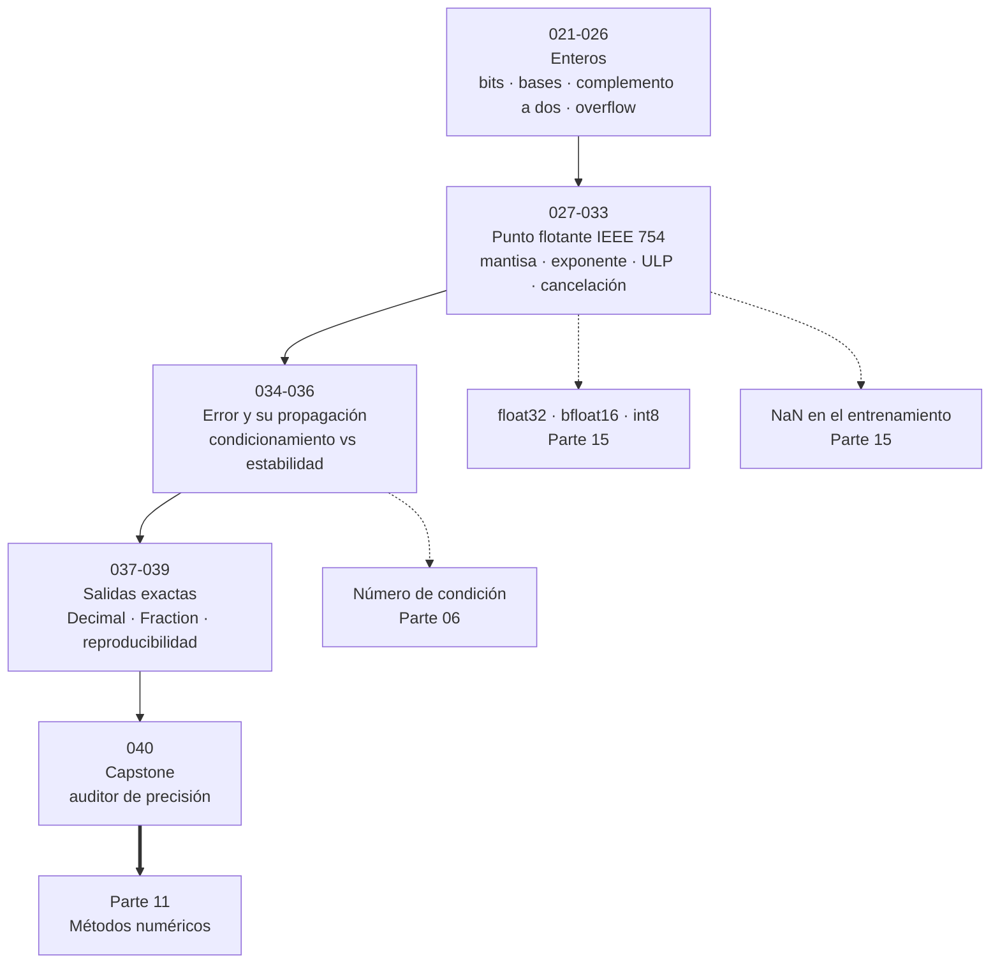

# 💾 Parte 01 — Aritmética computacional y representación numérica

> [⬅️ Parte 00 — Pensamiento matemático desde cero](../part-00-pensamiento-matematico-desde-cero/README.md) · [🏠 Programa](../../README.md) · [📇 Catálogo](../README.md) · [Parte 02 — Álgebra y funciones ➡️](../part-02-algebra-y-funciones/README.md)

**Nivel:** `basico-computacional` · **Clases:** 20 · **Horas estimadas:** 80 · **Motor:** [`part01.py`](../../src/computational_math/engines/part01.py)

---

## 🎯 De qué trata esta parte

Qué es realmente un número dentro de una máquina: bits, complemento a dos, IEEE 754, error, condicionamiento y estabilidad.

Esta es la parte que más cambia la forma de programar de quien la estudia, y la que casi
ningún curso de matemáticas incluye. La pregunta central es incómoda: **¿qué es realmente
un número dentro de una máquina?** La respuesta —una cadena finita de bits con una
interpretación acordada— tiene consecuencias que aparecen en producción a las tres de la
mañana.

El recorrido va de lo discreto a lo continuo. Las clases 021 a 026 tratan los enteros:
cuántos valores caben en un ancho de palabra, cómo se representan los negativos con
complemento a dos y qué ocurre cuando una suma se sale del rango. Python oculta este
problema porque sus enteros son de precisión arbitraria, pero NumPy, C, Rust y cualquier
base de datos no lo hacen, y el desbordamiento silencioso es un error de seguridad
clásico.

Las clases 027 a 033 son el núcleo: **IEEE 754**. Un `float64` no es un número real: es
un racional binario con 53 bits de mantisa. De ahí se derivan, con necesidad lógica, los
fenómenos que parecen fallos y no lo son: `0.1 + 0.2 != 0.3`, la suma que deja de ser
asociativa, el `epsilon` de máquina, los subnormales y el `NaN`. Goldberg escribió en
1991 el artículo que sigue siendo la referencia; esta parte es su versión ejecutable.

Las clases 034 a 036 introducen la distinción que separa a quien depura numéricamente de
quien adivina: **condicionamiento** es una propiedad del problema, **estabilidad** es una
propiedad del algoritmo. Un problema mal condicionado no tiene algoritmo estable que lo
salve; un algoritmo inestable estropea un problema bien condicionado. Confundirlos lleva
a buscar el error en el sitio equivocado.

El cierre (037 a 039) da las salidas: `Decimal` cuando hace falta exactitud decimal,
`Fraction` cuando hace falta exactitud racional, y las condiciones bajo las que un
resultado numérico es reproducible entre máquinas. El capstone construye un auditor que
mide cuántos dígitos significativos pierde cada forma de escribir una expresión.

En IA esta parte es cotidiana aunque nadie la nombre: `float32`, `bfloat16`, la
cuantización a `int8`, los `NaN` que aparecen en la época 3, el `epsilon` dentro de cada
`LayerNorm` y el motivo por el que dos entrenamientos con la misma semilla dan resultados
distintos en GPU. Todo eso es esta parte.

## 🗺️ Mapa conceptual



## 🧠 Ideas centrales

- Un float es un racional binario de precisión finita, no un número real.
- El error relativo, no el absoluto, es la magnitud que se propaga.
- Condicionamiento es del problema; estabilidad es del algoritmo.
- La cancelación catastrófica destruye dígitos significativos sin lanzar excepciones.
- Reproducibilidad numérica exige fijar orden de operaciones, no solo semillas.

## 🤖 Por qué importa en IA

> [!IMPORTANT]
> float32, bfloat16 y la cuantización a int8 son decisiones de representación. Los NaN en un entrenamiento casi siempre nacen aquí, no en la arquitectura.

## ⚠️ Errores frecuentes de esta parte

- Comparar floats con `==` en lugar de una tolerancia razonada.
- Suponer que la suma de floats es asociativa.
- Usar float para dinero en vez de Decimal o enteros de centavos.

## 🧭 Secuencia de la parte

```mermaid
flowchart LR
    subgraph B1["Bloque 1"]
        direction TB
        L021["021<br/>Bits, bytes y sistemas<br/>de numeración"]
        L022["022<br/>Conversión decimal a<br/>binario"]
        L023["023<br/>Binario, octal y<br/>hexadecimal"]
        L024["024<br/>Aritmética binaria"]
        L025["025<br/>Enteros con signo y<br/>complemento a dos"]
        L021 --> L022
        L022 --> L023
        L023 --> L024
        L024 --> L025
    end
    subgraph B2["Bloque 2"]
        direction TB
        L026["026<br/>Rango, overflow y<br/>wraparound"]
        L027["027<br/>Punto fijo frente a<br/>punto flotante"]
        L028["028<br/>IEEE 754: estructura de<br/>un float"]
        L029["029<br/>Por qué 0.1 + 0.2 no es<br/>exactamente 0.3"]
        L030["030<br/>Error absoluto y error<br/>relativo"]
        L026 --> L027
        L027 --> L028
        L028 --> L029
        L029 --> L030
    end
    subgraph B3["Bloque 3"]
        direction TB
        L031["031<br/>ULP y machine epsilon"]
        L032["032<br/>Cancelación catastrófica"]
        L033["033<br/>Overflow y underflow<br/>flotante"]
        L034["034<br/>Propagación de errores"]
        L035["035<br/>Condicionamiento de<br/>problemas"]
        L031 --> L032
        L032 --> L033
        L033 --> L034
        L034 --> L035
    end
    subgraph B4["Bloque 4"]
        direction TB
        L036["036<br/>Estabilidad de<br/>algoritmos"]
        L037["037<br/>Precisión arbitraria y<br/>Decimal"]
        L038["038<br/>Racional exacto y<br/>Fraction"]
        L039["039<br/>Reproducibilidad<br/>numérica entre<br/>plataformas"]
        L040["040<br/>Capstone: auditor de<br/>precisión numérica"]
        L036 --> L037
        L037 --> L038
        L038 --> L039
        L039 --> L040
    end
    L025 --> L026
    L030 --> L031
    L035 --> L036
```



## 📚 Las clases

| # | Clase | Demostración | Idea central |
|---|---|---|---|
| `021` | [Bits, bytes y sistemas de numeración](021-bits-bytes-y-sistemas-de-numeracion/README.md) | `bits_and_bytes` | Con n bits se codifican exactamente 2ⁿ valores distintos; el ancho de palabra fija el rango, no la precisión. |
| `022` | [Conversión decimal a binario](022-conversion-decimal-a-binario/README.md) | `decimal_to_binary` | Convertir a binario es dividir sucesivamente por 2 y leer los restos en orden inverso. |
| `023` | [Binario, octal y hexadecimal](023-binario-octal-y-hexadecimal/README.md) | `bases` | Hexadecimal y octal son taquigrafías de binario porque 16 y 8 son potencias de 2. |
| `024` | [Aritmética binaria](024-aritmetica-binaria/README.md) | `binary_arithmetic` | La aritmética binaria es la decimal con acarreo en base 2; los desplazamientos multiplican y dividen por potencias de 2. |
| `025` | [Enteros con signo y complemento a dos](025-enteros-con-signo-y-complemento-a-dos/README.md) | `twos_complement` | En complemento a dos, el negativo de x es 2ⁿ − x, y por eso la resta se implementa con el mismo sumador que la suma. |
| `026` | [Rango, overflow y wraparound](026-rango-overflow-y-wraparound/README.md) | `overflow_wraparound` | En ancho fijo, superar el máximo no lanza excepción: el valor da la vuelta al rango. |
| `027` | [Punto fijo frente a punto flotante](027-punto-fijo-frente-a-punto-flotante/README.md) | `fixed_vs_floating` | El punto fijo reparte la precisión de forma uniforme; el flotante la reparte proporcionalmente a la magnitud. |
| `028` | [IEEE 754: estructura de un float](028-ieee-754-estructura-de-un-float/README.md) | `ieee754_layout` | Un float64 es signo, exponente sesgado de 11 bits y mantisa de 52 bits con un 1 implícito. |
| `029` | [Por qué 0.1 + 0.2 no es exactamente 0.3](029-por-que-0-1-0-2-no-es-exactamente-0-3/README.md) | `why_point_one` | 0.1 no es representable en binario, igual que 1/3 no lo es en decimal; la desigualdad no es un fallo sino una consecuencia. |
| `030` | [Error absoluto y error relativo](030-error-absoluto-y-error-relativo/README.md) | `absolute_relative_error` | El error relativo es la magnitud que se propaga; el absoluto solo tiene sentido con la escala declarada. |
| `031` | [ULP y machine epsilon](031-ulp-y-machine-epsilon/README.md) | `ulp_epsilon` | El epsilon de máquina mide la precisión relativa; el ULP mide la distancia absoluta entre floats vecinos. |
| `032` | [Cancelación catastrófica](032-cancelacion-catastrofica/README.md) | `catastrophic_cancellation` | Restar dos números casi iguales destruye dígitos significativos sin producir ningún error visible. |
| `033` | [Overflow y underflow flotante](033-overflow-y-underflow-flotante/README.md) | `float_overflow_underflow` | Los subnormales extienden el rango hacia el cero a costa de precisión; el overflow produce infinito y no error. |
| `034` | [Propagación de errores](034-propagacion-de-errores/README.md) | `error_propagation` | Los errores de redondeo se acumulan al sumar muchos términos; la suma compensada los recupera. |
| `035` | [Condicionamiento de problemas](035-condicionamiento-de-problemas/README.md) | `conditioning` | El número de condición mide cuánto amplifica el problema el error de la entrada, con independencia del algoritmo. |
| `036` | [Estabilidad de algoritmos](036-estabilidad-de-algoritmos/README.md) | `stability` | Un algoritmo es estable si no amplifica el error más allá de lo que el condicionamiento del problema exige. |
| `037` | [Precisión arbitraria y Decimal](037-precision-arbitraria-y-decimal/README.md) | `arbitrary_precision` | Decimal ofrece precisión decimal declarada y exacta a cambio de velocidad. |
| `038` | [Racional exacto y Fraction](038-racional-exacto-y-fraction/README.md) | `exact_rationals` | Fraction guarda dos enteros y da aritmética racional exacta, útil como patrón de referencia. |
| `039` | [Reproducibilidad numérica entre plataformas](039-reproducibilidad-numerica-entre-plataformas/README.md) | `reproducibility` | La suma en punto flotante no es asociativa; reproducir un resultado exige fijar el orden de las operaciones. |
| `040` | [Capstone: auditor de precisión numérica](040-capstone-auditor-de-precision-numerica/README.md) | `capstone_precision_auditor` | Auditar una expresión es medir cuántos dígitos significativos pierde cada forma de escribirla. |

## 📖 Glosario de la parte (18 términos)

Definiciones precisas en [`GLOSARIO.md`](GLOSARIO.md).

## 🧰 Stack de referencia

`struct`, `decimal`, `fractions`, `sys.float_info`

Los laboratorios se ejecutan con biblioteca estándar; estas herramientas aparecen
como contraste profesional, no como requisito.

## 🧪 Ejecutar toda la parte

```bash
compmath run --part 01
compmath catalog --part 01
```

## 📊 Evaluación de la parte

| Componente | Peso |
|---|---:|
| Clases y ejercicios | 40 % |
| Laboratorios y notebooks | 25 % |
| Explicación oral o escrita | 15 % |
| Capstone ([040](040-capstone-auditor-de-precision-numerica/README.md)) | 20 % |

## 📖 Bibliografía

- Goldberg, D. *What Every Computer Scientist Should Know About Floating-Point Arithmetic*. ACM Computing Surveys, 1991.
- Higham, N. J. *Accuracy and Stability of Numerical Algorithms*. 2ª ed., SIAM, 2002.
- IEEE 754-2019 Standard for Floating-Point Arithmetic.

---

> [⬅️ Parte 00 — Pensamiento matemático desde cero](../part-00-pensamiento-matematico-desde-cero/README.md) · [🏠 Programa](../../README.md) · [📇 Catálogo](../README.md) · [Parte 02 — Álgebra y funciones ➡️](../part-02-algebra-y-funciones/README.md)
