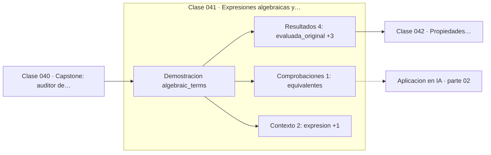

# 041 — Expresiones algebraicas y términos

> [⬅️ 040 Capstone: auditor de precisión numérica](../../part-01-aritmetica-computacional-y-representacion-numerica/040-capstone-auditor-de-precision-numerica/README.md) · [📚 Parte 02](../README.md) · [🏠 Programa](../../../README.md) · [042 Propiedades distributiva, asociativa y conmutativa ➡️](../042-propiedades-distributiva-asociativa-y-conmutativa/README.md)

**Parte:** 02 — Álgebra y funciones · **Nivel:** `basico` · **Horas estimadas:** 4
**Motor:** `engines.part02` · **Demostración:** `algebraic_terms` · **Clase 1 de 20** de la parte

---

## 🎯 Propósito

**Solo se suman términos con la misma parte literal; simplificar reduce operaciones sin cambiar el valor.**

Manipulación simbólica con criterio y la función como objeto central: dominio, imagen, composición, inversa y familias lineal, cuadrática, exponencial y logarítmica.

## ✅ Resultados de aprendizaje

Al terminar podrás:

1. Explicar **Expresiones algebraicas y términos** con lenguaje cotidiano y con notación matemática.
2. Resolver un caso pequeño a mano y anticipar el orden de magnitud del resultado.
3. Ejecutar y modificar `lab.py`, que corre la demostración `algebraic_terms`.
4. Interpretar las 7 salidas del laboratorio y decir qué comprueba cada una.
5. Detectar el error típico de esta parte: dividir por una expresión que puede anularse y perder soluciones.

## 🧩 Fórmulas de la clase

```text
3x²y + 5x²y = 8x²y
términos semejantes ⟺ misma parte literal con los mismos exponentes
```

## 🗺️ Ubicación en el programa



## 📖 Fundamentos

Una expresión algebraica es una receta de cálculo escrita con símbolos. Simplificarla
no cambia lo que calcula: cambia **cuántas operaciones** necesita para calcularlo. Esa
es la utilidad concreta de reducir términos semejantes, y es la misma idea que la
clase 001 introdujo comparando la suma iterativa con la fórmula cerrada.

Dos términos son semejantes si tienen idéntica parte literal: mismas variables con los
mismos exponentes. `3x²y` y `5x²y` lo son; `3x²y` y `3xy²` no, aunque usen las mismas
letras. La razón es la propiedad distributiva: `3x²y + 5x²y = (3+5)x²y` solo porque el
factor común existe.

La verificación es inmediata y conviene hacerla siempre: evaluar la expresión original
y la simplificada en un punto arbitrario y comprobar que coinciden. Si difieren, la
simplificación introdujo un error. Un solo punto no demuestra equivalencia —eso lo
recuerda la clase 019— pero detecta la mayoría de los errores de manipulación.

El hábito que instala esta clase es de lectura: antes de operar, identificar qué
términos pueden combinarse. En expresiones grandes, agrupar por parte literal antes de
sumar reduce errores más que cualquier técnica de cálculo.

## 🧮 Ejemplo trabajado

Reducir una expresión de cuatro términos a dos.

```text
original:     3x²y − 2xy + 5x²y + 7xy
agrupar:      (3x²y + 5x²y) + (−2xy + 7xy)
simplificada: 8x²y + 5xy

Verificación con x = 2, y = 3:
  original:     3·4·3 − 2·2·3 + 5·4·3 + 7·2·3 = 36 − 12 + 60 + 42 = 126
  simplificada: 8·4·3 + 5·2·3 = 96 + 30 = 126     ✓

Operaciones: 4 términos → 2 términos
```

## 🔬 Qué ejecuta el laboratorio

`algebraic_terms` — Términos semejantes y evaluación de una expresión.

| Grupo | Salidas |
|---|---|
| 🔢 Resultados numéricos (4) | `evaluada_original`, `evaluada_simplificada`, `terminos_originales`, `terminos_tras_reducir` |
| ✅ Comprobaciones de invariante (1) | `equivalentes` |

Las claves booleanas no son adorno: si alguna fuera `False`, el resultado numérico
no sería fiable aunque el programa terminase sin error.

```bash
python classes/part-02-algebra-y-funciones/041-expresiones-algebraicas-y-terminos/lab.py
compmath run 041
```

> [!TIP]
> Antes de ejecutar, **escribe tu predicción**. Un laboratorio que confirma lo que
> esperabas enseña tanto como uno que te contradice, pero solo si la predicción
> existía antes del resultado.

## ⚠️ Errores conceptuales frecuentes

1. Sumar términos con la misma variable pero distinto exponente: 3x² y 3x no son semejantes.
2. Perder un signo al reagrupar términos negativos.
3. Simplificar sin verificar numéricamente en al menos un punto.

## 🚀 Dónde se usa de verdad

Simplificar una expresión antes de implementarla reduce operaciones y errores de
redondeo. Es la versión manual de lo que hace un compilador al optimizar y de lo que
hacen los frameworks al fusionar operaciones en un grafo de cómputo.

## 🤖 Conexión con IA

Una red neuronal es una composición de funciones parametrizadas. La sigmoide, la softmax y la log-verosimilitud son álgebra de exponenciales y logaritmos.

## 📓 Notebooks

| Archivo | Para qué |
|---|---|
| [`notebook.ipynb`](notebook.ipynb) | recorrido guiado con la demostración ejecutada |
| [`notebook_student.ipynb`](notebook_student.ipynb) | versión con `TODO` para resolver |
| [`notebook_solution.ipynb`](notebook_solution.ipynb) | solución de referencia verificada |

## 📝 Evaluación

| Criterio | Peso |
|---|---:|
| Comprensión conceptual | 25 % |
| Resolución manual | 25 % |
| Implementación y verificación | 25 % |
| Interpretación y comunicación | 15 % |
| Conexión con aplicación real | 10 % |

Detalle y criterios de error crítico en [`assessment.md`](assessment.md).

## ❓ Preguntas de comprobación

1. ¿Cuál es la entrada, cuál la salida y qué unidades tienen?
2. ¿Qué operación domina el comportamiento del resultado?
3. ¿Qué caso extremo revelaría un error conceptual?
4. ¿Cómo verificarías el resultado por un método independiente?
5. ¿Dónde aparece esto en modelado de crecimiento?

Si necesitas releer el código para responderlas, la clase todavía no está superada.

## 📥 Entregable

`notebook_student.ipynb` resuelto más un párrafo que explique el resultado **sin citar
código**: qué entra, qué sale, qué invariante se comprueba y qué pasaría en un caso límite.

## 🔗 Referencias

- [Gelfand & Shen. *Algebra*. Birkhäuser, 2002](https://link.springer.com/book/10.1007/978-1-4612-0335-5)
- [SymPy: simplificación simbólica](https://docs.sympy.org/latest/tutorials/intro-tutorial/simplification.html)

Bibliografía completa de la parte en [`../../../docs/BIBLIOGRAPHY.md`](../../../docs/BIBLIOGRAPHY.md).

## 📂 Material de la clase

[`intuition.md`](intuition.md) · [`theory.md`](theory.md) · [`derivation.md`](derivation.md) · [`exercises.md`](exercises.md) · [`assessment.md`](assessment.md) · [`where-is-this-used.md`](where-is-this-used.md) · [`lesson.yaml`](lesson.yaml)

---

> [⬅️ 040 Capstone: auditor de precisión numérica](../../part-01-aritmetica-computacional-y-representacion-numerica/040-capstone-auditor-de-precision-numerica/README.md) · [📚 Parte 02](../README.md) · [🏠 Programa](../../../README.md) · [042 Propiedades distributiva, asociativa y conmutativa ➡️](../042-propiedades-distributiva-asociativa-y-conmutativa/README.md)
