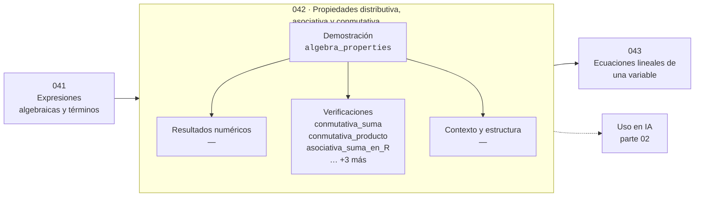

# 042 — Propiedades distributiva, asociativa y conmutativa

> [⬅️ 041 Expresiones algebraicas y términos](../041-expresiones-algebraicas-y-terminos/README.md) · [📚 Parte 02](../README.md) · [🏠 Programa](../../../README.md) · [043 Ecuaciones lineales de una variable ➡️](../043-ecuaciones-lineales-de-una-variable/README.md)

**Parte:** 02 — Álgebra y funciones · **Nivel:** `basico` · **Horas estimadas:** 4
**Motor:** `engines.part02` · **Demostración:** `algebra_properties` · **Clase 2 de 20** de la parte

---

## 🎯 Propósito

Manipulación simbólica con criterio y la función como objeto central: dominio, imagen, composición, inversa y familias lineal, cuadrática, exponencial y logarítmica.

Esta clase concreta ese objetivo sobre **Propiedades distributiva, asociativa y conmutativa**: qué es, cómo se
calcula a mano, cómo se implementa sin ocultar el procedimiento y cómo se verifica
que el resultado es correcto y no solo plausible.

## ✅ Resultados de aprendizaje

Al terminar podrás:

1. Explicar **Propiedades distributiva, asociativa y conmutativa** con lenguaje cotidiano y con notación matemática.
2. Resolver un caso pequeño a mano y anticipar el orden de magnitud del resultado.
3. Ejecutar y modificar `lab.py`, que corre la demostración `algebra_properties`.
4. Interpretar las 6 salidas del laboratorio y decir qué comprueba cada una.
5. Detectar el error típico de esta parte: aplicar log a valores no positivos sin declarar el dominio.

## 🗺️ Ubicación en el programa



## 🧠 Idea rectora de la parte 02

> El dominio forma parte de la definición: cambiarlo cambia la función.

## 🔬 Qué ejecuta el laboratorio

`algebra_properties` — Conmutativa, asociativa y distributiva: válidas en ℝ, no siempre en float.

| Grupo | Salidas |
|---|---|
| 🔢 Resultados numéricos (0) | — |
| ✅ Comprobaciones de invariante (6) | `conmutativa_suma`, `conmutativa_producto`, `asociativa_suma_en_R`, `distributiva`, `asociativa_falla_en_float`, `resta_no_es_conmutativa` |

Las claves booleanas no son adorno: si alguna fuera `False`, el resultado numérico
no sería fiable aunque el programa terminase sin error.

```bash
python classes/part-02-algebra-y-funciones/042-propiedades-distributiva-asociativa-y-conmutativa/lab.py
compmath run 042
```

> [!TIP]
> Antes de ejecutar, **escribe tu predicción**. Un laboratorio que confirma lo que
> esperabas enseña tanto como uno que te contradice, pero solo si la predicción
> existía antes del resultado.

## ⚠️ Errores frecuentes en esta parte

- Dividir por una expresión que puede anularse y perder soluciones.
- Aplicar log a valores no positivos sin declarar el dominio.
- Confundir función inversa con recíproco.

## 🤖 Conexión con IA

Una red neuronal es una composición de funciones parametrizadas. La sigmoide, la softmax y la log-verosimilitud son álgebra de exponenciales y logaritmos.

## 📓 Notebooks

| Archivo | Para qué |
|---|---|
| [`notebook.ipynb`](notebook.ipynb) | recorrido guiado con la demostración ejecutada |
| [`notebook_student.ipynb`](notebook_student.ipynb) | versión con `TODO` para resolver |
| [`notebook_solution.ipynb`](notebook_solution.ipynb) | solución de referencia verificada |

## 📝 Evaluación

| Criterio | Peso |
|---|---:|
| Comprensión conceptual | 25 % |
| Resolución manual | 25 % |
| Implementación y verificación | 25 % |
| Interpretación y comunicación | 15 % |
| Conexión con aplicación real | 10 % |

Detalle y criterios de error crítico en [`assessment.md`](assessment.md).

## ❓ Preguntas de comprobación

1. ¿Cuál es la entrada, cuál la salida y qué unidades tienen?
2. ¿Qué operación domina el comportamiento del resultado?
3. ¿Qué caso extremo revelaría un error conceptual?
4. ¿Cómo verificarías el resultado por un método independiente?
5. ¿Dónde aparece esto en modelado de crecimiento?

Si necesitas releer el código para responderlas, la clase todavía no está superada.

## 📥 Entregable

`notebook_student.ipynb` resuelto más un párrafo que explique el resultado **sin citar
código**: qué entra, qué sale, qué invariante se comprueba y qué pasaría en un caso límite.

## 🔗 Referencias

- Axler, S. *Precalculus: A Prelude to Calculus*. 3ª ed., Wiley, 2017.
- Gelfand, I. M.; Glagoleva, E.; Shnol, E. *Functions and Graphs*. Dover, 2002.
- Stewart, J. *Precalculus: Mathematics for Calculus*. 7ª ed., Cengage, 2015.

## 📂 Material de la clase

[`intuition.md`](intuition.md) · [`theory.md`](theory.md) · [`derivation.md`](derivation.md) · [`exercises.md`](exercises.md) · [`assessment.md`](assessment.md) · [`where-is-this-used.md`](where-is-this-used.md) · [`lesson.yaml`](lesson.yaml)

---

> [⬅️ 041 Expresiones algebraicas y términos](../041-expresiones-algebraicas-y-terminos/README.md) · [📚 Parte 02](../README.md) · [🏠 Programa](../../../README.md) · [043 Ecuaciones lineales de una variable ➡️](../043-ecuaciones-lineales-de-una-variable/README.md)
