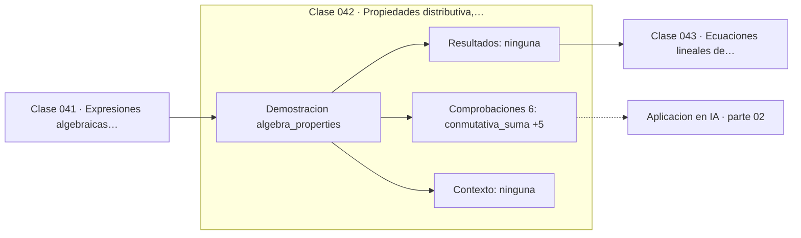

# 042 — Propiedades distributiva, asociativa y conmutativa

> [⬅️ 041 Expresiones algebraicas y términos](../041-expresiones-algebraicas-y-terminos/README.md) · [📚 Parte 02](../README.md) · [🏠 Programa](../../../README.md) · [043 Ecuaciones lineales de una variable ➡️](../043-ecuaciones-lineales-de-una-variable/README.md)

**Parte:** 02 — Álgebra y funciones · **Nivel:** `basico` · **Horas estimadas:** 4
**Motor:** `engines.part02` · **Demostración:** `algebra_properties` · **Clase 2 de 20** de la parte

---

## 🎯 Propósito

**Conmutativa, asociativa y distributiva son válidas en ℝ, pero la asociatividad falla en punto flotante.**

Manipulación simbólica con criterio y la función como objeto central: dominio, imagen, composición, inversa y familias lineal, cuadrática, exponencial y logarítmica.

## ✅ Resultados de aprendizaje

Al terminar podrás:

1. Explicar **Propiedades distributiva, asociativa y conmutativa** con lenguaje cotidiano y con notación matemática.
2. Resolver un caso pequeño a mano y anticipar el orden de magnitud del resultado.
3. Ejecutar y modificar `lab.py`, que corre la demostración `algebra_properties`.
4. Interpretar las 6 salidas del laboratorio y decir qué comprueba cada una.
5. Detectar el error típico de esta parte: aplicar log a valores no positivos sin declarar el dominio.

## 🧩 Fórmulas de la clase

```text
conmutativa: a + b = b + a,  ab = ba
asociativa: (a+b)+c = a+(b+c)
distributiva: a(b+c) = ab + ac
```

## 🗺️ Ubicación en el programa



## 📖 Fundamentos

Las tres propiedades definen la estructura de cuerpo de los números reales, y de ellas
se deduce todo el álgebra elemental. La distributiva es la más productiva: conecta la
suma con el producto y es la que justifica factorizar, desarrollar y —como vio la
clase 002— la regla de los signos.

Conviene notar qué **no** cumplen ciertas operaciones. La resta no es conmutativa ni
asociativa. La división tampoco. La potenciación no es conmutativa (`2³ ≠ 3²`) ni
asociativa (asocia por la derecha, clase 010). Y en la parte 05 aparecerá que el
producto de matrices es asociativo pero **no conmutativo**, lo que cambia por completo
cómo se manipulan las expresiones.

El hallazgo incómodo de esta clase es que la asociatividad de la suma **falla en punto
flotante**. `(1e16 + 1.0) − 1e16` da 0.0, mientras que `1e16 + (1.0 − 1e16)` da 1.0.
No es un bug: es la consecuencia directa de que cada suma parcial se redondea, tal como
explicó la clase 039.

La conclusión práctica es que las identidades algebraicas son ciertas en ℝ y solo
aproximadamente ciertas en float. Reordenar una expresión para simplificarla puede
cambiar su resultado numérico, y en cálculo sensible ese reordenamiento debe hacerse
con criterio, no automáticamente.

## 🧮 Ejemplo trabajado

Las tres propiedades y su límite en flotante.

```text
a = 2.5,  b = −4.0,  c = 7.25

conmutativa suma      a + b == b + a          True
conmutativa producto  a·b == b·a              True
asociativa en ℝ       (a+b)+c == a+(b+c)      True
distributiva          a(b+c) == ab + ac       True (isclose)

resta no conmutativa  a − b == b − a          False

Asociatividad en float64:
  (1e16 + 1.0) − 1e16  =  0.0
  1e16 + (1.0 − 1e16)  =  1.0
  ¿iguales?  No
```

## 🔬 Qué ejecuta el laboratorio

`algebra_properties` — Conmutativa, asociativa y distributiva: válidas en ℝ, no siempre en float.

| Grupo | Salidas |
|---|---|
| 🔢 Resultados numéricos (0) | — |
| ✅ Comprobaciones de invariante (6) | `conmutativa_suma`, `conmutativa_producto`, `asociativa_suma_en_R`, `distributiva`, `asociativa_falla_en_float`, `resta_no_es_conmutativa` |

Las claves booleanas no son adorno: si alguna fuera `False`, el resultado numérico
no sería fiable aunque el programa terminase sin error.

```bash
python classes/part-02-algebra-y-funciones/042-propiedades-distributiva-asociativa-y-conmutativa/lab.py
compmath run 042
```

> [!TIP]
> Antes de ejecutar, **escribe tu predicción**. Un laboratorio que confirma lo que
> esperabas enseña tanto como uno que te contradice, pero solo si la predicción
> existía antes del resultado.

## ⚠️ Errores conceptuales frecuentes

1. Suponer que la resta o la división heredan la conmutatividad de la suma y el producto.
2. Reordenar sumas en código numérico sensible sin comprobar el efecto.
3. Aplicar la conmutatividad al producto de matrices (parte 05).

## 🚀 Dónde se usa de verdad

Justifica toda manipulación algebraica y explica por qué un compilador con
optimizaciones agresivas de coma flotante (`-ffast-math`) puede cambiar resultados.

## 🤖 Conexión con IA

Una red neuronal es una composición de funciones parametrizadas. La sigmoide, la softmax y la log-verosimilitud son álgebra de exponenciales y logaritmos.

## 📓 Notebooks

| Archivo | Para qué |
|---|---|
| [`notebook.ipynb`](notebook.ipynb) | recorrido guiado con la demostración ejecutada |
| [`notebook_student.ipynb`](notebook_student.ipynb) | versión con `TODO` para resolver |
| [`notebook_solution.ipynb`](notebook_solution.ipynb) | solución de referencia verificada |

## 📝 Evaluación

| Criterio | Peso |
|---|---:|
| Comprensión conceptual | 25 % |
| Resolución manual | 25 % |
| Implementación y verificación | 25 % |
| Interpretación y comunicación | 15 % |
| Conexión con aplicación real | 10 % |

Detalle y criterios de error crítico en [`assessment.md`](assessment.md).

## ❓ Preguntas de comprobación

1. ¿Cuál es la entrada, cuál la salida y qué unidades tienen?
2. ¿Qué operación domina el comportamiento del resultado?
3. ¿Qué caso extremo revelaría un error conceptual?
4. ¿Cómo verificarías el resultado por un método independiente?
5. ¿Dónde aparece esto en modelado de crecimiento?

Si necesitas releer el código para responderlas, la clase todavía no está superada.

## 📥 Entregable

`notebook_student.ipynb` resuelto más un párrafo que explique el resultado **sin citar
código**: qué entra, qué sale, qué invariante se comprueba y qué pasaría en un caso límite.

## 🔗 Referencias

- [Goldberg, D. *What Every Computer Scientist Should Know About Floating-Point Arithmetic*. ACM CSUR, 1991](https://dl.acm.org/doi/10.1145/103162.103163)
- [Artin, M. *Algebra*, 2ª ed., Pearson, 2011, cap. 1](https://www.pearson.com/en-us/subject-catalog/p/algebra/P200000006131)

Bibliografía completa de la parte en [`../../../docs/BIBLIOGRAPHY.md`](../../../docs/BIBLIOGRAPHY.md).

## 📂 Material de la clase

[`intuition.md`](intuition.md) · [`theory.md`](theory.md) · [`derivation.md`](derivation.md) · [`exercises.md`](exercises.md) · [`assessment.md`](assessment.md) · [`where-is-this-used.md`](where-is-this-used.md) · [`lesson.yaml`](lesson.yaml)

---

> [⬅️ 041 Expresiones algebraicas y términos](../041-expresiones-algebraicas-y-terminos/README.md) · [📚 Parte 02](../README.md) · [🏠 Programa](../../../README.md) · [043 Ecuaciones lineales de una variable ➡️](../043-ecuaciones-lineales-de-una-variable/README.md)
