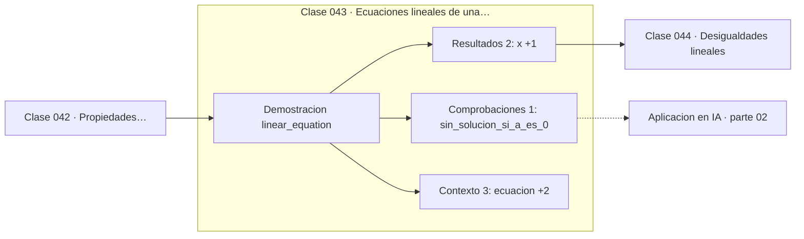

# 043 — Ecuaciones lineales de una variable

> [⬅️ 042 Propiedades distributiva, asociativa y conmutativa](../042-propiedades-distributiva-asociativa-y-conmutativa/README.md) · [📚 Parte 02](../README.md) · [🏠 Programa](../../../README.md) · [044 Desigualdades lineales ➡️](../044-desigualdades-lineales/README.md)

**Parte:** 02 — Álgebra y funciones · **Nivel:** `basico` · **Horas estimadas:** 4
**Motor:** `engines.part02` · **Demostración:** `linear_equation` · **Clase 3 de 20** de la parte

---

## 🎯 Propósito

**Resolver una ecuación es aplicar operaciones reversibles hasta aislar la incógnita.**

Manipulación simbólica con criterio y la función como objeto central: dominio, imagen, composición, inversa y familias lineal, cuadrática, exponencial y logarítmica.

## ✅ Resultados de aprendizaje

Al terminar podrás:

1. Explicar **Ecuaciones lineales de una variable** con lenguaje cotidiano y con notación matemática.
2. Resolver un caso pequeño a mano y anticipar el orden de magnitud del resultado.
3. Ejecutar y modificar `lab.py`, que corre la demostración `linear_equation`.
4. Interpretar las 6 salidas del laboratorio y decir qué comprueba cada una.
5. Detectar el error típico de esta parte: confundir función inversa con recíproco.

## 🧩 Fórmulas de la clase

```text
ax + b = c  ⟹  x = (c − b)/a,  a ≠ 0
residuo = ax + b − c = 0
```

## 🗺️ Ubicación en el programa



## 📖 Fundamentos

Cada paso de un despeje transforma la ecuación en otra **equivalente**: con el mismo
conjunto solución. Sumar o restar la misma cantidad a ambos lados siempre preserva la
equivalencia. Multiplicar o dividir por una cantidad no nula, también. La condición
«no nula» es la que hay que vigilar: dividir por una expresión que puede anularse
pierde soluciones sin avisar.

Los casos degenerados no son curiosidades de examen. Si `a = 0`, la ecuación `0·x = 0`
tiene infinitas soluciones y `0·x = 5` no tiene ninguna. En una implementación, ambos
casos deben detectarse y reportarse; lanzar una división por cero es peor que devolver
un diagnóstico. La clase 113 encontrará la versión matricial del mismo fenómeno.

Otras operaciones no son reversibles y hay que declararlo. Elevar al cuadrado ambos
lados puede **introducir** soluciones falsas: de `x = 2` se pasa a `x² = 4`, que además
admite `x = −2`. Por eso, tras elevar al cuadrado, hay que comprobar cada solución
candidata en la ecuación original.

La verificación cierra el proceso y es innegociable: sustituir y comprobar que el
residuo es cero. Ese hábito —calcular el residuo en lugar de confiar en el
procedimiento— es el mismo que se usará para sistemas lineales (clase 113), métodos
iterativos (clase 233) y ajuste por mínimos cuadrados (clase 131).

## 🧮 Ejemplo trabajado

Resolver 7x − 3 = 25 con verificación y casos degenerados.

```text
7x − 3 = 25
7x     = 28        (sumar 3, reversible)
 x     = 4         (dividir por 7 ≠ 0, reversible)

Verificación: 7·4 − 3 = 25    ✓
Residuo:      7·4 − 3 − 25 = 0 ✓

Casos degenerados (a = 0):
  0·x = 0  →  infinitas soluciones
  0·x = 5  →  ninguna solución
```

## 🔬 Qué ejecuta el laboratorio

`linear_equation` — Resolver ax + b = c y verificar el residuo.

| Grupo | Salidas |
|---|---|
| 🔢 Resultados numéricos (2) | `x`, `residuo` |
| ✅ Comprobaciones de invariante (1) | `sin_solucion_si_a_es_0` |

Las claves booleanas no son adorno: si alguna fuera `False`, el resultado numérico
no sería fiable aunque el programa terminase sin error.

```bash
python classes/part-02-algebra-y-funciones/043-ecuaciones-lineales-de-una-variable/lab.py
compmath run 043
```

> [!TIP]
> Antes de ejecutar, **escribe tu predicción**. Un laboratorio que confirma lo que
> esperabas enseña tanto como uno que te contradice, pero solo si la predicción
> existía antes del resultado.

## ⚠️ Errores conceptuales frecuentes

1. Dividir por una expresión con variable sin excluir el caso en que se anula.
2. Elevar al cuadrado y no comprobar las soluciones en la ecuación original.
3. No reportar el caso degenerado a = 0 en una implementación.

## 🚀 Dónde se usa de verdad

Todo despeje analítico, la condición de primer orden ∇f = 0 en optimización y la
resolución de sistemas lineales. El residuo es el criterio de aceptación universal.

## 🤖 Conexión con IA

Una red neuronal es una composición de funciones parametrizadas. La sigmoide, la softmax y la log-verosimilitud son álgebra de exponenciales y logaritmos.

## 📓 Notebooks

| Archivo | Para qué |
|---|---|
| [`notebook.ipynb`](notebook.ipynb) | recorrido guiado con la demostración ejecutada |
| [`notebook_student.ipynb`](notebook_student.ipynb) | versión con `TODO` para resolver |
| [`notebook_solution.ipynb`](notebook_solution.ipynb) | solución de referencia verificada |

## 📝 Evaluación

| Criterio | Peso |
|---|---:|
| Comprensión conceptual | 25 % |
| Resolución manual | 25 % |
| Implementación y verificación | 25 % |
| Interpretación y comunicación | 15 % |
| Conexión con aplicación real | 10 % |

Detalle y criterios de error crítico en [`assessment.md`](assessment.md).

## ❓ Preguntas de comprobación

1. ¿Cuál es la entrada, cuál la salida y qué unidades tienen?
2. ¿Qué operación domina el comportamiento del resultado?
3. ¿Qué caso extremo revelaría un error conceptual?
4. ¿Cómo verificarías el resultado por un método independiente?
5. ¿Dónde aparece esto en modelado de crecimiento?

Si necesitas releer el código para responderlas, la clase todavía no está superada.

## 📥 Entregable

`notebook_student.ipynb` resuelto más un párrafo que explique el resultado **sin citar
código**: qué entra, qué sale, qué invariante se comprueba y qué pasaría en un caso límite.

## 🔗 Referencias

- [Gelfand & Shen. *Algebra*. Birkhäuser, 2002](https://link.springer.com/book/10.1007/978-1-4612-0335-5)
- [Stewart, J. *Precalculus*, 7ª ed., Cengage, 2015](https://www.cengage.com/c/precalculus-mathematics-for-calculus-7e-stewart/)

Bibliografía completa de la parte en [`../../../docs/BIBLIOGRAPHY.md`](../../../docs/BIBLIOGRAPHY.md).

## 📂 Material de la clase

[`intuition.md`](intuition.md) · [`theory.md`](theory.md) · [`derivation.md`](derivation.md) · [`exercises.md`](exercises.md) · [`assessment.md`](assessment.md) · [`where-is-this-used.md`](where-is-this-used.md) · [`lesson.yaml`](lesson.yaml)

---

> [⬅️ 042 Propiedades distributiva, asociativa y conmutativa](../042-propiedades-distributiva-asociativa-y-conmutativa/README.md) · [📚 Parte 02](../README.md) · [🏠 Programa](../../../README.md) · [044 Desigualdades lineales ➡️](../044-desigualdades-lineales/README.md)
